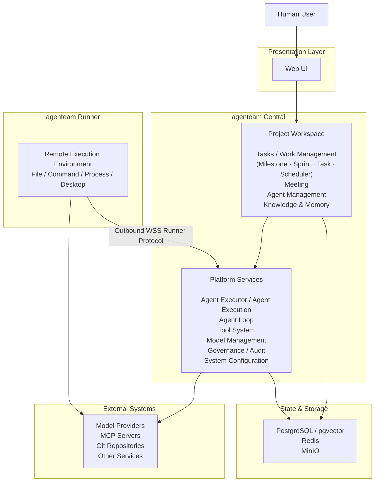

# agenteam 架构设计

> 本目录中的文档是 agenteam 后续设计与实现的主要依据。原 `docs/draft.md` 仅保留为早期设计草稿和历史参考，不再作为当前架构定义。
>
> 本 README 作为整体架构与模块文档的索引视图。随着各模块设计继续细化，README 中的总体架构会同步更新，但不在这里提前固化尚未确认的内部实现边界。

## 1. 系统定位

agenteam 是一个以项目为边界的 **AI Agent 协作与执行平台**。

系统的目标不是提供一次性的 Agent 对话或单个 Agent Loop，而是让多个 Agent 在持久化的项目状态、人类控制和可审计的执行环境下，围绕长期项目持续完成任务、协作、审查和迭代。

agenteam 主要负责：

- Project、Task、Meeting、Agent、Knowledge 等长期项目状态；
- Tasks / Work Management 与自动调度；
- 多 Agent 协作以及 Human-in-the-loop 决策、审批和 Review；
- Agent Executor、Agent Execution 与 Agent Loop；
- 统一 Tool System、模型访问和远程 Runner；
- Knowledge Base、Agent Memory、运行证据和审计。

Agent Executor 与 Agent Execution 是 agenteam 自身的平台执行能力。Agent Execution 内部运行 Agent Loop。agenteam 会借鉴成熟 Agent Harness 在 Agent Loop、上下文管理、模型调用、Tool Calling、错误恢复和运行记录等方面的设计经验，并据此开发自己的执行机制；当前架构不预设直接使用某个现成 Harness 作为系统基础。

默认工作路径：

```text
Task
  -> Scheduler claim
  -> Agent Executor
  -> Agent Execution
  -> Agent Loop / Tool / Model / Runner
  -> Evidence & Result
  -> Review
  -> Project State
```

所有 Task 必须经过 `in-review` 审核阶段后才能进入 `done`。

Meeting 是 Human-in-the-loop 的协作空间，用于讨论、分歧处理、决策和授权，不是 Task 的替代执行模型，也不是 Agent 之间默认的协作方式。

## 2. 核心设计原则

### 项目状态与 Agent 执行分离

Project、Task、Meeting、Agent 等业务对象是长期存在的项目事实；Agent Execution 是一次 Agent 从准备、运行到结束的完整执行实例和持久化记录。Agent Loop 是 Agent Execution 内部的执行机制，不能把某次 Agent Loop 的上下文或运行状态当成项目本身。

### 业务协作围绕 Project Workspace 展开

Tasks / Work Management、Meeting、Agent Management、Knowledge & Memory 构成 Project Workspace 的主要业务能力。Agent Executor / Agent Execution 属于 Platform Services，为这些业务模块提供统一 Agent 执行能力。

### Agent 通过统一 Tool 使用系统能力

项目业务能力、Runner 能力和外部 MCP 能力都通过统一 Tool System 提供给 Agent Loop。Agent Loop 不直接绕过业务服务修改项目数据库。

### Human-in-the-loop 是正式系统能力

Review、Meeting、Approval、waiting_for_human 等不是异常分支，而是长期 Agent 协作中的正常控制机制。高风险或需要人类判断的动作必须保留明确的用户控制边界。

### 运行证据与业务状态分层保存

execution log、tool calls、模型请求和运行错误属于 Agent Execution；Task Timeline 只保存具有项目业务意义的事件和证据；Audit Log 记录敏感系统操作。三者可以关联，但职责不同。

## 3. 总体架构

总体架构只表达稳定的大模块及其关系。具体 Service、数据模型、Tool、Agent Execution lifecycle 等实现细节由后续模块文档定义。



这里的模块与后续架构文档保持对应关系：

- **Project Workspace**：项目级业务与协作边界；
- **Platform Services**：跨项目或跨业务模块复用的平台能力；
- **agenteam Runner**：部署在远程设备上的执行节点；
- **State & Storage**：业务事实、向量、缓存和对象存储；
- **External Systems**：模型 Provider、MCP、Git 和其他外部系统。

随着后续模块文档被逐一审查和修改，本图只同步已经确认的一级边界，不把模块内部实现细节重复搬到 README。

## 4. 核心架构边界

### agenteam Central

agenteam Central 是系统主体，承载 Web/API、项目业务、调度协调、Agent Executor / Agent Execution、平台服务以及对 Runner 和外部系统的访问。

agenteam Central 的后端作为一个整体后端部署和运行。

### Project Workspace

Project Workspace 是项目级协作与执行的核心边界，当前主要包含：

- Tasks / Work Management：以 `Milestone -> Sprint -> Task` 为强制工作层级，提供统一 Tasks 页面及 Explore、Kanban 等不同视图，并通过 Scheduler 决定何时派发 Task；
- Meeting：Human-in-the-loop 讨论、决策和执行授权；
- Agent Management：项目 Agent 的配置、能力和运行环境；
- Knowledge & Memory：项目知识库与 Agent 独立 Memory。

这些模块之间通过明确的业务接口、Tool 和事件协作，不应因为都属于 Project Workspace 就共享无边界的内部状态。

### Platform Services

Platform Services 提供多个业务模块共同依赖的系统能力，例如：

- Agent Executor / Agent Execution lifecycle；
- Agent Loop；
- Unified Tool System；
- Model Management / Model Adapter；
- Authentication / Authorization；
- Approval / Audit；
- Runner Management；
- Project Environment Variables / Secret Management；
- Internal Events；
- 系统级配置。

这里是后端内部的架构分类，用于明确职责边界。

### Agent Executor / Agent Execution

Agent Executor 是统一 Agent 启动与运行管理服务。Scheduler、Meeting 等业务模块通过 Agent Launch Request 调用它。

每次启动创建一个 Agent Execution；Agent Executor 为其准备 AgentExecutionContext，随后 Agent Execution 内部运行 Agent Loop。Agent Loop 负责模型调用、Tool Calling、错误处理、上下文管理并产生最终结果。

这一整套执行能力属于 Platform Services，不依赖 Task 或 Meeting 的内部状态机。业务触发上下文通过 Trigger Context Provider 提供。

Agent Loop 不应直接绕过业务服务修改 Project、Task、Meeting 等项目状态。

### agenteam Runner

Runner 是远程资源执行节点，只向 Central 提供文件、命令、进程、桌面环境等能力。

Runner 主动向 Central 建立出站 WSS Control Channel；Central 不需要能够反向访问 Runner。设备 enrollment、Ed25519 身份认证、Runner RPC、heartbeat、重连和可选 Data Channel 由自定义 Runner Protocol 负责。

Runner 不拥有 Task、Meeting、Scheduler、Agent Memory 等项目业务模型，也不承担项目级调度决策。

### State & Storage

PostgreSQL 是主要业务 Source of Truth；pgvector 提供向量索引；Redis 用于缓存和短期协调；MinIO 保存附件、原始文档、Artifact 等对象数据。

存储技术不定义业务模块边界，具体数据归属由各模块文档说明。

### External Systems

External Systems 包括模型 Provider、MCP Server、Git Repository 以及其他第三方服务。

外部能力应通过明确的 Adapter、Tool 或 Runner 边界接入，避免外部协议直接渗透到项目业务模型。

## 5. 架构文档索引

- [项目与工作管理](./project-work-management/index.md)
- [Scheduler](./scheduler.md)
- [Meeting](./meeting/README.md)
- [Agent 管理](./agent-management.md)
- [Agent Executor](./agent-executor.md)
- [Agent Loop](./agent-loop.md)
- [统一工具系统](./tool-system/index.md)
- [MCP 集成](./mcp-integration/index.md)
- [Runner](./runner.md)
- [Knowledge Base 与 Agent Memory](./knowledge-memory.md)
- [安全与治理](./security-governance/index.md)
- [平台基础设施与部署](./platform-infrastructure/index.md)

## 6. 当前技术基线

- 前端：Vue 3 + 自定义组件；
- 后端与 Runner：Go；
- 主数据库：PostgreSQL；
- 向量能力：pgvector；
- 对象存储：MinIO；
- 缓存与短期协调：Redis；
- 部署：前后端一体二进制 + Docker Compose；
- 执行拓扑：单个 agenteam Central + 多个远程 Runner。

agenteam Central 作为一个整体后端部署。领域边界用于保持状态模型、模块职责和内部接口清晰。
