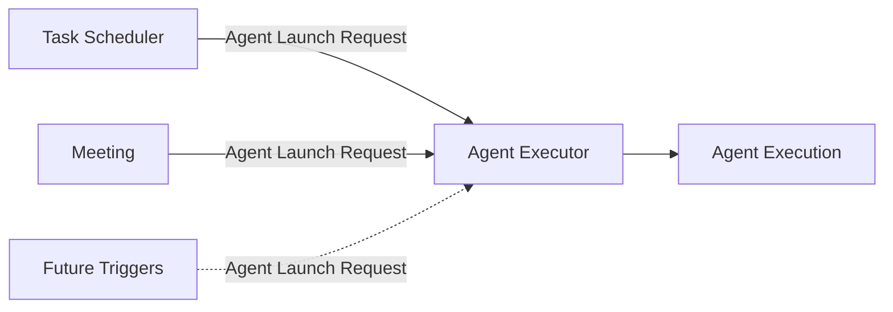
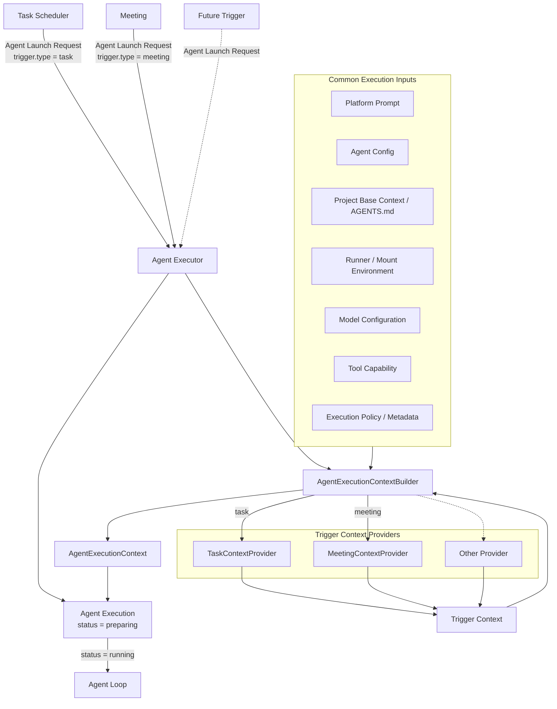

# Agent Executor 架构

## 1. 定位

Agent Executor 是 agenteam Platform Services 中负责统一创建和管理 Agent Execution 的基础执行服务。

所有需要启动 Agent 的业务模块都通过统一的 Agent Launch Request 调用 Agent Executor。Agent Executor 负责准备本次执行所需的 Agent 配置、业务触发上下文、模型、工具、环境和执行策略，然后创建并驱动一个 **Agent Execution**。

核心关系：

```text
Task Scheduler ──┐
Meeting ─────────┼──> Agent Launch Request
Future Trigger ──┘
                         ↓
                   Agent Executor
                         ↓
                  Agent Execution
                  ├── Execution Context
                  ├── Agent Loop
                  ├── Model / Tools
                  ├── Logs / Usage
                  └── Result
```

其中：

- **Agent Executor**：平台服务 / 模块；
- **Agent Execution**：一次 Agent 从准备、运行到结束的完整执行实例；
- **Execution Context**：本次 Agent Execution 启动时准备好的完整运行输入；
- **Agent Loop**：Agent Execution 内部负责模型调用和 Tool Calling 的核心循环。

Agent Execution 本身就是一次 Agent 运行的生命周期边界和持久化边界，不再额外增加独立的运行时架构层。

## 2. 为什么需要 Agent Executor

Task Scheduler、Meeting 和未来其他触发源都可能需要启动 Agent。

这些业务模块不应该分别实现：

- Agent 配置解析；
- Trigger Context 准备；
- Model Provider 解析；
- Tool Capability 计算；
- 环境元数据准备；
- Agent Loop 启动；
- execution log / usage 归档；
- cancel / timeout；
- 执行状态管理。

Agent Executor 将这些能力统一为一个平台入口。

业务模块只需要回答：

> 需要启动哪个 Agent，为什么启动，以及这次执行对应什么 trigger。

Agent Executor 负责：

> 准备这次 Agent Execution，并管理它从创建到结束的完整生命周期。

## 3. 触发来源

Agent Executor 不限制触发来源。第一阶段至少包括 Task Scheduler、Meeting，后续还可以扩展 Manual / Timer / Webhook 等触发方式。



所有触发方都只提交轻量的 Agent Launch Request。Agent Execution 的 Context 构造方式统一由 Agent Executor 内部处理，具体见后文的 AgentExecutionContextBuilder。

## 4. Agent Launch Request

所有调用方通过统一 Agent Launch Request 请求启动 Agent。

概念结构：

```text
AgentLaunchRequest
├── agent_id
├── trigger
│   ├── type
│   └── reference
├── purpose
├── execution_policy
├── idempotency_key
└── metadata
```

### agent_id

明确指定要运行的 Agent。

Agent Executor 不负责替业务模块选择 Agent。

### trigger

描述“为什么启动这次 Agent”。

例如 Task 场景：

```text
type = task
reference = task_id
```

Meeting 场景：

```text
type = meeting
reference = meeting_id / turn_id
```

### purpose

描述本次执行目的。

Task 场景例如：

- work；
- review。

Meeting 场景例如：

- response；
- approved_action。

Agent Executor 不解释具体业务状态机，只把 purpose 交给对应 Trigger Context Provider。

### execution_policy

调用方可以进一步收紧本次执行权限，例如：

- Meeting turn 默认限制为只读；
- approved_action 仅允许用户批准范围内的写操作；
- 特定触发来源禁止某类 Tool。

execution_policy 只能缩小 Agent Capability，不能扩大 Agent 的长期权限。

### idempotency_key

用于防止调用方重试时重复创建 Agent Execution。

相同幂等键的重复 Launch Request 必须返回已有 Agent Execution 或其最终结果，而不是无条件创建新实例。

## 5. AgentExecutionContextBuilder 与 Trigger Context Provider

Agent Executor 内部使用统一的 **AgentExecutionContextBuilder** 构造每次 Agent Execution 的启动上下文。

Builder 负责合并两类信息：

- 公共执行信息：Platform Prompt、Agent Config、Project base context、可选 `AGENTS.md`、Runner / mount environment、Model、Tool Capability、execution policy、metadata；
- Trigger-specific Context：由对应业务领域的 Trigger Context Provider 提供，其中既包括业务数据，也包括当前场景需要注入的 Prompt Template / instructions。

Trigger Context Provider 是统一的领域适配接口。第一阶段至少包括：

- `TaskContextProvider`：读取当前 Task、Sprint、Milestone 以及 work / review 语义，并提供 Task 场景 Prompt Template，使 Agent 明确当前任务阶段、可用操作，以及如何根据执行结果通过 `transfer-task` 请求下一步状态流转；实际合法性由 Task 状态机校验；
- `MeetingContextProvider`：读取 meeting topic、participants、rolling summary、必要的 recent messages 和 meeting policy，并提供 Meeting 场景 Prompt Template，使 Agent 明确会议中的发言、DecisionRequest、ExecutionApprovalRequest、受限写操作和会议收尾方式；
- 后续其他 trigger 可以按相同接口扩展，并定义各自的场景 Prompt Template。

Scheduler、Meeting 等触发方只创建 Agent Launch Request，不直接构造 AgentExecutionContext，也不直接调用 Provider。Agent Executor 根据 `trigger.type` 选择对应 Provider，再由 Builder 合并为完整 AgentExecutionContext。



Builder / Provider 的职责边界仅是准备本次 Agent Execution 的启动 Context。它们不负责调度 Task、决定 Meeting 发言者、选择 assignee / reviewer、执行 Agent Loop，或在运行过程中自动检索 Knowledge / Memory。

## 6. Agent Execution Context

AgentExecutionContextBuilder 在 Agent Execution 进入运行阶段前准备完整的 **AgentExecutionContext**。

概念结构：

```text
AgentExecutionContext
├── execution_id
├── platform_prompt
├── agent
│   ├── description
│   ├── instructions
│   ├── inject_agents_md
│   ├── model_parameters
│   └── capability_snapshot
├── base_context
├── trigger_context
├── environment_context
├── model
├── tools
├── execution_policy
└── metadata
```

其中：

- `execution_id`：当前 Agent Execution ID；
- `platform_prompt`：平台统一维护的基础 Prompt，用于提供所有 Agent 共享的通用工作能力和平台约定；
- `agent.description`：当前 Agent 面向外部的简短能力说明，用于 UI 展示和其他 Agent 快速识别其职责；
- `agent.instructions`：当前 Agent 自身的长期 Prompt，描述其角色、职责、专业能力和工作方式；
- `agent.inject_agents_md`：是否将项目 `AGENTS.md` 纳入本次执行上下文；
- `agent.model_parameters`：Agent 级模型参数覆盖；
- `agent.capability_snapshot`：本次执行使用的 Agent 长期能力快照；
- `base_context`：项目基础信息、可选 `AGENTS.md` 等；
- `trigger_context`：Trigger Context Provider 准备的业务触发上下文，其中可以包含该 trigger 的场景 Prompt Template / instructions；
- `environment_context`：Runner、mount、环境说明；
- `model`：已经解析好的模型配置；
- `tools`：本次执行允许暴露给模型的 ToolSpec 集合；
- `execution_policy`：本次执行额外限制；
- `metadata`：trace、trigger、时间限制等执行元数据。

AgentExecutionContext 是 Agent Executor 与 Agent Loop 之间的主要输入边界，也是 Agent Execution 从 `preparing` 进入 `running` 的启动配置。

其中保存的是 Prompt components 和其他执行输入，而不是已经组装完成的最终 System Prompt。最终 System Prompt 由 Agent Loop 在 Context Assembly 阶段根据 Platform Prompt、Agent instructions、Trigger Prompt 以及其他需要作为系统级指令表达的内容统一组装。

Agent Loop 不应重新读取 Task、Meeting、Agent 配置等业务数据库来补齐启动信息。

## 7. Agent Executor 启动流程

推荐流程：

1. 接收 Agent Launch Request；
2. 校验 idempotency key；
3. 校验 Agent 是否存在且可执行；
4. 创建 Agent Execution，并进入 `preparing`；
5. AgentExecutionContextBuilder 获取 Agent 配置快照；
6. Builder 根据 `trigger.type` 调用对应 Trigger Context Provider；
7. Builder 解析 Runner / mount 环境元数据；
8. Builder 解析 Model 配置；
9. Builder 计算本次有效 Tool Capability；
10. Builder 合并 execution policy / metadata；
11. 构造 AgentExecutionContext；
12. Agent Execution 进入 `running` 并启动 Agent Loop；
13. 持久化 execution log、usage、error 和最终结果；
14. 更新 Agent Execution 最终状态。

## 8. Agent Execution

Agent Execution 是“一次 Agent 被启动并实际运行”的完整实例。

它同时是：

- 执行生命周期对象；
- 持久化运行记录；
- Agent Loop 的宿主；
- log / usage / tool calls / result 的归档边界。

它不是 Task，也不是 Meeting message。

建议至少包含：

- `id`；
- `agent_id`；
- `trigger_type`；
- `trigger_reference`；
- `purpose`；
- `idempotency_key`；
- `status`；
- `created_at`；
- `started_at`；
- `finished_at`；
- Agent description / instructions / settings / capability snapshot reference；
- Execution Context reference / snapshot；
- model metadata / usage；
- tool call records / references；
- execution log reference；
- result metadata；
- error metadata。

Agent Execution 可以被 Task、Meeting 或未来其他业务对象引用，但它自身属于 Platform Services。

## 9. Agent Execution 生命周期

建议状态：

```text
created
  -> preparing
  -> running
  -> succeeded
  -> failed
  -> cancelled
  -> timed_out
```

### created

Agent Launch Request 已通过基础校验，并创建持久化 Agent Execution。

### preparing

Agent Executor 正在准备：

- Agent Config；
- Trigger Context；
- Model；
- Tool Capability；
- Runner / Mount metadata；
- AgentExecutionContext。

### running

AgentExecutionContext 已准备完成，Agent Loop 正在运行。

### succeeded

Agent Loop 正常结束。

`succeeded` 只表示 Agent Execution 正常完成，不代表业务对象一定完成。

例如：

```text
Agent Execution succeeded
Task -> in-review
```

同样是正常结果。

### failed

Agent Loop 无法正常完成，例如不可恢复的模型错误、Tool infrastructure failure 或执行进程异常。

### cancelled

用户或系统显式取消本次 Agent Execution。

### timed_out

超过配置的执行时间限制。

## 10. Agent Loop

Agent Loop 是 Agent Execution 内部的核心执行机制，不是独立平台服务。

它负责：

- 将 Execution Context 组装为模型输入；
- 调用 Model Adapter；
- 解析模型输出；
- 执行 Tool Calls；
- 回填 Tool Results；
- 重复模型 / 工具循环；
- 处理错误、重试、取消和上下文窗口；
- 产生最终结果。

Agent Loop 的详细设计单独见 [Agent Loop](./agent-loop.md)。

## 11. Tool Capability 计算

Agent Executor 根据多层约束生成本次 Agent Execution 可见的 Tool Set：

```text
System Policy
  ∩ Project Policy
  ∩ Agent Capability
  ∩ Execution Policy
  ∩ Human Approval Scope
```

最终仍由 Tool System 在具体 Tool Call 时执行服务端权限校验。

Agent Executor 负责“本次执行给 Agent Loop 提供哪些 Tool”，Tool System 负责“某次 Tool Call 是否真的允许执行”。

## 12. Logs、Usage 与运行证据

完整运行记录归属于 Agent Execution。

包括：

- model requests / responses metadata；
- tool calls；
- tool results metadata；
- token / usage；
- execution events；
- retry；
- errors；
- cancel / timeout；
- final output。

Task Event、Meeting message 和 Audit Log 可以引用 Agent Execution，但不复制完整 execution log。

```text
Task Event       -> business fact
Meeting Message  -> collaboration content
Agent Execution  -> agent execution evidence
Audit Log        -> sensitive system operation
```

## 13. Cancel、Timeout 与故障恢复

Agent Executor 是 Agent Execution lifecycle 的 owner。

因此以下操作由 Agent Executor 处理：

- cancel；
- timeout；
- execution heartbeat（如果实现需要）；
- execution crash detection；
- restart / recovery（如果后续支持）；
- final state persistence。

Scheduler 只管理 Task 是否应该派发，不持续持有运行中的 Agent Execution。

Meeting 也只负责发起 turn，不负责维持 Agent Execution。

## 14. 与业务模块的边界

### Scheduler

Scheduler：

- 判断 Task 是否应该运行；
- 确定 assignee；
- 确定 work / review purpose；
- 创建 Agent Launch Request。

Agent Executor：

- 创建 Agent Execution；
- 通过 AgentExecutionContextBuilder 准备 AgentExecutionContext；
- 启动 Agent Loop；
- 管理 Agent Execution 生命周期。

### Meeting

Meeting：

- 决定当前轮到哪个 Agent 发言；
- 准备 meeting trigger / turn reference；
- 设置 execution policy；
- 创建 Agent Launch Request。

Task Scheduler 与 Meeting 都只负责创建 Agent Launch Request。

Agent Executor 对两者使用完全相同的启动机制，由 AgentExecutionContextBuilder 根据 `trigger.type` 选择对应 Trigger Context Provider。

### Agent Management

Agent Management 持有 Agent 长期配置。

Agent Executor 在每次 Agent Execution 创建时读取配置快照并用于本次执行。

### Tool System / Model Management

Agent Executor 解析本次执行所需的 Model 和 Tool Set。

Agent Loop 在运行期间只通过已经提供的 Model Adapter 和 Tool System 完成实际调用。

## 15. 架构原则总结

Agent Executor 应保持以下边界：

1. **Platform Service**：不属于某个 Project Workspace 业务领域；
2. **统一入口**：所有 Agent 启动都经过 Agent Executor；
3. **统一 Context Builder**：所有 Agent Execution 都通过 AgentExecutionContextBuilder 生成启动 Context；
4. **业务无关**：Task / Meeting 语义通过 Trigger Context Provider 隔离；
5. **Agent Execution 是最终执行层**：不再增加与其职责重叠的执行层；
6. **Execution Context 明确**：启动所需内容在运行前准备完成；
7. **Agent Loop 内聚**：模型与 Tool 的循环属于 Agent Execution 内部实现；
8. **可审计**：模型、Tool、日志、Usage 和最终状态都追溯到 Agent Execution；
9. **可扩展**：未来 Manual / Timer / Webhook 等触发方式只需增加对应 Provider，无需复制 Executor 逻辑。
