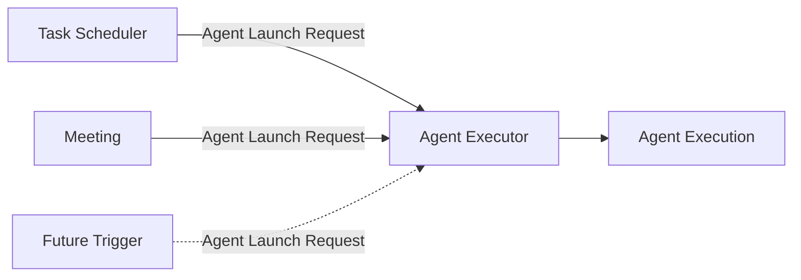

# Agent Executor 架构

> 详细设计：
> - [Agent Execution Domain Model](./execution-domain-model.md)
> - [Execution Context](./execution-context.md)
> - [Execution Lifecycle](./execution-lifecycle.md)
> - [Runtime View](./runtime-view.md)
>
> 相关架构：
> - [Scheduler](../scheduler/README.md)
> - [Meeting](../meeting/README.md)
> - [Agent 管理](../agent-management.md)
> - [Agent Loop](../agent-loop/README.md)
> - [统一工具系统](../tool-system/README.md)
> - [Model System](../platform-infrastructure/model-system/README.md)

## 1. 定位

Agent Executor 是 agenteam Platform Services 中负责统一创建和管理 Agent Execution 的基础执行模块。

所有需要启动 Agent 的业务模块都通过统一的 Agent Launch Request 调用 Agent Executor。Agent Executor 负责创建 Agent Execution、准备不可变启动 Context、启动 Agent Loop，并拥有该 Execution 从创建到结束的生命周期。

核心关系：

```text
Task Scheduler ──┐
Meeting ─────────┼──> Agent Launch Request
Future Trigger ──┘
                         ↓
                   Agent Executor
                         ↓
                  Agent Execution
                  ├── Execution Snapshot
                  ├── Execution Context
                  ├── Agent Loop
                  ├── Runtime Items
                  ├── Logs / Usage
                  └── Lifecycle
```

其中：

- **Agent Executor**：统一执行入口和 Agent Execution lifecycle owner；
- **Agent Execution**：一次 Agent 从创建、准备、运行、等待到结束的完整执行实例；
- **Execution Snapshot**：本次 Execution 实际使用的 Agent、Model、Tool Capability、Policy 等不可变快照；
- **AgentExecutionContext**：本次 Execution 在进入 running 前准备完成的不可变启动输入；
- **Agent Loop**：Execution 内部负责 Model → Tool → Model 循环的执行机制；
- **Runtime View**：面向 UI 的实时结构化执行流，由 Runtime Item Snapshot 与 RuntimeItemUpdate Stream 组成。

Agent Execution 本身就是一次 Agent 运行的生命周期边界和持久化边界，不再额外增加与其职责重叠的“Run”或“Runtime”业务实体。

## 2. 为什么需要 Agent Executor

Task Scheduler、Meeting 和未来 Manual / Timer / Webhook 等触发源都可能需要启动 Agent。

这些模块不应分别实现：

- Agent 配置解析；
- Trigger Context 准备；
- Model 配置解析；
- Tool Capability 计算；
- Project / Runner / mount 环境准备；
- Agent Loop 启动；
- Execution lifecycle；
- waiting / resume；
- cancel；
- checkpoint / crash recovery；
- Runtime View；
- execution log / usage 归档。

业务模块只负责回答：

> 启动哪个 Agent、为什么启动、对应哪个 Trigger，以及本次执行是否需要进一步收紧能力。

Agent Executor 负责：

> 创建这次 Agent Execution，准备运行所需输入，并管理它从创建到结束的完整生命周期。

## 3. 触发来源

Agent Executor 不限制触发来源。

第一阶段至少包括：

- Task Scheduler；
- Meeting。

后续可以增加：

- Manual；
- Timer；
- Webhook；
- 其他 Platform Trigger。



Agent Executor 不替业务模块选择 Agent，也不解释业务状态机。

## 4. Agent Launch Request

所有调用方通过统一 Agent Launch Request 请求启动 Agent。

概念结构：

```text
AgentLaunchRequest
├── agent_id
├── trigger
│   ├── type
│   └── reference
├── purpose
├── execution_policy
├── idempotency_key
└── metadata
```

字段含义：

- `agent_id`：明确指定要运行的 Agent；
- `trigger.type`：Trigger 类型，例如 `task`、`meeting`；
- `trigger.reference`：对应业务对象稳定 identity；
- `purpose`：本次 Execution 的场景目的，例如 `work`、`review`、`response`；
- `execution_policy`：本次执行额外收紧的能力限制，只能缩小长期 Agent Capability；
- `idempotency_key`：调用方重试时避免重复创建 Agent Execution；
- `metadata`：trace 等非业务控制信息。

Launch 是异步创建语义：

```text
launch(request)
    ↓
resolve idempotency
    ├── same key + same semantic input -> return original execution_id
    ├── same key + different semantic input -> conflict
    └── new Launch
            ↓
      atomic acquire Agent execution slot
            ├── occupied -> AgentBusy
            └── acquired
                    ↓
              Agent Execution persisted
              status = created
    ↓
return execution_id
    ↓
background preparing
```

Agent Executor 不等待 Execution 进入 running 后才返回。

同键重放先校验语义一致性，不重新竞争 slot；只有真正的新 Launch 才原子创建 Execution。调用结果未知时使用按 Launch key 的只读结果查询，不能把可能创建 Execution 的 launch 当作查询。作用域、语义比较和查询端口由 D01/D22 固定，见 [Execution Domain](./execution-domain-model.md#6-idempotency)。

### 4.1 Agent Execution Slot

同一个 Agent 同一时刻最多只能存在一个非终态 Agent Execution。

以下状态都占用该 Agent 的 execution slot：

```text
created
preparing
running
waiting
```

只有 Execution 进入：

```text
succeeded
failed
cancelled
```

后才释放 slot。

因此 Agent 的 busy / idle 不是 Agent Management 上额外维护的持久状态，而是由 Agent Executor 根据 active Execution 派生：

```text
busy
= exists AgentExecution
  where agent_id = target_agent
  and status in (created, preparing, running, waiting)
```

该约束跨所有 Trigger 生效。Task Scheduler、Meeting、Manual / Timer / Webhook 等来源不能分别占用不同的并发槽位。

`waiting` 仍然保持 busy。即使 Agent Loop 正在等待 Approval / Decision，也不能启动该 Agent 的第二个 Execution，否则原 Execution resume 后仍会与新 Execution 共享同一个 Agent Workspace。

Agent Executor 必须在持久化新 Execution 时原子执行 slot 校验，不能只依赖调用方先查询 busy 状态。并发 Launch 中只有一个请求可以成功获得 slot。

如果 slot 已被其他 Execution 占用：

```text
launch(request)
-> AgentBusy
```

并且**不创建新的 Agent Execution**。

`AgentBusy` 至少返回结构化占用信息：

```text
agent_id
active_execution_id
active_trigger.type
active_trigger.reference
active_purpose
```

Agent Executor 不生成“正在处理 Task #123”之类业务展示文案。Scheduler、Meeting 等调用方根据结构化 Trigger reference 和对应领域数据形成用户可见描述。

完整 Launch、idempotency 与 persistence contract 见 [Agent Execution Domain Model](./execution-domain-model.md)。

## 5. AgentExecutionContextBuilder

Agent Executor 使用统一的 **AgentExecutionContextBuilder** 准备本次 Execution 的启动 Context。

Builder 合并两类输入：

```text
Common Execution Inputs
+
Trigger-specific Context
        ↓
AgentExecutionContextBuilder
        ↓
Immutable AgentExecutionContext
```

公共输入包括：

- Platform Prompt；
- Agent Config Snapshot；
- 初始 Skill 固定版本绑定与目录 metadata；
- Project base context；
- 可选 `AGENTS.md` Snapshot；
- Project Environment Variables metadata；
- Runner / mount environment metadata；
- resolved Model Snapshot；
- Execution Tool Set Snapshot；
- Execution Policy；
- metadata。

Trigger-specific Context 由 `TriggerContextProviderRegistry` 中对应 Provider 提供。

第一阶段：

- `TaskContextProvider`；
- `MeetingContextProvider`。

后续增加新的 Trigger 只需要注册新的 Provider，不需要在 Agent Executor 内持续堆积业务 `switch`。

完整设计见 [Execution Context](./execution-context.md)。

已运行 Execution 接收新增技能时，只在下一次模型输入确定点应用可靠持久化的窄范围 Skill binding；不改写启动 Snapshot、Model 或固定 Tool Set，不每轮重读全部配置。版本、移除与恢复规则见 [Agent Skills](../agent-skills.md)。

## 6. Agent Execution

Agent Execution 是一次 Agent 实际运行的完整实例。

它同时是：

- lifecycle 对象；
- 持久化执行记录；
- Agent Loop 宿主；
- Execution Snapshot 的 owner；
- Runtime View 的归属边界；
- logs / usage / errors 的关联边界。

它不是：

- Task；
- Meeting Message；
- Tool Operation；
- Model Invocation；
- Audit Log。

这些对象可以引用 `execution_id`，但各自保留自己的 Source of Truth。

Agent Execution 主记录保持适合高频查询；重型启动 Snapshot 独立持久化。

完整 schema、idempotency、version、Error Contract 与存储边界见 [Agent Execution Domain Model](./execution-domain-model.md)。

## 7. 生命周期概览

第一阶段主状态：

```text
created
  ↓
preparing
  ↓
running
  ↔
waiting
  ↓
succeeded

任意非终态
  ├──> failed
  └──> cancelled
```

其中：

- `created`：Launch 已可靠持久化；
- `preparing`：Context Builder 正在准备本次运行输入；
- `running`：Agent Loop 正在主动运行；
- `waiting`：Agent Loop 等待 Approval / Decision 等外部输入；
- `succeeded`：本次 Agent Loop 正常完成；
- `failed`：本次 Execution 无法继续；
- `cancelled`：取消请求已经真正停止 Execution。

第一阶段**不使用 Execution 级自动 timeout 终止**。Execution 可以持续运行；主动运行时间过长只向 Human Inbox 产生警告。

Approval / Decision waiting 不设置自动过期，必须等待用户明确处理。

Execution terminal state 不可逆。需要重试时创建新的 Agent Execution。

跨模块需要观察的稳定 lifecycle 事实通过 typed Internal Domain Event 暴露，例如：

```text
AgentExecutionStartedEvent
AgentExecutionSucceededEvent
AgentExecutionFailedEvent
AgentExecutionCancelledEvent
```

对应 lifecycle 状态变更与 DomainEventOutbox 在同一 PostgreSQL transaction 中提交。这里不引入通用 AgentExecutionEvent Event Store，也不把 RuntimeItem / Model / Tool 细节事件化。

完整 waiting、resume、cancel、checkpoint 与 crash recovery 设计见 [Execution Lifecycle](./execution-lifecycle.md)。

## 8. Agent Loop

Agent Loop 是 Agent Execution 内部的核心执行机制，不是独立 Platform Service。

它负责：

- Context Assembly；
- Model 调用；
- Tool Calling；
- Tool Result 回填；
- 多轮 Model → Tool → Model 循环；
- context window management；
- 语义层的新调用与安全恢复；同一逻辑模型请求的自动 retry 由 Model System 统一负责；
- 单轮 Model generation watchdog；
- cancel signal 响应；
- 产生 Runtime Item semantic update；
- 正常结束或报告不可恢复错误。

Agent Loop 不负责：

- 创建 Agent Execution；
- 持久化 Agent Execution lifecycle；
- 读取 Task / Meeting 业务数据补齐启动输入；
- 替业务模块决定状态流转；
- 把最终文本解析成业务结果。

Agent 的业务效果通过 Tool / Domain Service 写入相应领域。

完整设计见 [Agent Loop](../agent-loop/README.md)。

## 9. Tool Capability

Agent Executor 在 preparing 阶段计算本次 Agent Execution 的 Execution Tool Set：

```text
Available Tools
  ∩ Agent Capability
  ∩ Execution Policy
```

Approval 不参与 Tool 可见性计算。

Agent Executor 负责：

> 本次 Execution 给 Agent Loop 暴露哪些 Tool。

Tool Runtime / Security Governance 负责：

> 某次具体 Tool Call 是否允许执行，以及如何执行、审批、重试和记录。

## 10. Runtime View

Agent Executor 提供统一、可复用的 Agent Execution Runtime View。

Runtime View 不是传统日志，也不是底层 Event Store，而是面向用户的实时结构化执行流。

概念模型：

```text
RuntimeItem[]
├── text
├── reasoning
├── tool
├── interaction
└── notice / error
```

- Text 默认展开并支持流式追加；
- Reasoning 默认折叠，可显示“正在思考 / 思考了 xx 秒”；
- Tool 默认折叠，可展开查看参数、执行状态和结果；
- Interaction 用于 Approval / Decision；
- Notice / Error 用于重要运行提示。

底层采用：

```text
Runtime Item Snapshot
+
RuntimeItemUpdate Stream
```

不采用通用 AgentExecutionEvent Event Store，也不采用 Event Sourcing。

完整 schema、stream protocol、snapshot、reconnect 与 UI projection 边界见 [Runtime View](./runtime-view.md)。

## 11. Checkpoint 与恢复

Agent Loop 运行期间周期性尝试保存 checkpoint。

checkpoint 同时服务两个需求：

- Central 重启后的 Execution 恢复；
- 长时间 waiting 后释放 Agent Loop 内存运行态。

系统不会一进入 waiting 就立即释放内存。

只有当 Execution 处于 waiting，并且连续若干个 checkpoint tick 都检测到状态没有变化时，才认为它进入持续等待并释放内存态。

Central 重启后：

- created：重新处理；
- preparing：重新执行幂等 Context Builder；
- running：优先从最近 checkpoint 恢复；
- waiting：从最近 checkpoint 恢复等待态；
- 无法安全恢复：fallback 为 failed。

不引入多 Backend owner lease，也不自动创建 replacement Execution。

完整设计见 [Execution Lifecycle](./execution-lifecycle.md)。

## 12. 与业务模块的边界

### Scheduler

Scheduler：

- 判断 Task 是否应该运行；
- 读取当前 Task 已有的合法 assignee，不自行选择或恢复 assignee，也不推断 reviewer；
- 确定 work / review purpose；
- 在正常调度路径中预检查 assignee Agent 是否 busy；
- 创建 Agent Launch Request；
- 将最终 `AgentBusy` 视为正常资源竞争，而不是 Execution failure；
- 依据当前 Task 状态与 cooldown 判断 work / review 派发，不从 Execution succeeded / failed / cancelled 推断 Task 结果或直接套用失败策略；
- 保留正常 claim、blocker reconciliation 和已确认 Launch 失败处理；未知 Launch 按原 Dispatch/key 继续核对。

Agent Executor：

- 创建 Agent Execution；
- 准备 Execution Context；
- 启动 Agent Loop；
- 管理 Agent Execution lifecycle。

### Meeting

Meeting：

- 决定当前轮到哪个 Agent；
- 创建含 meeting_id / turn_id / contribution_id / participant_id 的结构化 Meeting Trigger reference；
- 设置 execution policy；
- 创建 Agent Launch Request；
- 当目标 Agent busy 时，让对应 Contribution 等待 Agent slot，并允许用户跳过；
- 管理 Meeting Message / Decision 等领域对象。

Agent Executor：

- 对 Meeting 使用与其他 Trigger 相同的启动机制；
- 通过 Meeting 领域的 `MeetingContextProvider` 校验来源关系、目标 Agent 与权限并准备 Trigger Context，不直接查询 Meeting 表；
- 提供统一 Runtime View。

### Agent Management

Agent Management 持有 Agent 长期配置。

Agent Executor 在 preparing 时解析并固化本次 Execution 使用的 Agent Snapshot；新增 Skill 走独立持久绑定端口，不把它扩大为 Agent 配置热更新。

### Model System

Model System 持有 Provider / Model 配置并提供 Model Adapter。

Agent Executor 固化本次 resolved Model Snapshot；Agent Loop 调用统一 Model Contract。Model System 统一管理同一 Agent 逻辑调用的 Provider 自动重试及真实 attempt 记录，Loop 消费标准流、结果与最终错误。

### Tool System

Tool System 持有 Tool 定义、Operation / Attempt、Authorization 与 Backend execution。

Agent Executor 固化 Execution Tool Set；Agent Loop 通过 Tool Runtime 调用 Tool。

## 13. 架构原则

Agent Executor 保持以下原则：

1. **统一入口**：所有 Agent 启动都经过 Agent Executor；
2. **Execution 是最终生命周期边界**：不再增加职责重叠的 Run 实体；
3. **启动输入不可变**：Execution Context 与关键配置在 preparing 完成后固化；
4. **业务语义隔离**：Trigger-specific 数据通过 Provider 接入；
5. **Agent Loop 内聚**：Model / Tool 循环属于 Execution 内部实现；
6. **生命周期集中管理**：waiting、resume、cancel、checkpoint、recovery 都由 Agent Executor 协调；
7. **业务结果由业务领域拥有**：Executor 不解析或复制业务结果；
8. **Runtime View 与内部日志分离**：Runtime Item 是 UI projection，不替代 Tool / Model / Audit / Log Source of Truth；
9. **可恢复但不盲目重放副作用**：无法安全恢复时失败并交由上层业务兜底；
10. **单 Agent 串行执行**：同一个 Agent 同一时刻最多一个非终态 Execution，避免共享 Workspace 的并发读写冲突；
11. **保持可扩展**：新的 Trigger 通过 Provider Registry 接入。
