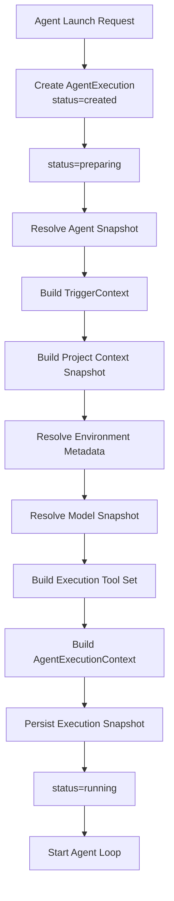

# Execution Context 详细设计

> 上层架构：[Agent Executor](./README.md)
>
> 相关详细设计：
> - [Agent Execution Domain Model](./execution-domain-model.md)
> - [Execution Lifecycle](./execution-lifecycle.md)

## 1. 设计范围

本文定义 Agent Executor 如何从 Agent Launch Request 构造本次 Agent Execution 的不可变启动输入。

主要覆盖：

- Agent Launch Request；
- AgentExecutionContextBuilder；
- TriggerContextProvider；
- TriggerContextProviderRegistry；
- typed Trigger Context；
- Agent / Model / Tool / Project / Runner 等 Snapshot；
- Project Environment Variables；
- preparing failure；
- AgentExecutionContext；
- 与 Agent Loop Context Assembly 的边界。

## 2. 核心原则

1. **调用方只提交轻量 Launch Request**，不自己构造 Execution Context；
2. **业务 Trigger 通过 Provider 隔离**；
3. **Context 在 entering running 前完整准备**；
4. **启动 Context 一旦完成即 immutable**；
5. **历史 Execution 使用本次 Snapshot，不读取当前最新配置替代**；
6. **Secret value 不进入 Context Snapshot**；
7. **Agent Loop 不重新查询 Task / Meeting / Agent 配置补齐启动信息**；
8. **Prompt component 与最终 System Prompt 分离**；
9. **新增技能采用窄持久绑定**，在下一模型输入边界应用，不重写启动 Context 或重新读取全部配置。

## 3. AgentLaunchRequest

概念结构：

```text
AgentLaunchRequest
├── agent_id
├── trigger
│   ├── type
│   └── reference
├── purpose
├── execution_policy
├── idempotency_key
└── metadata
```

### 3.1 agent_id

调用方明确指定 Agent。

Agent Executor 不负责：

- 从候选 Agent 中选择；
- 根据 Task 自动推荐 Agent；
- 根据 Meeting participant 自动推断 Agent。

### 3.2 trigger

Trigger 表示“为什么启动”。

Task：

```text
type = task
reference = task_id
```

Meeting：

```text
type = meeting
reference = { meeting_id, turn_id, contribution_id, participant_id }
```

`reference` 必须是稳定 typed identity，而不是临时 UI index。

Meeting 领域校验同项目归属、Meeting/Turn/Contribution/Participant 关系、参与者对应目标 Agent 与调用权限。Executor 经正式 Provider/校验端口消费结果，不直接查 Meeting 表；引用不夹带可变正文。稳定 Contribution 的 retry/regenerate 通过 generation/attempt、独立 Execution 及幂等键区分，不以当前指针替换历史来源身份。

### 3.3 purpose

purpose 表示当前 Trigger 内的执行目的。

例如：

```text
task/work
task/review
meeting/response
```

Agent Executor 本身不解释这些业务含义，而是将其交给对应 Trigger Context Provider。

### 3.4 execution_policy

execution_policy 只能进一步收紧本次执行能力。

例如：

- 禁用某类 Tool；
-限制某个 Tool scope；
- Meeting 中禁止特定写操作。

有效 Tool Set：

```text
Available Tools
∩ Agent Capability
∩ Execution Policy
```

execution_policy 不能扩大 Agent 长期 Capability。

### 3.5 idempotency_key

只用于 Agent Execution 创建幂等。同一作用域内，同键同语义返回首次结果，同键不同语义拒绝；重放不再竞争 Agent slot。结果查询使用独立只读端口，不以 launch 代替。

完整规则见 [Agent Execution Domain Model](./execution-domain-model.md)。

## 4. Launch 与 Preparing

Launch API 持久化 Agent Execution 后立即返回。

```mermaid
sequenceDiagram
    participant Caller
    participant Executor as Agent Executor
    participant DB
    participant Builder as Context Builder

    Caller->>Executor: launch(request)
    Executor->>DB: resolve key + semantic input; only new Launch atomically acquires slot
    DB-->>Executor: execution_id
    Executor-->>Caller: execution_id

    Executor->>DB: created -> preparing
    Executor->>Builder: build(execution_id, launch request)
    Builder-->>Executor: AgentExecutionContext
    Executor->>DB: persist snapshot
    Executor->>DB: preparing -> running
```

Launch 不等待 Builder 完成。

图中后续 preparing 只适用于本次新建的 Execution；一致重放返回原结果，语义冲突或 AgentBusy 不进入创建分支。

## 5. AgentExecutionContextBuilder

Builder 是统一 Context 构造入口。

概念：

```text
AgentExecutionContextBuilder
├── Agent Snapshot Resolver
├── Project Context Resolver
├── Environment Resolver
├── Model Resolver
├── Execution Tool Set Resolver
├── TriggerContextProviderRegistry
├── Execution Policy Merger
└── Snapshot Writer
```

Builder 只负责准备启动输入。

它不负责：

- Task 调度；
- Meeting turn 调度；
- Agent 选择；
- Agent Loop；
- Tool Operation 执行；
- Knowledge / Memory 自动检索；
-业务状态变更。

## 6. TriggerContextProviderRegistry

不在 Agent Executor 内部硬编码不断增长的：

```text
if task ...
else if meeting ...
else if webhook ...
```

而是定义显式 Registry：

```text
TriggerContextProviderRegistry
├── task    -> TaskContextProvider
├── meeting -> MeetingContextProvider
└── ...
```

统一 Contract：

```text
TriggerContextProvider
  supports(trigger_type)
  build(reference, purpose, execution metadata)
      -> TriggerContext
```

未知 `trigger.type` 在进入 running 前失败。

## 7. TriggerContext

Provider 返回 typed Context，而不是只返回一段 Prompt。

概念结构：

```text
TriggerContext
├── type
├── identity
├── data
└── prompt_components
```

### 7.1 identity

保存稳定业务 identity。

### 7.2 data

保存结构化业务数据。

Agent Loop 可以按统一 schema 将其序列化进模型上下文，但不需要重新查询业务数据库。

### 7.3 prompt_components

保存该 Trigger 需要注入的场景指令。

这些内容仍然只是 Prompt component，不在 Builder 阶段提前拼成最终 System Prompt。

## 8. TaskContextProvider

第一阶段 Task Provider 至少准备：

- Task identity；
- Task title / description；
- Task version；
- 当前状态；
- 当前 assignee / reviewer context；
- Task Plan；
- unresolved blockers；
- 最近有限数量的 TaskEvent；
- Sprint 必要信息；
- Milestone 必要信息；
- purpose = work / review；
- Task 场景 Prompt component。

Task version 随 Trigger Context 一并固化，供 Agent 首次 mutation 使用；如果后续发生 `TASK_VERSION_CONFLICT`，Agent 通过 `read-task(task_id)` 获取最新 Task 与 version，再决定新的 mutation。

更早的 Task Timeline 不在 Provider 中全量展开，Agent 需要时通过 `list-task-events` Tool 按需分页读取。

TaskContextProvider 不直接复制历史 Agent Execution Runtime View / transcript。历史 Execution 仍按 Agent Execution Source of Truth 查询。

Task Prompt 负责告诉 Agent：

- 当前阶段；
- 本次职责；
- 可用 Task Tool；
- 需要通过 `transfer-task` 请求状态流转。

真正状态合法性仍由 Task Domain 校验。

Provider 不直接修改 Task。

Task Context 的完整领域边界见 [Task Domain Model](../project-work-management/task-domain-model.md) 与 [Task Event Timeline](../project-work-management/task-event-timeline.md)。

## 9. MeetingContextProvider

第一阶段 Meeting Provider 至少准备：

- meeting identity；
- 当前四项结构化 Trigger reference 及本次有效 generation/attempt 关联；
- Meeting title（首轮 finalize 前可空）；主题由 rolling summary.goals 概括；
- participants；
- rolling summary；
-当前 Execution 可见的 MeetingMessage history；
- typed Meeting References；
- Meeting 场景 Prompt component。

MeetingMessage 中的：

- mention；
- task；
- knowledge；
- link；
- file

需要序列化成模型可识别的结构化表示。

以下 Runtime / Interaction 对象不直接作为 Meeting Context 历史注入：

- MeetingTurn 控制对象；
- DecisionRequest 控制对象；
- Approval Request 控制对象。

Meeting Context 不在 Provider 阶段按 token budget 预裁剪。

超出模型 context window 时由 Agent Loop Context Management 统一处理。

parallel Turn 使用 Meeting 领域已固定的同一 references 集合、summary version 和实际有效 immutable message/generation 输入；不能只凭 Timeline 截止点再读取可变 current 指针。sequential 则按启动顺序纳入前序正式回复。这里只固定 Meeting 输入引用，不复制所有 Task/Knowledge/link/file 正文，详见 [Meeting Context](../meeting/meeting-context-summary.md)。

## 10. Agent Snapshot

Builder 读取 Agent Management 当前配置，并固化本次 Execution 实际使用的 Snapshot。

至少包含：

```text
AgentSnapshot
├── agent_id
├── description
├── instructions
├── inject_agents_md
├── capability
├── initial skill revision bindings / catalog metadata
├── model selection metadata
├── reasoning effort
└── relevant settings
```

Execution 启动后一般 Agent 配置变化不替换当前 Snapshot。新增技能采用下述独立绑定规则；这不是模型、Tool、Mount、Secret 或审批策略的热更新。

### 10.1 运行中的 Skill Binding

初始技能固定 revision 随启动输入持久化。正式分配事务与 Executor 端口可靠提交新增绑定，在下一次 Model Request 输入确定点应用此前已提交的有效分配，并留下可追溯 typed control 记录；不能只依赖可能延迟的通知承诺下一轮可用。D01/D10/D22 明确启动竞争、持久化/去重及输入边界。

本次目录由初始绑定与已应用变更重建；读取说明、素材与 Runner 包准备使用同一固定版本。发布新 revision 不替换旧绑定；完整正文仍按需读取，缺少当前固定 Tool Set 中所需工具时返回明确限制，不自动扩权。

新增技能不改已发出的 Model Request 或 Tool Batch，不解除 waiting，也不复活 terminal Execution。移除/禁用只改变正式配置，不停止已开始工作或清除旧内容；后续读取/准备按当前资源与权限返回正常错误。新增绑定应用前须验证分配仍有效，迟到新增不能恢复已撤授权。完整规则见 [Agent Skills](../agent-skills.md#6-新分配技能的下一轮生效)。

## 11. Project Context Snapshot

Project base context 在 preparing 时读取并固化。

包括：

- Project 基础信息；
-可选 `AGENTS.md`；
-其他明确属于自动启动 Context 的 Project metadata。

`AGENTS.md` 不只保存路径。

应保存本次实际读取内容的 Snapshot 或 Object Storage reference。

运行中的文件变化不影响当前 Execution。

## 12. Project Environment Variables

普通变量：

```text
name
description
value
secret = false
```

可以进入 Execution Context。

Secret：

```text
name
description
secret = true
available = true
```

只进入 metadata。

Secret value：

- 不进入 AgentExecutionContext；
-不进入 Execution Snapshot；
-不进入 Runtime View；
-不进入普通 Log。

需要执行时由 Runner / Tool Backend 根据权限临时解析。

完整设计见 [项目变量与 Secret](../project-work-management/project-environment-variables.md)。

## 13. Runner / Mount Environment

Execution Context 只包含 Agent 需要理解运行环境的 metadata，例如：

- Runner identity；
- mount identity；
- workspace path semantics；
-当前可用环境能力。

不把 Runner 内部连接状态、Credential、Transport detail 注入模型。

Runner 临时离线属于 preparing / runtime infrastructure condition，不改变 Context schema。

Runner / Agent Mount 的物理 workspace 映射、路径语义与 trusted-host command 边界见 [Agent Workspace 详细设计](../runner/agent-workspace.md)。

## 14. Model Snapshot

Builder 通过 Model System 解析 Agent 本次实际使用的 Model。

Snapshot 至少包含：

- Provider / Model stable identity；
- protocol / adapter identity；
-最终生效参数；
- reasoning effort；
- capability metadata；
-必要的 request behavior metadata。

Credential 不进入 Snapshot。

Agent Execution 运行中 Model 配置变化不影响本次 Snapshot。

具体 Provider request 由 Agent Loop / Model Adapter 负责。

## 15. Execution Tool Set Snapshot

Builder 生成本次 Execution 可见 Tool Set：

```text
Registered Tools
  ∩ Agent Capability
  ∩ Execution Policy
```

Snapshot 保存模型可见 Tool projection 所需稳定信息。

Backend 的临时在线 / 健康状态不固化进 Snapshot，也不作为统一 Tool availability 层参与 Execution Tool Set 过滤。

Execution Tool Set 只回答：

> 模型在这次 Execution 中可以尝试调用哪些 Tool。

具体调用是否合法、是否需要 Approval、目标 Runner / MCP Backend 当前能否执行，由 Tool Runtime 在每次调用时重新服务端校验；临时离线直接形成标准 ToolError。

## 16. AgentExecutionContext

最终概念结构：

```text
AgentExecutionContext
├── execution_id
├── platform_prompt
├── agent
│   ├── description
│   ├── instructions
│   ├── inject_agents_md
│   └── capability_snapshot
├── base_context
├── trigger_context
├── environment_context
│   ├── runner / mount metadata
│   └── project_variables
├── model
├── tools
├── initial_skill_bindings
├── execution_policy
└── metadata
```

这是 Agent Executor 与 Agent Loop 的启动输入边界。

## 17. Immutable Boundary

AgentExecutionContext 一旦 preparing 完成并进入 running，即不可修改。

运行过程中产生的：

- Model output；
- Tool Call；
- Tool Result；
- Approval Result；
- Decision Answer；
- 已应用的 Skill binding 变更；
- context compaction；
- Runtime Item；
- checkpoint

都属于 Agent Loop runtime state / execution records。

它们不反向改写启动 Context。

这个边界用于区分：

```text
Execution started with what
!=
What happened during execution
```

## 18. Prompt Assembly 边界

Builder 保存的是 Prompt components。

例如：

```text
Platform Prompt
Agent instructions
Trigger Prompt
AGENTS.md
Environment instructions
```

最终 System Prompt 由 Agent Loop Context Assembly 统一生成：

```text
Prompt Components
      ↓
Agent Loop Context Assembly
      ↓
Final System Prompt
```

原因：

- Agent Loop 才拥有 model context window；
- Agent Loop 才知道 conversation runtime state；
- Agent Loop 负责 compaction；
-避免 Executor 和 Loop 各自实现 Prompt 拼装。

## 19. Knowledge / Memory

以下内容不在 Context Builder 中自动检索：

- Knowledge Retrieval；
- Agent Memory recall；
-历史 Execution；
-全量项目文档。

Agent 需要时通过 Tool 主动获取。

这样避免：

-每次 Launch 无条件产生检索成本；
-低相关内容占满 Context；
- Knowledge / Memory 与 Executor 强耦合。

## 20. Preparing Failure

Builder failure 分为：

### 20.1 Permanent

例如：

- Agent 不存在；
- Agent 不可执行；
- Model 配置无效；
- Trigger reference 无效；
-未知 Trigger Provider；
- execution policy 非法。

处理：

```text
preparing -> failed
```

### 20.2 Transient

例如：

-临时基础设施错误；
-短暂数据库 / Object Storage 故障；
-临时 Runner metadata 获取失败。

允许有限内部 retry。

重试耗尽：

```text
preparing -> failed
```

并记录：

```text
AgentExecutionError.stage = preparing
```

不允许无限停留在 preparing。

## 21. Preparing 幂等

Context Builder 必须尽量支持重入。

Central crash 后 preparing Execution 会重新执行 Builder。

因此：

-读取 Snapshot source 必须是无副作用的；
- Snapshot 写入应基于 execution identity 幂等；
-同一 Execution 不产生多个互相冲突的“最终 Snapshot”；
- Object Storage 上传需要稳定关联或安全去重；
- Builder 不执行具有业务副作用的 Tool。

只有 Builder 成功完成并可靠持久化 Snapshot 后，Execution 才进入 running。

## 22. 启动流程



## 23. 与其他模块的边界

### Agent Management

提供长期 Agent config。

Executor 读取并固化启动 Snapshot；运行期只通过正式端口接收与校验新增 Skill binding。

### Task / Meeting

提供 Trigger-specific Provider。

业务模块不直接构造完整 AgentExecutionContext。

### Model System

提供 resolved model config / adapter contract。

### Tool System

提供 Available Tool / Tool projection。

### Agent Loop

消费 immutable 启动 Context、已持久化的运行事实与窄 Skill binding，不重新读取全部业务配置补齐或替换启动信息。

## 24. 不在本文定义的内容

- AgentExecution persistence schema：[Agent Execution Domain Model](./execution-domain-model.md)
-生命周期 / waiting / checkpoint / recovery：[Execution Lifecycle](./execution-lifecycle.md)
- Runtime Item / realtime stream：[Runtime View](./runtime-view.md)
- Model / Tool Turn runtime：[Agent Loop Runtime](../agent-loop/loop-runtime.md)
- Transcript / Model Context：[Transcript 与 Model Context](../agent-loop/transcript-context.md)
- Context compaction：[Context Window 与 Compaction](../agent-loop/context-compaction.md)
