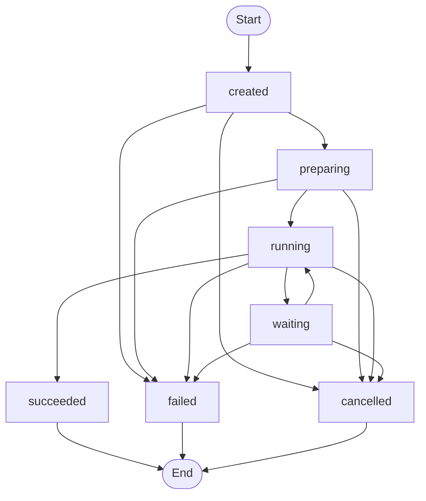

# Execution Lifecycle 详细设计

> 上层架构：[Agent Executor](./README.md)
>
> 相关详细设计：
> - [Agent Execution Domain Model](./execution-domain-model.md)
> - [Execution Context](./execution-context.md)
> - [Runtime View](./runtime-view.md)

## 1. 设计范围

本文定义 Agent Execution 从创建到结束的状态机，以及：

- waiting / resume；
- cancel；
-周期性 checkpoint；
-持续 waiting 后释放内存；
- Central restart recovery；
-长时间运行警告；
- Execution 与下层 timeout / watchdog 的边界；
-无法恢复时的 fallback。

## 2. 生命周期状态

第一阶段主状态：

```text
created
preparing
running
waiting
succeeded
failed
cancelled
```

状态关系：



terminal：

- succeeded；
- failed；
- cancelled。

第一阶段不设置 Execution-level `timed_out` 主状态。

## 3. created

含义：

> Agent Launch Request 已可靠持久化并获得 execution_id，但后台尚未开始 Context preparation。

created 允许：

-被后台 Executor claim；
-被用户取消；
- Central restart 后重新处理。

created 不表示：

- Context 已准备；
- Agent Loop 已运行。

## 4. preparing

preparing 表示 Context Builder 正在准备：

- Agent Snapshot；
- Trigger Context；
- Project Context；
- Runner / mount metadata；
- Model Snapshot；
- Execution Tool Set；
- Execution Policy；
- AgentExecutionContext；
- Execution Snapshot。

Builder 成功并可靠持久化后：

```text
preparing -> running
```

不可恢复的 preparing failure：

```text
preparing -> failed
```

临时错误允许有限内部 retry，但不允许无限卡在 preparing。

## 5. running

running 表示 Agent Loop 正在主动推进本次 Execution。

可能进行：

- Model generation；
- Tool Calling；
- Tool Result 回填；
- Context Compaction；
- retry；
- Runtime Item streaming；
- checkpoint。

running 不意味着当前每一毫秒都在消耗 Model / Tool；它是对外 lifecycle 状态。

## 6. waiting

waiting 表示 Agent Loop 当前不能继续，需要外部输入。

第一阶段至少：

```text
waiting_reason = approval
waiting_reason = decision
```

同时必须有：

```text
waiting_reference
```

指向具体 Approval Request / Decision Request。

状态：

```text
running -> waiting -> running
```

waiting 是同一个 Agent Execution 的挂起，不创建 follow-up Execution。

## 7. Resume

外部模块不能直接恢复 Agent Loop。

统一流程：

```mermaid
sequenceDiagram
    participant External as Approval / Meeting
    participant Executor as Agent Executor
    participant Store
    participant Loop as Agent Loop Runtime

    External->>Executor: resume(execution_id, waiting_reference)
    Executor->>Store: read execution
    Executor->>Executor: validate waiting + reference
    Executor->>External: verify resolved state
    Executor->>Store: waiting -> running
    Executor->>Loop: restore / continue with resolved input
```

Resume 校验：

1. Execution 存在；
2.当前 status = waiting，或该 waiting 已经被成功消费；
3. `waiting_reference` 匹配；
4.外部对象确实 resolved；
5.结果尚未重复注入。

## 8. Resume 幂等

幂等边界：

```text
execution_id + waiting_reference
```

如果同一个 resolve 被重复通知：

-不重复注入结果；
-不创建新的 Runtime Item；
-不再次触发 `waiting -> running`；
-返回当前 Execution 状态。

如果 waiting_reference 不匹配当前等待对象，则返回 conflict / invalid state。

## 9. Terminal State

terminal state 不可逆。

```text
succeeded
failed
cancelled
```

进入 terminal 后：

-不再恢复原 Execution；
-不再重新进入 running；
-不再接受新的 waiting resume；
-新的重试必须创建新的 Agent Execution。

## 10. succeeded

succeeded 只表示：

> 当前 Agent Loop 按 Trigger 的正常 completion contract 结束。

它不表示：

- Task done；
- Meeting 已完成；
-业务目标最终成功。

例如：

```text
Agent calls transfer-task(in-review)
Agent Loop exits normally
Execution -> succeeded
Task -> in-review
```

业务状态由业务 Tool / Domain Service 决定。

## 11. failed

failed 表示 Agent Execution 无法可靠继续。

可能原因：

- preparing permanent failure；
- Agent Loop unrecoverable error；
- Model / Tool / Runner infrastructure failure；
- Central restart 后无法安全恢复；
- state corruption；
- cancel propagation 失败后无法形成可信执行态。

失败必须附结构化 AgentExecutionError。

上层 Task / Meeting 使用各自失败处理机制兜底。

Agent Executor 不自动创建 replacement Execution。

## 12. Cancel

所有非终态均可请求 cancel：

```text
created
preparing
running
waiting
```

取消分两个阶段：

```text
cancel requested
      ↓
propagate cancellation
      ↓
execution stops driving new work
      ↓
cancelled
```

收到 cancel 后：

1.写入 `cancel_requested_at`；
2.不再启动新的 Model / Tool 工作；
3.尽可能取消当前 Model Request；
4.尽可能取消当前 Tool Operation / Runner Command；
5.终止当前 Agent Loop；
6.确认不再继续推进；
7.进入 `cancelled`。

不能在收到 API 请求的瞬间直接把 status 标记成 cancelled。

## 13. Cancelling UI Phase

第一阶段不增加正式 `cancelling` 主状态。

UI 判断：

```text
cancel_requested_at != null
AND status in (created, preparing, running, waiting)
```

即可展示：

```text
Cancelling...
```

真正完成后 status = cancelled。

## 14. 周期性 Checkpoint

Agent Loop 运行期间周期性尝试生成可恢复 checkpoint。

目标：

1. Central 重启后尽可能从最近状态恢复；
2.判断 waiting 是否长期没有推进；
3.长时间 waiting 时释放内存运行态。

Checkpoint 不是 Runtime View Item。

Checkpoint 是内部恢复数据。

## 15. Checkpoint 内容

Checkpoint 至少需要足以重建：

- Agent Loop conversation / message state；
-当前 loop phase；
-最近稳定 Tool Call / Tool Result 边界；
- waiting state；
- Context Compaction state；
-当前 Runtime Item Snapshot 关联；
-必要的 Model / Tool correlation；
-下一步可安全继续的位置。

Checkpoint 不应直接保存：

- Secret value；
-无法安全持久化的 Provider private runtime object；
-正在执行且 outcome unknown 的非幂等副作用操作的“假完成”状态。

## 16. Checkpoint Stable Identity

每个 checkpoint 应计算稳定 state identity / digest。

概念：

```text
checkpoint_state_hash
```

定时 tick 时：

```text
current state hash == latest persisted hash
    -> 不写重复 checkpoint
    -> unchanged_tick_count + 1

current state hash != latest persisted hash
    -> persist new checkpoint
    -> unchanged_tick_count = 0
```

这样避免持续 waiting 时不断写相同数据。

## 17. Waiting 后延迟释放内存

进入 waiting 时：

-不立即释放 Agent Loop runtime；
- checkpoint 定时机制继续工作。

当同时满足：

```text
status = waiting
AND
连续 N 次 checkpoint tick 均 unchanged
```

则认为进入持续 waiting。

此时：

1.确保最近稳定 checkpoint 已持久化；
2.释放 Agent Loop 内存 runtime；
3. Execution 主状态仍保持 waiting；
4.等待外部 resolve。

N 与 checkpoint interval 是实现配置，不在架构中写死。

## 18. Waiting 恢复

如果 waiting Execution 的 Agent Loop 仍驻留内存：

```text
resolve
-> inject resolved input
-> running
```

如果已经释放：

```text
resolve
-> load latest checkpoint
-> rebuild Agent Loop runtime
-> inject resolved input
-> running
```

两种情况对外都是同一个 resume contract。

业务模块不需要知道 runtime 是否仍在内存。

## 19. Central Restart Recovery

Central Backend 是单一 Backend。

不设计：

-多 Backend owner election；
- owner lease；
- `owner_instance_id`；
-跨 Backend takeover。

Central restart 后扫描非终态 Execution。

### created

安全重新进入处理流程。

```text
created -> preparing
```

### preparing

重新运行幂等 Context Builder。

如果 Snapshot 已完整写入，可基于稳定阶段判断是否直接继续。

### running

优先加载最近安全 checkpoint。

如果可以确认恢复边界：

```text
restore checkpoint
-> running
```

如果不能：

```text
running -> failed
```

### waiting

加载最近 checkpoint，恢复 waiting state。

如果等待已经长时间挂起，可以保持“无内存 runtime + waiting”状态，直到 resolve。

## 20. Recovery Safety

恢复原则：

> 宁可失败，也不盲目重放无法确认副作用 outcome 的操作。

尤其：

```text
unknown outcome
+
non-idempotent side effect
```

不能为了恢复 Execution 而自动重放。

Tool retry / unknown outcome 规则继续由 Tool Runtime 决定。

Agent Executor 只使用已知安全的 checkpoint 边界。

## 21. Recovery Failure

无法恢复时：

```text
status -> failed
error.category = recovery_failed / infrastructure_error
```

之后：

- Task 按 Scheduler / Task 自己的失败策略处理；
- Meeting 按 Meeting 自己的失败逻辑处理；
-用户可以人工重新启动；
-未来业务 Retry Policy 可以创建新的 Execution。

Agent Executor 不增加：

- replacement Execution；
- interrupted status；
-特殊 recovery Task。

## 22. Execution 总时长

Execution 不设置自动总 deadline。

即：

```text
Execution can keep running
```

系统不会因为：

```text
elapsed > X
```

自动 cancel / fail Execution。

## 23. 长时间运行警告

虽然不自动终止，但需要 observability。

系统统计：

```text
active_execution_duration
```

只累计：

- preparing；
- running。

不累计：

- waiting。

超过配置阈值：

```text
-> Human Inbox warning
```

警告只提示：

- Execution 已主动运行较长时间；
-可能需要人工查看。

不会改变 Execution status。

同一 Execution 的重复警告应支持去重 / 合理节流，避免 Inbox spam。

## 24. Approval / Decision Waiting Timeout

Approval / Decision waiting：

-不设置自动 timeout；
-不设置自动 expiry；
-不因为 waiting 时间长进入 failed；
-必须等待用户明确 answer / skip / approve / reject 等处理。

这是明确的人机交互语义。

## 25. 下层 Timeout 与 Execution 的关系

不同层的 timeout 不统一映射成 Execution timeout。

### 25.1 Tool Operation

Tool 是否支持 timeout、多久 timeout，由 Agent / Tool Contract 决定。

如果 Tool 支持：

```text
timeout?
```

可以作为 Tool 参数或调用 policy 暴露给 Agent。

Tool timeout 的结果由 Agent Loop 继续处理。

它不自动结束 Agent Execution。

### 25.2 Model Adapter

Model Request 使用渐进 timeout / retry。

初始 timeout、增长策略、最大单次 timeout 由 Model System 详细设计。

达到最大单次 timeout 后：

-不再继续增加 timeout；
-仍可以按 retry policy 继续重试。

Model request timeout 不自动结束整个 Execution。

### 25.3 单轮 Loop Watchdog

为了防止某些模型在一次 generation 中陷入持续循环输出：

每次 Model generation / Loop iteration 具有最大持续时间 watchdog。

触发后：

1.终止当前 generation；
2.保留已允许的必要输出；
3.向 Agent conversation 插入系统提示，说明上一轮因持续时间过长 / 疑似循环被中止；
4.开始下一轮 Agent Loop。

watchdog 只终止当前轮，不终止 Agent Execution。

具体 watchdog 设计属于 Agent Loop。

## 26. Shutdown

Central 正常 shutdown 时，应尽可能：

1.停止接收新的 Launch；
2.触发一次安全 checkpoint；
3.停止继续发起新 Model / Tool 操作；
4.完成可安全完成的当前持久化；
5.退出。

再次启动时按统一 restart recovery 处理。

正常 shutdown 和 crash 不需要两套不同恢复架构。

## 27. Lifecycle Mutation

所有生命周期变更必须经 Agent Executor。

典型操作：

```text
launch
prepare
start
enter_waiting
resume
request_cancel
complete
fail
recover
```

每次 mutation：

-校验允许的 source status；
-使用 `version` 做乐观并发；
-写必要 timestamps / metadata；
-必要时产生 Runtime Item semantic update；
-不允许业务模块直接 UPDATE AgentExecution status。

## 28. 生命周期转换表

| From | To | 原因 |
| --- | --- | --- |
| created | preparing | Executor 开始准备 |
| created | cancelled | 创建后被取消 |
| created | failed | 创建记录存在但后续基础校验失败 |
| preparing | running | Context Snapshot 完成 |
| preparing | cancelled | 用户取消 |
| preparing | failed | Context Builder 最终失败 |
| running | waiting | Approval / Decision |
| running | succeeded | Agent Loop 正常完成 |
| running | cancelled | 取消完成 |
| running | failed | 不可恢复错误 |
| waiting | running | 外部条件 resolved |
| waiting | cancelled | 用户取消 |
| waiting | failed | 恢复失败 / 状态损坏 |

terminal 不允许再迁移。

## 29. 与 Runtime View 的关系

Lifecycle status 是 AgentExecution Source of Truth。

Runtime View 可以显示 lifecycle 变化，但 Runtime Item 不反向决定 status。

例如：

```text
Execution -> waiting
Runtime View -> interaction item: Waiting for Approval
```

Approval resolved：

```text
Execution -> running
Runtime Item -> interaction completed
Agent Loop continues
```

## 30. 与 Agent Loop 的边界

Agent Executor：

-拥有 lifecycle；
-协调 checkpoint；
-协调 resume；
-协调 cancel；
-负责 restart recovery；
-长时间运行告警。

Agent Loop：

-执行 Model / Tool 循环；
-维护可 checkpoint 的 runtime state；
-响应 cancel；
-实现单轮 watchdog；
-报告正常 completion / unrecoverable error。

## 31. 不在本文定义的内容

- Execution schema / version / Error：[Agent Execution Domain Model](./execution-domain-model.md)
- Context Builder：[Execution Context](./execution-context.md)
- Runtime Item / Stream：[Runtime View](./runtime-view.md)
- Agent Loop watchdog / Context management：[Agent Loop](../agent-loop.md)
- Model progressive timeout：[Model System](../platform-infrastructure/model-system.md)
- Tool timeout / retry：[Unified Tool Runtime](../tool-system/tool-runtime.md)
