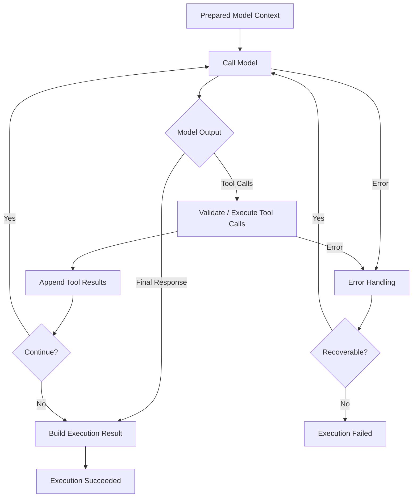
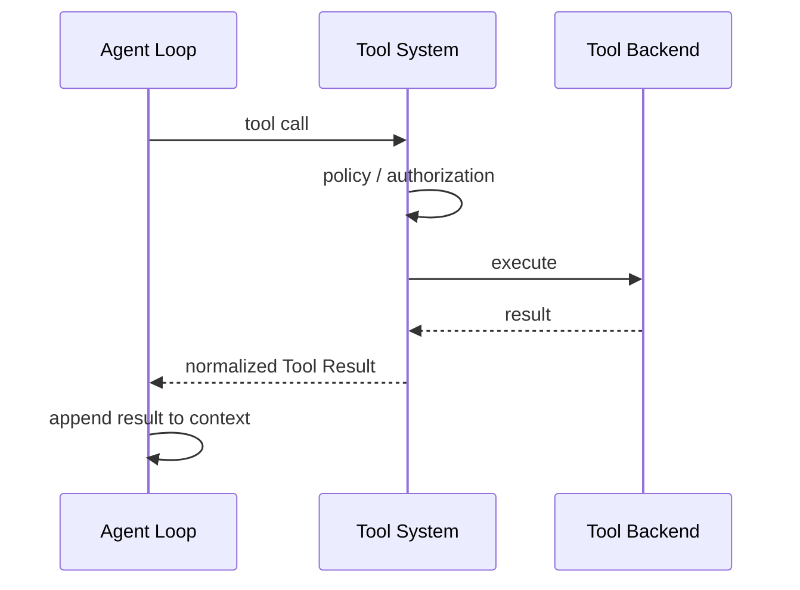
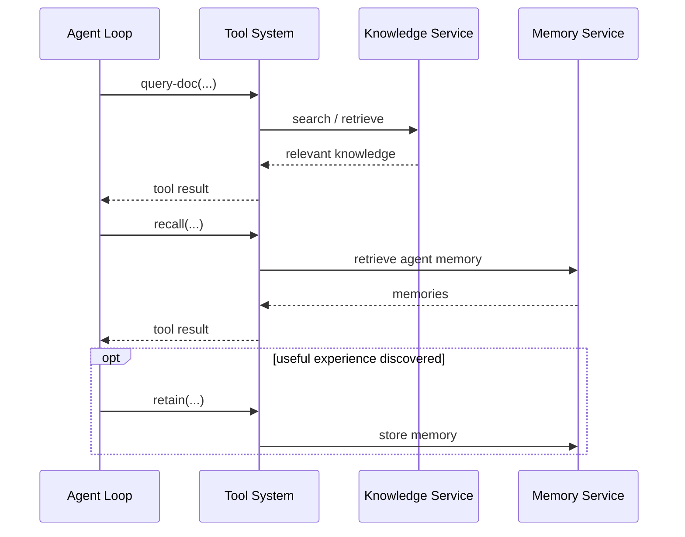

# Agent Loop 架构

## 1. 定位

Agent Loop 是 Agent Execution 内部负责模型调用、Tool Calling、结果回填和循环控制的核心执行机制。

它不是独立服务，也不拥有自己的持久化生命周期。

关系如下：

```text
Agent Executor
  -> Agent Execution
      ├── Execution Context
      ├── Agent Loop
      ├── Model / Tools
      ├── Logs / Usage
      └── Result
```

Agent Executor 负责创建 Agent Execution 并准备 AgentExecutionContext；Agent Loop 只消费已经准备好的 Execution Context，完成实际的 Agent 推理与工具交互。

## 2. Agent Loop 职责

Agent Loop 负责：

- 接收 AgentExecutionContext；
- 将 Execution Context 组装为模型输入；
- 调用 Model Adapter；
- 接收和解析模型输出；
- 处理 tool calls；
- 通过统一 Tool System 执行工具；
- 将 Tool Result 回填到消息上下文；
- 重复执行模型 / Tool 循环；
- 维护当前执行中的消息上下文；
- 管理 context window；
- 处理模型和 Tool 错误；
- 支持 retry；
- 响应 cancel / timeout；
- 记录 usage 和 loop events；
- 生成最终 Agent Execution Result。

Agent Loop 不负责：

- Task 调度；
- Meeting turn 调度；
- 选择 Agent；
- 创建 Agent Execution；
- 读取 Task / Sprint / Milestone 业务数据；
- 读取 Meeting 业务数据；
- 解析 Agent 持久化配置；
- 选择 Model；
- 计算长期 Tool Capability；
- 决定 Task 的业务状态；
- 持久化 Agent Execution lifecycle。

## 3. 输入：AgentExecutionContext

Agent Loop 的唯一启动输入是已经准备好的 AgentExecutionContext。

概念结构：

```text
AgentExecutionContext
├── execution_id
├── platform_prompt
├── agent
│   ├── description
│   ├── instructions
│   ├── inject_agents_md
│   ├── model_parameters
│   └── capability_snapshot
├── base_context
├── trigger_context
├── environment_context
├── model
├── tools
├── execution_policy
└── metadata
```

Agent Loop 不根据 trigger 类型重新查询业务数据库补充启动上下文。

Task、Meeting 等业务信息由 Trigger Context Provider 在 Agent Executor 阶段准备。Trigger Context 中还可以包含对应场景的 Prompt Template / instructions，例如 Task 的状态流转与收尾规则，或 Meeting 的发言、决策与审批规则。

## 4. Context Assembly

Agent Loop 启动时首先将 AgentExecutionContext 组织成真正发送给 Model Adapter 的模型上下文。

在这个阶段才进行最终的 **Prompt Assembly**。此前 AgentExecutionContext 中保存的只是不同来源的 Prompt components，不应分别称为 System Prompt。

主要 Prompt components 包括：

- Platform Prompt；
- Agent `instructions`；
- Trigger-specific Prompt / instructions；
- 可选项目 `AGENTS.md` 中需要作为系统指令表达的内容；
- environment / execution policy 中需要作为系统指令表达的约束。

Agent Loop 将这些 Prompt components 按稳定规则组合后，形成最终 **System Prompt**，再与业务上下文、消息历史和 ToolSpec 一起交给 Model Adapter。

```text
Platform Prompt
      +
Agent instructions
      +
Trigger Prompt / instructions
      +
Project / AGENTS.md instructions
      +
Environment / Execution constraints
      ↓
Prompt Assembly
      ↓
Final System Prompt
      ↓
Model Adapter
```

除 Prompt 外，模型上下文还可以包含：

- Agent 配置快照；
- 项目基础信息；
- prepared trigger context；
- Runner / mount 环境信息；
- execution metadata；
- conversation / execution messages；
- ToolSpec。

Task trigger 的 prepared context 可能包含：

- Task 必要信息；
- Milestone title / description；
- Sprint title / description；
- work / review purpose。

Meeting trigger 的 prepared context 可能包含：

- meeting topic；
- participants；
- rolling summary；
- necessary recent messages；
- turn metadata。

Context Assembly 只负责组织已有输入，不负责业务数据检索。

这里的 **System Prompt** 专指 Prompt Assembly 完成后的最终模型系统级指令。Platform Prompt、Agent instructions、Task/Meeting Prompt 等在组装前都只是 Prompt component，不单独称为 System Prompt。

## 5. 不自动注入的内容

以下内容不作为固定 Execution Context 自动检索：

- Knowledge Retrieval；
- Agent Memory recall；
- 大量历史项目文档；
- 历史 Agent Execution logs；
- 与当前 trigger 无关的全量 Task / Meeting 历史。

Agent 应在 Loop 中根据需要主动调用 Tools 获取这些信息。

虽然 Knowledge Retrieval 和 Agent Memory 不会自动注入，但每个 Agent 都会通过 Platform Prompt 获知这些能力：需要项目背景时主动检索 Knowledge，遇到困难时可以 recall 自己的 Memory，形成可复用经验后可以 retain。具体 Tool 内容仍然只在 Agent 实际调用后进入当前 Execution Context。

这样可以避免：

- 每次执行无条件产生大规模检索；
- Context 被低相关信息占满；
- Agent 无法决定真正需要的信息；
- Knowledge / Memory 与 Agent Loop 强耦合。

## 6. 核心循环

Agent Loop 的基础流程：



Agent Loop 必须允许多轮 Model → Tool → Model 循环，而不是把一次 Model API 调用等同于一次 Agent Execution。

## 7. Loop 状态

Agent Loop 内部可以维护类似以下逻辑状态：

```text
initializing
  -> calling_model
  -> executing_tools
  -> calling_model
  -> ...
  -> completing
  -> completed

or

  -> failed
  -> cancelled
  -> timed_out
```

这些状态主要用于当前 Agent Execution 内部的运行控制和 observability。

它们不需要成为与 Agent Execution 并列的独立业务实体。

Agent Execution 对外只暴露自身生命周期状态，例如：

```text
created
preparing
running
succeeded
failed
cancelled
timed_out
```

## 8. Model Adapter

Agent Loop 通过统一 Model Adapter 调用不同 Model Provider。

Model Adapter 负责：

- 将统一 message schema 转换为 Provider 原生格式；
- 将统一 ToolSpec 转换为 Provider function/tool schema；
- 发送模型请求；
- 处理 streaming；
- 解析文本输出；
- 解析 tool calls；
- 标准化 usage；
- 标准化 finish reason；
- 标准化模型错误。

Agent Loop 不应直接绑定某个具体 Provider 的协议。

例如：

```text
Agent Loop
    -> Model Adapter
        -> OpenAI-compatible
        -> Anthropic
        -> Gemini
        -> other providers
```

Provider 差异应尽量被 Model Adapter 屏蔽。

## 9. Tool Calling

模型产生 Tool Call 后，Agent Loop 通过统一 Tool System 执行。



Agent Loop 只面对：

- Unified ToolSpec；
- normalized Tool Call；
- normalized Tool Result。

Builtin、Runner、MCP 等具体来源由 Tool System 处理。

## 10. Parallel Tool Calls

如果 Model Provider 支持一次返回多个独立 tool calls，Agent Loop 可以支持并行执行。

但并行执行必须考虑：

- Tool 是否声明为可并行；
- 是否存在写冲突；
- Tool 调用之间是否有隐式依赖；
- 是否共享同一 Runner / workspace；
- 是否涉及需要串行审批的操作。

第一阶段可以保守地：

- 读操作允许并行；
- 写操作默认串行；
- 未明确声明可并行的 Tool 默认串行。

具体并发策略可以在 Tool System 设计中继续细化。

## 11. Tool Result 回填

Tool Result 需要以统一结构回填给模型。

至少应区分：

- success；
- business error；
- authorization denied；
- approval required；
- technical error；
- cancelled；
- timeout。

不应把所有失败都转换成普通字符串。

Agent Loop 需要根据 Tool Result 类型决定：

- 继续交给模型判断；
- 自动 retry；
- 等待 approval；
- 终止执行；
- 返回 failed result。

## 12. 按需 Knowledge 与 Memory

Knowledge Base 与 Agent Memory 都作为 Tool 能力提供。

典型流程：



Knowledge 与 Memory 不是 Agent Loop 内部隐藏的自动注入步骤。

## 13. Context Window Management

长时间 Agent Execution 可能超过模型 context window。

Agent Loop 必须具备上下文窗口管理能力。

至少需要考虑：

- system / execution context 的保留优先级；
- 最近 Tool Calls / Tool Results；
- 历史消息压缩；
- 大型 Tool Result 外部化；
- artifact / file reference；
- rolling summary；
- token budget。

原则上：

- 核心 system / execution constraints 不应被压缩丢失；
- 大体积原始内容优先保存为 artifact，并在 Context 中保留 reference；
- 历史 Tool Result 可以按需要摘要；
- 不应因为 context compaction 改变业务事实。

具体 compaction 算法可在实现阶段继续设计。

## 14. Streaming

Agent Loop 应支持模型 streaming。

Streaming 可以产生：

- text delta；
- reasoning / thinking metadata（仅当 Provider 明确支持且允许保存）；
- tool call delta；
- usage update；
- completion event。

UI 可以消费 execution stream 展示实时输出。

Streaming 事件属于 Agent Execution 的运行事件，不应直接成为 Task Event 或 Meeting message。

Meeting 中最终公开消息应在本轮 Agent Execution 产生完整可发布输出后写入 Meeting。

## 15. Error Handling

错误至少需要分类：

### Model Error

例如：

- rate limit；
- provider unavailable；
- invalid request；
- context too large；
- model timeout。

### Tool Error

例如：

- business validation error；
- authorization denied；
- Runner unavailable；
- MCP failure；
- command failure。

### Loop Error

例如：

- invalid tool call format；
- repeated invalid calls；
- tool loop runaway；
- internal state corruption。

错误类型不同，恢复策略也应不同。

## 16. Retry

Agent Loop 可以对明确可恢复的底层错误进行有限 retry，例如：

- transient model network error；
- provider rate limit；
- transient Tool transport error。

不应自动 retry：

- 业务校验失败；
- 权限拒绝；
- Human Approval required；
- Agent 明确产生了错误业务动作；
- 无限重复的相同 tool call。

Retry 必须：

- 有次数上限；
- 支持 backoff；
- 写入 Agent Execution log；
- 计入 usage / duration。

## 17. Loop Guard

需要防止 Agent Loop 无限运行。

至少包括：

- max model turns；
- max tool calls；
- max wall-clock duration；
- max token / cost budget（如果启用）；
- repeated-call detection；
- cancellation signal。

达到 guard 后，Agent Execution 可以进入：

- failed；
- timed_out；
- 或返回结构化 incomplete result。

具体映射由 Agent Executor 根据执行终止原因确定。

## 18. Cancel 与 Timeout

Agent Loop 必须能够响应 Agent Executor 对当前 Agent Execution 发出的：

- cancel；
- timeout；
- shutdown。

收到终止信号后：

1. 不再发起新的模型调用；
2. 尽可能取消正在进行的模型请求；
3. 尽可能取消可取消的 Tool Call；
4. 释放执行资源；
5. 输出明确的终止原因；
6. 让 Agent Executor更新 Agent Execution 最终状态。

Agent Loop 本身不创建新的 Agent Execution 进行重试。

## 19. Execution Result

Agent Loop 结束后返回标准化 Agent Execution Result。

可以包含：

- final output；
- completion status；
- structured output；
- usage；
- generated artifact references；
- error；
- termination reason；
- execution summary。

Agent Execution Result 表示本次 Agent 运行结果，不直接等价于业务对象的最终状态。

例如 Task 是否进入：

- `in-review`；
- `done`；
- `blocked`

应通过 Agent 调用 Task Tools 和 Task Domain 状态校验完成，而不是根据 Agent Execution 是否 succeeded 自动推断。

## 20. Logs 与 Observability

Agent Loop 持续向当前 Agent Execution 写入运行事件。

包括：

- model request started / finished；
- model usage；
- tool call started / finished；
- retry；
- context compaction；
- cancel / timeout；
- error；
- final result。

完整 execution log 的归档边界是 Agent Execution。

Task Event、Meeting message 和 Audit Log 只保存各自领域需要的信息，并可以引用 Agent Execution ID。

## 21. Harness 参考与实现策略

当前架构基线是：**agenteam 自行实现 Agent Loop，不直接集成或封装完整第三方 Agent Harness 作为核心执行基础。**

可以研究成熟 Agent Harness，例如：

- pi；
- opencode。

重点借鉴：

- Agent Loop 控制流程；
- provider abstraction；
- tool/function calling；
- streaming；
- cancellation；
- retry / error recovery；
- context compaction；
- usage tracking；
- logging / tracing。

这些项目是设计和实现参考，不是 agenteam 的既定运行时依赖。

未来如果局部组件具有明确复用价值，可以通过适配层引入，但不改变：

```text
Agent Executor owns Agent Execution lifecycle
Agent Execution owns execution context / logs / result
Agent Loop performs model-tool iteration
```
