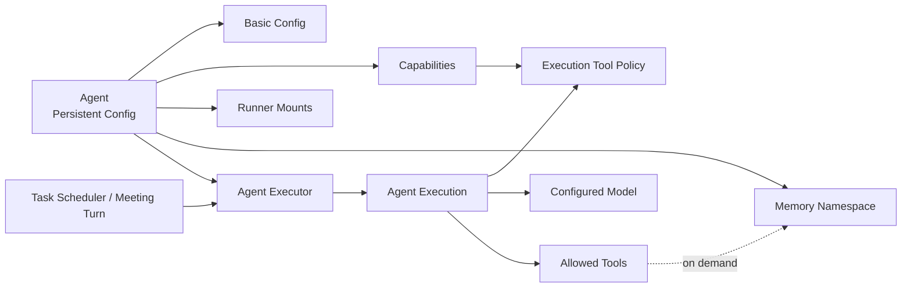

# Agent 管理架构

## 1. 模块职责

Agent Management 定义项目中“一个 Agent 是什么”，负责长期配置、能力边界和 Agent 模板。

它不负责执行 Agent Loop。一次实际运行由 Agent Executor 根据某个 Agent 的配置创建 Agent Execution，Agent Execution 内部运行 Agent Loop。

## 2. Agent 配置模型

项目级 Agent 至少包含：

### 基础配置

- name；
- tag-color；
- model；
- description；
- instructions；
- 是否注入项目 `AGENTS.md`；
- 可选的 Agent 级 model parameters。

其中：

- tag-color 只用于界面识别，不参与权限、角色或调度语义；
- `description` 是面向用户和其他 Agent 的简短能力说明，用于快速判断该 Agent 是做什么的、是否适合作为 assignee / reviewer / Meeting participant；
- `instructions` 是该 Agent 自身长期维护的 Prompt，描述其角色、职责、专业能力、工作方式和个性化约束；
- Agent Management 不额外保存独立的 `system prompt` 字段。System Prompt 只指 Agent Loop 在执行前将各类 Prompt components 组装完成后的最终产物。

### Platform Prompt

除了 Agent 自身的 `instructions`，平台还维护一段统一的 **Platform Prompt**，用于说明所有 Agent 在 agenteam 中都应掌握的通用工作能力和平台约定。

Platform Prompt 不属于某个 Agent 的持久化配置，也不在创建 Agent 时复制到 Agent 记录中。它由平台统一维护和版本化，并在每次 Agent Execution 构造上下文时注入。

Platform Prompt 至少应让所有 Agent 知道：

- 当需要了解项目设计、规范或背景信息时，可以主动使用 Knowledge Retrieval；
- 当遇到困难、重复问题或不确定如何处理时，可以尝试 Agent Memory recall，查询自己过去积累的经验；
- 当解决了有复用价值的问题、踩过坑或形成经验时，可以使用 Agent Memory retain 保存到自己的 memory namespace；
- Knowledge 与 Memory 都是按需能力，不代表其内容会自动出现在每次 Agent Execution 的上下文中。

这些只是 Platform Prompt 应覆盖的能力方向。具体 Prompt 文案需要结合实际 Tool、Agent Loop 行为和使用效果持续设计与迭代，不在当前架构阶段提前固化成最终文本。

因此执行期的 Prompt components 至少包括：

- **Platform Prompt**：平台共享的基础能力与工作约定；
- **Agent instructions**：当前 Agent 自身的长期角色与工作提示；
- **Trigger Prompt**：由 Task / Meeting 等 Trigger Context Provider 根据当前执行场景提供。

这些组件在 AgentExecutionContext 中保持独立，只有 Agent Loop 在真正准备模型输入时完成最终 Prompt Assembly。

Knowledge Retrieval 与 Agent Memory 的具体机制见 [Knowledge Base 与 Agent Memory 架构](./knowledge-memory.md)。

### Capability

Capability 描述 Agent 被允许使用的资源和工具，包括：

- allowed tools；
- skills；
- Runner mount points。

其中 `allowed tools` 只控制普通可配置 Tool。平台定义的 Core Agent Tools（当前包括 `query-doc`、`recall`、`retain`、`reflect`）始终可见，不能通过 Agent Capability 关闭，但仍受 Project / Agent scope 和服务端授权限制。

Tool 的统一抽象、来源、权限和调用链路见 [统一工具系统架构](./tool-system.md)。

Tool 应支持按以下维度组织和展示：

- 来源：Builtin / Runner / MCP；
- 功能类别；
- 读 / 写属性；
- 风险属性。

Capability 是 Agent 的长期最大权限，不代表任意运行上下文中都能无条件使用这些能力。Meeting 等上下文可以进一步收紧权限。

### Runner Mount Point

Runner、mount、远程执行环境和安全边界的完整设计见 [Runner 架构](./runner.md)。

每个 mount point 至少包含：

- name；
- runner；
- path；
- description。

Runner 的 description、headless 属性以及 Agent 可见 mount 信息会作为执行环境元数据由 Agent Executor 解析，并写入 AgentExecutionContext。

Agent 只看到被分配给自己的 mount，而不是 Runner 的完整文件系统。

### Memory

Knowledge Base 与 Agent Memory 的职责边界、存储和按需访问机制见 [Knowledge Base 与 Agent Memory 架构](./knowledge-memory.md)。

每个项目级 Agent 拥有独立 memory namespace，用于沉淀该 Agent 在当前项目中的经验、知识和问题。

Memory 的执行期访问通过 memory tools 完成，而不是在每次 Agent Execution 启动时自动把全部 Memory 注入 Execution Context。

## 3. Agent 与执行链路的关系



Agent 是持久化配置；Agent Execution 是一次独立 Agent 运行的完整执行实例和持久化记录。

每次执行时，Agent Executor 会把 Platform Prompt、Agent 自身 `instructions`，以及当前 Trigger Context Provider 提供的场景 Prompt / Context 一起组织进 AgentExecutionContext。

因此不存在“正在运行的 Agent 对象”长期持有上下文的设计。每次 Agent Execution 都创建独立的 Execution Context，并从新的 Agent Loop 开始运行。

## 4. Agent Preset

系统级 Agent Preset 是创建项目 Agent 时使用的模板。

Preset 可以包含：

- name；
- tag-color；
- model；
- description；
- instructions；
- AGENTS.md 注入策略；
- Agent 级 model parameters；
- allowed tools；
- skills。

Preset 不包含：

- 项目特定 Runner mount points；
- 项目特定 Agent Memory。

从 Preset 创建 Agent 时采用“复制配置”，不是引用。

因此后续修改 Preset 不应自动影响已经创建的项目 Agent。

## 5. 模型选择

Agent 配置引用一个可用 chat model。

模型可能来自：

- 系统级 Model Provider；
- 项目级 Model Provider。

Agent Management 只保存模型选择和与 Agent 有关的模型参数，不负责实现模型 Provider 调用协议。实际模型调用由 Agent Loop 的 Model Adapter 处理。

## 6. 权限边界

Tool Capability、Execution Policy 和服务端授权的完整关系见 [统一工具系统架构](./tool-system.md)。

Agent 的有效权限是多层约束的交集：

```text
System Policy
  ∩ Project Policy
  ∩ Agent Capability
  ∩ Execution Policy
  ∩ Human Approval Scope
```

任何 Agent 配置都不能绕过服务端最终授权校验。

Memory tools 虽然不需要由用户逐项配置权限，但服务端必须强制限制 Agent 只能访问自己的 memory namespace。
