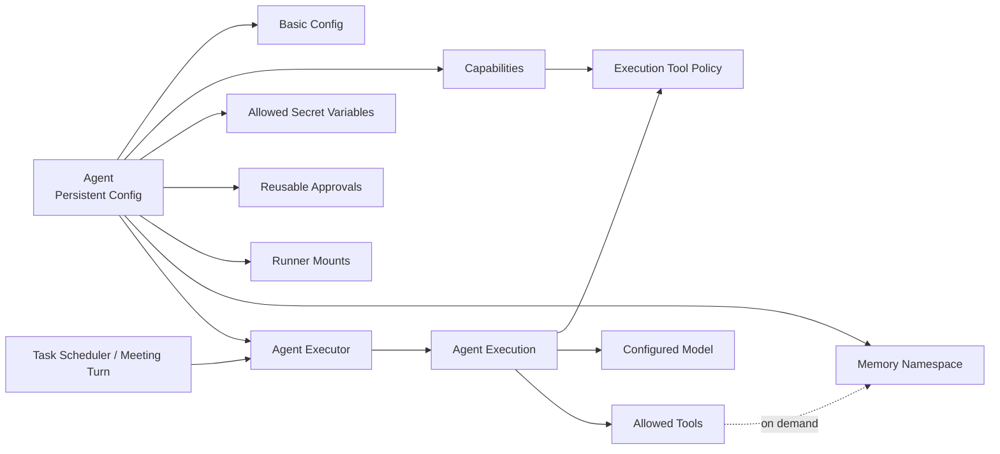

# Agent 管理架构

## 1. 模块职责

Agent Management 定义项目中“一个 Agent 是什么”，负责长期配置、能力边界和 Agent 模板。

它不负责执行 Agent Loop。一次实际运行由 Agent Executor 根据某个 Agent 的配置创建 Agent Execution，Agent Execution 内部运行 Agent Loop。

## 2. Agent 配置模型

项目级 Agent 至少包含：

### 基础配置

- name；
- tag-color；
- `model_ref`；
- `reasoning_effort`；
- description；
- instructions；
- 是否注入项目 `AGENTS.md`；

其中：

- tag-color 只用于界面识别，不参与权限、角色或调度语义；
- `description` 是面向用户和其他 Agent 的简短能力说明，用于快速判断该 Agent 是做什么的、是否适合作为 assignee / reviewer / Meeting participant；
- `instructions` 是该 Agent 自身长期维护的 Prompt，描述其角色、职责、专业能力、工作方式和个性化约束；
- `reasoning_effort` 是当前 Agent 对所选 chat Model 的 reasoning 等级选择；当该 Model 的 `parameters.capabilities.reasoning_efforts` 非空时，必须从其中选择一个等级；不支持可选 reasoning effort 的 Model 不展示该配置；
- Agent Management 不额外保存独立的 `system prompt` 字段。System Prompt 只指 Agent Loop 在执行前将各类 Prompt components 组装完成后的最终产物。

### Platform Prompt

除了 Agent 自身的 `instructions`，平台还维护一段统一的 **Platform Prompt**，用于说明所有 Agent 在 agenteam 中都应掌握的通用工作能力和平台约定。

Platform Prompt 不属于某个 Agent 的持久化配置，也不在创建 Agent 时复制到 Agent 记录中。它由平台统一维护和版本化，并在每次 Agent Execution 构造上下文时注入。

Platform Prompt 至少应让所有 Agent 知道：

- 当需要了解项目设计、规范或背景信息时，可以主动使用 Knowledge Retrieval；
- 当遇到困难、重复问题或不确定如何处理时，可以尝试 Agent Memory recall，查询自己过去积累的经验；
- 当解决了有复用价值的问题、踩过坑或形成经验时，可以使用 Agent Memory retain 保存到自己的 memory namespace；
- Knowledge 与 Memory 都是按需能力，不代表其内容会自动出现在每次 Agent Execution 的上下文中。

这些只是 Platform Prompt 应覆盖的能力方向。具体 Prompt 文案需要结合实际 Tool、Agent Loop 行为和使用效果持续设计与迭代，不在当前架构阶段提前固化成最终文本。

因此执行期的 Prompt components 至少包括：

- **Platform Prompt**：平台共享的基础能力与工作约定；
- **Agent instructions**：当前 Agent 自身的长期角色与工作提示；
- **Trigger Prompt**：由 Task / Meeting 等 Trigger Context Provider 根据当前执行场景提供。

这些组件在 AgentExecutionContext 中保持独立，只有 Agent Loop 在真正准备模型输入时完成最终 Prompt Assembly。

Knowledge Retrieval 与 Agent Memory 的具体机制见 [Knowledge Base 与 Agent Memory 架构](./knowledge-memory.md)。

### Capability

Capability 描述 Agent 被允许使用的资源和工具，包括：

- allowed tools；
- skills；
- Runner mount points；
- allowed Secret Variables。

其中 `allowed tools` 只控制普通可配置 Tool。平台定义的 Core Agent Tools（当前包括 `query-doc`、`recall`、`retain`、`reflect`、`list-mcp-resources`、`read-mcp-resource`、`list-artifacts`、`create-artifact`、`read-artifact`）始终可见，不能通过 Agent Capability 关闭，但仍受 Project / Agent scope 和服务端授权限制。

Tool 的统一抽象、来源、权限和调用链路见 [统一工具系统架构](./tool-system/index.md)。

Tool 应支持按以下维度组织和展示：

- 来源：Builtin / Runner / MCP；
- 功能类别；
- 读 / 写属性；
- 风险属性。

MCP Server 通过 MCP Bridge discovery 出来的 Tool 会先映射成统一 `ToolSpec`，然后与 Builtin / Runner Tool 一样出现在 Agent Capability 的 Tool 选择中。MCP Tool 默认按**具体 Tool**授权，而不是因为 Agent 能使用某个 MCP Server 就自动拥有该 Server 的全部 Tool。

Agent Capability 保存的是 Tool 的稳定 ID 引用，不复制 MCP schema。例如概念上可以表示为：

```text
mcp:<mcp_server_config_id>:<remote_tool_name>
```

因此：

- MCP Server 新 discovery 出来的 Tool 不会自动加入已有 Agent Capability；
- MCP Tool 暂时不可用时，长期 Capability 引用可以保留，但当前 Agent Execution 不暴露该 Tool；
- Tool schema 更新不应因为 display name 变化而隐式改变 Agent 的权限身份。

MCP Server 配置、Tool discovery、stable identity 和 Bridge 执行链路见 [MCP 集成架构](./mcp-integration/index.md)。

MCP Resource 不进入普通 `allowed tools` 列表。Agent 通过平台 Core Agent Tools 按需列举 / 读取当前 Project 已连接 MCP 的 Resource；真正读取后的 Resource 内容统一落入 Object Storage，并以 file / image / text projection 供 Agent 消费。

Artifact 同样不直接暴露底层 StoredObject。Agent 通过 `list-artifacts / create-artifact / read-artifact` 管理当前 Project 中有业务语义的 Artifact，用于保存生成结果、复用已有 file/image reference，以及向用户提供可预览 / 下载的文件。

Artifact 下载 URL 由用户侧 UI / API 在权限校验后按需生成，不进入 Agent Context。

Capability 是 Agent 的长期最大权限，不代表任意运行上下文中都能无条件使用这些能力。Meeting 等上下文可以进一步收紧权限。

### Project Environment Variables

Project 可以配置两类 Environment Variable：

- 普通 Variable；
- Secret Variable。

普通 Variable 对当前 Project 的所有 Agent 可见，不需要逐 Agent 配置。

Secret Variable 必须由 Project Owner 显式加入 Agent 的 `allowed_secret_variables` 白名单后，该 Agent 才能使用。

Agent 配置只保存 Secret Variable 的稳定引用，不复制 Secret value。

每个变量都包含 `description`，用于告诉 Agent 变量的用途。

Agent Execution 构造时：

- 普通 Variable 的 name / description / value 会进入 AgentExecutionContext；
- 当前 Agent 被允许使用的 Secret Variable 只把 name / description / Secret 标记放入 AgentExecutionContext；
- Secret value 不进入 AgentExecutionContext 和 Model Context。

具体存储、Prompt 注入和执行期环境变量注入见 [项目变量与 Secret 详细设计](./project-work-management/project-environment-variables.md)。

### Reusable Approval

Reusable Approval 是当前 Agent 的长期 Approval，但不属于 Agent Capability。

它由一次真实的待审批 Tool Call 创建：

~~~text
用户选择“以后都允许此类调用”
-> 创建 Reusable Approval
-> 归属于当前 Agent
~~~

Agent 配置页面提供 `Reusable Approvals` 列表，用于查看当前 Agent 已经存在的 Reusable Approval。

Project Owner 可以：

- 查看 Tool；
- 查看 human-readable Scope；
- 查看创建时间和来源；
- 撤销 active Reusable Approval。

第一阶段不允许在 Agent 配置页：

- 手工新增 Reusable Approval；
- 任意编辑 Scope；
- 把一条 Reusable Approval 改到另一个 Tool 或 Agent。

Reusable Approval 不设置过期时间，保持 active 直到 Project Owner 撤销。

每次 Tool Call 都会重新匹配当前 active Reusable Approval，因此撤销后后续调用自然无法再匹配该 Approval。

Reusable Approval 的 Scope、创建和匹配规则见 [Approval Scope 详细设计](./security-governance/approval-scope.md)。

### Runner Mount Point

Runner、mount、远程执行环境和安全边界的完整设计见 [Runner 架构](./runner.md)。

每个 mount point 至少包含：

- name；
- runner；
- path；
- description。

Runner 的 description、headless 属性以及 Agent 可见 mount 信息会作为执行环境元数据由 Agent Executor 解析，并写入 AgentExecutionContext。

Agent 只看到被分配给自己的 mount，而不是 Runner 的完整文件系统。

### Memory

Knowledge Base 与 Agent Memory 的职责边界、存储和按需访问机制见 [Knowledge Base 与 Agent Memory 架构](./knowledge-memory.md)。

每个项目级 Agent 拥有独立 memory namespace，用于沉淀该 Agent 在当前项目中的经验、知识和问题。

Memory 的执行期访问通过 memory tools 完成，而不是在每次 Agent Execution 启动时自动把全部 Memory 注入 Execution Context。

## 3. Agent 与执行链路的关系



Agent 是持久化配置；Agent Execution 是一次独立 Agent 运行的完整执行实例和持久化记录。

每次执行时，Agent Executor 会把 Platform Prompt、Agent 自身 `instructions`、当前 Agent 可见的 Project Environment Variables，以及当前 Trigger Context Provider 提供的场景 Prompt / Context 一起组织进 AgentExecutionContext。

因此不存在“正在运行的 Agent 对象”长期持有上下文的设计。每次 Agent Execution 都创建独立的 Execution Context，并从新的 Agent Loop 开始运行。

## 4. Agent Preset

系统级 Agent Preset 是创建项目 Agent 时使用的模板。

Preset 可以包含：

- name；
- tag-color；
- model_ref；
- reasoning_effort；
- description；
- instructions；
- AGENTS.md 注入策略；
- allowed tools；
- skills。

Preset 不包含：

- 项目特定 Runner mount points；
- 项目特定 Secret Variable 白名单；
- Reusable Approval；
- 项目特定 Agent Memory。

从 Preset 创建 Agent 时采用“复制配置”，不是引用。

因此后续修改 Preset 不应自动影响已经创建的项目 Agent。

## 5. 模型选择

Agent 配置引用一个可用 chat model。

chat Model 可能来自：

- 系统级 Model Provider；
- 项目级 Model Provider。

项目级 Provider 第一阶段只能配置 chat Model；embedding / reranker / image_generation 由平台级 Model Management 统一配置和消费，不出现在 Agent 的 model_ref 选择中。

Agent Management 只保存 `model_ref` 以及按所选 Model 能力配置的 `reasoning_effort`，不保存通用模型请求参数。

删除仍被 Agent 引用的 chat Model 时，Model Management 必须要求用户先选择替代 chat Model，并在删除前批量更新受影响 Agent.model_ref；替换后还必须保证各 Agent 的 reasoning_effort 在新 Model 下合法，不能留下无效配置。

实际模型调用由 Agent Loop 的 Model Adapter 处理。Provider / Model 配置、模型解析、Capability 与 Model Adapter 的完整设计见 [Model System 详细设计](./platform-infrastructure/model-system.md)。

## 6. 权限边界

Tool Capability、Execution Policy 和服务端授权的完整关系见 [统一工具系统架构](./tool-system/index.md)。

Agent 的执行期 Tool 能力由长期 Capability 和单次 Execution Policy 共同收紧：

```text
Agent Capability
  ∩ Execution Policy
```

具体 Tool Call 仍必须经过 Project / Resource Scope、平台固定安全规则、Approval Match / Approval Policy 和服务端最终校验。

任何 Agent 配置都不能绕过服务端最终授权校验。

Memory tools 虽然不需要由用户逐项配置权限，但服务端必须强制限制 Agent 只能访问自己的 memory namespace。
