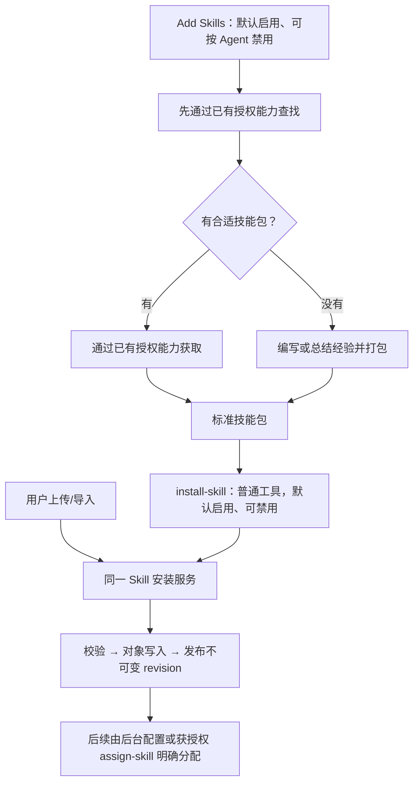
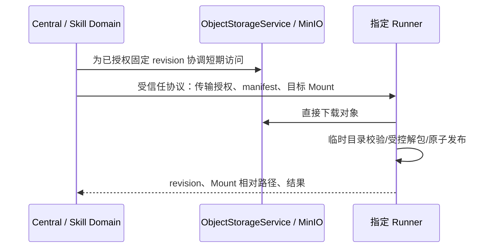

# Agent Skills 架构

> 相关：[Agent Management](agent-management.md)、[Object Storage](platform-infrastructure/object-storage.md)、[Execution Context](agent-executor/execution-context.md)、[Runner Workspace](runner/agent-workspace.md)、[Data Channel](runner/data-channel.md)。本文承载已确认业务规则；具体 schema、工具名、路径、参数与库版本仍须 D01 及责任模块规格落实，尚未实现或验收。

## 1. 职责与作用域

Skill 是以 `SKILL.md` 为入口的技能包，可携带脚本、参考资料和素材。它是独立业务资源，不能因为内容是文件就把它作为 Artifact 或 KnowledgeDocument 并套用另一套生命周期。

首期只有 Project 技能库，没有系统共享技能库；系统 Agent Preset 不保存项目技能引用。Skill Domain 拥有技能身份、包版本、安装发布与查询，Agent 配置拥有技能分配引用，两者通过正式端口协作。Object Storage 拥有字节存储，Executor 拥有运行中版本绑定，Runner 拥有文件落地。

Owner 可通过项目管理 UI 上传/导入标准包并配置 Agent 分配，不新增人工编写技能的独立流程。Agent 使用已授权的获取/编写能力形成标准包，再通过统一安装工具入库。第三方平台适配与格式范围由规格明确，不承诺任意第三方包都可直接导入。

## 2. 包、对象与不可变版本

包的根入口为 `SKILL.md`。以下是内容组织示例，不是已冻结的目录约束：

```text
SKILL.md
scripts/build-report.py
references/format.md
assets/template.html
```

稳定 Skill 身份属于一个 Project；每次成功发布创建不可变 revision。PostgreSQL 保存业务元数据、当前 revision、对象引用和经过验证的文件清单；MinIO 通过 ObjectStorageService 保存包内容。具体名称规范化、字段和包格式由 D01/D10 固定。

原始包是 revision 的内容事实来源。单文件派生对象或缓存须绑定该 revision 及校验值、可由原包重建，不允许独立编辑成为第二套正文。读取入口、参考资料和 Runner 文件准备必须使用同一已绑定版本。

安装前验证结构、入口、媒体与资源限制；拒绝越界/绝对路径、符号链接和硬链接、设备文件、重复或规范化碰撞路径。压缩/解压体积、文件数量、单文件大小、处理时限及受支持 frontmatter 范围在规格固定。上传和准备阶段不执行包内脚本或安装依赖。

## 3. 内置 Add Skills 与统一安装

每个 Project 初始化受保护的 Add Skills 引导资源：不能单独删除，项目永久删除仍按清理矩阵处理。它默认对 Agent 启用，但用户可以按 Agent 禁用；这不建立系统共享技能目录，也不新增不可关闭 Core Tool。

引导先查找市场/网络已有技能；没有合适内容时编写或从经验中总结技能。两条路径都产出标准包，并说明安装之后仍须显式分配：



`install-skill` 为职责名称，精确工具名/schema 在 D18/D21 固定。输入是受控标准包或业务文件引用：平台文件须校验 Project 归属，Runner 包须校验 Mount/执行权限并沿对象直传路径上传，用户上传同样先形成受控材料。模型不提供 MinIO key、凭据或 Signed URL；具体 typed source reference、无 Runner 文本包生成方式及完整性端口在 D01/D05/D10/D17/D21 落实。

UI 和工具调用同一安装服务，采用相同格式、校验、版本、错误与幂等规则。下载成功或对象写入成功都不代表业务安装完成；对象写入与数据库发布不能假装处于同一数据库事务，失败须明确反馈并可恢复清理。来源、版本和内容摘要用于追溯，不夹带明文凭据，也不代替包校验。

安装只发布到项目库，不自动分配给发起 Agent。安装成功而后续分配失败时，保留已发布包并分别反馈。没有分配权限的安装者仍须由用户或获授权的其他 Agent 完成分配。

Add Skills 与 install-skill 按技能引用、allowed tools 分别管理；保存、重启、模板复制或读取指引不得重新开启用户显式禁用的配置。引导只提供方法，不授予搜索、下载、文件、命令、Artifact 等权限；需要的能力未绑定时明确失败并交接实现，不能用提示词或私有旁路冒充正式能力。

## 4. 分配、目录与正文权限

普通 Agent 只看到自身已分配且允许使用的技能名称/简介，完整入口及附件按需读取；服务端过滤，不能只隐藏 UI。Owner 的项目管理目录单独授权。

`assign-skill` 是普通可选 Builtin Tool，不默认为全体开启，不属于 Core Tool。拥有当前有效管理权限的 Agent 可查询当前 Project 全部合法技能的名称/简介，并分配给自己或同项目其他 Agent；不要求调用者先拥有目标技能。管理目录权限不授予正文/脚本/素材读取，正文继续检查调用 Agent 自身分配。

后台勾选与工具复用同一分配服务，验证目标 Agent/Skill 所属 Project、资源状态、Agent 配置版本、幂等与并发冲突，遵守归档/删除门禁。查询和写入均验证当前工具与 Execution Policy 权限，不能仅凭请求参数打开全库。分配不能顺带修改模型、Tool、Mount、Secret 或审批授权；添加/移除的精确命令在规格固定。

## 5. Central 按需读取

Agent Loop 和模型上下文在 Central，技能说明通过 Skill Domain 与 ObjectStorageService 读取，无需 Runner 在线。Execution 初始目录由 Agent 合法分配解析，固定技能 ID/revision、名称、简介和入口引用；模型只获得摘要与读取方法，不预装全部正文。

读取能力（职责上类似 `read-skill`）接受业务技能身份及包内相对文件路径，校验 Project、当前 Agent/Execution 授权、资源状态及本次已生效绑定版本。返回经大小/媒体校验的文本；二进制素材不强塞进文本上下文，大结果遵循正式外部化和投影规则。

读取结果进入正式 ToolOperation/Attempt 与 Canonical Transcript。Agent 不直接调用 ObjectStorageService，不获得对象 key、签名 URL 或 Central 本地路径。读取工具的精确 schema 和暴露规则由 D18/D21 明确，不凭本文增加不可关闭 Core 能力。

## 6. 新分配技能的下一轮生效

启动 Agent/Model/Tool/Prompt Snapshot 保持不可变。技能新增采用专用的持久运行事实，形成“初始技能绑定 + 已生效新增绑定”；不替换整个 Agent 配置，不任意扩大固定 Tool Set。

1. UI / assign-skill 经同一分配事务和正式执行端口可靠提交新增绑定，记录变更身份、目标、分配版本与固定 Skill revision。具体字段、事务/锁和启动竞争由 D01/D10/D22 明确，不能依靠易丢失或可能延迟的内存通知。
2. 下一次 Model Request 的输入确定点应用此前已提交、尚未应用且仍有效的分配。确定点后提交的变更进入再下一轮；当前已发出的模型请求和 Tool Batch 不被改写，同批工具不会因完成先后获得不同新增集合。
3. 应用前再次经正式端口确认分配未移除，防止延迟新增通知恢复已撤销授权。重复或乱序投递按版本/幂等契约处理，提交后响应丢失不能重复追加或漏绑定。
4. Executor 生成正式 typed control input 并记录必要 Transcript 事实，下一轮显示新增技能名称/简介，正文仍按需读取。Checkpoint 保存绑定状态和变更位置，恢复与 Compaction 后可重建有效目录，不能只依赖一条可能被摘要遗漏的提示。
5. 读取说明、素材和 Runner 准备均使用新增绑定的同一固定 revision。已有绑定不随库更新或恢复过程静默替换为最新版本。

当前 Execution 必须已有所需通用读取/准备与命令工具。缺少能力时报告限制，技能本身不增加工具、改 schema、换模型或授予 Runner/Secret 权限。waiting 可记录待应用变更，但分配不解决原审批/Decision、不自动恢复 running；终态执行不复活，新 Execution 从新配置准备。

## 7. Runner 文件准备与直连传输

需要脚本或素材时，通过有业务语义的准备能力（职责上类似 `prepare-skill`）选择已授权 Mount。Central 校验 Project、Agent、Execution、当前 Skill 资源/授权、绑定 revision、Mount 有效性与 Execution Policy，再协调单对象、单操作的短期传输授权。



Runner 直连对象存储，Central 保留业务授权、metadata 与传输协调；不把包字节塞入 Control Channel，不自动回退 Central 中转。存储端点可以通过内网/VPN 或受保护 HTTPS 对 Runner 可达，不要求公开 bucket 或管理控制台；外部端点/TLS 使用部署环境配置。短期访问材料仅经过受信任协议，不进入模型、普通 Tool Result、Transcript、日志或长期缓存。

默认完整包落地以保留相对导入及素材关系。Runner 在 Agent Workspace 内使用平台管理的不可变版本目录，具体相对路径/保留名称在 D16/D17 规格固定，不接受包内任意目标绝对路径。校验 manifest 与文件摘要后原子发布；取消、断连、磁盘不足和部分传输不暴露半套包为成功。同一 Mount/revision 重复准备可在验证后复用，失败可恢复。

Tool Result 只返回 Mount identity、Skill revision、工作区相对路径和明确结果；多个 Runner 分别按需准备同一固定版本，不共享宿主机绝对路径，也不因 Agent 创建向所有 Runner 分发。单 Agent 最多一个非终态 Execution 的约束保留。

脚本通过已有命令/进程工具运行，继续检查权限、审批、取消与记录；准备成功不等于执行获批。Runner 缺少解释器或工具时返回真实错误，不隐式安装依赖。trusted-host Runner 的文件属性不等于 OS sandbox，技能不创建新的执行容器。

## 8. 更新、移除与清理

同名安装默认冲突，只有显式更新且校验稳定目标与预期版本后才发布新 revision；不能仅凭包内名称覆盖已有技能。UI 与安装工具共用该规则和业务幂等语义，响应丢失重试不重复发布，更新失败保留原版本。已运行 Execution 保留固定旧 revision；Add Skills 的受保护身份不能被普通同名安装绕过，其版本维护由规格落实。

移除/禁用只更新正式配置，不因此停止 Execution 或已开始的脚本，不改写历史 Snapshot/Transcript，不增加专用撤回通知或强制上下文清理。已读内容和落地文件不主动收回；后续读取/准备继续校验当前资源与权限，失效时返回正常 ToolError，由 Agent 处理，不保证旧权限持续到执行结束，也不因一次普通工具错误直接终止 Execution。

包版本、运行绑定及对象引用须持久化保护；新版本发布不覆盖活动旧版本。项目库技能删除、历史 payload 与缓存保留的精确矩阵仍须 D01/D10/D22 明确，不能把移除分配等同于包对象删除。缓存清理只处理已验证归属且没有活动使用的版本，不递归删除用户文件或共享挂载。

项目归档遵循停止后只读，永久删除经各责任模块端口清理技能、对象与托管文件。Runner 离线或清理未知时不能宣称已物理清理；边界见[项目生命周期](project-work-management/README.md#22-project-归档与永久删除)。

## 9. 实现责任与验收

| 责任模块 | 必须落实的边界 |
| --- | --- |
| D01 / D10 | 业务模型、引用/版本/删除矩阵、安装/分配/查询端口、内置引导与项目初始化绑定 |
| D05 / D15–D17 | 对象能力、单次直传授权、Runner 路径/完整性/失败恢复 |
| D18 / D19 / D21 | 读取/准备/安装/分配工具、ScopeResolver、授权审批与真实后端 |
| D22 | 初始版本、可靠新增绑定、轮次应用、Transcript/Checkpoint 与恢复 |
| D27 / D28 | 导入和分配界面、部署可达性与完整远程流程 |

验证须覆盖无 Runner 文本读取、受控包导入、跨 Project 拒绝、管理目录与正文权限分离、安装不自动分配、同名冲突/显式更新、默认启用/显式禁用、来源与解包攻击、发布失败恢复、固定版本及多 Runner 准备、取消/断连/环境缺失、脚本审批、分配与启动/终止/移除竞争、waiting、重复/乱序、恢复/压缩后的目录一致性。缺少正式绑定时明确报告，不使用生产成功 stub；本文件的规则归位不代表上述验收已经执行。
