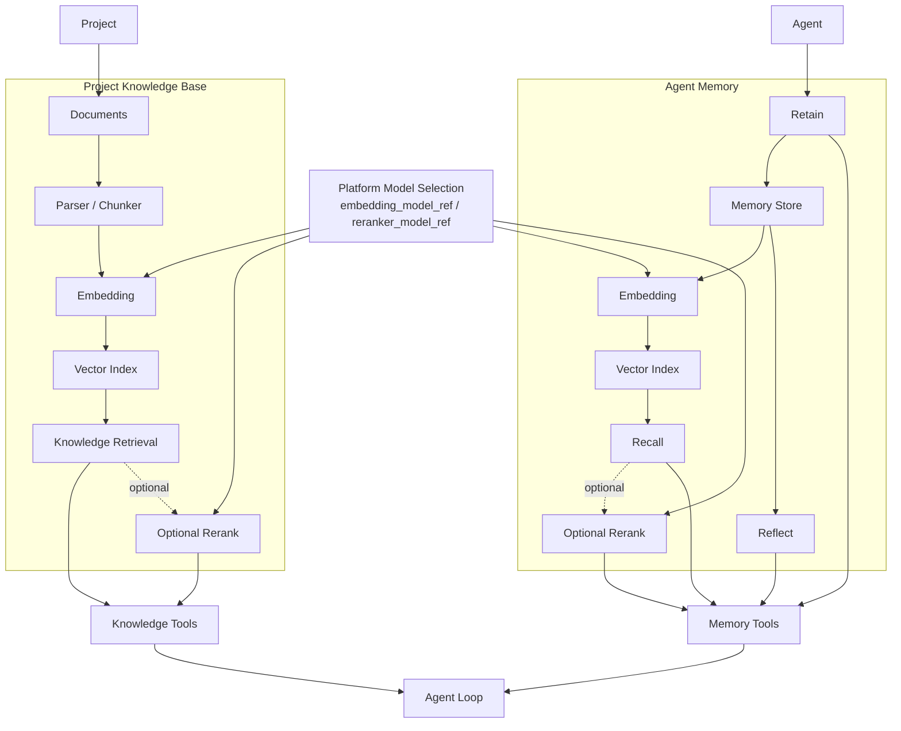

# Knowledge Base 与 Agent Memory 架构

## 1. 两个系统的边界

Knowledge Base 和 Agent Memory 都可能使用向量检索，但它们不是同一个业务系统。

| Knowledge Base | Agent Memory |
|---|---|
| 项目共同知识 | 单个 Agent 的项目经验 |
| 用户可显式维护 | 主要由 Agent 持续沉淀 |
| PRD、设计、架构、说明文档 | 经验、教训、观察、工作模式 |
| Project scoped | Project + Agent scoped |
| 相对权威 | 允许存在主观性或不确定性 |
| 文档生命周期 | 记忆生命周期 |

底层可以共享 embedding、pgvector 等基础设施，但上层数据模型和权限必须分开。

## 2. 总体架构



箭头表达 Tool 调用结果返回给 Agent Loop，不表示这些内容在 Agent Execution 启动时自动注入。

## 3. Knowledge Base

Knowledge Base 用于保存项目关键文档，例如：

- 产品需求；
- 产品设计；
- 技术架构；
- 接口说明；
- 运维文档；
- 决策记录。

每个文档需要稳定 ID。

更新文档时以该 ID 替换最新内容，并重新生成对应的检索索引。

建议文档模型至少包含：

- document id；
- project id；
- title；
- content / object reference；
- mime/type；
- version；
- created_at；
- updated_at；
- indexing status。

## 4. 文档索引流程


原始文档内容是 canonical source，向量索引是派生数据，可以重建。

## 5. Knowledge Retrieval

Agent 通过 Tool 按需查询 Knowledge。

典型工具：

- list-docs；
- query-doc；
- read-doc；
- create-doc；
- update-doc。

其中 `query-doc` 是所有 Agent 都必须具备、不可由普通 Agent Capability 关闭的 Core Agent Tool。它始终受 Project scope 和服务端授权限制，只能检索当前 Project 的 Knowledge Base。其他 Knowledge 管理 Tool 仍可以按 Agent Capability 配置。

后续 retrieval 可以采用：

- vector search；
- keyword / full-text search；
- metadata filtering；
- hybrid retrieval；
- reranking。

Knowledge Retrieval 不直接配置 Provider / Model，而是使用平台级 Model Management 中的用途 selector：

~~~text
embedding_model_ref
-> required for vector embedding

reranker_model_ref
-> optional
~~~

两个 selector 都只能引用系统级 ModelConfig，并且分别要求 `type = embedding` / `type = reranker`。

Knowledge 和 Agent Memory 共用同一组平台级 embedding / reranker Model。

`reranker_model_ref` 为空时，retrieval 可以继续使用 vector search / keyword / hybrid search，只跳过模型 reranking 阶段。

完整 Model 选择和类型约束见 [Model System 详细设计](./platform-infrastructure/model-system.md)。

## 6. Agent Memory

每个项目 Agent 拥有独立 memory namespace。

Memory 用于沉淀：

- 项目经验；
- 已验证的工作方式；
- 常见错误及解决办法；
- 对项目结构的长期理解；
- 需要在后续任务中复用的观察。

Memory 的设计可以参考 Hindsight 的 retain / recall / reflect 思路，但应结合 agenteam 的权限、项目和 Agent namespace 自行实现或封装。

Memory 的向量化与 recall retrieval 使用与 Knowledge Base 相同的平台级 `embedding_model_ref`；如果配置了 `reranker_model_ref`，Recall 可以在候选结果上执行 reranking。Memory 不维护自己的 Provider / Model 配置。

如果复用第三方代码，需要记录许可证和借鉴范围。

## 7. Memory Tools

基础 Tool：

- `retain`：保存长期有价值的经验；
- `recall`：根据当前工作主动检索相关记忆；
- `reflect`：对已有记忆进行总结、整理或形成更高层经验。

这三个 Memory Tool 与 `query-doc` 一样属于 Core Agent Tools，不进入普通 Agent Capability 的开关列表，用户不能关闭。

它们只允许访问当前 Agent 自己的 memory namespace，并且所有调用仍经过服务端授权和审计。

Agent Executor 在准备 AgentExecutionContext 时、以及 Agent Loop 组装基础上下文时，都不自动执行 recall。

由 Agent 根据当前任务判断是否需要：

```text
recall(...)
query-doc(...)
```

避免把所有历史信息无条件注入上下文。

## 8. 一致性与删除

Knowledge 文档被更新或删除后，其派生 chunk/vector 必须可以追踪到 canonical document version。

Memory 也需要具备：

- source / provenance；
- created_at；
- updated_at；
- optional confidence / importance；
- delete / expire 策略。

向量索引不是事实来源，不能出现“数据库已删除但旧向量仍能被 Agent 检索”的长期不一致。
