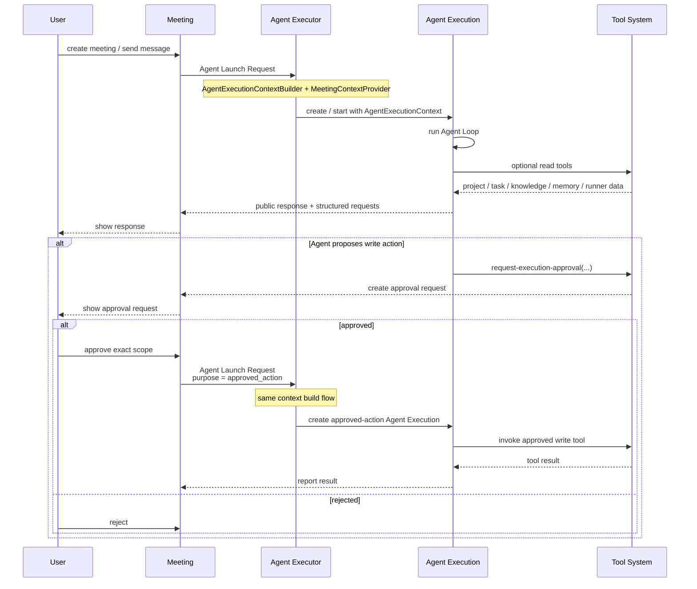
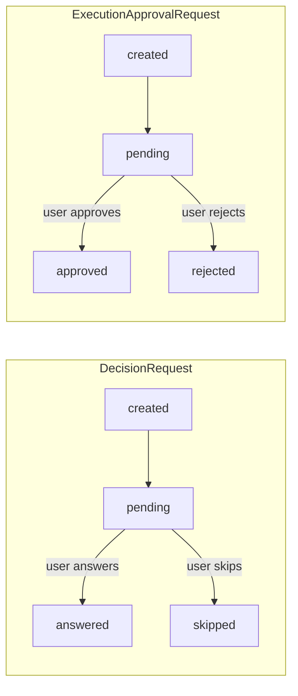

# Meeting 架构

## 1. 定位

Meeting 是用户与一个或多个 Agent 共同参与的 Human-in-the-loop 协作空间。

它适用于：

- 用户希望听取多个 Agent 的独立观点；
- Agent 之间存在分歧，需要比较方案和证据；
- 某项工作等待用户决策或补充信息；
- 架构、安全、产品取舍等需要人类在场；
- 用户主动要求多 Agent 共同讨论。

Meeting 不是：

- 所有 Task 的默认执行方式；
- Agent 之间自动协作的唯一机制；
- 自动产生代码或项目状态变更的流水线。

会议可以只产生信息和判断，而没有任何项目层面的写操作。

## 2. 核心数据

Meeting 层只保留面向协作的长期内容，包括：

- user / agent messages；
- DecisionRequest；
- ExecutionApprovalRequest；
- references；
- attachments；
- rolling summary；
- meeting metadata。

Meeting 同时必须提供统一的 **Meeting Timeline**，按时间顺序展示消息、DecisionRequest、ExecutionApprovalRequest 及其结果。Timeline 是 Meeting 的核心交互视图。Request 自身保存当前状态和最终结果，不再额外维护一套审批结果事件对象；Timeline 根据这些事实生成对应条目。

Agent Execution 的完整 tool calls、模型交互和 execution log 不属于 Meeting 主消息历史，应归档到对应的 Agent Execution，并在 UI 中按需展开。

## 3. Meeting 与 Agent Executor

每次 Agent 发言都通过 Agent Executor 创建一个独立 Agent Execution。Agent Execution 内部直接运行 Agent Loop。



这里刻意不存在 Task 层或 Task participant。

Meeting 中如果需要：

- 查询 Task；
- 修改 Task；
- 创建 Task；
- 添加 comment；
- 处理 blocker；

都通过统一 Tool System 调用相应 Builtin Tool。

Meeting 本身不直接依赖 Task Service 的内部实现。

## 4. Meeting Trigger Context

Meeting 与 Task 使用同一套 Agent Executor 启动机制。Meeting 本身只创建 Agent Launch Request，不直接构造 AgentExecutionContext。

Agent Executor 根据 `trigger.type = meeting` 通过 MeetingContextProvider 获取 Meeting 领域上下文，再由统一 AgentExecutionContextBuilder 与公共执行信息合并为 AgentExecutionContext。

MeetingContextProvider 可以准备：

- Meeting 场景 Prompt / instructions；
- meeting topic；
- participants；
- rolling summary；
- 必要的 recent meeting messages；
- meeting-level policy。

如果 Meeting 来源于某个 Task，可以在 meeting metadata 或引用信息中提供关联 ID，但更详细的 Task 内容由 Agent 通过 Task Tools 按需查询。

不会自动注入：

- 上一次 Agent Execution 的完整 tool history；
- 全部项目 Task；
- 全量 Knowledge；
- 全部 Agent Memory。

## 5. Read / Write 权限

Meeting 默认是更严格的运行上下文。

Agent 的有效能力：

```text
Agent Capability
  ∩ Meeting Context Policy
  ∩ Human Approval Scope
  ∩ Server Authorization
```

默认规则：

- 读性质工具可以在权限范围内调用；
- 写性质动作需要结构化审批；
- 用户审批只对明确动作或范围有效；
- 审批不能扩大 Agent 原有 Capability；
- 服务端在实际工具执行时再次校验。

## 6. DecisionRequest 与 ExecutionApprovalRequest

两类 Request 都由 Agent 发起、由用户处理，但语义不同：

- **DecisionRequest**：Agent 需要用户给出一个业务答案；
- **ExecutionApprovalRequest**：Agent 已经知道要执行什么，但执行受限动作前需要用户授权。

### DecisionRequest

DecisionRequest 只用于 **Agent 请求用户作出决定或提供输入**。用户如果主动希望征求 Agent 意见，直接通过 Meeting 自然语言消息表达，不需要创建 DecisionRequest。

概念结构：

```text
DecisionRequest
├── id
├── meeting_id
├── agent_id
├── source_execution_id
├── question
├── options: string[]
├── status
│   ├── pending
│   ├── answered
│   └── skipped
├── answer: string | null
├── created_at
└── resolved_at
```

字段含义：

- `meeting_id`：所属 Meeting；
- `agent_id`：发起请求的 Agent；
- `source_execution_id`：产生该请求的 Agent Execution，用于追踪运行证据；
- `question`：Agent 希望用户回答的明确问题；
- `options`：可选的预设答案，可以为空；
- `status`：当前处理状态；
- `answer`：用户最终给出的实际答案；
- `created_at`：请求创建时间；
- `resolved_at`：用户回答或跳过的时间。

状态语义：

- `pending`：等待用户输入；
- `answered`：用户已经给出答案；
- `skipped`：用户明确选择跳过，不提供答案。

约束：

```text
status = pending
=> answer = null
=> resolved_at = null

status = answered
=> answer must be non-empty
=> resolved_at must exist

status = skipped
=> answer = null
=> resolved_at must exist
```

`options` 只是帮助用户快速选择，不限制用户输入。UI 必须同时提供：

- options 对应的快捷选择；
- 自由输入框；
- Skip 操作。

如果用户选择某个 option，`answer` 直接保存该 option 的**内容本身**，而不是 option id / index / reference。

例如：

```text
question = "数据库选择哪个？"
options = ["PostgreSQL", "MySQL"]

用户点击 PostgreSQL

status = answered
answer = "PostgreSQL"
```

如果用户自由输入：

```text
answer = "先使用 PostgreSQL，后续根据分析需求再评估 ClickHouse"
```

Agent 后续只消费统一的 `answer`，不需要判断答案来自 option 还是自由输入。

### ExecutionApprovalRequest

ExecutionApprovalRequest 用于请求用户授权一个明确的受限执行动作。

概念结构：

```text
ExecutionApprovalRequest
├── id
├── meeting_id
├── agent_id
├── source_execution_id
├── action
├── scope
├── status
│   ├── pending
│   ├── approved
│   └── rejected
├── created_at
└── decided_at
```

字段含义：

- `meeting_id`：所属 Meeting；
- `agent_id`：请求授权的 Agent；
- `source_execution_id`：产生审批请求的 Agent Execution；
- `action`：面向用户描述“准备执行什么”；
- `scope`：结构化描述本次授权允许执行的精确范围，供后续服务端校验；
- `status`：审批状态；
- `created_at`：请求创建时间；
- `decided_at`：用户批准或拒绝的时间。

状态语义：

- `pending`：等待用户审批；
- `approved`：用户已经批准该 action / scope；
- `rejected`：用户已经拒绝。

约束：

```text
status = pending
=> decided_at = null

status = approved | rejected
=> decided_at must exist
```

不定义 `deferred`：用户暂时不处理时，请求继续保持 `pending`。

审批通过只代表“允许在给定 scope 内执行”，并不表示动作已经实际执行或执行成功。批准后仍需创建对应 Agent Execution，并真正调用 Tool。

因此：

```text
conversation
  != decision
  != approval
  != execution
  != successful project change
```

### 状态机



## 7. Meeting Timeline

Meeting Timeline 是当前 Meeting 的核心视图，不是未来扩展项。

Timeline 必须把 Meeting 中不同类型的协作事实统一按时间顺序展示，包括：

- user message；
- agent message；
- DecisionRequest created；
- DecisionRequest answered；
- DecisionRequest skipped；
- ExecutionApprovalRequest created；
- ExecutionApprovalRequest approved；
- ExecutionApprovalRequest rejected；
- approved action 的 Agent Execution 结果；
- 其他适合面向用户展示的 Meeting-level 事实。

示例：

```text
10:02  Agent A: 建议使用 PostgreSQL，但需要确认部署优先级。
10:03  Decision requested: "数据库选择哪个？"
       [PostgreSQL] [MySQL] [自由输入] [Skip]

10:05  You answered: "PostgreSQL"

10:08  Agent A requests approval:
       action = "更新项目数据库配置"
       scope  = {...}

10:09  You approved

10:10  Agent A: 配置已更新。
```

Timeline 条目不是另一套 request 状态 Source of Truth：

- DecisionRequest 自己保存 `status / answer`；
- ExecutionApprovalRequest 自己保存 `status`；
- message 自己保存消息内容；
- Agent Execution 保存完整运行证据。

Timeline 可以由这些事实动态生成，也可以为了查询效率维护 materialized read model，但不能形成与原始对象相互冲突的第二套状态。

## 8. Agent 请求会议

Agent 不能直接启动正式 Meeting。

Agent 使用 `request-meeting` 提交提案，内容应包括：

- 会议目的；
- 关联工作或引用；
- 需要用户解决的问题；
- 建议参与 Agent；
- 预期用户动作。

如果这是某个 Task 触发的 Agent Execution 中产生的阻塞，Agent 可以通过相应 Task Tool 将 Task 设置为 blocked 并登记：

- `waiting_for_human`；
- 或 `waiting_for_meeting_approval`。

这些项目状态操作仍然通过 Tool System 完成，不由 Meeting 模块直接修改 Task。

只有用户批准会议提案后，系统才创建/启动正式 Meeting。

## 9. Meeting Summary

每轮发言后可以更新 rolling summary。

Summary 的作用是压缩长期会议上下文，帮助用户和后续 Agent 快速理解进度。

Summary 不代表：

- 用户已经作出决定；
- 某项审批已经通过；
- Task 已经修改；
- 代码已经提交；
- 项目已经产生执行结果。

具有业务意义的决定和执行必须保留独立的结构化记录。
