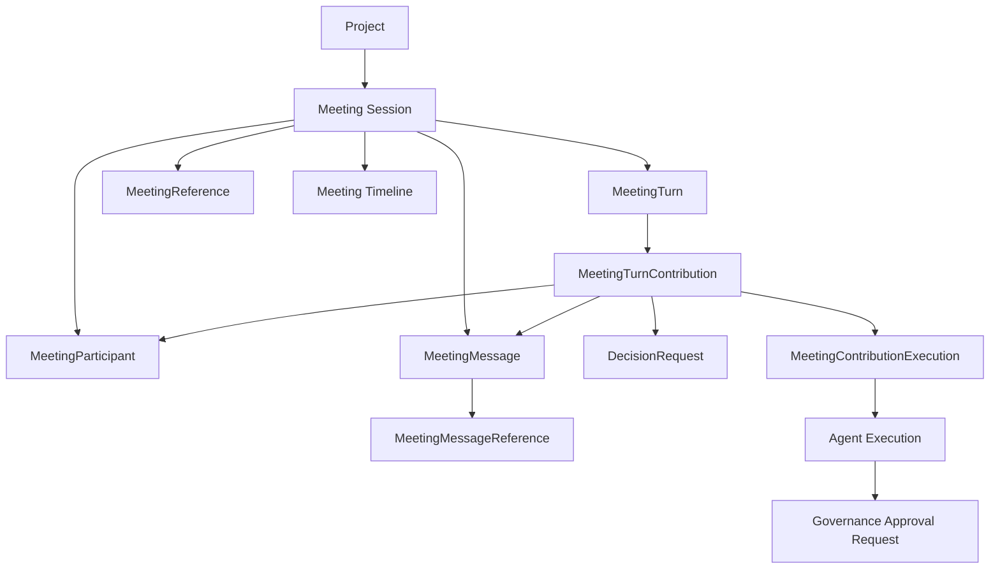
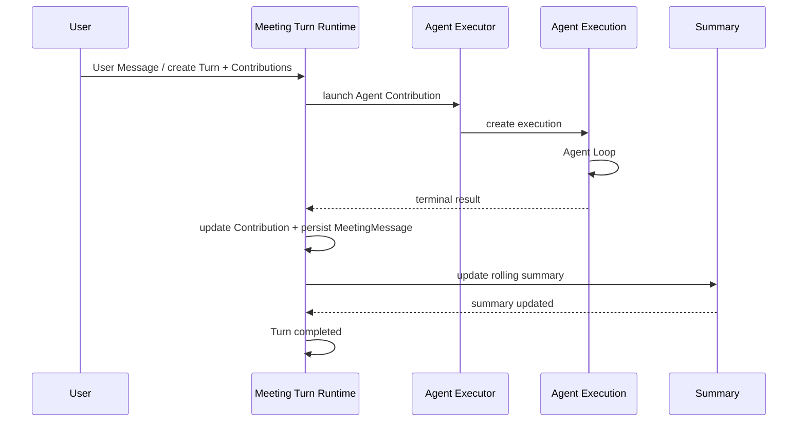

# Meeting 架构

## 1. 定位

Meeting 是 Project 内长期存在的人类与多个 Agent 协作会话。

它的使用体验类似 ChatGPT / Codex 的一次 conversation：

- 用户可以持续发送消息；
- 多个 Agent 可以参与同一个会话；
- 每次用户输入形成一个 MeetingTurn；
- Agent 每次发言由独立 Agent Execution 完成；
- 会话本身没有“完成 / 结束”状态。

Meeting 适用于：

- 用户希望听取多个 Agent 的独立观点；
- Agent 之间需要顺序讨论；
- 用户希望在同一个长期上下文中持续讨论架构、产品、安全或实现问题；
- Agent 需要请求用户作出 Decision；
- 受限 Tool 操作需要用户 Approval；
- Agent 主动建议创建一个需要人类参与的 Meeting。

Meeting 不是：

- Task 的默认执行方式；
- Agent 自动协作的唯一机制；
- Agent Executor 的替代；
- Tool / Approval 状态的 Source of Truth。

## 2. 核心模型



Meeting 本域长期保存：

- Meeting Session；
- User / Agent Participant；
- MeetingTurn；
- MeetingTurnContribution；
- MeetingReference；
- MeetingMessage；
- MeetingMessageReference；
- DecisionRequest；
- Approval Request references；
- rolling summary；
- Meeting metadata。

Agent Execution、完整 Tool Calls、Model Interactions、Execution Logs 属于 Agent Executor。

Approval Request 属于 Security / Governance。

Meeting Timeline 是 materialized read model，不是新的 Source of Truth。

## 3. Meeting Session 状态

Meeting 没有 `closed / completed / ended`。

持久状态只有：

```text
proposed
active
archive
```

### proposed

Agent 调用 `request-meeting` 时，直接创建 proposed Meeting Session。

不创建独立 MeetingProposal。

Human Inbox 增加一个待处理提醒，用户点击后进入对应 Meeting 页面。

用户批准：

```text
proposed -> active
```

用户拒绝 / 归档：

```text
proposed -> archive
```

### active

正常可交互的 Meeting。

### archive

仅表示归档和可见性变化，不代表 Meeting 已“结束”。

可以：

```text
archive -> active
```

继续原会话。

Hard delete 是删除命令，不是状态。

## 4. Participant

User 与 Agent 统一使用 MeetingParticipant。

这样：

- Message author 统一引用 participant；
- Agent 被删除后仍能保留 Meeting 历史身份快照；
- User / Agent membership 使用一致模型；
- Agent participant 可以维护 Meeting 默认发言顺序。

Agent Participant 不区分角色。

所有 active Agent 都是普通 participant。

Meeting UI 可以拖拽调整 Agent participant 的默认发言顺序。

## 5. MeetingTurn 与 Contribution

每次 User 输入都创建一个 MeetingTurn。

Turn 是编排边界；Turn 下面的 `MeetingTurnContribution` 才是这一轮中每个 Participant 的稳定发言单元。

每个 Turn 创建时：

1. 创建一个 User trigger Contribution；
2. 根据目标 Agent 创建一个 Agent Contribution；
3. 固化每个 Agent Contribution 的 `order_index`；
4. 确定 Turn `mode`。

概念关系：

```text
MeetingTurn
├── User Contribution
│   └── User MeetingMessage
└── Agent Contributions[]
    ├── MeetingParticipant
    ├── Agent Execution(s)
    ├── Decision / Approval interactions
    └── current MeetingMessage
```

User Contribution 不需要 Agent Execution。

Agent Contribution 是稳定发言位置。retry / regenerate 都继续发生在同一个 Contribution 下，只是关联新的 Agent Execution / generation。

用户没有显式选择 Agent：

```text
targets = all active Agent participants
```

用户通过 @mention / picker 显式选择：

```text
targets = selected Agent participants
```

Turn 支持：

- `sequential`；
- `parallel`。

### sequential

Agent Contribution 按 `order_index` 顺序运行。

后续 Agent 可以看到本 Turn 中前序 Contribution 当前已经形成的 MeetingMessage。

### parallel

所有 Agent Contribution 基于同一个 MeetingMessage visibility boundary 并行执行。

同一 Turn 内 Agent 之间看不到其他并行 Contribution 随后产生的本轮回复。

Parallel 模式不自动增加汇总 Agent。

如果用户需要汇总，应在下一 Turn 显式选择某个 Agent 汇总上一 Turn。

完整设计见 [Meeting Turn Runtime](./meeting-turn-runtime.md)。

## 6. Queue 与插话

同一个 Meeting 默认按 Turn 顺序推进。

当前 Turn 未完成时，新 User Message 默认进入 queue。

用户也可以选择“立即发送 / 插话”：

1. 取消当前 Turn；
2. 保留当前 Turn 已经完成的 Agent Message；
3. 取消尚未完成的 Agent Execution；
4. 创建并开始新的 Turn。

用户还可以单独停止某个 Agent Execution。

## 7. Meeting 与 Agent Executor

每个 Agent Participant 在一个 Turn 中先对应一个稳定的 MeetingTurnContribution；当前发言由该 Contribution 下的 Agent Execution 完成。retry / regenerate 可以让同一个 Contribution 关联多个 Agent Execution。



Meeting Runtime 决定：

- 哪些 Agent 发言；
- sequential / parallel；
- queue / interrupt；
- Turn completion。

Agent Executor 负责：

- Execution Context；
- Agent Loop；
- waiting / resume；
- cancel / timeout；
- execution logs；
- model / tools。

## 8. Waiting / Resume

Meeting 中有两类主要 Human-in-the-loop wait。

### DecisionRequest

DecisionRequest 属于 Meeting Domain。

Agent 调用 `request-decision` 后：

```text
Agent Execution
running -> waiting(decision)
```

用户 answer / skip 后：

```text
waiting -> running
```

继续同一个 Agent Execution。

Skip 会明确返回给 Agent，由 Agent 自己选择后续决定。

### Approval Request

Approval Request 属于 Security / Governance。

ToolOperation 需要审批时：

```text
ToolOperation -> waiting_for_approval
Agent Execution -> waiting(approval)
```

批准或拒绝后都恢复原 Agent Execution。

批准：

- 继续同一个 ToolOperation。

拒绝：

- Agent 收到 rejection result / error；
- Agent 自己决定如何回应。

Meeting 不创建新的 `approved_action` Execution。

## 9. Retry / Regenerate

retry 与 regenerate 分开。

### retry

用于失败 Agent Execution。

底层 transient retry 仍由 Agent Loop / Tool Runtime 自己完成。

已经 terminal failed 后用户手动 Retry，创建新的关联 Agent Execution。

### regenerate

用于用户主动要求某个 Agent 重新生成回复。

Regenerate：

- 只作用于单个 Agent；
- 创建新的 Agent Execution；
- 旧 MeetingMessage 不删除；
- Timeline 默认展示最新 generation；
- 不自动级联重跑整个 Turn。

## 10. Meeting Context

MeetingContextProvider 默认提供：

- Meeting identity；
- active participants；
- rolling summary；
- 当前 Meeting References，只注入稳定 typed identity；
- 当前 Execution 可见的 MeetingMessage，并按照 Meeting Timeline 的消息顺序排列；

MeetingTurn 只属于 Runtime 编排控制，不进入模型可见的 Meeting Context。DecisionRequest / Approval Request 也不作为后续 Agent 的 Meeting Context 注入；它们在当前 Agent Execution 内通过 waiting / resume 和 Tool Result 完成闭环，最终用户可见结论通过 MeetingMessage 进入后续会话历史。

MeetingReference 支持 `task / knowledge / link / file`。MeetingMessage 使用结构化 `text / mention / task / knowledge / link / file` inline node。具体内容不会因为被引用而自动加载；Agent 按需使用对应 Tool。

完整 Reference / Inline Content 设计见 [Meeting References & Inline Content](./meeting-references-inline-content.md)。

MeetingContextProvider 不做 Meeting 专属 token-budget 裁剪。

如果完整 Context 超过模型窗口：

```text
Agent Loop Context Window Management
-> unified compaction
```

负责压缩。

这避免 Meeting 与 Agent Loop 各维护一套 context compression。

完整设计见 [Meeting Context & Summary](./meeting-context-summary.md)。

## 11. Rolling Summary

每个 Turn 的 Agent executions 都进入 terminal 后：

```text
Turn.running
-> Turn.finalizing
-> synchronous rolling summary update
-> Turn.completed
```

Summary 至少包含：

- goals：text；
- decisions：text；
- unresolved：text；
- facts：text。

四个字段都由 Meeting Summary Generator 使用 LLM 从当前全部 MeetingMessage 中重新生成，不使用上一版 Summary 做增量输入。

Summary Generator 使用 Project Config 中的：

```text
meeting_summary_model_ref
```

该 Model 必须是当前 Project 可用的 enabled chat Model。Summary 调用只做普通 text generation，不暴露任何 Tools，也不创建 Agent Execution。

Summary 是派生语义摘要，不是：

- Decision Source of Truth；
- Approval；
- Task state；
- Tool execution result；
- Audit。

Summary 更新成功前，不开始后续 queued Turn。

## 12. Timeline

Meeting Timeline 使用独立 materialized read model。

用户体验接近群聊。

Timeline 的稳定展示单元是 MeetingTurnContribution。

### User Contribution

User Contribution 直接展示当前 MeetingMessage，不包含 Agent Execution。

User Message 使用结构化 inline content，支持 `text / mention / task / knowledge / link / file`。其中 `task / knowledge / link / file` 支持 **Pin to References**。

### Agent Contribution

Agent Contribution 的当前 Agent Execution 启动后，在该 Contribution 的固定聊天位置展示 placeholder：

```text
Agent Contribution
├── Execution ▸ frontend-only collapsed status row
├── Decision / Approval card?   <- waiting 时
└── current MeetingMessage      <- execution 成功结束后
```

Execution 行默认折叠。折叠状态只根据 Contribution 的 `status + started_at + completed_at` 在前端生成展示内容：

- running：显示前端随机趣味文案；
- completed：显示“思考了 xx 时间”；
- failed：显示“xx 时间后失败”；
- cancelled：显示“思考了 xx 时间后被停止”。

折叠状态不请求 / 订阅 Agent Execution Runtime View。只有用户主动展开后才连接统一 Agent Execution Stream 查看真实 Tool Call、waiting、retry、streaming 等运行细节。

retry / regenerate 不创建新的聊天位置，而是在同一个 Contribution item 中切换当前 Execution / generation。

DecisionRequest / Approval Request：

- pending 时在 Execution 外部展示区显示交互卡片；
- 用户完成交互后卡片消失；
- 底层领域对象和历史仍保留。

完整设计见 [Meeting Timeline & Realtime](./meeting-timeline-realtime.md)。

## 13. Realtime

Meeting 不自己选择 WebSocket / SSE。

统一复用 Platform Realtime Channel。

Timeline realtime 与 Agent Execution streaming 分开。Agent Execution streaming 直接复用 Agent Executor 提供的统一 Execution Stream / Runtime View，而不是由 Meeting 再实现一套：

```text
Meeting Timeline realtime
-> Timeline item / Turn / Message state

Reusable Agent Execution stream
-> detailed model / tool / execution events
```

这套 Agent Execution stream 同时供 Task Execution、Meeting、独立 Execution Detail 等页面使用。

断线后第一阶段直接重新加载完整 Meeting Timeline；只有当前仍处于展开状态的 Execution 需要重新连接统一 Agent Execution stream。

## 14. Human Inbox

Human Inbox 是统一的人类待处理聚合视图。

Meeting 可以向 Human Inbox 暴露：

- proposed Meeting；
- pending DecisionRequest；
- pending Approval Request。

Human Inbox 不保存这些对象的第二份状态。

其中 Approval Request 是平台级可复用交互对象。Human Inbox 必须能够直接使用统一 Approval UI / Action 完成 approve / reject，不要求用户跳转到 Task 或 Meeting 页面。Meeting Timeline、Task Execution Detail 和 Human Inbox 使用的是同一个 Governance Approval Request、同一套处理 API 和同一份状态。

proposed Meeting reminder：

```text
Human Inbox
-> Meeting Session
-> user approves
-> Meeting active
```

## 15. References 与 Inline Content

Meeting 的创建来源、长期 Reference 与 Message Inline Content 相互独立：

```text
origin
= 单一、不可变的创建 provenance

MeetingReference[]
= 可持续维护的长期关联资源

MeetingMessageReference[]
= 某条 Message 内的临时行内引用
```

MeetingReference 支持 `task / knowledge / link / file`；Message inline node 至少支持 `text / mention / task / knowledge / link / file`。

`task / knowledge / link / file` inline node 都支持 **Pin to References**。File 通过 `ToolArtifact -> StoredObject -> ObjectStorageService` 持久化，并由 Artifact Builtin Tools 提供 Agent 侧查询 / 创建 / 读取能力。

完整设计见 [Meeting References & Inline Content](./meeting-references-inline-content.md)。

## 16. 用户访问权限

Project 是单用户结构，因此 Meeting 不建立额外 Role / ACL / Permission Matrix。

用户访问 Meeting 及其所有 Meeting-owned 子资源时，只校验：

```text
meeting.project_id == project.id
AND
project.owner_user_id == current_user.id
```

Owner 校验通过后，用户可以读取和操作该 Project 下的：

- Meeting；
- MeetingParticipant；
- MeetingTurn / Contribution；
- MeetingMessage；
- MeetingReference；
- DecisionRequest；
- Meeting Timeline。

不再额外判断“Meeting access”“Participant role”“Timeline permission”等 Meeting 专属权限。

Agent 在 Meeting 中调用 Tool 的授权属于另一条路径，继续由 Agent Capability、Tool Runtime、Approval 与 Security / Governance 处理，不属于 Meeting 用户访问权限模型。

## 17. 一致性

Meeting 本域使用数据库事务保证强一致。

跨模块使用：

- service boundary；
- Domain Event；
- PostgreSQL Outbox；

形成最终一致。

推荐：

```text
Meeting local state
-> same DB transaction

Agent Executor / Governance / Human Inbox
-> service + event / outbox
```

不引入跨模块分布式事务。

## 18. Idempotency

Meeting 关键写命令统一支持 idempotency key。

至少包括：

- approve Meeting；
- send Message / create Turn；
- Decision answer / skip；
- participant add / remove / reorder；
- cancel；
- retry / regenerate；
- archive / restore；
- hard delete。

Meeting command 幂等与 AgentLaunchRequest / ToolOperation 自己的幂等机制相互独立。

## 19. 删除

MeetingMessage、DecisionRequest 等历史对象不允许单独删除。

Meeting 支持：

- archive；
- hard delete。

Hard delete 直接删除 Meeting 本域拥有的数据。

Agent Execution、Approval、Audit 等其他模块拥有的数据仍按各自 retention policy 处理。

## 20. 详细设计

Meeting 详细设计拆为五篇：

1. [Meeting Domain Model](./meeting-domain-model.md)
   - Meeting / Participant / Reference / Message / Message Reference / Turn / Contribution / Decision；
   - status；
   - persistence；
   - idempotency；
   - archive / hard delete。

2. [Meeting Turn Runtime](./meeting-turn-runtime.md)
   - Agent selection；
   - sequential / parallel；
   - queue / interrupt；
   - waiting / resume；
   - retry / regenerate；
   - Turn finalize。

3. [Meeting Context & Summary](./meeting-context-summary.md)
   - MeetingContextProvider；
   - sequential / parallel Context visibility；
   - full history + Agent Loop compaction；
   - LLM-generated four-text-field rolling summary；
   - Project Summary Model。

4. [Meeting Timeline & Realtime](./meeting-timeline-realtime.md)
   - materialized Timeline；
   - Contribution-based Agent placeholder；
   - streaming；
   - Decision / Approval cards；
   - projection；
   - platform realtime。

5. [Meeting References & Inline Content](./meeting-references-inline-content.md)
   - MeetingReference；
   - text / mention / task / knowledge / link / file inline node；
   - Pin to References；
   - Task / Knowledge / Link / File identity；
   - Object Storage / Artifact Tools 集成；
   - Context serialization。
