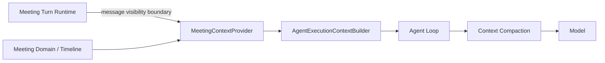

# Meeting Context & Summary 详细设计

## 1. 目标与边界

本文定义 Meeting 场景下：

- MeetingContextProvider 如何构造模型可见的 Meeting 会话上下文；
- sequential / parallel 编排如何控制 Message 可见边界；
- rolling summary 的结构和同步更新；
- Meeting Context 与 Agent Loop Context Compaction 的职责边界。

核心原则：

> MeetingTurn 是 Runtime 编排对象，不进入模型业务上下文。模型看到的是 Meeting 会话本身：Meeting 基本信息、Participants、rolling summary，以及按 Timeline 顺序排列的 MeetingMessage。

MeetingContextProvider 不维护另一套 token-budget 裁剪算法。

## 2. Context 架构



MeetingContextProvider 是 Agent Executor 的 Trigger Context Provider。

它不：

- 启动 Agent；
- 选择 Agent；
- 调度 Turn；
- 把 MeetingTurn 暴露给模型；
- 注入 DecisionRequest / Approval Request 等运行控制对象；
- 调用 Tools；
- 自动检索 Knowledge；
- 自动 recall Memory；
- 决定最终模型 token budget。

## 3. MeetingTriggerContext

模型可见的概念结构：

```text
MeetingTriggerContext
├── meeting
│   ├── id
│   ├── title?
│   └── status
├── participants[]
│   ├── participant_id
│   ├── type
│   ├── name
│   └── description?
├── rolling_summary
├── references[]
│   └── typed_identity
├── messages[]
│   ├── message_id
│   ├── author_participant_id
│   ├── author_name
│   ├── content_nodes[]
│   ├── reply_to_message_id?
│   └── created_at
└── meeting_policy
```

这里没有：

- `turn_id`；
- `turn mode`；
- execution order；
- DecisionRequest；
- Approval Request；
- Agent Execution 状态。

这些属于 Runtime / Tool / Governance 控制面，不是 Meeting 会话语义本身。

## 4. Meeting Identity

每次 Meeting Agent Execution 都需要知道：

- 当前 Meeting；
- Meeting title（生成前可空，展示占位不是模型事实）；讨论主题与目标来自 rolling summary.goals；
- 当前 active participants；
- 自己对应的 MeetingParticipant；
- 当前 Meeting policy；
- 可见的 MeetingMessage history。

Agent 不需要知道“当前属于第几个 Turn”才能正常参与会话。

Turn 只负责决定：

- 谁执行；
- 顺序还是并行；
- Message 可见截止点；
- queue / interrupt；
- completion。

## 5. Participant Context

Agent 可以看到所有 active Agent participants 的：

- participant id；
- name；
- description；
- 当前默认 sort order。

User participants 可以提供：

- participant id；
- display name。

不向 Agent 自动暴露 User 的额外账户信息。

被移除 Participant：

- 历史 MeetingMessage 继续存在；
- author 使用 MeetingParticipant snapshot；
- 不再出现在 active participant list。

## 6. Message History

MeetingContextProvider 提供的是 MeetingMessage，而不是 MeetingTurn history。

另外，它会把 Meeting 当前被固定的 `MeetingReference` 全部作为轻量资源引用注入 Context。

```text
rolling summary
+
visible MeetingMessages ordered as Timeline
```

Message 顺序必须与用户看到的 Meeting Timeline 中当前 Contribution 顺序一致。

Provider 只抽取 Timeline 中当前可见的 MeetingMessage：

- User Contribution 的 MeetingMessage；
- Agent Contribution 当前 `current_message_id` 指向的 MeetingMessage。

不注入：

- Agent Contribution placeholder；
- Execution streaming；
- DecisionRequest card；
- Approval Request card；
- retry / waiting runtime state。

这些内容用于控制执行或 UI 展示，不属于会话 message history。

同一个 Agent Contribution 因 regenerate 产生的旧 generation MeetingMessage 仍然长期保存，但不自动进入普通后续 Meeting Context；正常 Context 只使用 Timeline 当前展示的 `current_message_id`。这样模型看到的会话与用户主 Timeline 保持一致。

## 7. Message Ordering

MeetingMessage 使用与 Timeline Contribution 一致的稳定顺序。

概念上：

```text
ORDER BY timeline.occurred_at, timeline_item_id
```

MeetingContextProvider 可以通过 Timeline projection 获取排序，也可以使用与 Timeline 完全相同的排序字段直接查询 Message；关键要求是：

> 模型看到的会话顺序与用户在 Meeting 页面看到的消息顺序一致。

Timeline 是 Read Model，MeetingMessage 仍然是消息内容 Source of Truth。

## 8. Sequential 可见性

Sequential 模式的可见性由 Meeting Turn Runtime 控制，但 Turn 本身不进入 Context。

例如：

```text
User Message
Agent A starts
-> Provider returns messages through User Message

Agent A final MeetingMessage persisted

Agent B starts
-> Provider returns messages through Agent A Message

Agent B final MeetingMessage persisted

Agent C starts
-> Provider returns messages through Agent B Message
```

因此后续 Agent 自然能看到前序 Agent 的正式回复。

只有已经持久化为 MeetingMessage 的输出进入后续 Context。

以下内容不会自动进入：

- Agent streaming；
- Tool logs；
- reasoning；
- intermediate model messages。

## 9. Parallel 可见性

Parallel 模式需要所有 Agent 使用同一个 Message 可见边界。

Turn Runtime 在启动本轮 parallel executions 前记录一个内部边界，例如：

```text
visible_through_timeline_item_id
```

然后调用 MeetingContextProvider：

```text
BuildMeetingContext(
  meeting_id,
  executing_participant_id,
  visible_through_timeline_item_id
)
```

该边界只是 Provider 调用参数，不进入模型可见 MeetingTriggerContext。

因此所有 parallel Agent 都看到：

```text
all MeetingMessages
through the same User trigger Message
```

看不到同一批 parallel Agent 随后产生的 MeetingMessage。

## 10. Meeting References

MeetingContextProvider 每次都注入全部当前 `MeetingReference` 的稳定 typed identity，但不自动加载资源内容。

第一阶段 Reference 类型：

```text
task
knowledge
link
file
```

MeetingMessage 的 `mention / task / knowledge / link / file` inline node 也会按原消息顺序序列化成模型可识别的结构化 marker；后端不依赖 `#xxx` 等显示文本重新解析资源。

具体 Resource Identity、Context Serialization、Artifact / File、Link、Pin to References 规则见 [Meeting References & Inline Content](./meeting-references-inline-content.md)。

## 11. 不自动注入的内容

MeetingContextProvider 不自动获取：

- DecisionRequest；
- Approval Request；
- Agent Execution status；
- Execution streaming / logs；
- Knowledge Retrieval；
- Agent Memory recall；
- 未被固定到 Meeting References 的全部 Project Task；
- Task / Knowledge Reference 的完整资源内容；
- 历史 Tool Calls；
- MCP Resources；
- 大量 Project 文件。

Decision / Approval 的结果在当前 Agent Execution 内通过 Tool Result 恢复；执行最终产生的公开结论再通过 Agent MeetingMessage 进入后续 Meeting Context。

因此后续 Agent 不需要消费 Decision / Approval 对象本身。

## 12. Rolling Summary 的定位

Rolling Summary 是 Meeting 会话历史的派生语义摘要。

它帮助 Agent 快速识别：

- 当前讨论目标；
- 已形成的长期结论；
- 尚未解决的问题；
- 重要背景事实。

它不是：

- User 授权；
- Tool Approval；
- DecisionRequest Source of Truth；
- Task state；
- Agent Execution result record；
- Audit record。

模型同时可以获得 rolling summary 与原始可见 MeetingMessage。

## 13. Rolling Summary Schema

建议结构：

```text
MeetingRollingSummary
├── meeting_id
├── version
├── goals
├── decisions
├── unresolved
├── facts
├── summarized_through_message_id
├── generated_at
└── generator_metadata
    └── model_config_id_snapshot
```

`goals / decisions / unresolved / facts` 都是单个 text 字段，不是 list。

### goals

一段纯文本，总结当前 Meeting 的讨论主题、长期目标与当前讨论目标。Meeting 不再保存独立主题字段；Summary 仍保持四个 text 维度。

### decisions

一段纯文本，总结已经在公开 MeetingMessage 中明确形成、值得后续 Agent 持续知道的会议结论。

### unresolved

一段纯文本，总结当前仍未解决的问题、分歧和待确认事项。

### facts

一段纯文本，总结稳定背景事实和重要上下文。

### summarized_through_message_id

明确当前 Summary 是基于截至哪一条当前 MeetingMessage 的完整会话历史生成。

它用于：

- finalize 恢复；
- 幂等更新；
- 防止重复 summarize；
- observability。

## 14. Summary Update

每个 MeetingTurn 的目标 Agent Contributions 全部进入 terminal contribution state 后：

```text
Turn.running
    -> all target contributions terminal
    -> Turn.finalizing
    -> generate rolling summary from all current MeetingMessages
    -> Turn.completed
```

Summary 更新仍属于 Turn Runtime 的 finalize 控制流程，但 Summary 内容只消费 MeetingMessage，不需要把 Turn 对象注入模型上下文。

首轮 finalize 同时生成一次 Meeting.title 与四字段 Summary，使用同一个解析后的 `meeting_summary_model_ref`、同次普通文本模型调用和相同 Message 边界。服务端解析校验后在同一事务写入标题与 Summary；成功之前 Turn 保持 finalizing。生成前 UI 展示“新会议”，不阻断首轮 Agent 执行。后续 finalize 仅更新 Summary，不因讨论变化或 regenerate 改写已生成标题。

Summary 更新是同步 finalize 步骤：

- Summary 未成功更新，Turn 不进入 completed；
- queued Turn 不越过正在 finalizing 的前一 Turn；
- Runtime 可以有限 retry；
- crash 后可以根据 Summary version / message boundary 恢复。

## 15. Summary Updater

Meeting 模块内部定义：

```text
MeetingSummaryUpdater
```

输入：

```text
all current MeetingMessages
ordered as Meeting Timeline
```

输出：

```text
new MeetingRollingSummary
+ initial Meeting.title if not yet generated
```

Summary Generator 不做增量 summarization。

每次更新都重新读取当前 Meeting 主 Timeline 中全部有效 MeetingMessage，并重新生成四个维度的完整 Summary。

因此：

- 不把上一版 Rolling Summary 作为输入；
- 不只输入自上次 Summary 后新增的 Message；
- regenerate 后已经不再是当前 generation 的历史 Message 不进入普通 Summary 输入；
- Summary 始终是当前 Meeting 会话状态的完整派生结果。

Summary Updater：

- 不是 MeetingParticipant；
- 不创建 MeetingMessage；
- 不创建 Agent Execution；
- 不读取 DecisionRequest / Approval Request 作为会话事实；
- 固定通过统一 Model System 调用 chat Model；
- 使用当前 Project 配置的 `meeting_summary_model_ref`；
- 只执行普通 text generation；
- 不暴露任何 Tools；
- 不发起 Tool Calling；
- 不拥有 Agent Capability；
- 不作为 Agent 出现在 Meeting；
- invocation / token usage 进入平台统一 Model Usage 记录。

Summary Model 只要求：

- `type = chat`；
- 当前 Project 可见且 enabled；
- 支持 text input / output。

不要求：

- tool calling；
- parallel tool calls；
- image / file input；
- structured output。

Summary 请求使用普通 Unified Chat Model Contract，并显式保持：

```text
tools = []
```

后续轮次模型输出约定为固定四字段文本 envelope：

```json
{
  "goals": "...",
  "decisions": "...",
  "unresolved": "...",
  "facts": "..."
}
```

这里的 JSON 只是普通文本输出格式，不要求 Model 具备 `structured_output` capability。

首轮输出在上述 envelope 中额外包含非空 `title` string，服务端将其写入 `Meeting.title`，不向 `MeetingRollingSummary` 增加第五字段。首轮解析须同时验证标题与四个摘要文本；标题或摘要不合法时整步失败，不能只提交其中一部分。生成标题不创建 MeetingMessage 或 Agent Execution。

服务端解析成功后，把四个 string 分别写入 `MeetingRollingSummary`。如果输出无法解析，可以按平台普通 Model retry policy 做有限 retry；不能把无法解析的文本直接写进四个字段。

某个维度没有可总结内容时写空字符串：

```text
""
```

不写空 list、placeholder item 或模型自行补造的“无”条目。

### 15.1 Project Summary Model

Project Config 必须配置：

```text
meeting_summary_model_ref
```

它引用当前 Project 可用的 enabled chat Model：

```text
all enabled System chat Models
+
enabled chat Models from current Project Providers
```

Project 配置页面显示为：

```text
Meeting Summary Model
```

该配置只选择已有 ModelConfig，不重复配置 Provider、Model 参数或 reasoning effort。

MeetingSummaryUpdater 每次生成 Summary 时通过 Model Resolver 解析该 Model。

如果引用的 Model 被 disabled / 删除且尚未完成替换：

- Summary 生成失败；
- Turn 保持 `finalizing`；
- 不自动切换其他 Model。

### 15.2 Context Window

第一阶段 Summary Generator 输入全部当前 MeetingMessage，不做：

- silent truncation；
- incremental summary fallback；
- hidden chunking。

如果完整 Message History 超过所选 Summary Model 的 context window，Summary 更新明确失败。

用户应在 Project Config 中选择具有足够 context window 的 Meeting Summary Model。

后续如果确实需要支持超长 Meeting，再单独设计 hierarchical / chunked summarization，不在第一阶段隐式加入另一套压缩逻辑。

## 16. Summary Prompt 约束

Summary Generator 必须：

- 只总结 MeetingMessage 中已经表达的内容；
- 不自行作出新的业务决定；
- 不推断某个 Tool 一定执行成功；
- 不修改 Participant / Task 等业务状态；
- 不因为模型认为“不重要”就无条件丢弃 unresolved 内容。

如果某个 Approval / Decision 最终影响了执行结果，应由 Agent 的最终 MeetingMessage 表达其用户可见结论，再进入 Summary。

## 17. Summary Update 幂等

Summary 更新使用 Message 边界作为幂等依据。

例如：

```text
(meeting_id, summarized_through_message_id)
```

重复 finalize：

- 已存在对应成功 Summary version：直接复用；首轮标题与该 Summary 已共同提交，不再次生成；
- 尚未成功：继续生成；
- 不重复推进 version；首轮提交使用尚未生成标题的条件与 Summary version check，防止重试覆盖已提交标题。

建议使用 optimistic version check：

```text
expected_previous_version = N
write version = N + 1
```

## 18. Agent Loop Context Compaction

MeetingContextProvider 返回：

```text
Meeting metadata
+ Participants
+ Rolling Summary
+ visible MeetingMessages
+ source reference
```

如果最终 Context 超出模型窗口：

```text
full Meeting Trigger Context
    -> Agent Loop Context Window Management
    -> compacted model context
```

Agent Loop 可以：

- 使用 rolling summary 压缩远期 Message；
- 压缩 Execution 内历史 Tool Results；
- 外部化大内容；
- 保留 artifact references；
- 压缩旧 conversation messages。

Meeting 不规定具体 token-budget 或 compaction 算法。

## 19. Prompt Assembly

Meeting 场景 Prompt 由：

```text
Platform Prompt
+ Agent Instructions
+ Meeting Trigger Prompt
```

组成。

Meeting Trigger Prompt 负责说明：

- 当前是多人 Meeting 会话；
- participant 列表；
- Meeting References 只提供 type / id，具体内容按需通过 Tool 获取；
- Message inline reference 使用结构化 Resource identity；
- 用户消息和 Agent 最终消息构成公开会话历史；
- DecisionRequest 用于当前 Execution 向用户请求输入；
- Approval 与普通业务 Decision 的区别；
- Task 需要通过 Tool 查询 / 修改；
- rolling summary 是辅助上下文；
- 最终公开输出会形成新的 MeetingMessage。

不需要告诉模型：

- 当前 Turn ID；
- 当前 Turn mode；
- execution order。

这些由 Runtime 保证。

## 20. Resume Context

Decision / Approval 使 Agent Execution waiting 时，不重新调用 MeetingContextProvider 构造新的 Meeting 会话 Context。

恢复原 Execution时：

- 保留原 Execution conversation state；
- 将 resolved Tool Result / Decision Result 追加到当前 Agent Loop；
- 继续 Model → Tool → Model。

最终公开回复写成 MeetingMessage 后，才会成为后续 Agent Execution 的 Meeting Context。

## 21. Source of Truth 边界

```text
Meeting conversation
-> current MeetingMessage of each Timeline Contribution

Long-lived related resources
-> MeetingReference

Inline resource mentions
-> MeetingMessageReference

Participants
-> MeetingParticipant

Rolling summary
-> Meeting derived data

Turn / sequential / parallel / queue
-> Meeting Turn Runtime control state

Decision
-> DecisionRequest, current Execution only

Approval
-> Governance Approval Request, current Execution only

Execution conversation / Tool history
-> Agent Execution

Model context after compaction
-> transient Agent Loop runtime input
```

MeetingContextProvider 不把 Runtime 控制对象混入 Meeting conversation。
