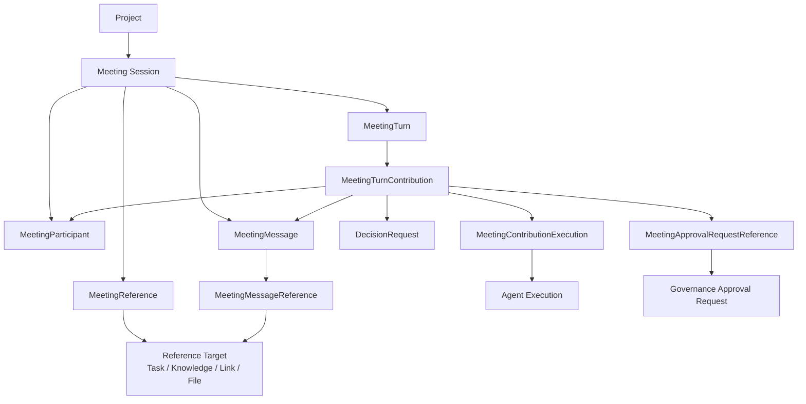
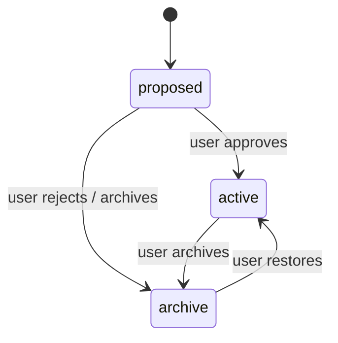
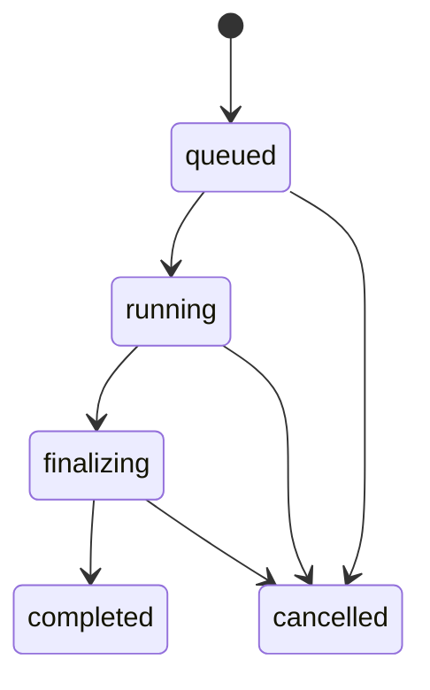
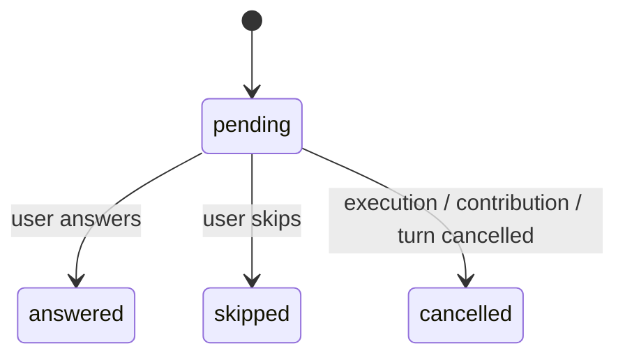

# Meeting Domain Model 详细设计

## 1. 目标与边界

本文定义 Meeting 模块的长期领域对象、持久化关系、状态约束与写入语义。

Meeting 是 Project 内长期存在的一次协作会话，语义上类似 ChatGPT / Codex conversation。它没有“完成 / 结束”这一业务状态。用户暂时不再发送消息，只表示当前没有新的交互。

本文负责：

- Meeting Session；
- MeetingParticipant；
- MeetingMessage；
- MeetingTurn；
- MeetingTurnContribution；
- MeetingReference / MeetingMessageReference；
- DecisionRequest；
- Approval Request reference；
- archive / hard delete；
- 关键写命令的幂等边界。

本文不负责：

- Agent 在一个 Turn 中如何被调度，见 [Meeting Turn Runtime](./meeting-turn-runtime.md)；
- Agent Context 与 rolling summary，见 [Meeting Context & Summary](./meeting-context-summary.md)；
- Timeline 的投影和 Realtime UI，见 [Meeting Timeline & Realtime](./meeting-timeline-realtime.md)；
- Approval Request 本身的生命周期，见 [安全与治理](../security-governance/README.md)。

## 2. 聚合关系



Meeting 是领域聚合入口，但 Agent Execution 和 Approval Request 仍属于各自平台模块。Meeting 只保存必要引用。

## 3. Meeting Session

概念结构：

```text
Meeting
├── id
├── project_id
├── status
│   ├── proposed
│   ├── active
│   └── archive
├── title?                 # 首轮 finalize 成功后生成
├── proposal_content?      # 仅 Agent 提案内容，不是会议主题字段
├── origin?
│   ├── type
│   └── id
├── created_by_participant_id?
├── rolling_summary
├── created_at
├── activated_at?
├── archived_at?
└── updated_at
```

`title` 在首轮 finalize 时由 Meeting Summary Updater 使用系统 `platform.meeting_summary` 为本次逻辑生成固化的 Model 生成一次，并与首轮四字段 Summary 同事务提交。生成前 UI 使用“新会议”，该占位不写入生成标题。后续轮次、retry / regenerate 和恢复不重新生成已提交标题。标题不由用户在创建表单填写。

Meeting 不独立保存讨论主题；Summary 的 `goals` 概括讨论主题和目标。`proposal_content` 只保存 request-meeting 的提案理由与期望用户动作，可在批准前展示，不作为独立会话主题注入 Context，也不允许 Summary 反写它。

### 3.1 status

Meeting 只有三个持久状态：

- `proposed`：Agent 通过 `request-meeting` 提议创建，等待用户处理；
- `active`：正常可交互的 Meeting；
- `archive`：被用户归档，不作为日常活跃会话展示。

状态关系：



这里没有 `closed`、`completed`、`ended`。

`archive` 只是组织和可见性状态，不表示业务意义上的结束。用户恢复归档 Meeting 后可以继续创建新的 Turn。

### 3.2 Agent 发起 Meeting

Agent 调用 `request-meeting` 时直接创建 `status = proposed` 的 Meeting，而不是创建另一套 MeetingProposal 对象。

proposed Meeting 已经拥有自己的：

- Meeting ID；
- proposal_content 中的提案内容与目的；
- 建议 participants；
- source execution；
- source Task / reference。

Human Inbox 为“该 Meeting 等待用户批准”建立 HumanInboxItem projection，并提供跳转到 Meeting Session 页面的入口；Meeting 本身仍是 Source of Truth。HumanInboxItem 通过 `source_type = meeting + source_id = meeting_id` 单向引用 Meeting，Meeting Domain 不反向保存 Human Inbox projection reference。

用户批准：

```text
proposed -> active
```

用户拒绝或不希望继续：

```text
proposed -> archive
```

不额外保留 `rejected` Meeting 状态。

### 3.3 Origin 与 References

Meeting 的“创建来源”和“长期关联资源”是两个不同概念。

`origin` 只记录 Meeting 最初是从哪个对象 / 流程创建出来的 provenance。
`origin` 最多一个、创建后不可修改；它只用于 provenance / navigation，不等同于长期 Reference。

Meeting 的长期关联资源由独立 `MeetingReference` 表达，支持 `task / knowledge / link / file`。Reference 使用统一 typed identity，并可以持续 Pin / Unpin / reorder。

完整的 Reference 类型、canonical identity、Link / File 语义、Pin to References 与 UI / Context 规则见 [Meeting References & Inline Content](./meeting-references-inline-content.md)。

## 4. MeetingParticipant

User 和 Agent 都使用统一的 MeetingParticipant 模型。

概念结构：

```text
MeetingParticipant
├── id
├── meeting_id
├── participant_type
│   ├── user
│   └── agent
├── source_id?
├── display_name_snapshot
├── description_snapshot?
├── status
│   ├── active
│   └── removed
├── sort_order
├── joined_at
└── removed_at?
```

### 4.1 统一 Participant

统一模型的目的：

- User / Agent 的 message author 都只引用 `participant_id`；
- UI 不需要维护两套 participant 结构；
- Agent 被系统删除后，Meeting 历史仍能展示当时的身份；
- participant 顺序、加入 / 移除等逻辑可以统一处理。

### 4.2 Identity Snapshot

MeetingParticipant 必须保存必要身份快照。

对于 Agent，至少保存：

- display name；
- description。

`source_id` 可以继续引用当前 Agent，但 Meeting 历史展示不能依赖该 Agent 仍然存在。

如果 Agent 后续被删除：

```text
MeetingParticipant remains
source_id -> null / unavailable
snapshot remains
```

对于 User 同样保存至少 display name snapshot。

### 4.3 Agent 发言顺序

Agent participant 使用 `sort_order` 表示 Meeting 默认发言顺序。

用户可以在 Meeting UI 中拖拽重新排序。重新排序只影响后续 Turn，不改变已经创建 Turn 的 execution order snapshot。

User participant 不参与 Agent 发言排序。

### 4.4 Participant Removal

Participant 不直接删除，而是：

```text
active -> removed
```

历史 MeetingMessage、MeetingTurn、Agent Execution reference 继续引用原 Participant。

重新加入同一个 Agent 时，建议创建新的 active Participant 记录，而不是复活旧记录，以保留清晰的 membership history。

## 5. MeetingMessage

MeetingMessage 是面向用户长期保存的公开会话内容。

概念结构：

```text
MeetingMessage
├── id
├── meeting_id
├── turn_id
├── contribution_id
├── author_participant_id
├── source_execution_id?
├── reply_to_message_id?
├── content_nodes[]
└── created_at
```

### 5.1 不可变

MeetingMessage 只追加：

- 不允许编辑；
- 不允许单独删除；
- Agent regenerate 不覆盖旧 Message。

这样可以保持：

- 会话历史可追踪；
- Turn Context 可重建；
- Timeline 投影稳定；
- Agent Execution 与最终公开结果一一可追踪。

### 5.2 User Message

每次用户发送普通消息时，在同一个 Meeting 本域事务中：

1. 创建 MeetingTurn；
2. 为 User 创建本 Turn 的 trigger `MeetingTurnContribution`；
3. 创建 User MeetingMessage，并关联该 Contribution；
4. 将该 Contribution 记录为 Turn 的 `trigger_contribution_id`。

User Message 可以设置：

```text
reply_to_message_id
```

第一阶段只有 User 可以创建 Reply。

### 5.3 Inline Content 与 References

MeetingMessage 使用结构化 inline content，而不是把所有语义都压进单一纯文本字符串。

第一阶段至少支持：

```text
text
mention
task
knowledge
link
file
```

其中 `task / knowledge / link / file` 使用 `MeetingMessageReference` 保存稳定资源 identity，并全部支持 **Pin to References**；`mention` 指向 MeetingParticipant，不支持 Pin。

完整 content node schema、`@` / `#` 编辑器交互、Link、File、Context Serialization 与 Pin 规则见 [Meeting References & Inline Content](./meeting-references-inline-content.md)。

### 5.4 Agent Message

Agent Message 只能由某个 Agent `MeetingTurnContribution` 的 Agent Execution 成功形成最终公开输出后写入。

必须保存：

```text
contribution_id
source_execution_id
```

同一个 Contribution 因 retry / regenerate 可以关联多个 Agent Execution，并保留多个历史 MeetingMessage；Contribution 的 `current_message_id` 指向当前在主 Timeline 中展示的那一版回复。

Agent streaming、Tool Call、Reasoning、Execution Log 不属于 MeetingMessage。

第一阶段 Agent 不创建 `reply_to_message_id`。

## 6. MeetingTurn

MeetingTurn 是用户一次输入触发的一轮 Meeting 编排边界。

Turn 本身不直接等同于一组 Agent Execution。Turn 下面先创建一组 `MeetingTurnContribution`，用来表达这一轮中各 Participant 的发言位置；Agent Execution 再挂到对应 Agent Contribution 下。

概念结构：

```text
MeetingTurn
├── id
├── meeting_id
├── trigger_contribution_id
├── mode
│   ├── sequential
│   └── parallel
├── status
│   ├── queued
│   ├── running
│   ├── finalizing
│   ├── completed
│   └── cancelled
├── result
│   ├── success
│   ├── partial_failure
│   └── null
├── interrupted_by_turn_id?
├── meeting_input_reference?  # parallel 的共同不可变输入，具体字段待 D24
├── created_at
├── started_at?
├── finalizing_at?
└── completed_at?
```

### 6.1 Contribution Snapshot

Turn 创建时固定本轮 Contribution 集合：

- 第一个 Contribution 是触发本轮的 User Contribution；
- 每个本轮目标 Agent 各创建一个 Agent Contribution；
- Contribution 的 `order_index` 固化本轮发言顺序。

后续 MeetingParticipant：

- 新增；
- 移除；
- 拖拽排序；

都不改变已经创建 Turn 的 Contribution snapshot。

### 6.2 mode

每个 Turn 在发送前由 User 选择：

- `sequential`；
- `parallel`。

Turn 创建后 mode 不再修改。

### 6.3 status

典型生命周期：



当本轮所有目标 Agent Contribution 都进入 terminal contribution state 后，Turn 进入 `finalizing`。

第一阶段 terminal contribution state 包括：

```text
completed
failed
cancelled
skipped
```

finalizing 阶段同步更新 rolling summary；首轮还生成并共同提交 Meeting.title。该步骤成功后才进入 `completed`，详见 [Meeting Context & Summary](./meeting-context-summary.md)。

parallel 输入固定 references 集合、summary version 及实际有序 immutable message/generation；Timeline 截止点不足以替代它。sequential 在后续启动时纳入前序正式回复。finalizing 的有限失败重试不允许跳过摘要或启用备用模型；显式取消可停止收尾，迟到结果不得发布。

### 6.4 partial failure

某些 Agent Contribution 在 retry 后仍失败，不阻止其他 Contribution 完成。

因此：

```text
status = completed
result = partial_failure
```

用于表达“这一轮已经收尾，但不是所有 Agent Contribution 都成功”。

用户主动将 `waiting_for_agent` Contribution 标记为 `skipped` 不视为 failure，本身不会把 Turn.result 变成 `partial_failure`。它表示用户明确接受本轮不等待该 Agent 发言。

## 7. MeetingTurnContribution

`MeetingTurnContribution` 是 MeetingTurn 下的稳定发言单元，表达：

> 某个 MeetingParticipant 在这一轮中的一次发言位置。

它把“谁在这一轮发言”与“这次发言为了完成可能启动了几次 Agent Execution”分开。

概念结构：

```text
MeetingTurnContribution
├── id
├── turn_id
├── participant_id
├── order_index
├── status
│   ├── pending
│   ├── waiting_for_agent
│   ├── running
│   ├── completed
│   ├── failed
│   ├── cancelled
│   └── skipped
├── current_generation
├── current_execution_id?
├── waiting_on_execution_id?
├── current_message_id?
├── created_at
├── started_at?
└── completed_at?
```

### 7.1 User Contribution

User 发送消息创建 Turn 时，同时创建 trigger Contribution：

```text
participant = User
order_index = 0
status = completed
current_execution_id = null
current_message_id = User MeetingMessage
```

User Contribution 不需要 Agent Execution。

### 7.2 Agent Contribution

每个本轮目标 Agent 创建一个 Contribution：

```text
participant = Agent
order_index = 1..N
status = pending
```

Contribution 是 Agent 在这一 Turn 中的稳定“发言槽位”。

它可以经历：

```text
pending -> running -> completed
pending -> running -> failed
pending -> running -> cancelled
pending -> waiting_for_agent -> running
pending -> waiting_for_agent -> skipped
failed -> running            # user retry
completed -> running         # user regenerate
```

`waiting_for_agent` 表示当前 Contribution 轮到发言，但目标 Agent 的 active execution slot 正被其他 Execution 占用。此时：

- 尚未创建本 Contribution 的 Agent Execution；
- `current_execution_id = null`；
- `waiting_on_execution_id` 指向当前占用该 Agent 的 active Execution；
- 默认无限等待，不设置 timeout；
- 用户可以显式 Skip，使 Contribution 进入 `skipped`。

当占用 Execution terminal 后，Meeting Runtime 重新尝试 Launch。若此时又被另一个 Execution 抢占，则继续保持 `waiting_for_agent` 并更新 `waiting_on_execution_id`。

`waiting_for_agent` 与 Agent Execution 自身的 `waiting` 完全不同：前者表示 Execution 尚未创建、正在等 Agent slot；后者表示 Execution 已经存在并等待 Approval / Decision。

Execution 进入 `waiting` 时，Contribution 仍保持 `running`；waiting 是 Agent Execution 的运行状态，不复制成另一套 Contribution 状态。

`started_at / completed_at` 表示当前 Contribution generation / attempt 的运行区间，而不是 Contribution 自第一次启动以来的累计生命周期。

因此：

- 首次进入 `running`：写入新的 `started_at`，清空 `completed_at`；
- retry 进入新的 attempt：重新写入 `started_at`，清空 `completed_at`；
- regenerate 进入新的 generation：重新写入 `started_at`，清空 `completed_at`；
- 当前 attempt 进入 `completed / failed / cancelled`：写入 `completed_at`。
- `waiting_for_agent -> skipped`：`started_at` 保持 null，写入 `completed_at` 作为用户跳过时间，并清空 `waiting_on_execution_id`。

历史每次 Execution 自己仍保留独立 timing；Contribution 只保留当前展示 attempt / generation 的时间，供 Timeline 等业务 UI 直接使用。

### 7.3 Contribution 与 Message

一个 Contribution 可以保留多个历史 MeetingMessage，例如 regenerate 前后的不同生成版本，但：

```text
current_message_id
```

始终指向当前在 Meeting 主 Timeline 中展示、并进入正常后续 Meeting Context 的 Message。

旧 Message 不删除，只作为该 Contribution 的历史 generation 保留。

## 8. DecisionRequest

DecisionRequest 是 Meeting 自己持有的用户决策对象，并归属于产生它的 Agent Contribution。

概念结构：

```text
DecisionRequest
├── id
├── meeting_id
├── turn_id
├── contribution_id
├── agent_participant_id
├── source_execution_id
├── question
├── options[]
├── status
│   ├── pending
│   ├── answered
│   ├── skipped
│   └── cancelled
├── answer?
├── created_at
└── resolved_at?
```

### 8.1 状态



其中：

- `answered`：用户提供实际答案；
- `skipped`：用户明确选择 Skip；
- `cancelled`：Contribution、Turn 或 Agent Execution 被系统 / 用户取消，不代表用户选择 Skip。

DecisionRequest 内容创建后保持不可变。

### 8.2 answer

如果 User 点击 option：

```text
answer = option content
```

如果自由输入：

```text
answer = user text
```

Agent Execution 恢复时只消费统一结果，不关心答案来自 option 还是自由输入。

Skip 则返回明确的 structured result：

```text
status = skipped
answer = null
```

由 Agent 自己决定后续行为。

## 9. Approval Request Reference

Approval Request 属于 Security / Governance。

Meeting 保存轻量关联，并把引用挂到产生审批的 Agent Contribution：

```text
MeetingApprovalRequestReference
├── meeting_id
├── turn_id
├── contribution_id
├── source_execution_id
├── approval_request_id
└── linked_at
```

Meeting 不复制：

- Approval status；
- Approval scope；
- reusable approval；
- consumption state。

这些状态始终从 Governance Source of Truth 获取。

## 10. Agent Execution References

Agent Execution 不直接挂在 MeetingTurn 下，而是挂在具体 Agent Contribution 下。

建议持久化关联：

```text
MeetingContributionExecution
├── contribution_id
├── execution_id
├── generation_index
├── attempt_index
├── retry_of_execution_id?
├── regenerate_of_execution_id?
└── created_at
```

Contribution 同时保存当前：

```text
current_generation
current_execution_id
current_message_id
```

用于 Runtime 和 Timeline 快速定位当前有效版本。

### 10.1 Technical Retry

模型 / Tool 的 transient retry 继续发生在同一个 Agent Execution 内，不新增 `MeetingContributionExecution`。

同一逻辑模型请求的自动 retry 由 Model System 唯一拥有；工具 retry 仍由 Tool Runtime 管理，Loop 与 Meeting 不叠加第二层。

### 10.2 User Retry

如果当前 Agent Execution 已经 terminal failed，用户显式 Retry：

- 仍属于同一个 Contribution；
- `generation_index` 不变；
- `attempt_index += 1`；
- 创建新的 Agent Execution；
- `retry_of_execution_id` 指向上一失败 Execution。

### 10.3 Regenerate

Regenerate 仍属于同一个 Contribution，但进入新的生成版本：

```text
generation_index += 1
attempt_index = 0
regenerate_of_execution_id = previous current execution
```

新的 Agent Execution 成功后：

- 写入新的 immutable MeetingMessage；
- 更新 Contribution.`current_execution_id`；
- 更新 Contribution.`current_message_id`；
- 旧 Execution / Message 继续作为该 Contribution 的 generation history 保留。

若替换的是已完成历史回复，成功改变有效输入后仅使 Summary 待更新，等待下一正常 Turn finalize；不立即刷新、不重开历史 finalize、不设 timer、不重生成标题或级联重跑。失败/取消未变输入时不无条件标记；旧 Summary 保持原覆盖身份，已有 Execution/固定输入不热改。

## 11. 关键领域约束

服务端至少保证：

1. Meeting 必须属于一个 Project；
2. User / Agent message author 必须是该 Meeting 的 Participant；
3. 每个 MeetingMessage 必须绑定一个同 Turn、同 Participant 的 MeetingTurnContribution；
4. User trigger Contribution 不允许绑定 Agent Execution；
5. Agent Execution 的 Meeting Trigger 必须携带 meeting_id/turn_id/contribution_id/participant_id；由 Meeting 领域校验关系、项目、参与者目标 Agent 与权限，Executor 不直接查表；
6. `reply_to_message_id` 必须引用同一个 Meeting；
7. 第一阶段只有 User Participant 可以创建 reply；
8. proposed Meeting 不能创建正常 Agent Turn，必须先变为 active；
9. archive Meeting 默认不能创建新 Turn，恢复 active 后才允许继续；
10. DecisionRequest / Approval Request Reference 必须绑定产生它们的 Agent Contribution 和 Agent Execution；
11. MeetingReference 在同一个 Meeting 内按 canonical `reference_key` 唯一；
12. MeetingMessageReference 必须引用与 Message 同 Project scope 内的合法资源；
13. Knowledge Reference 必须指向 canonical document id；
14. MeetingMessage 不允许 update / delete；
15. Turn 的 Contribution snapshot 创建后不可因 participant 后续变化而重写。

## 12. 写命令与幂等

新会议从首条用户输入启动，不要求人工标题或独立主题字段。提交包括正文 content_nodes、参会 Agent identity 与顺序、mode 和幂等标识。创建 Meeting / Participants 后将草稿 Agent 引用转换为正式 mention.participant_id，并以合法首条消息建立 Turn。该启动边界须保证会话和首消息的可重试一致性：校验或事务失败不暴露已启动空会话；响应丢失后用同一幂等标识返回原会话 / 消息，不重复创建。正文资源、参会名单和顺序由服务端校验，客户端不能伪造 Participant identity。


Meeting 的关键写操作统一支持 `idempotency_key`。

至少包括：

- approve proposed Meeting；
- send User message + create Turn；
- answer DecisionRequest；
- skip DecisionRequest；
- add / remove Participant；
- reorder Participants；
- pin / unpin MeetingReference；
- Pin to References；
- cancel Turn；
- cancel Agent Execution；
- retry Agent；
- regenerate Agent；
- archive / restore；
- hard delete。

推荐唯一约束：

```text
(project_id, command_type, idempotency_key)
```

相同 key + 相同 command payload：

```text
return previous result
```

相同 key + 不同 payload：

```text
reject as idempotency conflict
```

这层幂等属于 Meeting command boundary，与 AgentLaunchRequest、ToolOperation 自己的幂等机制并存。

## 13. 事务与 Outbox

Meeting 本域强一致变化在同一个数据库事务中完成。

例如发送 User Message：

```text
BEGIN
  insert MeetingTurn
  insert User MeetingTurnContribution
  insert Agent MeetingTurnContribution(s)
  insert User MeetingMessage
  insert MeetingMessageReference(s)
  insert MeetingTimelineItem
  insert DomainEventOutbox row(s)
COMMIT
```

Meeting 不尝试和 Agent Executor、Security / Governance 建立跨模块分布式事务。

跨模块联动通过：

- 明确 service call；
- Domain Event；
- PostgreSQL Outbox；

实现最终一致。

所有 Meeting Domain Event 都使用平台统一 typed Event + DomainEventEnvelope，并在产生业务事实的同一 transaction 中写 Outbox；完整 contract 见 [Internal Domain Events](../platform-infrastructure/internal-domain-events.md)。

第一阶段跨模块使用的 canonical Event 名称与 Meeting 状态机保持一致：

```text
MeetingProposedEvent
  -> Meeting 以 status = proposed 创建

MeetingActivatedEvent
  -> proposed -> active

MeetingRestoredEvent
  -> archive -> active

MeetingArchivedEvent
  -> proposed / active -> archive

MeetingDeletedEvent
  -> Meeting hard delete committed

DecisionRequestedEvent
  -> DecisionRequest 以 status = pending 创建

DecisionAnsweredEvent
  -> pending -> answered

DecisionSkippedEvent
  -> pending -> skipped

DecisionCancelledEvent
  -> pending -> cancelled
```

Meeting 没有 `rejected` 状态，因此不定义 MeetingRejectedEvent；用户拒绝 proposed Meeting 的 canonical 事实是 `proposed -> archive`，对应 MeetingArchivedEvent。

DecisionRequest 没有 `invalidated` 状态，因此不定义 DecisionInvalidatedEvent；Execution / Contribution / Turn cancellation 导致的终止统一对应 DecisionCancelledEvent。

## 14. Archive 与 Hard Delete

### Archive

```text
active -> archive
archive -> active
```

Archive：

- 不删除任何历史；
- 不改变 Message / Decision / Execution；
- 默认不再出现在 active Meeting 列表；
- 恢复后继续原会话。

Meeting archive 与 Project archive 不同：前者是会话组织/可见性变化，不能套用 Project 的自动停止策略。

### Hard Delete

Hard delete 是命令，不是 Meeting status。

执行顺序：先阻断该 Meeting 后续 Turn/Contribution 派生，经正式取消/生命周期端口停止本会议尚未完成的 Execution、waiting 与 finalizing 活动，确认收敛后再清理本域：

- 删除 Meeting 本域拥有的数据；
- 删除 Participant / Message / Turn / Contribution / MeetingReference / MeetingMessageReference / Decision / Timeline projection / references；
- 不负责删除其他模块拥有的 Agent Execution、Governance Approval、Audit 等数据；
- 外部记录只能保留原 source id 或显示 source deleted。

Hard delete 的用户授权按当前 Project Owner 校验：

```text
project.owner_user_id == current_user.id
```

授权通过后仍须完成停止与清理门禁。只处理属于该 Meeting 的活动，不停止这些 Agent 的无关 Task；外域 Execution/Approval/Audit 记录按各自归属保留，不能将“不删执行记录”误解为“不停执行”。

删除操作按既有 [Audit 契约](../security-governance/audit.md) 记录结构化结果，不由 Meeting 另设日志类别或删除外域审计记录。

pending Decision/Approval/ToolOperation 按显式取消与来源失效收敛，不伪造批准、拒绝或自动到期。停止/清理失败或未知返回明确失败/待处理，不提前宣称删除成功；不承诺回滚外部副作用。迟到完成事件/摘要不得复活会议、重写已删除来源或派生新 Turn。D01/D19/D22/D24/D25 固定事务、幂等、确认与恢复，不新增独立删除平台。

## 15. Source of Truth

最终 Source of Truth 边界：

```text
Meeting Session / Participant / MeetingReference / Message / MessageReference / Turn / Contribution / Decision
    -> Meeting Domain

Agent Execution / Execution Log / Streaming
    -> Agent Executor

Approval Request
    -> Security / Governance

Timeline
    -> Meeting materialized read model

Audit
    -> Security / Governance Audit
```

任何 Read Model 或 rolling summary 都不能反向成为业务状态来源。
