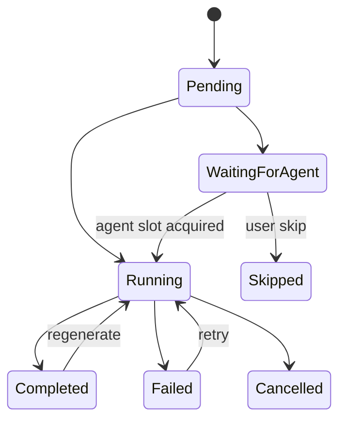
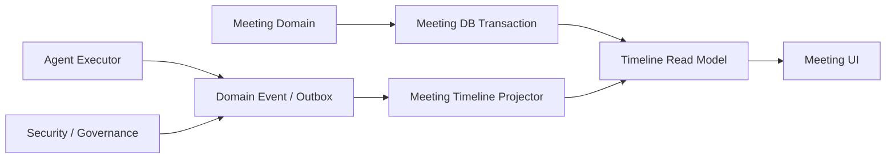

# Meeting Timeline & Realtime 详细设计

## 1. 目标与边界

Meeting Timeline 是用户进入 Meeting Session 后看到的核心协作视图。

它的视觉语义接近群聊，但 Agent 每次发言不是只有一条静态消息，而是由两部分组成：

```text
MeetingTurnContribution
├── Participant
├── 可展开的当前 Agent Execution streaming / 当前状态
└── 展示区
    ├── pending DecisionRequest / Approval Request
    └── current MeetingMessage
```

本文定义：

- Timeline materialized read model；
- MeetingTurnContribution 的统一展示单元；
- Decision / Approval 交互卡片；
- Agent streaming 的展开方式；
- Projection；
- ordering；
- realtime；
- reload / reconnect。

Timeline 是 Read Model，不是新的业务 Source of Truth。

## 2. UI 结构

概念展示：

```text
User
└── MeetingMessage

Agent A
├── Execution ▸ "正在贿赂仓鼠……"
├── DecisionRequest card?       <- pending 时出现
├── ApprovalRequest card?       <- pending 时出现
└── Final MeetingMessage        <- execution 完成后出现

Agent B
├── Execution ▸ "思考了 18.4s"
└── Final MeetingMessage
```

Execution 行默认折叠。

展开后显示：

- model streaming；
- Tool Call / Tool Result；
- waiting；
- retry；
- error；
- cancel；
- final execution status。

具体 Execution Event schema 仍由 Agent Executor / Agent Loop 定义。

## 3. Materialized Read Model

Meeting Timeline 维护独立 materialized read model。

Timeline 的一等展示单元对应 `MeetingTurnContribution`，而不是直接对应 Agent Execution。

建议核心结构：

```text
MeetingTimelineItem
├── id
├── meeting_id
├── turn_id
├── contribution_id
├── participant_id
├── participant_type
├── occurred_at
├── projection_state
└── display_snapshot
```

第一阶段不把 Decision / Approval 建成独立永久 TimelineItem。

它们属于 Agent Contribution item 的 active interaction projection。

## 4. User Contribution Item

用户发送消息时，在 Meeting 本域同一事务中：

1. 创建 MeetingTurn；
2. 创建 User `MeetingTurnContribution`；
3. 写 User MeetingMessage，并关联该 Contribution；
4. 创建对应 TimelineItem；
5. 写 Outbox。

User Contribution 在 Timeline 中直接展示其 `current_message_id` 对应的 MeetingMessage。

User Contribution 没有 Agent Execution，也没有 Execution streaming 区域。

### 4.1 Inline Reference UI

Meeting Message 编辑器支持结构化 `text / mention / task / knowledge / link / file` inline node。

- `@` 用于 Participant mention；
- `#` 用于 Task / Knowledge / File Resource Picker；
- URL paste / Link action 创建 link node；
- 文件上传 / Artifact Picker 创建 file node；
- `task / knowledge / link / file` chip 全部支持 **Pin to References**。

Timeline 只负责渲染这些结构化 node 和交互状态；完整 schema、选择器、Pin、File / Object Storage 规则见 [Meeting References & Inline Content](./meeting-references-inline-content.md)。

## 5. Agent Contribution Item

每个目标 Agent 在 Turn 创建时都有一个稳定的 `MeetingTurnContribution`。

Timeline 不必在 Contribution 创建时立刻显示所有普通 `pending` Agent；但当 Contribution 进入 `waiting_for_agent` 或真正启动当前 Agent Execution 时，必须创建 / 激活该 Contribution 的 Timeline placeholder。这样用户可以看到正在等待 busy Agent 的稳定发言位置。

概念 projection：

```text
AgentContributionTimelineProjection
├── contribution_id
├── participant_snapshot
├── contribution_status
├── current_execution_id?
├── waiting_on_execution_id?
├── busy_source?
│   ├── trigger_type
│   └── trigger_reference
├── active_decision_request_ids[]
├── active_approval_request_ids[]
├── current_message_id?
├── current_generation
├── execution_history_refs[]
├── started_at?
└── completed_at?
```

一个 Contribution 可以因为 retry / regenerate 关联多个 Agent Execution，但主 Timeline 中始终占据同一个发言位置。

Timeline 不保存完整 Execution Log。

## 6. Agent Contribution Item 生命周期



UI 上始终是同一个 Contribution item。

`waiting_for_agent` 表示尚未创建当前 Contribution 的 Agent Execution；`waiting_on_execution_id / busy_source` 只是 Timeline projection 用于解释谁正在占用目标 Agent，不成为新的 Source of Truth。

DecisionRequest / Approval Request 使当前 Agent Execution 进入 waiting 时，Contribution 仍保持 `running`。waiting 的具体原因由下方交互卡片表达，不为 Contribution 再复制一套 waiting 状态。

Execution 的 retry / regenerate 不追加新的聊天位置，只更新该 Contribution 当前指向的 Execution / Message，并保留历史 generation 供展开查看。

## 7. Execution Runtime View

Agent streaming 不 materialize 到 Meeting Timeline 数据表，也不由 Meeting 实现自己的 streaming backend。

数据来源：

```text
Meeting UI
    -> reusable Agent Execution Runtime View
        -> Runtime Item Snapshot
        -> RuntimeItemUpdate Stream
        -> Agent Executor
```

Timeline item 只保存：

- execution reference；
- Contribution status；
- Contribution `started_at / completed_at`；
- Decision / Approval active references；
- current MeetingMessage reference。

用户点击展开 Execution 行时：

1. UI 通过 `execution_id` 打开平台统一 Agent Execution Runtime View；
2. 加载当前 Runtime Item Snapshot；
3. 如果 Execution 仍在运行，则订阅 RuntimeItemUpdate Stream；
4. 展示结构化的 text / reasoning / tool / interaction / notice/error Runtime Item；
5. 收起后停止消费 RuntimeItemUpdate Stream，只保留纯前端状态行。

这样默认折叠状态完全不需要为了显示 Execution Row 额外请求 Agent Execution runtime data，也避免把 token delta、Tool logs 等复制到 Meeting 数据模型。

Task / Review 的 Execution Detail、Meeting Timeline、独立 Execution Detail 使用同一个 Agent Execution Runtime View contract。Meeting 只负责决定“在哪个聊天位置展示这个 Execution”，不负责定义 Runtime Item schema 或 streaming protocol。

## 8. Collapsed Execution Row

Collapsed Execution Row 是**纯前端展示效果**，不显示 Agent Execution 实际正在执行的 phase / Tool / retry / waiting reason。

它只使用 Timeline 已经拥有的：

```text
Contribution.status
Contribution.started_at
Contribution.completed_at
Contribution.id / generation
busy_source?               # only waiting_for_agent
```

因此默认折叠状态：

- 不请求 Agent Execution Runtime View；
- 不订阅 RuntimeItemUpdate Stream；
- 不需要 backend 生成 `collapsed_status_text`；
- 不需要 Timeline Projector 投影 Execution current phase。

`waiting_for_agent` 是这一展示区的特例：此时还没有当前 Contribution 的 Agent Execution，因此展示的是明确的 Agent busy 状态，而不是虚构的 Execution phase。

### 8.1 waiting_for_agent

`Contribution.status = waiting_for_agent` 时，显示当前占用 Agent 的业务来源，例如：

```text
Agent B · 正在处理 Task #123                 [跳过]
```

busy 文案来自 `AgentBusy.active_trigger` 对应的结构化业务引用，而不是 Agent Execution Runtime View。常见映射例如：

```text
task     -> 正在处理 Task #123
meeting  -> 正在参与 Meeting #456
other    -> 正在执行其他工作
```

具体 Task 编号 / Meeting 标题等展示信息由对应业务 read model 解析；Agent Executor 不生成 UI 文案。

“跳过”调用 Meeting Runtime 的 Skip Contribution command：

```text
waiting_for_agent -> skipped
```

它不 cancel 当前占用该 Agent 的 Execution，因为那个 Execution 属于其他 Task / Meeting / Trigger。

`waiting_for_agent` 默认无限等待，因此 UI 不显示倒计时或自动 timeout。

### 8.2 running

`Contribution.status = running` 时，从前端内置趣味文案池中选择一条，例如：

```text
Agent A · 正在贿赂仓鼠……
Agent A · 正在调配杀虫剂……
Agent A · 正在给电子羊数羊……
Agent A · 正在重新排列宇宙常数……
```

这些文案：

- 完全由前端维护；
- 不对应真实 Execution phase；
- 不进入后端数据模型；
- 不进入 Audit / Timeline projection；
- 不应用来推断 Agent 实际正在做什么。

为了避免 React / Vue 重新 render 时文案不断跳变，建议按：

```text
contribution_id + current_generation
```

做确定性伪随机选择，或者在进入 running 时在前端 local state 中随机一次并保持到该 generation 结束。

如果希望文案周期性变化，也只能使用前端 timer 切换，不产生网络请求。

### 8.3 completed

`Contribution.status = completed`：

```text
Agent A · 思考了 18.4s
```

其中：

```text
duration = completed_at - started_at
```

纯前端格式化，不从 Execution Runtime 获取 duration。

### 8.4 failed

`Contribution.status = failed`：

```text
Agent A · 18.4s 后失败
```

同样只使用 Contribution timestamps。

### 8.5 cancelled

`Contribution.status = cancelled`：

```text
Agent A · 思考了 7.2s 后被停止
```

### 8.6 skipped

`Contribution.status = skipped`：

```text
Agent B · 已跳过
```

不显示 Execution duration，因为该 Contribution 没有启动新的 Agent Execution。

### 8.7 pending

如果 UI 需要展示尚未启动的 Contribution：

```text
Agent A · 等待发言
```

真实 Execution 状态、Tool Call、reasoning、waiting、retry 等细节只在用户主动展开 Execution Row 后，通过统一 Agent Execution Runtime View 获取。

## 9. DecisionRequest Card

DecisionRequest Source of Truth 属于 Meeting Domain。

当：

```text
DecisionRequest.status = pending
```

对应 Agent Contribution item 的展示区出现 Decision card：

- question；
- options；
- free input；
- Skip。

用户 answer / skip 后：

- Source of Truth 更新；
- Execution resume；
- 卡片从主要展示区消失；
- Timeline item 不需要永久保留一张 resolved card。

历史 Decision 仍然：

- 存在 DecisionRequest 表；
- 可以从 Execution detail / history 中查看；
- 可以被 Audit / observability 引用。

## 10. Approval Request Card

Approval Request Source of Truth 属于 Security / Governance。

Meeting 通过 Approval Request reference + projection 展示 pending Approval card。

Approval card 复用平台统一的 Approval Request 交互组件 / Action Contract。Meeting Timeline、Human Inbox、Task / Execution Detail 都调用同一套 Governance approve / reject API，不各自实现审批逻辑。

卡片至少可以展示：

- 请求 Agent；
- Tool / action；
- resource / scope 的用户可读摘要；
- approve；
- reject；
- 跳转 Governance detail。

用户处理后：

- Governance 更新 Approval Request；
- ToolOperation / Agent Execution resume；
- pending card 从 Meeting item 展示区消失。

Meeting 不保存第二份 approved / rejected 状态。

## 11. Final MeetingMessage

Agent Execution 成功产生公开回复后：

1. Agent Executor 完成 execution result；
2. Meeting 幂等消费完成事件；
3. 写 immutable Agent MeetingMessage，并绑定当前 Contribution；
4. 更新 Contribution：
   ```text
   current_execution_id = execution.id
   current_message_id = message.id
   status = completed
   ```
5. 更新对应 Contribution TimelineItem；
6. UI 在 Execution 行下方展示当前 MeetingMessage。

最终结构：

```text
Agent A Contribution
├── Execution ▸ 思考了 18.4s
└── "当前公开回复..."
```

Execution 行仍然保留，用户之后仍可以展开查看该次 Agent 工作过程。

## 12. Failed / Cancelled Contribution

当前 Execution failed：

```text
Contribution.status = failed
```

Timeline：

```text
Agent A
└── Execution ▸ 18.4s 后失败
```

没有新的 current MeetingMessage。

用户可以从同一个 Contribution item 上执行 Retry。

当前 Execution cancelled：

```text
Contribution.status = cancelled
```

如果取消前该 Contribution 已经存在历史 MeetingMessage，历史 Message 不删除；是否仍作为 `current_message_id` 由具体取消时点决定。

## 13. Retry / Regenerate

Retry / Regenerate 都发生在同一个 MeetingTurnContribution 下。

### Retry

terminal failure 后 Retry：

- Contribution 不变；
- 创建新的 Agent Execution attempt；
- Timeline item 不变；
- 展开的 Execution Runtime View 切换到新的 `current_execution_id`；
- 成功后更新 `current_message_id`。

### Regenerate

Regenerate：

- Contribution 不变；
- generation 增加；
- 创建新的 Agent Execution；
- 成功后创建新的 immutable MeetingMessage；
- Contribution.`current_message_id` 指向新 Message；
- 旧 Execution / Message 继续保留为 generation history。

概念上：

```text
Agent A Contribution
├── Generation 1
│   ├── Execution
│   └── MeetingMessage
└── Generation 2 [current]
    ├── Execution
    └── MeetingMessage
```

主 Timeline 仍只有一个 Agent A Contribution item。

## 14. Timeline Ordering

Timeline 主要使用：

```text
occurred_at ASC
```

不建立新的 Meeting 业务 sequence。

同一 Turn 内，Contribution 的 `order_index` 已经表达 User trigger 与各 Agent 的固定发言位置；Timeline projection 可以把该顺序作为同一 Turn 的稳定展示约束。

跨 Turn 或相同 timestamp 的稳定分页使用技术 tie-breaker：

```text
(occurred_at, timeline_item_id)
```

其中 TimelineItem ID 必须具有稳定全序，例如：

- UUIDv7；
- ULID；
- 数据库生成的 sortable id。

## 15. Agent Contribution 启动顺序

Sequential 模式按 Contribution.`order_index` 逐个启动。

如果当前顺序位置的 Agent busy，该 Contribution 先形成 `waiting_for_agent` placeholder；后续 Contribution 不启动，直到当前 Agent 成功 Launch 或用户 Skip。

Parallel 模式：

- Runtime 按 Contribution.`order_index` 发起 launch；
- busy Agent 的 Contribution 在 `waiting_for_agent` 时立即形成 / 激活 placeholder；
- idle Agent 的 Contribution 在 Agent Execution 真正启动后形成 / 激活 placeholder；
- 所有并行 Contribution 使用同一个 Message visibility boundary。

这不要求所有 parallel Agent 真正同时开始，只要求它们使用相同的 MeetingMessage 可见边界。

## 16. Projection 架构

采用：

> Meeting 本域同步投影 + 外部模块事件投影



## 17. 本域同步投影

以下事实由 Meeting 本域自己创建，可以同事务写 Timeline：

- User MeetingMessage；
- Agent final MeetingMessage；
- Turn metadata；
- Contribution `waiting_for_agent / skipped` 状态；
- 当前 `waiting_on_execution_id` 与结构化 busy source projection；
- DecisionRequest pending projection；
- participant display snapshot；
- archive / restore 对页面状态的影响。

例如：

```text
BEGIN
  insert Agent MeetingMessage
  update MeetingTimelineItem.final_message_id
  insert OutboxEvent
COMMIT
```

这样避免用户刷新页面时出现“Message 已经存在但 Timeline 还没有”的本域可避免不一致。

## 18. 外部事件投影

以下信息来自其他 Source of Truth：

### Agent Executor

- execution started：驱动 Contribution 进入 running，并写入当前 `started_at`；
- succeeded：驱动 Contribution 进入 completed，并写入 `completed_at`；
- failed：驱动 Contribution 进入 failed，并写入 `completed_at`；
- cancelled：驱动 Contribution 进入 cancelled，并写入 `completed_at`。
- 被 `waiting_on_execution_id` 引用的占用 Execution 进入 terminal：通知 Meeting Runtime 重新尝试该 Contribution Launch；若再次 `AgentBusy`，Meeting 本域更新新的 busy source。

Execution 的 current phase、waiting、retry、Runtime Item 等细节不需要为了 Collapsed Execution Row 投影到 Meeting Timeline。

DecisionRequest / Approval Request 的 pending 状态仍通过各自领域对象 / reference 投影为独立交互卡片。

### Security / Governance

- Approval Request linked / pending；
- Approval resolved；
- Approval invalidated / unavailable。

Timeline Projector 幂等消费这些事件，更新对应 Agent item。

## 19. Projection 幂等

外部事件必须包含稳定：

```text
event_id
source_id
source_version / occurred_at
```

Timeline Projector 保存 processed event 或使用 projection version 防止重复应用。

典型唯一约束：

```text
(projector_name, event_id)
```

重复事件：

```text
no-op
```

不能重复创建 Agent placeholder 或重复挂载 Approval card。

## 20. Projection 延迟

外部 projection 是最终一致。

因此短时间内可能出现：

```text
Agent Execution 已启动
Timeline placeholder 尚未出现
```

或：

```text
Approval 已解决
Meeting card 尚未消失
```

Realtime + Projector 应把延迟控制在交互可接受范围。

Meeting UI 在用户直接提交 Decision / Approval 后可以进行 optimistic interaction state，但最终仍以后端投影 / Source of Truth 回包校正。

## 21. Realtime Channel

Meeting 不单独决定 WebSocket 或 SSE。

统一复用平台 Realtime Channel。

Meeting 需要的逻辑事件至少包括：

```text
meeting.timeline.item.created
meeting.timeline.item.updated
meeting.participant.updated
meeting.turn.updated
meeting.summary.updated
```

Approval / Decision 的变化最终通过 Timeline item update 呈现。

`RuntimeItemUpdate` 不属于默认 Meeting Timeline subscription。只有用户展开某个 Execution Row 时，前端才单独加载该 execution 的 Runtime Item Snapshot，并在仍运行时订阅 RuntimeItemUpdate Stream。

Transport 由 Platform Infrastructure 统一决定。

## 22. Execution Runtime View Channel

Execution Runtime View 与 Timeline projection 分开，并直接复用 Agent Executor 的统一 Runtime View。

```text
Timeline channel
-> item / state / message

Agent Execution Runtime View
-> execution summary
-> Runtime Item Snapshot
-> RuntimeItemUpdate Stream
```

只有用户展开某个 Agent Execution 时，前端才需要加载详细 Runtime View；如果 Execution 仍在运行，再持续消费 RuntimeItemUpdate Stream。

该能力与 Task / Review 页面查看 Agent 运行状态使用同一个后端接口和前端 Runtime Item renderer。

这样可以避免多人并行 Agent 时主 Meeting channel 被大量 text / reasoning delta 淹没。

## 23. Reconnect

Meeting 不实现专属 sequence / cursor catch-up 协议。

断线重连后：

1. 重新读取完整 Meeting Timeline；
2. 直接根据 Timeline 中的 Contribution status / timestamps 恢复所有默认折叠行；
3. 重新获取 pending Decision / Approval；
4. 恢复 Meeting Timeline realtime subscription；
5. 只有仍处于展开状态的 execution 才重新连接 Agent Execution stream。

这是明确的第一阶段策略。

它优先：

- 实现简单；
- 状态正确；
- 容易维护。

如果未来单个 Meeting Timeline 大到完整 reload 成为性能问题，再增加 cursor catch-up。

## 24. Timeline Query

虽然 reconnect 使用完整 reload，服务端 API 仍建议提供稳定排序。

第一阶段可以支持：

```text
GET meeting timeline
order by occurred_at, id
```

如果 Meeting 很长，UI 日常浏览可以做分页 / virtual list，但 reconnect 语义仍以“重新建立 authoritative view”为目标。

是否在未来改成增量 catch-up 不改变领域模型。

## 25. Meeting Info / References

Meeting 页面提供侧边栏或悬浮信息区域：

```text
Meeting Info
├── Participants
├── Summary
└── References
    ├── Tasks
    ├── Knowledge
    ├── Links
    └── Files
```

References 来自 `MeetingReference`，支持直接 Pin / Unpin / reorder / open，也可以从 Message inline resource chip 执行 **Pin to References**。

完整 Reference UI、资源 identity、Link / File 行为见 [Meeting References & Inline Content](./meeting-references-inline-content.md)。

## 26. Human Inbox 跳转

proposed Meeting 在 Human Inbox 中只显示提醒：

```text
Agent requests a Meeting
-> Open Meeting
```

点击：

```text
Human Inbox
-> Meeting Session page
```

批准动作在 Meeting 页面完成。

Human Inbox reminder 不是 MeetingProposal Source of Truth。

Approval Request 与 proposed Meeting 不同：Approval 是平台级可复用交互对象，Human Inbox 应直接渲染统一 Approval Request 卡片并允许 approve / reject，不要求跳转到 Meeting / Task 页面。Meeting Timeline、Task / Execution Detail 和 Human Inbox 使用同一个 Governance Approval Request 组件 / Action Contract。

DecisionRequest 仍可以从 Human Inbox 跳转到对应 Meeting Execution 处理；无论入口在哪里，用户操作的始终是原领域对象。

## 27. 权限

Meeting Timeline 不建立独立权限模型。

用户访问 Timeline 时只校验：

```text
meeting.project_id == project.id
AND
project.owner_user_id == current_user.id
```

Project Owner 校验通过后，可以访问该 Meeting 的 Timeline、DecisionRequest、Approval card 以及关联 Agent Execution Detail。

Approval 的业务状态和处理流程仍由 Security / Governance 管理，但 Project 内不存在额外的人类审批角色。

Execution Runtime View 仍然需要遵守平台统一的数据脱敏 / Secret masking / private reasoning 不暴露规则；这些属于数据暴露规则，不是 Meeting 的额外权限层。

## 28. Hard Delete

Meeting hard delete 后：

- Meeting Timeline read model 一并删除；
- active realtime subscription 收到 resource deleted / access lost；
- UI 返回 Meeting 列表；
- Agent Execution / Audit / Governance 等外部记录按各自 retention 规则存在。

Timeline 不承担跨模块清理职责。

## 29. Timeline 与 Audit

两者完全分离。

```text
Timeline
= 用户协作界面

Audit
= 安全 / 治理 / 追责记录
```

Timeline 可以隐藏已经 resolved 的 Decision / Approval card。

Audit 不能因此丢失对应操作事实。

同样，Timeline hard delete 不等于 Audit 必须删除。

## 30. Source of Truth

```text
Turn speaking position
-> MeetingTurnContribution

User / Agent current public content
-> MeetingMessage

Long-lived Meeting resource links
-> MeetingReference

Inline Message resource links
-> MeetingMessageReference

Decision
-> DecisionRequest

Approval
-> Governance Approval Request

Execution runtime / streaming
-> Agent Execution

TimelineItem
-> Materialized Read Model only
```

如果 Timeline projection 与 Source of Truth 不一致：

- 允许 rebuild Timeline；
- 不允许反向用 Timeline 覆盖领域对象。

## 31. Rebuild

Timeline 必须可以重建。

Rebuild 来源：

- MeetingMessage；
- MeetingReference；
- MeetingMessageReference；
- MeetingTurn；
- MeetingTurnContribution；
- MeetingContributionExecution；
- DecisionRequest；
- MeetingApprovalRequestReference；
- Agent Execution current / historical metadata；
- Governance Approval references。

Rebuild 主要恢复当前 UI view。

完整 Execution streaming history 不复制到 Timeline；展开时仍从 Agent Execution 获取。
