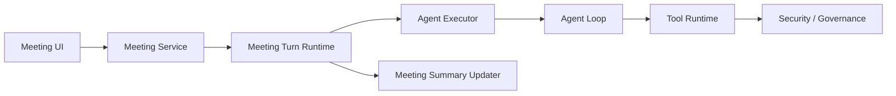
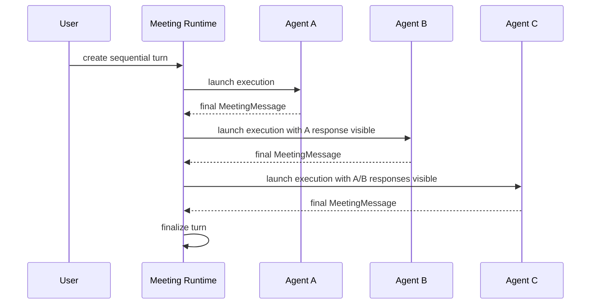
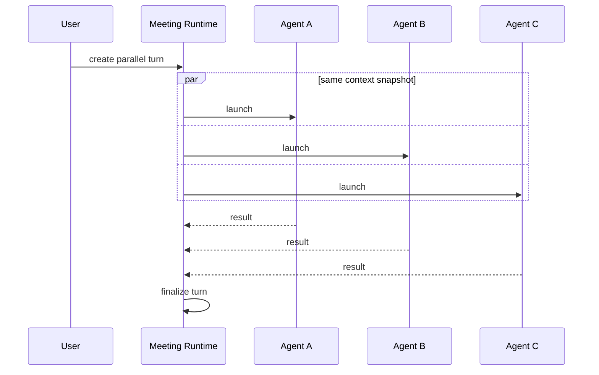
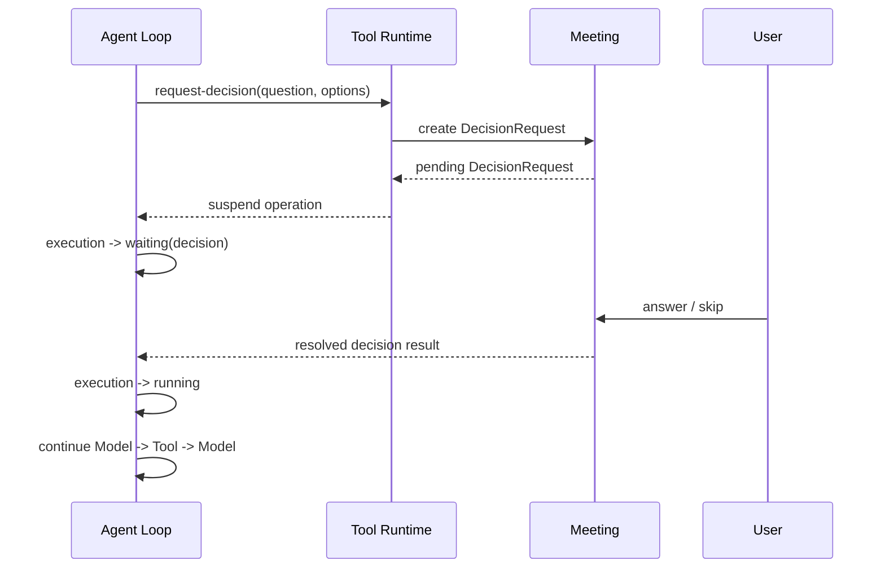
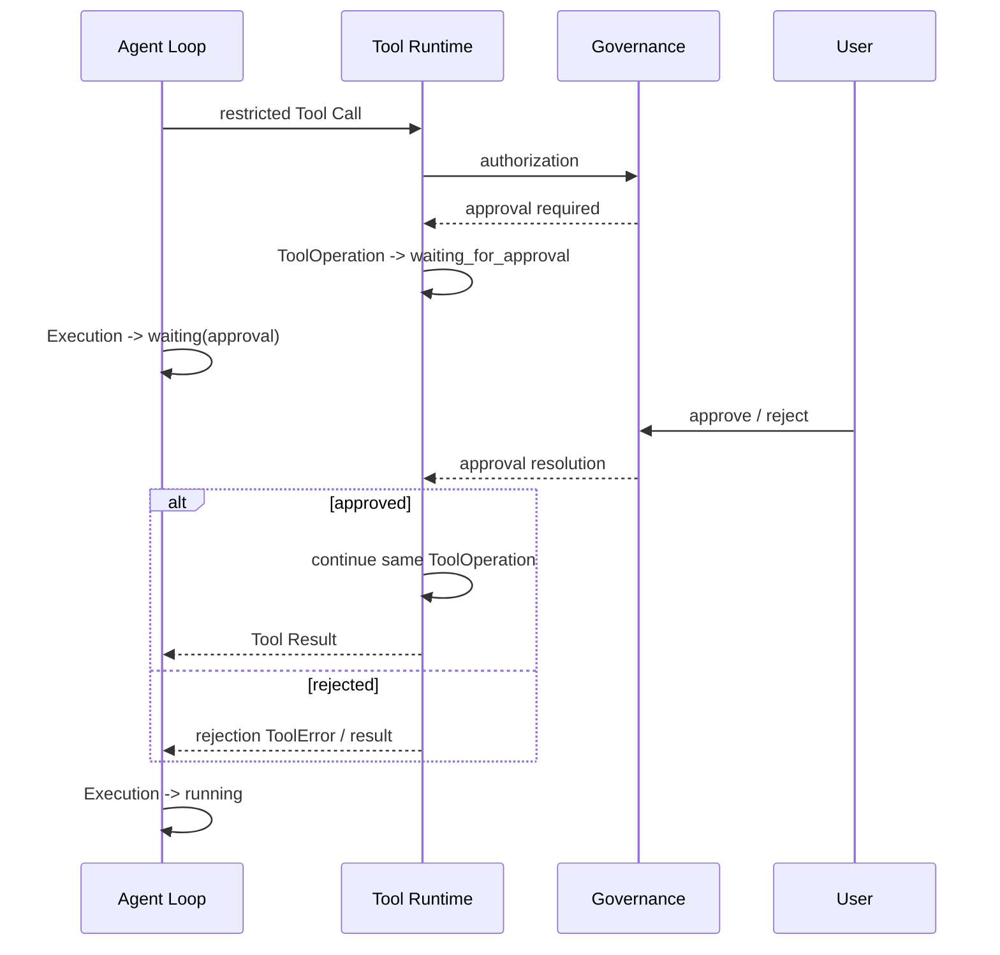
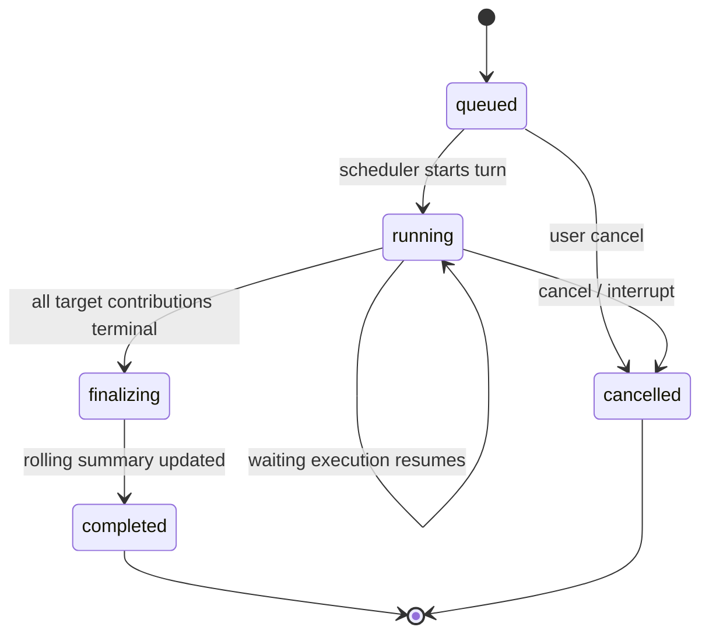

# Meeting Turn Runtime 详细设计

## 1. 目标与边界

MeetingTurn 是用户一次输入触发的一轮编排边界。Turn 下的实际发言单元是 `MeetingTurnContribution`；Agent Execution 只负责完成某个 Agent Contribution。

本文定义：

- Turn 创建与排队；
- Agent selection；
- sequential / parallel；
- 插话与 cancel；
- Agent Execution launch；
- DecisionRequest / Approval 等待与恢复；
- retry / regenerate；
- Turn finalize。

Meeting Turn Runtime 只负责“这一轮怎么跑”，不负责 Agent Loop 内部模型调用，也不负责 Governance Approval 本身的状态机。

## 2. Runtime 组件关系



Meeting Turn Runtime 是 Meeting 模块内部逻辑，不是独立部署服务。

## 3. Turn 创建

用户发送普通 Meeting 消息时，服务端在一个 Meeting 本域事务内：

1. 校验 Meeting 为 `active`；
2. 校验 User Participant；
3. 写入 immutable User MeetingMessage；
4. 解析本轮 Agent selection；
5. 解析本轮 mode；
6. 创建 MeetingTurn snapshot；
7. 写入 Timeline User Message；
8. 写出 Outbox Event。

概念命令：

```text
SendMeetingMessageCommand
├── meeting_id
├── user_participant_id
├── content_nodes[]
├── reply_to_message_id?
├── selected_agent_participant_ids?
├── mode
│   ├── sequential
│   └── parallel
├── send_mode
│   ├── enqueue
│   └── interrupt
└── idempotency_key
```

## 4. Agent Selection

### 4.1 默认规则

如果用户没有指定 Agent：

```text
targets = all active Agent participants
```

### 4.2 显式选择

如果用户使用：

- @mention；
- Agent picker；
- 其他显式选择 UI；

则：

```text
targets = selected Agent participants only
```

@mention 实际来自 MeetingMessage 的结构化 `mention` inline node。mention node 和 picker 都只负责形成结构化 `selected_agent_participant_ids`，Runtime 不依赖解析最终展示文本来决定执行者。

Inline Content 与 mention node 的完整设计见 [Meeting References & Inline Content](./meeting-references-inline-content.md)。

### 4.3 Contribution Snapshot

Turn 创建时一次性创建本轮 Contribution snapshot：

```text
MeetingTurn
├── User trigger Contribution
└── Agent Contributions[]
    ├── participant_id
    └── order_index
```

User trigger Contribution 固定为：

```text
order_index = 0
status = completed
```

没有显式选择 Agent 顺序时：

```text
Agent Contribution.order_index
= MeetingParticipant.sort_order
```

用户显式选择多个 Agent 时：

```text
Agent Contribution.order_index
= user selection order
```

Turn 创建之后，Meeting participant 的新增、移除或拖拽排序都不会改变该 Turn 已经建立的 Contribution snapshot。

## 5. Sequential Mode

Sequential Turn 每次只推进一个目标 Agent Contribution。



后续 Agent 的 Context 在启动前即时构造，因此可以看到：

- 本 Turn 的 User Message；
- 本 Turn 中已经完成的前序 Agent Message；
- 按 Meeting Timeline 顺序排列的历史 MeetingMessage；
- rolling summary。

如果当前 Contribution 的 Agent Execution 正在 waiting Decision / Approval，后一个 Contribution 不启动，因为前序 Contribution 还没有完成。

如果轮到当前 Contribution 时目标 Agent busy，则该 Contribution 进入 `waiting_for_agent`，Sequential Turn 同样停在这里，后续 Contribution 保持 `pending`。目标 Agent 空闲并成功 Launch，或用户显式 Skip 当前 Contribution 后，才继续推进下一个 Agent。

## 6. Parallel Mode

Parallel Turn 中所有目标 Agent Contribution 基于同一个初始 Meeting snapshot 并行启动。



Turn 创建后记录统一 Message visibility boundary。

每个 parallel Agent 可以看到：

- 当前 User Message；
- Turn 开始前已经存在、并位于统一 visibility boundary 以内的 MeetingMessage；
- rolling summary。

不能看到：

- 同一 parallel Turn 中其他 Agent 尚未完成或随后完成的回复。

Parallel 模式不自动创建额外汇总 Agent。

Parallel Turn 中每个 Contribution 独立竞争自己的 Agent slot。某个目标 Agent busy 时，只让该 Contribution 进入 `waiting_for_agent`；其他 Agent Contribution 继续正常 Launch / 运行，不互相阻塞。

用户如果希望汇总上一 Turn，应显式创建下一 Turn，并选择某个 Agent执行汇总。

## 7. Queue 与插话

同一个 Meeting 默认一次只推进一个 active Turn。

### 7.1 enqueue

如果当前 Turn 尚未完成，用户默认发送：

```text
new Turn.status = queued
```

当前 Turn 完成 summary finalize 后，再启动队首 Turn。

### 7.2 interrupt

用户可以选择“立即发送 / 插话”。

此时：

1. 创建新的 User Message 和 Turn；
2. 当前 running Turn 进入 cancel flow；
3. 向其所有非 terminal Agent Execution 发送 cancel；
4. 当前 Turn 已经完成的 Agent Message 保留；
5. 当前 Turn 标记 `cancelled`；
6. 新 Turn 不等待旧 Turn 正常 finalize，取消流程完成后立即开始。

建议保存：

```text
old_turn.interrupted_by_turn_id = new_turn.id
```

这样 UI 和 Audit 可以明确解释为什么上一轮被终止。

## 8. Agent Execution Launch

Meeting Runtime 不自己运行 Agent。

对每个进入运行阶段的 Agent Contribution 创建：

```text
AgentLaunchRequest
├── agent_id = participant.source_id
├── trigger.type = meeting
├── trigger.reference
│   ├── meeting_id
│   ├── turn_id
│   ├── contribution_id
│   └── participant_id
├── purpose = response
├── execution_policy
├── idempotency_key
└── metadata
    ├── mode
    ├── contribution_order
    ├── generation_index
    └── attempt_index
```

Meeting Runtime 持久化 `MeetingContributionExecution` 关联，并把 Contribution 的 `current_execution_id` 指向当前 Execution。

`AgentExecutor.launch()` 可能返回两种正常结果：

```text
execution_id
AgentBusy
```

只有取得 `execution_id` 后才创建 / 更新 `MeetingContributionExecution` 并把 Contribution 置为 `running`。`AgentBusy` 不创建本 Contribution 的 Agent Execution。

### 8.1 Contribution Execution Idempotency

推荐：

```text
meeting:{meeting_id}:contribution:{contribution_id}:generation:{g}:attempt:{a}
```

同一个 Contribution generation / attempt 无论 Runtime 因进程崩溃、事件重复还是 service retry 再次发起，都只能得到同一个 Agent Execution。

如果前一次尝试只得到 `AgentBusy`，该 idempotency key 尚未对应任何新 Execution；后续等待结束后的 Launch retry 继续复用同一个 key。第一次成功创建后，再次重放才返回该稳定 Execution。

### 8.2 Agent Busy / waiting_for_agent

如果目标 Agent 当前已有非终态 Execution，Agent Executor 返回：

```text
AgentBusy
├── agent_id
├── active_execution_id
├── active_trigger.type
├── active_trigger.reference
└── active_purpose
```

Meeting Runtime 更新：

```text
Contribution.status = waiting_for_agent
Contribution.current_execution_id = null
Contribution.waiting_on_execution_id = active_execution_id
```

`waiting_for_agent` 默认无限等待，不设置自动 timeout。

恢复推进有两条路径：

1. 收到 `waiting_on_execution_id` terminal 事件后重新尝试 Launch；
2. Meeting Runtime restart recovery 时重新检查所有 `waiting_for_agent` Contribution，并幂等重试 Launch。

如果重试时 Agent 又被新的 Execution 占用，则继续保持 `waiting_for_agent`，并更新 `waiting_on_execution_id`。

### 8.3 Skip Busy Agent

用户可以对 `waiting_for_agent` Contribution 执行 Skip。

Skip 必须原子校验：

```text
status = waiting_for_agent
AND current_execution_id is null
```

成功后：

```text
waiting_for_agent -> skipped
waiting_on_execution_id = null
```

不创建 Agent Execution，也不生成 MeetingMessage。

如果 Skip 与 Agent slot 释放 / Launch 竞争，已经成功进入 `running` 的 Contribution 不再接受 Skip；此时用户应使用现有 Stop / Cancel Agent Execution 操作。

Sequential 模式在 Skip 后继续下一个 Contribution。Parallel 模式只结束该 Contribution，其他 Contribution 不受影响。

## 9. Agent Execution Waiting

Meeting 需要 Agent Execution 支持非 terminal 的 external waiting。

Agent Execution 对外生命周期扩展为：

```text
created
  -> preparing
  -> running
  -> waiting
  -> running
  -> succeeded / failed / cancelled
```

其中：

```text
waiting_reason
├── decision
└── approval
```

`waiting` 表示 Agent Loop 的逻辑执行尚未完成，但当前无法继续推进，需要外部用户输入。

等待期间：

- Execution 不是 succeeded；
- 不创建最终 MeetingMessage；
- Turn 仍视为 running；
- Approval / Decision waiting 不设置自动 timeout，必须等待用户明确处理；
- waiting 时间不计入 Agent Execution 主动运行时长；
- UI 显示 pending interaction card。

## 10. DecisionRequest Suspension / Resume

Agent 在 Loop 中调用 `request-decision`。

流程：



### 10.1 Answer

```text
pending -> answered
```

原 Agent Execution 恢复，不创建 follow-up Execution。

### 10.2 Skip

```text
pending -> skipped
```

原 Agent Execution 恢复，并收到明确 Tool Result：

```text
decision.status = skipped
```

Agent 自己决定采用默认方案、提出其他问题或停止相关动作。

### 10.3 Turn / Execution Cancel

如果 waiting execution 被取消：

```text
DecisionRequest.pending -> cancelled
```

该 Request 从 Human Inbox / active interaction UI 中移除。

## 11. Approval Suspension / Resume

Approval 与 Decision 的 UI 都表现为“等待用户”，但 Source of Truth 不同。



关键约束：

- 不创建新的 `approved_action` Agent Execution；
- 不创建新的 ToolOperation；
- Approval 后继续原 Operation；
- reject 后同样恢复原 Agent Loop，让 Agent 消费拒绝结果。

Meeting 只引用 Approval Request。

## 12. Completion 与 Final Message

Agent Execution 只有产生完整可公开输出后才写 MeetingMessage。

推荐顺序：

```text
Agent Loop final result
    -> persist Agent Execution terminal result
    -> persist immutable MeetingMessage
    -> update Timeline projection
    -> update MeetingTurnContribution + MeetingContributionExecution
```

这些跨 Agent Executor / Meeting 的变化不能依赖分布式事务。

Agent Executor 发布可靠完成事件，Meeting 通过幂等 consumer 写入 Message / projection。

必须保证：

```text
(execution_id) -> at most one normal final MeetingMessage
```

regenerate 是新的 Execution，因此可以产生新的 Message。

## 13. Failure

单个 Agent Execution 最终可能：

- succeeded；
- failed；
- cancelled。

### 13.1 Automatic Retry

模型 / Tool transient retry 由 Agent Loop、Tool Runtime 的通用策略处理。

它不会创建新的 Contribution 或新的 MeetingContributionExecution。

### 13.2 Terminal Failure

自动 retry 后仍失败：

- 当前 Agent Contribution 标记 `failed`；
- Parallel 模式其他 Agent 继续；
- Sequential 模式继续启动后续 Agent；
- 后续 Agent Context 中不伪造失败 Agent 的 MeetingMessage；
- 失败状态保留在 Runtime / Timeline，不作为额外 Turn metadata 注入后续 Agent 的 Meeting Context。

当所有目标 Agent Contribution 都进入 terminal contribution state：

```text
Turn.result = partial_failure
```

如果至少一个目标 Agent failed / cancelled，且不是整个 Turn 被用户取消，则可以形成 partial failure。

## 14. Cancel

### 14.1 Cancel Turn

用户取消 Turn：

1. Turn -> cancelling（可作为瞬时 runtime phase，不要求持久枚举）；
2. 将 `pending / waiting_for_agent` 且尚无 Execution 的 Agent Contribution -> cancelled；
3. cancel 所有非 terminal Agent Execution；
4. pending DecisionRequest -> cancelled；
5. pending Approval / Tool Operation 请求取消或失效；
6. 已经生成的 MeetingMessage 保留；
7. Turn -> cancelled。

取消不是 rollback。

### 14.2 Cancel Single Agent

只对指定 Agent Execution 发送 cancel。

其他 Contribution 继续。

最终 Turn 可以：

```text
completed + partial_failure
```

## 15. Retry

区分两种 retry。

### 15.1 Technical Retry

发生在同一个 Execution 内：

- model transient error；
- retryable Tool transport；
- Provider retry。

由 Agent Executor / Agent Loop / Tool Runtime 管理。

### 15.2 User Retry

如果一个 Agent Execution 已经 terminal failed：

- 创建新的 Agent Execution；
- 绑定同一个 MeetingTurnContribution；
- `retry_of_execution_id = old`；
- generation 不因纯 retry 必然变化；
- 新 Execution 成功后成为该 Contribution 当前有效结果。

旧 Execution 仍保留用于 observability / Audit。

## 16. Regenerate

Regenerate 表示用户主动要求某个 Agent Contribution 重新生成回答，不要求原 Execution 失败。

Contribution 是稳定发言位置，因此 Regenerate 不创建新的 Contribution。

流程：

1. 原 Contribution 从 `completed -> running`；
2. `generation_index += 1`；
3. `attempt_index = 0`；
4. 创建新的 Agent Execution，并继续绑定原 Contribution；
5. `regenerate_of_execution_id = previous current execution`；
6. 产生新的 immutable MeetingMessage；
7. 更新 Contribution.`current_execution_id` 和 `current_message_id`。

旧 Execution / Message 不删除，作为该 Contribution 的 generation history 保留。

Timeline 默认在同一个 Contribution item 中展示最新 generation，历史 generation 在 detail 中保留。

对于 sequential Turn，regenerate 前序 Contribution 后，不自动级联 regenerate 后续 Contribution。用户如果认为后续回复已经基于旧回答失效，应显式 regenerate 对应 Agent Contribution。

这样避免隐式重跑整个 Turn。

## 17. Turn Completion

当所有目标 Agent Contribution 都进入 terminal contribution state：

```text
running -> finalizing
```

terminal contribution state：

```text
completed
failed
cancelled
skipped
```

Runtime 计算：

```text
result = success | partial_failure
```

`skipped` 是用户主动接受不再等待该 Agent 的结果，本身不计为 partial failure。只有 `failed / cancelled` Contribution 才使正常完成的 Turn 形成 `partial_failure`。

然后同步调用 Meeting Summary Updater。

```text
finalizing
    -> summary update succeeded
    -> completed
```

如果 Summary 更新失败：

- Turn 保持 `finalizing`；
- 使用平台级有限 retry；
- 不启动后续 queued Turn；
- 不把旧 Summary 当作已经完成本轮 finalize 的结果。

这样保证 rolling summary 和 Turn completion 有明确一致性边界。

## 18. Sequential 与 Parallel Context Boundary

### Sequential

每个 Agent 启动时重新调用 MeetingContextProvider，因此可以看到前序 Agent 已经持久化的 MeetingMessage。MeetingContextProvider 只返回 Meeting 会话数据，不把 MeetingTurn 自身注入模型 Context。

### Parallel

Turn 启动时创建统一 Message visibility boundary。

所有 Agent Context 必须基于同一个 MeetingMessage 截止点：

```text
visible MeetingMessages <= boundary
```

不能因为某个 Agent 晚几毫秒启动而看到另一个 parallel Agent 已完成的回复。

实现可以保存：

```text
turn.message_visibility_boundary
```

这个 boundary 只属于 Runtime 控制状态，用于约束 MeetingContextProvider 查询到哪一条 Timeline Message；它不会进入模型可见的 MeetingTriggerContext，也不承担 Timeline business sequence。

## 19. Turn Runtime 状态图



## 20. Runtime 恢复

Meeting Runtime 必须支持进程崩溃后的恢复。

恢复时从数据库重建：

- queued / running / finalizing Turn；
- Turn participant snapshot；
- MeetingTurnContribution；
- MeetingContributionExecution；
- Agent Execution status；
- pending DecisionRequest；
- linked Approval Request；
- summary finalize status。

恢复逻辑只能补发幂等命令，不能假设内存中的 orchestrator state 仍然存在。

典型恢复：

```text
running sequential Turn
+ Contribution A completed
+ Contribution B pending / no execution
=> idempotently launch Contribution B execution

running Turn
+ Contribution B waiting_for_agent
+ waiting_on_execution_id terminal / stale
=> idempotently retry Contribution B launch

finalizing Turn
+ summary not committed
=> retry summary finalize
```

## 21. 与其他模块的边界

```text
Meeting Turn Runtime
├── decides target agents / order / mode
├── owns queue / interrupt / turn finalize
├── reacts to Agent Execution events
└── resumes Meeting flow

Agent Executor
├── owns Agent Execution
├── owns waiting / resume runtime capability
├── owns Agent Loop
└── owns cancel / timeout

Tool Runtime
├── owns ToolOperation
└── owns waiting_for_approval

Security / Governance
└── owns Approval Request

Meeting Context Provider
└── prepares trigger context

Timeline
└── projects runtime facts for UI
```

Meeting Runtime 不能绕过这些模块直接修改其内部状态。
