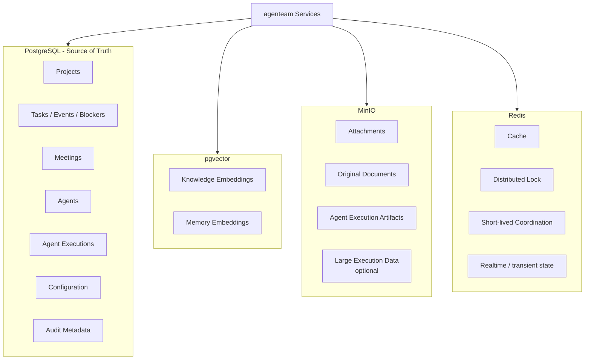
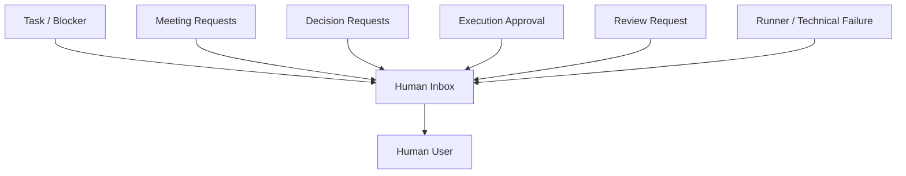
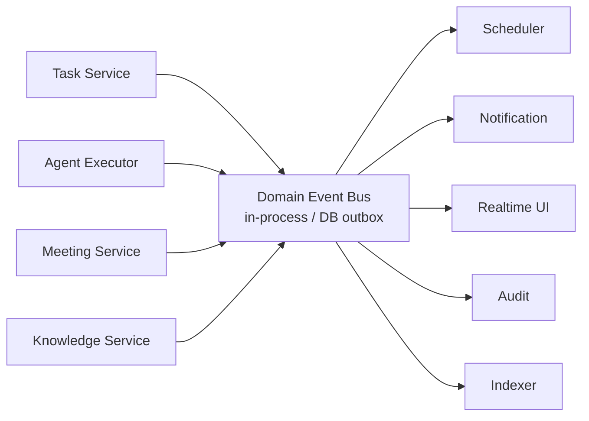
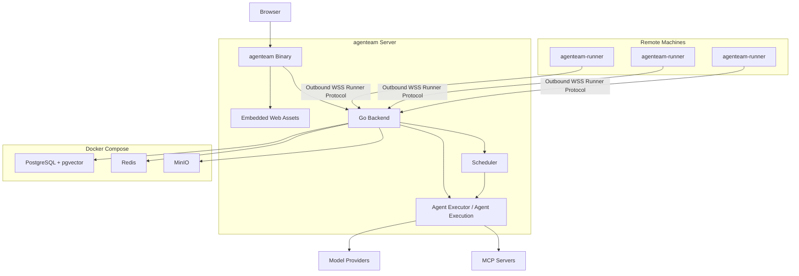

# 平台基础设施与部署架构

## 1. 模块范围

本模块描述跨业务领域的公共平台能力：

- Model Management；
- PostgreSQL / pgvector；
- MinIO；
- Redis；
- Authentication / Authorization；
- Approval / Audit；
- Human Inbox；
- Internal Events；
- Agent Executor / Agent Execution；
- 部署拓扑。

这些能力为 Project、Task、Meeting、Agent、Tool 等业务模块提供基础设施，并承载统一的 Agent 执行能力。

## 2. Model Management

系统允许接入多个 Provider 和多个 Model。

模型配置分两级：

- 系统级；
- 项目级。

项目可以使用系统级模型，也可以配置自己的模型。在模型选择 UI 中，两类模型应明确区分来源。

Provider 配置至少包含：

- name；
- base-url；
- api-type；
- credentials；
- models。

Model metadata 至少可以包含：

- model-id；
- type；
- context-length；
- max-output；
- input types；
- reasoning capability；
- property overrides。

模型类型可包括：

- chat；
- image generation；
- embedding；
- reranker；
- 后续其他类型。

Agent Loop 通过统一 Model Adapter 调用模型，而不是让 Agent Management 或业务模块直接适配每家 Provider。

## 3. 存储职责



### PostgreSQL

PostgreSQL 是业务 Source of Truth。

包括：

- Project；
- Task；
- Task Event；
- Task Blocker（including rely_on）；
- Meeting；
- Agent；
- Agent Execution；
- Approval；
- Runner metadata；
- Model config；
- Audit metadata。

### pgvector

用于派生向量索引：

- Knowledge embedding；
- Agent Memory embedding。

向量索引可以从 canonical data 重建。

### MinIO

适合保存：

- attachment；
- 原始上传文件；
- Agent Execution artifact；
- 大体积导出结果；
- 可选的大型日志对象。

数据库保存 metadata 与 object reference。

### Redis

用于可丢失、可恢复或短生命周期状态：

- cache；
- realtime / pubsub；
- short-lived locks；
- scheduler coordination；
- lease acceleration。

Redis 不应成为无法重建的业务事实唯一存储。

## 4. Governance

随着 Agent 获得项目写能力，Governance 应作为正式平台能力。

至少包括：

- authentication；
- project membership；
- RBAC / policy；
- Agent capability；
- Human Approval；
- secret management；
- audit。

最终权限校验必须发生在服务端。

## 5. Human Inbox

长期运行的 Agent Team 需要一个统一的人类待处理入口，而不能要求用户逐个打开 Task / Meeting / Runner 页面寻找阻塞。

Human Inbox 可以聚合：

- waiting_for_human；
- meeting proposals；
- pending decision requests；
- execution approval requests；
- review requests；
- technical blockers；
- Runner failures；
- 其他需要用户介入的事项。



Inbox 是聚合视图，不应成为这些业务对象的新 Source of Truth。

## 6. Internal Domain Events

业务模块之间建议使用轻量 Domain Event 机制降低耦合。

第一阶段不需要引入 Kafka 等独立消息基础设施，可以采用：

- in-process event bus；
- PostgreSQL outbox；
- 需要时结合 Redis 做 realtime fan-out。



典型事件：

- TaskCreated；
- TaskStateChanged；
- BlockerAdded / Resolved；
- AgentExecutionStarted / Finished；
- ReviewRequested / Finished；
- MeetingRequested / Approved；
- DecisionRequested / Answered / Skipped；
- ExecutionApprovalRequested / Approved / Rejected；
- DocumentUpdated；
- RunnerConnected / Disconnected。

Domain Event 不能代替业务事务本身。需要强一致的状态变化仍在对应服务事务中完成。

## 7. Audit

Audit 与 Task Event / Execution Log 是不同层次。

### Task Event

回答“这个 Task 的业务状态发生了什么”。

### Execution Log

回答“这次 Agent Execution 实际运行了什么”。

### Audit Log

回答“谁在什么时间以什么权限对系统执行了什么敏感操作”。

三者可以关联，但不应合并成同一张万能日志表。

## 8. Secret Management

以下内容不能作为普通配置明文传播：

- Model Provider API keys；
- MCP credentials；
- Runner enrollment / device credentials；
- Git SSH private keys；
- 其他外部服务 token。

Agent Execution Context 和 Tool Call 应尽量拿到 secret 的引用或临时注入，不把 secret 写入：

- model context；
- Task Event；
- Meeting message；
- 普通 execution log。

## 9. 部署架构



Runner 连接始终由远端 agenteam-runner 主动向 Central 建立出站 WSS Control Channel；Central 不需要能够反向访问 Runner。设备注册、认证、RPC、heartbeat、重连和可选 Data Channel 的完整设计见 [Runner 架构](./runner.md)。

第一阶段推荐：

```text
Single Control Plane
  + PostgreSQL / Redis / MinIO
  + Multiple Remote Runners
```

agenteam Central 的后端作为一个整体后端部署和运行。

Project、Task、Meeting、Agent、Tool、Runner Management 等领域边界用于组织后端内部职责，体现在：

- package / module；
- service interface；
- database ownership conventions；
- event contract；
- tool/service boundaries。

这些领域边界不对应独立部署单元。
