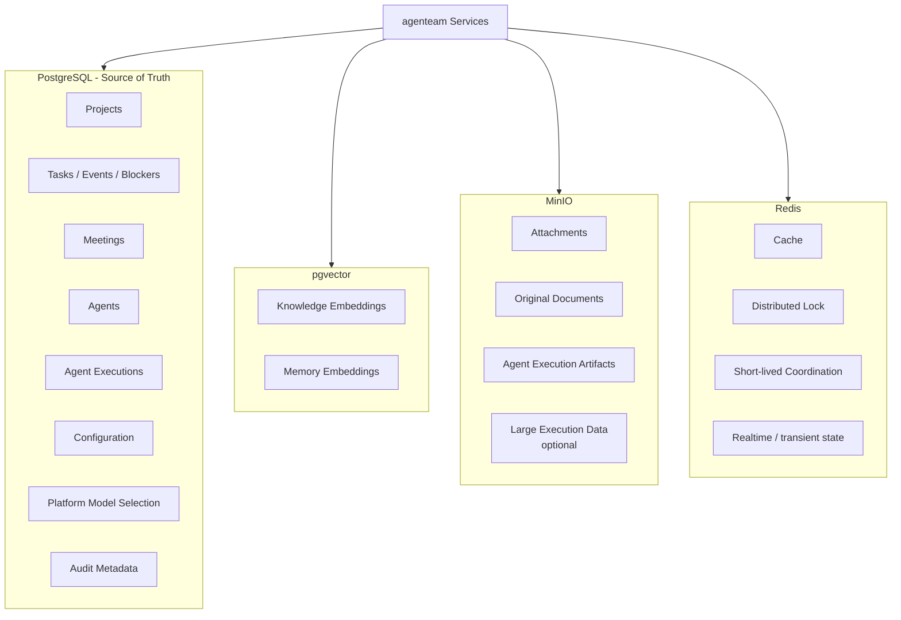
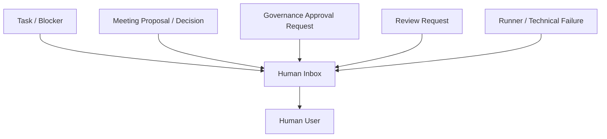
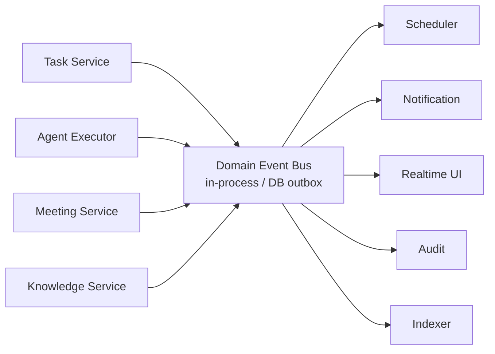
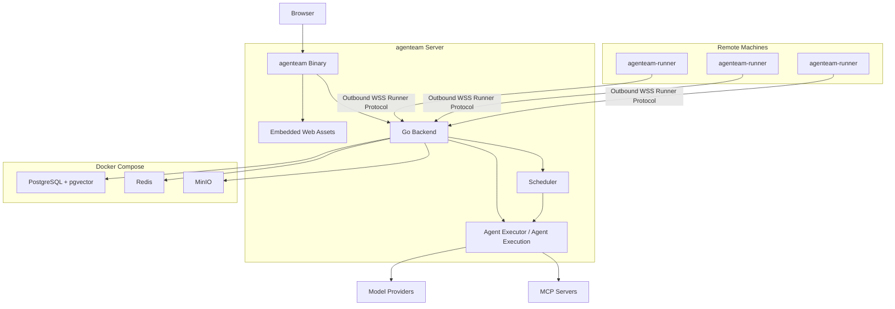

# 平台基础设施与部署架构

## 1. 模块范围

本模块描述跨业务领域的公共平台能力：

- Model Management；
- PostgreSQL / pgvector；
- MinIO；
- Redis；
- Authentication / Authorization；
- Approval / Audit；
- Human Inbox；
- Internal Events；
- Agent Executor / Agent Execution；
- 部署拓扑。

这些能力为 Project、Task、Meeting、Agent、Tool 等业务模块提供基础设施，并承载统一的 Agent 执行能力。

## 2. Model Management

系统允许接入多个 Provider 和多个 Model。

模型配置分两级：

- 系统级；
- 项目级。

所有 enabled 的系统级 chat Model 对所有 Project 可见。Project 也可以配置自己的 chat Model；在模型选择 UI 中，两类 chat Model 应明确区分来源。第一阶段不增加 System chat Model 的 Project allowlist。

非 chat Model 属于平台内部基础能力：

- embedding；
- reranker；
- image generation。

第一阶段这些类型只能由系统级 Provider 配置，Project Provider 不允许创建非 chat Model。

Provider 配置至少包含：

- name；
- base-url；
- protocol；
- credentials；
- models。

一个 Provider 固定使用一种 Protocol；同一外部服务如果需要通过不同 Protocol 接入，应配置为不同 Provider，而不是由 Model 覆盖 Protocol。

Model metadata 至少可以包含：

- model-id；
- type；
- parameters；
- request overwrite；
- header overwrite。

其中 parameters 由具体 Model type 定义。例如 chat Model 可以包含 context-length、max-output 和 capabilities，其中 capabilities 可声明 reasoning 以及可选的 reasoning_efforts；embedding、reranker、image generation 等类型可以拥有不同的参数结构，并不要求存在 capabilities。

模型类型可包括：

- chat；
- image generation；
- embedding；
- reranker；
- 后续其他类型。

平台另外保存三个只引用既有 System Model 的用途 selector：

~~~text
PlatformModelSelection
├── embedding_model_ref
├── reranker_model_ref?
└── image_generation_model_ref?
~~~

其中：

- `embedding_model_ref`：Knowledge / Memory 使用的 embedding Model；
- `reranker_model_ref`：Knowledge / Memory 可选的 reranker Model，可以为空；
- `image_generation_model_ref`：Builtin 图片生成 Tool 使用的 image_generation Model，可以为空。

三个 selector 都是平台级配置，不支持 Project override，也不在 selector 中重复配置 Model 参数。

Agent Loop 只直接消费 chat Model，并通过统一 Model Adapter 调用模型，而不是让 Agent Management 或业务模块直接适配每家 Provider。embedding / reranker 由 Knowledge / Memory 内部消费；image_generation 由 Builtin image generation Tool 消费。

第一阶段 Chat Provider Adapter 只实现：

- OpenAI Chat Completions / OpenAI-compatible；
- Anthropic Messages。

Provider / ModelConfig 支持物理删除。删除仍被 Agent 引用的 chat Model 时，必须先在用户确认流程中选择替代 Model，并批量更新受影响 Agent；删除被 PlatformModelSelection 引用的平台 Model 时，必须先替换对应 selector，或在 reranker / image generation 场景清空 optional selector。Provider 只有在其 Models 已全部删除后才能删除。

历史 Agent Execution / Model Invocation Usage 不阻止配置删除：live Provider / Model 外键可以通过 `ON DELETE SET NULL` 置空，但历史记录必须保留调用时的 Provider / Model snapshot。

Provider、Model 配置、Capability、Model Resolver、统一 Model Adapter 与模型调用契约的详细设计见 [Model System 详细设计](../design/platform-infrastructure/model-system.md)。模型调用 Token Usage 的持久化与按 Project / Agent / Model / Provider 统计见 [Model Token Usage 详细设计](../design/platform-infrastructure/model-token-usage.md)。

## 3. 存储职责



### PostgreSQL

PostgreSQL 是业务 Source of Truth。

包括：

- Project；
- Task；
- Task Event；
- Task Blocker（including rely_on）；
- Meeting；
- Agent；
- Agent Execution；
- Approval；
- Runner metadata；
- Model config；
- Platform Model Selection；
- Model invocation usage；
- Audit metadata。

### pgvector

用于派生向量索引：

- Knowledge embedding；
- Agent Memory embedding。

向量索引可以从 canonical data 重建。

### MinIO

适合保存：

- attachment；
- 原始上传文件；
- Agent Execution artifact；
- 大体积导出结果；
- 可选的大型日志对象。

数据库保存 metadata 与 object reference。

### Redis

用于可丢失、可恢复或短生命周期状态：

- cache；
- realtime / pubsub；
- short-lived locks；
- scheduler coordination；
- lease acceleration。

Redis 不应成为无法重建的业务事实唯一存储。

## 4. Governance

随着 Agent 获得项目写能力，Governance 应作为正式平台能力。

至少包括：

- authentication；
- Project Owner boundary；
- 平台固定安全规则与 Project / Resource scope；
- Agent capability；
- Approval；
- secret management；
- audit。

最终权限校验必须发生在服务端。

## 5. Human Inbox

长期运行的 Agent Team 需要一个统一的人类待处理入口，而不能要求用户逐个打开 Task / Meeting / Runner 页面寻找阻塞。

Human Inbox 可以聚合：

- waiting_for_human；
- meeting proposals；
- pending decision requests；
- pending approval requests；
- review requests；
- technical blockers；
- Runner failures；
- 其他需要用户介入的事项。



Human Inbox 是统一的**人类待处理聚合视图**，不是这些业务对象的新 Source of Truth。

特别是 Agent Execution 在执行过程中产生的权限审批需求，应由 Security / Governance 创建并持久化 Approval Request。Human Inbox 负责把 pending Approval Request 聚合给用户处理，而不是自己保存另一套审批状态。

因此：

```text
Agent Execution / Tool Authorization
  -> Governance Approval Request
      -> Human Inbox
          -> Human User
```

Approval Request 可以关联：

- project；
- agent；
- source execution；
- tool / action；
- resource / scope；
- Task / Meeting 等业务来源。

如果审批来自 Meeting，Meeting Timeline 可以引用并展示同一个 Approval Request；如果审批来自 Task Execution，也可以从 Task / Execution 页面跳转到同一个 Approval Request。不同 UI 入口不能各自复制一套审批状态。

## 6. Internal Domain Events

业务模块之间建议使用轻量 Domain Event 机制降低耦合。

第一阶段不需要引入 Kafka 等独立消息基础设施，可以采用：

- in-process event bus；
- PostgreSQL outbox；
- 需要时结合 Redis 做 realtime fan-out。



典型事件：

- TaskCreated；
- TaskStateChanged；
- BlockerAdded / Resolved；
- AgentExecutionStarted / Finished；
- ReviewRequested / Finished；
- MeetingRequested / Approved；
- DecisionRequested / Answered / Skipped；
- ApprovalRequested / Approved / Rejected；
- DocumentUpdated；
- RunnerConnected / Disconnected。

Domain Event 不能代替业务事务本身。需要强一致的状态变化仍在对应服务事务中完成。

## 7. Audit

Audit 与 Task Event / Execution Log 是不同层次。

~~~text
Task Event
= Task 的业务状态发生了什么

Execution Log
= Agent Execution 实际运行了什么

Audit
= 谁以什么权限执行了什么敏感操作
~~~

Audit 采用 append-oriented 结构化记录，第一阶段不自动过期，不复制完整运行日志。

完整数据模型、retention、查询、分页、索引和关联方式见 [Audit 详细设计](../design/security-governance/audit.md)。

## 8. Project Environment Variables 与 Secret Management

Project 可以配置两类 Environment Variable：

~~~text
Project Environment Variables
├── Variable
└── Secret
~~~

每个变量至少包含：

- name；
- description；
- type；
- value。

普通 Variable：

- 对当前 Project 的所有 Agent 可见；
- name / description / value 可以进入 AgentExecutionContext 和 Prompt；
- 执行 Runner command / process 时可以作为普通环境变量注入。

Secret Variable：

- value 加密存储；
- 保存后普通读取接口不返回明文；
- 只有被 Project Owner 加入当前 Agent Secret Variable 白名单的 Secret 才能被该 Agent 使用；
- AgentExecutionContext 和 Prompt 只包含允许使用的 Secret name / description，不包含 Secret value；
- Secret value 只在具体执行后端需要时解析和临时注入。

执行后端应让 Tool arguments 尽量保持环境变量引用，例如：

~~~text
$GITHUB_TOKEN
~~~

而不是把 Secret value 展开后写入 Tool Call。

已解析 Secret 进入 stdout / stderr / Tool Result 路径时，需要在持久化和回传前进行已知 Secret value masking。

Masking 只用于降低意外泄漏风险，不构成针对主动编码、拆分 Secret 等行为的严格数据防泄漏边界。

Model Provider API key、Runner enrollment / device credential 等系统级 Secret 仍属于平台自身 Secret Management，不因为 Project Environment Variables 的存在而变成 Project 变量。

Project Environment Variables 的详细数据模型、Agent 白名单、Prompt 注入和执行期注入见 [项目变量与 Secret 详细设计](../design/project-work-management/project-environment-variables.md)。

## 9. 部署架构



Runner 连接始终由远端 agenteam-runner 主动向 Central 建立出站 WSS Control Channel；Central 不需要能够反向访问 Runner。设备注册、认证、RPC、heartbeat、重连和可选 Data Channel 的完整设计见 [Runner 架构](./runner.md)。

第一阶段推荐：

```text
Single Control Plane
  + PostgreSQL / Redis / MinIO
  + Multiple Remote Runners
```

agenteam Central 的后端作为一个整体后端部署和运行。

Project、Task、Meeting、Agent、Tool、Runner Management 等领域边界用于组织后端内部职责，体现在：

- package / module；
- service interface；
- database ownership conventions；
- event contract；
- tool/service boundaries。

这些领域边界不对应独立部署单元。
