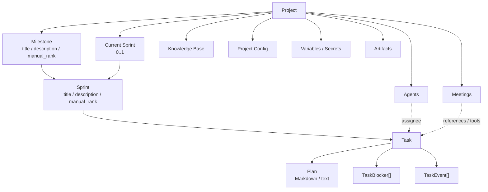
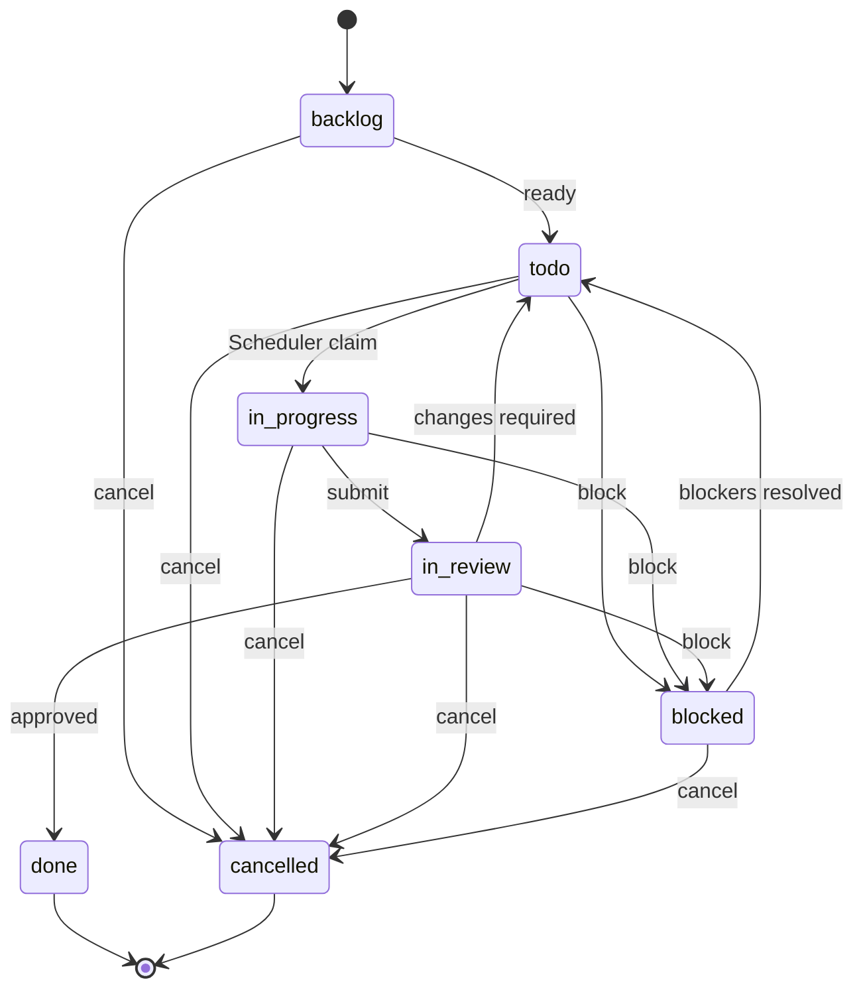

# 项目与工作管理架构

> 详细设计：
> - [Task Domain Model](./task-domain-model.md)
> - [Task State Machine](./task-state-machine.md)
> - [Task Blocker / Dependency](./task-blocker-dependency.md)
> - [Task Event Timeline](./task-event-timeline.md)
> - [Sprint Lifecycle](./sprint-lifecycle.md)
> - [项目变量与 Secret](./project-environment-variables.md)

## 1. 模块职责

Project / Work Management 负责组织一个项目中的长期工作状态与规划上下文。

核心对象：

- Project；
- Milestone；
- Sprint；
- Task；
- Task Plan；
- Task Blocker；
- Task Event。

固定工作层级：

```text
Project
└── Milestone
    └── Sprint
        └── Task
```

Milestone / Sprint 不只是展示层级，也是 Task 的业务上下文边界。Task 不允许脱离这两级规划结构独立存在。

## 2. 领域关系



图中的关联表示业务关系，不表示模块之间必须直接调用。Meeting、Scheduler、Agent 等对 Task 的修改都必须经过统一 Task Domain。

## 3. Project Variables

Project Variables 是 Project 的长期配置对象，分为普通 Variable 和 Secret。

- 普通 Variable 对 Project 内所有 Agent 可见；
- Secret 需要在 Agent 配置中显式授权；
- AgentExecutionContext 只向 Model 暴露允许暴露的 projection；
- Secret value 不进入 Model Context；
- Central 在真正执行 command / process 时按需解析并注入 Runner。

完整设计见 [项目变量与 Secret](./project-environment-variables.md)。

## 4. Project Meeting Config

Project Config 第一阶段至少保存：

```text
meeting_summary_model_ref
```

用于 Meeting Rolling Summary Generator，不继承某个 Agent 的 model / capability。

Model 解析见 [Model System](../platform-infrastructure/model-system.md)，Meeting Summary 见 [Meeting Context & Summary](../meeting/meeting-context-summary.md)。

## 5. Task

Task 是项目中最小的可调度工作单元。

canonical model 至少包含：

```text
id
project_id
milestone_id
sprint_id
title
description
type
priority
state
assignee_agent_id?
plan
manual_rank
version
```

固定 type：

```text
feature | bug | task | spike | chore
```

固定 priority：

```text
low | medium | high | critical
```

`manual_rank` 的正式 scope 是 `sprint + state + priority`，采用 fractional indexing / LexoRank 类字符串 rank。

Task 使用显式 `version` 做 optimistic concurrency。

完整字段、排序、create / update / move / delete、幂等和查询 contract 见 [Task Domain Model](./task-domain-model.md)。

## 6. Task State Machine

canonical state：

```text
backlog
todo
in_progress
in_review
blocked
done
cancelled
```



关键约束：

- 所有 Task 都必须经过 review 才能进入 done；
- `todo / in_progress / in_review` 必须有当前 Project 内合法 assignee；
- assignee 只允许 Project Agent，用户不是 assignee；
- `blocked` 在事务提交后必须至少有一个 unresolved blocker；
- `done / cancelled` 是冻结终态，不 reopen；
- 所有 state transition 统一通过 Task State Machine；
- Agent-facing 状态入口统一为 `transfer-task(target_state = ...)`。

完整 transition matrix、reviewer handoff、comment requirement、blocked recovery 与 transaction contract 见 [Task State Machine](./task-state-machine.md)。

## 7. Task Blocker / Dependency

Blocker 是正式领域对象，不是字符串字段。

第一阶段核心类型：

```text
rely_on
waiting_for_human
waiting_for_meeting_approval
technical
user_cancelled_execution
```

Task dependency 不建立第二套实体，而是：

```text
TaskBlocker
type = rely_on
metadata.related_task_id = ...
```

`rely_on` 只有在 related Task = done 时才自动满足。related Task = cancelled 时 blocker 保持 unresolved，不自动取消依赖 Task，也不自动改 blocker 类型。

Scheduler 只自动处理具有确定性解除规则的 blocker。自动 resolve 最后 blocker 与 `blocked -> todo` 必须在同一 reconciliation transaction 中完成。

完整 Blocker schema、cycle detection、resolution 与 dependency 规则见 [Task Blocker / Dependency](./task-blocker-dependency.md)。

## 8. Task Event Timeline

Task 使用 GitHub Issue 风格统一 Timeline。

`TaskEvent` 是单条持久化业务事件；`Task Event Timeline` 是 TaskEvent 按时间排序后的用户可见 read model。

第一阶段事件至少包括：

```text
task_created
fields_updated
state_changed
assignee_changed
task_moved
blocker_added
blocker_resolved
comment
```

领域事实 append-only；普通 comment 允许编辑与软删除。

一次领域命令产生多个事实时，各自写独立 TaskEvent，并共享 `operation_id / correlation_id`。

TaskEvent 与 Task mutation 同事务写入，但与 Internal Domain Event / Outbox 分离。Task Domain 一旦产生 Domain Event，该 Event 必须与业务状态在同一 PostgreSQL transaction 中写入统一 Outbox。

Agent Execution Runtime View、Tool Call、Execution lifecycle 不复制成 TaskEvent。

完整设计见 [Task Event Timeline](./task-event-timeline.md)。

## 9. Milestone 与 Sprint

Milestone 第一阶段只作为规划与上下文容器，不建立独立 lifecycle。

Milestone 与 Sprint 都使用显式 `manual_rank`。

Project 通过：

```text
current_sprint_id?
```

持有唯一 Current Sprint。

Sprint lifecycle：

```text
planned -> current -> completed
```

Scheduler 只调度 Current Sprint 中的 Task。

完成 Current Sprint 时：

- active Task Execution / pending SchedulerDispatch 必须清空；
- done / cancelled 留在历史 Sprint；
- 其他 unfinished Task rollover 到另一个 planned Sprint；
- rollover 保留 Task state / assignee / plan / blockers；
- completed Sprint membership 冻结；
- complete 不自动 start 下一 Sprint。

完整设计见 [Sprint Lifecycle](./sprint-lifecycle.md)。

## 10. Task Domain Operations

普通字段、结构位置、状态流转、Blocker 使用不同领域入口：

```text
list-tasks           # 列表 / filter query，projection 包含 version
read-task            # 精确读取 canonical Task + version
list-task-events     # 分页读取 Timeline
create-task          # 新建 Task，默认 backlog
update-task          # 普通字段
update-task-plan     # Plan adapter；Domain 仍视为普通字段
move-task            # Sprint / Milestone membership
delete-task          # 仅允许纯 backlog 草稿；当前不作为 Agent-facing Tool
transfer-task        # state transition
list-task-blockers
add-task-blocker
resolve-task-blocker
comment-task
```

所有 mutation 共享：

- Project scope authorization；
- request / operation idempotency；
- Task version concurrency contract（适用时）；
- TaskEvent transaction contract。

Tool 只是 Domain command adapter，不拥有一套重复业务规则。

## 11. Task Context

Agent 启动 Task Execution 时，Task Context 默认提供：

- Task 当前字段（包含 version）；
- Milestone / Sprint title、description；
- Plan；
- unresolved blockers；
- 最近有限数量 TaskEvents。

更早 Timeline 由 `list-task-events` Tool 按需读取。

历史 Agent Execution Runtime View / transcript 不自动复制进 Task Context，需要时按 Execution Source of Truth 查询。

## 12. Tasks 页面与 Query

Tasks 页面当前包含：

### Explore View

按 `Milestone -> Sprint -> Task` 展示工作树。

### Kanban View

按 Task state 展示同一套 Task 数据。

两者不是独立业务模型。

Domain query contract 提供 `read-task(task_id)` 精确读取，并保证 `read-task / list-tasks` projection 都返回 Task.version；列表查询至少支持 state、priority、type、assignee、milestone、sprint、text filter，以及 pagination / stable sort。

前端筛选器布局、交互状态不属于 Work Management Domain。

## 13. 第一阶段明确不做

- Project / Milestone / Sprint / Task due date / start date；
- Task labels / tags；
- parent / subtask；
- related / duplicate 等通用 TaskRelation；
- Milestone 独立 lifecycle；
- Task terminal reopen。

这些能力以后可以在真实需求出现后扩展，不提前污染当前状态机与 Scheduler contract。

## 14. 模块边界

### Scheduler

读取 Task Source of Truth、执行 claim / reconciliation，但不拥有 Task 状态机。

### Agent Executor

通过 TaskContextProvider 构造 Trigger Context，不复制 Task Domain。

### Tool System

Builtin Tool 调用 Work Management Domain command，不重新实现业务规则。

### Meeting

Meeting 对 Task 的读取 / 修改仍通过统一 Tool 与 Work Management Service。

### Platform Events

TaskEvent 是用户 Timeline；Internal Domain Event / Outbox 是模块集成机制，两者职责分离。

所有 Domain Event 的 envelope、transactional outbox、at-least-once delivery、Handler 幂等与 retry 统一遵循 [Internal Domain Events](../platform-infrastructure/internal-domain-events.md)。
