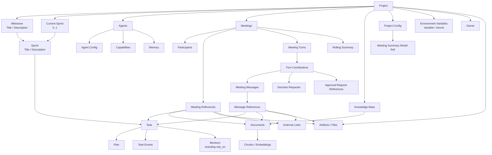
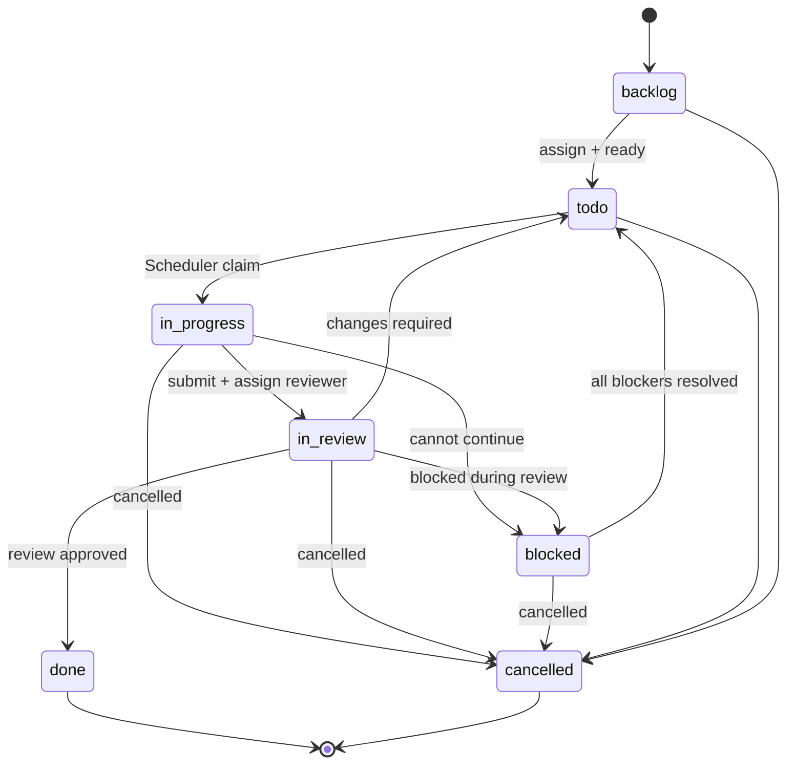
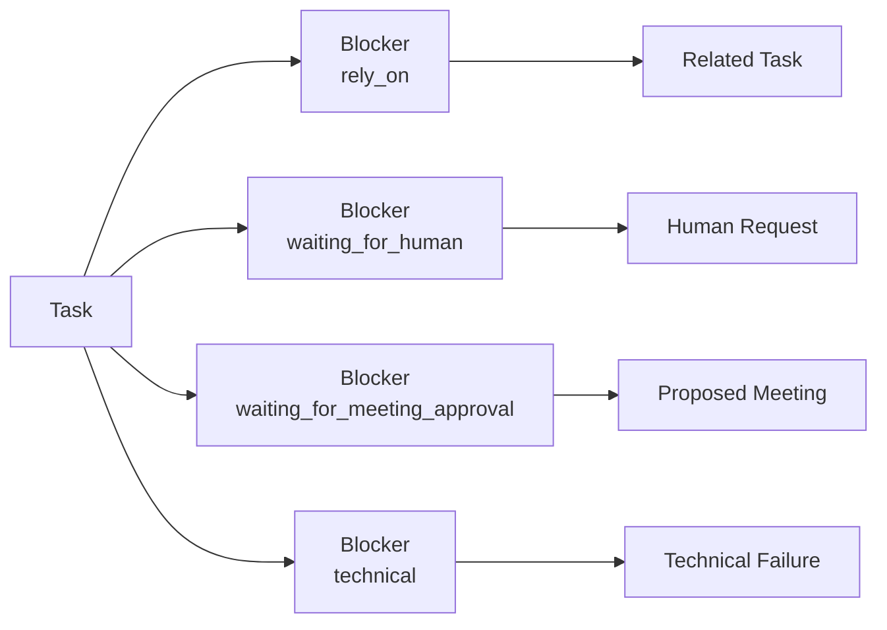

# 项目与工作管理架构

> 详细设计：
> - [Sprint Lifecycle](./sprint-lifecycle.md)
> - [项目变量与 Secret](./project-environment-variables.md)

## 1. 模块职责

项目与工作管理模块负责组织一个项目中的长期工作状态。

核心对象包括：

- Project；
- Milestone；
- Sprint；
- Task；
- Task Plan；
- Task Event；
- Task Blocker。

Milestone 和 Sprint 不只是展示或统计层级，也是 Task 的任务上下文边界。

每个 Milestone 和 Sprint 都应至少包含 `title` 与 `description`，用于描述当前阶段目标、范围和约束。Task 必须归属于某个 Sprint，且该 Sprint 必须归属于某个 Milestone，因此每个 Task 在逻辑上都同时处于明确的 Milestone / Sprint 上下文中，不允许存在脱离这两级规划结构的孤立 Task。

## 2. 项目领域模型



图中的关联表达业务关系，不表示模块之间必须直接调用。例如 Meeting 对 Task 的变更仍通过统一 Tool 和业务服务完成。

### 2.1 Project Variables

Project Variables 是 Project 的长期配置对象，分为普通 Variable 和 Secret。

- 普通 Variable 对 Project 内所有 Agent 可见；
- Secret 需要在 Agent 配置中显式授权；
- Variable / Secret 都包含 description；
- AgentExecutionContext 负责生成 Model 可见视图；
- Central 在执行期解析实际值，并按需注入 Runner / MCP 等执行后端。

远端 Runner 不主动读取 Project 配置或 Secret Store，而是在执行 command / process 时由 Central 通过 Runner Protocol 临时下发本次进程所需的 environment。

完整数据模型、Agent 白名单、Prompt 注入、跨设备 Runner 传输和 Secret 生命周期见 [项目变量与 Secret 详细设计](./project-environment-variables.md)。

### 2.2 Project Meeting Config

Project Config 负责保存 Meeting 运行所需的项目级配置。

第一阶段至少包含：

```text
ProjectConfig
└── meeting_summary_model_ref
```

`meeting_summary_model_ref`：

- 必填；
- 引用当前 Project 可见的 enabled chat Model；
- 可以选择 enabled System chat Model；
- 也可以选择当前 Project Provider 下的 enabled chat Model；
- 只用于 Meeting Rolling Summary Generator；
- 不继承某个 Agent 的 `model_ref`；
- 不配置 Agent Capability / Tools；
- 不配置 reasoning effort。

Project 配置页面对应：

```text
Meeting
└── Summary Model
```

Summary Model 的解析、删除替换和调用边界见 [Model System 详细设计](../platform-infrastructure/model-system.md)；Rolling Summary 生成流程见 [Meeting Context & Summary](../meeting/meeting-context-summary.md)。

## 3. Task

Task 是项目中最小的可调度工作单元。

Task 必须具有明确的 Milestone 与 Sprint 归属。创建或移动 Task 时，目标 Sprint 必须属于目标 Milestone，服务端需要保证层级关系一致。

至少包含：

- `id`：项目内唯一；
- 所属 `milestone`；
- 所属 `sprint`；
- `title`；
- `state`；
- `priority`；
- `manual_rank`；
- `type`；
- `description`；
- `assignee`；
- `plan`；
- `blockers`；
- 关联的 `events`。

建议的类型：

- feature；
- bug；
- task；
- spike；
- chore。

建议的优先级：

- low；
- medium；
- high；
- critical。

`manual_rank` 用于同一个 `sprint + state + priority` 分组内的稳定手工排序。前端可以拖拽调整，后端 Scheduler 与 Tasks View 使用同一套顺序。建议使用 fractional rank / 可插入排序键，避免普通拖拽导致整组 Task 大量重排。

## 4. Task 状态机

所有 Task 都必须经过审核才能完成。

因此 `done` 只能从 `in-review` 进入，`in-progress -> done` 是非法状态流转。



约束：

- `backlog`、`done`、`cancelled` 不要求 assignee；
- 其他可执行或等待执行的状态必须具有明确 assignee；
- `done` 是审核后的终态，不允许普通工作阶段的 Agent 将 `in-progress` 直接标记为 `done`；
- `assignee` 表示当前阶段负责该 Task 的 Agent，而不是永久 owner；
- 执行 Agent 完成本轮工作并将 Task 从 `in-progress` 提交到 `in-review` 时，必须同时选择并指定下一阶段的 reviewer assignee；
- reviewer 的选择由当前执行 Agent 根据项目 `AGENTS.md`、Agent 描述、能力信息和当前任务内容决定，Scheduler 不替它选择；
- `in-review` 且具有 assignee 的 Task 可以继续由同一个 Scheduler 自动调度审核；
- reviewer 审核通过后将 Task 置为 `done`；如果要求修改，则将 Task 返回 `todo` 并指定下一轮执行 assignee；如果无法继续，则进入 `blocked`。

Task 的普通字段、结构位置和状态流转通过不同领域操作处理：

- 普通字段修改使用 `update-task`；
- 移动到其他 Sprint 使用 `move-task`，目标 Milestone 由 Sprint 归属自动确定；
- 更新 Plan 使用 `update-task-plan`；
- Task 状态流转统一使用 `transfer-task`。

`transfer-task` 由 Agent 根据当前实际工作结果决定目标状态，并可以同时提交下一阶段 assignee、comment，以及进入 `blocked` 时需要增加的 blocker。

Tool 本身不重复编码 `in-progress -> in-review`、`in-review -> done` 等规则。所有合法流转、必要字段和领域约束都由 Task 状态机在服务端统一判断；不合法的请求必须拒绝并返回明确错误原因。

例如，执行 Agent 完成本轮工作时可以请求转入 `in-review` 并指定 reviewer；reviewer 完成审核后可以根据结果请求进入 `done`、返回 `todo` 并指定下一轮 assignee，或进入 `blocked` 并增加 blocker。

## 5. Plan

`plan` 是当前 Task 的执行计划和完成情况。

它主要用于 Agent 和用户理解工作拆解，不作为独立调度单元。Agent 可以在权限允许的情况下更新 plan。

如果后续需要把计划条目独立调度，应创建新的 Task，而不是把 plan item 隐式升级成 Scheduler 任务。

## 6. Task Event Timeline

Task 使用统一事件时间线，而不是分别维护“评论列表”和“状态历史”。

事件类型至少包括：

- `comment`；
- `state_changed`；
- `assignee_changed`；
- `blocker_added`；
- `blocker_resolved`；
- 后续可增加 `review_started`、`review_finished` 等审核事件。

Task Event 只记录 Task Domain 自身的业务事实，不复制 Agent Execution lifecycle。

Task 页面如果需要展示该 Task 触发过的 Agent Execution，直接通过：

```text
trigger_type = task
trigger_reference = task_id
```

查询 Agent Execution 历史。

完整 execution log、Runtime View、Tool Call 等仍归 Agent Execution / 对应运行模块所有。

## 7. Task Blocker

Task Dependency 不再作为独立领域对象存在。Task 之间的依赖统一表示为一种 Blocker：

```text
Blocker
  type = rely_on
  related_task_id = ...
```

这样 Task 只维护一套阻塞模型，同时仍保留依赖关系需要的图约束和自动解除语义。



Blocker 不应只是 Task 上的一个字符串字段。至少需要：

- blocker 类型；
- 说明；
- 关联对象 ID；
- 创建时间；
- 解除时间；
- 创建者或来源。

一个 Task 可以同时具有多个 blocker。

只有所有 blocker 都解除后，Task 才能重新进入 `todo`。

对于 `rely_on` blocker，服务端必须执行额外约束：

- related Task 必须存在；
- Task 不能依赖自身；
- 创建 / 修改依赖关系时检查循环依赖；
- 前置 Task 满足条件后，Scheduler 可以自动解除对应 `rely_on` blocker。

当前置 Task 被取消时，不应隐式认为 `rely_on` 已经满足。后续可以通过项目策略决定：

- 将当前 Task 转为等待用户决策；
- 取消当前 Task；
- 替换依赖；
- 其他显式处理。

## 8. Milestone 与 Sprint

层级关系：

```text
Project
  -> Milestone
      -> Sprint
          -> Task
```

Milestone 和 Sprint 都应至少包含：

- `title`；
- `description`。

Project 额外保存：

```text
current_sprint_id?
```

一个 Project 同一时间最多只有一个 Current Sprint。

Scheduler 只调度 Current Sprint 中的 Task；如果 Project 当前没有 Current Sprint，则 Scheduler 不调度任何 Sprint 的 Task。

Sprint lifecycle 使用：

```text
planned -> current -> completed
```

Project 通过 `current_sprint_id` 持有唯一 Current Sprint。Sprint 不根据日期自动 start / complete，均通过显式领域操作完成。

完成 Current Sprint 时：

- 如果存在 active Task Execution 或 pending SchedulerDispatch，必须拒绝完成；
- `done / cancelled` Task 保留在已完成 Sprint；
- 其他未完成 Task 必须 rollover 到另一个 planned Sprint；
- complete 后不会自动启动下一 Sprint；
- completed Sprint membership 冻结并保持只读。

完整生命周期、rollover、并发锁与 Tool Contract 见 [Sprint Lifecycle 详细设计](./sprint-lifecycle.md)。

Milestone / Sprint 删除不支持强制执行：

- Milestone 仍包含 Sprint 时必须拒绝删除；
- 只有 `planned + empty` 的 Sprint 可以删除；
- Current Sprint 不能删除，只能通过 `complete-sprint` 结束；
- Completed Sprint 不允许删除；
- 服务端需要返回明确、可处理的结构化错误原因。

它们不仅服务于项目规划和进度展示，也构成 Task 的上层任务语境：

- Milestone 描述一个较大的阶段目标、交付边界和整体方向；
- Sprint 描述 Milestone 内更具体的一轮工作目标和范围；
- Task 描述该 Sprint 中可被独立调度和执行的具体任务。

因此 Task 不允许脱离 Milestone / Sprint 独立存在。Agent 执行 Task 时，当前 Milestone 与 Sprint 的 `title`、`description` 应作为基础任务上下文的一部分提供给 Agent，使其不仅理解单个 Task，还能理解当前任务所属阶段的目标、边界和项目整体位置。

Milestone / Sprint 归属是 Task 的结构性前置条件；在归属合法之后，只有 Current Sprint 中的 Task 才进入 Scheduler traversal。具体调度规则见 [Scheduler](../scheduler/README.md)。

## 9. Tasks 页面与视图

Tasks 是项目工作管理的统一页面，所有视图都基于同一套 Milestone / Sprint / Task 数据和操作能力。

当前包含两种主要 Task 展示方式：

### Explore View

按：

```text
Milestone -> Sprint -> Task
```

展示工作树，并提供搜索、筛选、排序和编辑。

### Kanban View

按照 Task 状态组织和展示同一套 Task 数据，用于观察工作流转和当前进度。

Explore 与 Kanban 只是 Tasks 页面中的不同 View，不是独立业务模块，也不存在两套任务模型。

后续可以在同一 Tasks 模型下继续扩展其他项目进度视图，例如 Timeline、Roadmap 等，而不改变底层 Work Management Domain。

所有 Tasks Views 都调用相同的 Task / Work Management Service。
