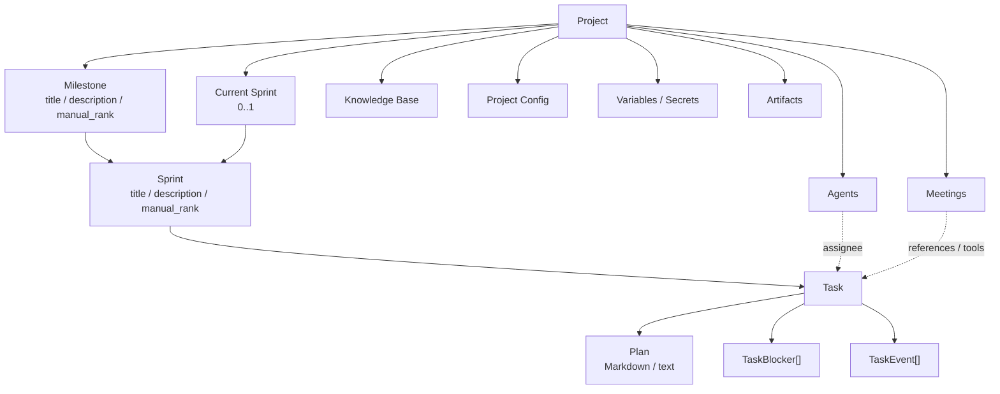
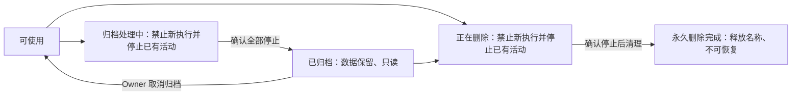
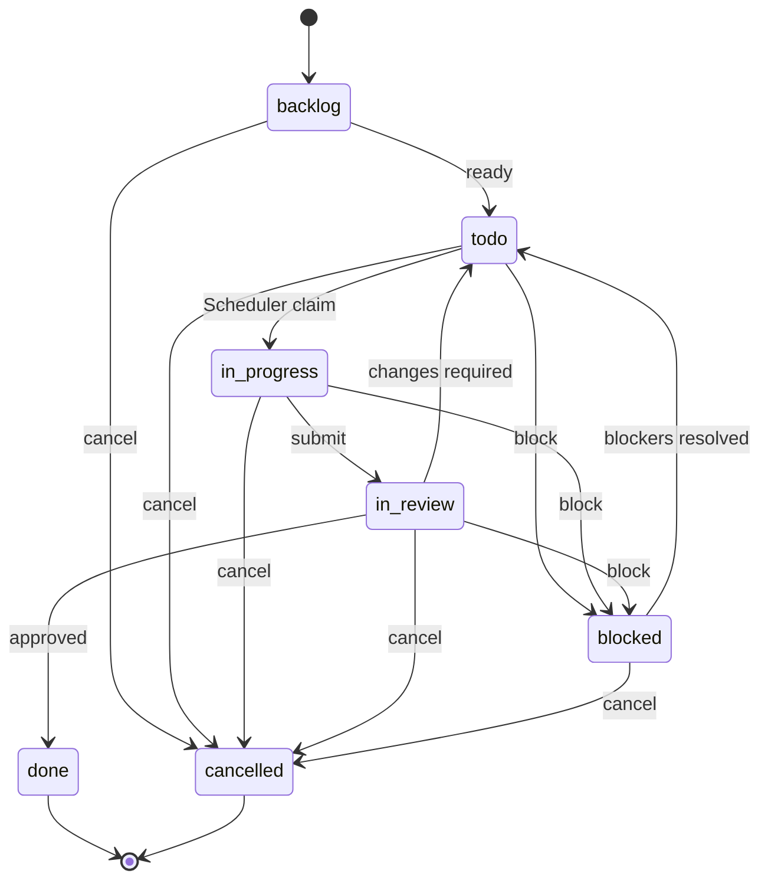

# 项目与工作管理架构

> 详细设计：
> - [Task Domain Model](./task-domain-model.md)
> - [Task State Machine](./task-state-machine.md)
> - [Task Blocker / Dependency](./task-blocker-dependency.md)
> - [Task Event Timeline](./task-event-timeline.md)
> - [Sprint Lifecycle](./sprint-lifecycle.md)
> - [项目变量与 Secret](./project-environment-variables.md)

## 1. 模块职责

Project / Work Management 负责组织一个项目中的长期工作状态与规划上下文。

核心对象：

- Project；
- Milestone；
- Sprint；
- Task；
- Task Plan；
- Task Blocker；
- Task Event。

固定工作层级：

```text
Project
└── Milestone
    └── Sprint
        └── Task
```

Milestone / Sprint 不只是展示层级，也是 Task 的业务上下文边界。Task 不允许脱离这两级规划结构独立存在。

## 2. 领域关系



图中的关联表示业务关系，不表示模块之间必须直接调用。Meeting、Scheduler、Agent 等对 Task 的修改都必须经过统一 Task Domain。

### 2.1 Project 身份与路径

Project 的 canonical 身份至少包括稳定 `id`、`owner_user_id`、名称、描述、生命周期状态与 `version`；精确字段和状态枚举由 D01/D08 规格固定。Project 只有一个 Owner，创建时由服务端绑定当前用户，不接收客户端伪造的 Owner。系统管理员身份不授予其他用户项目访问权。

同一 Owner 下项目名不重复，不同用户可使用相同项目名。项目名使用英文字母、数字、`-`、`_`、`.`，唯一性不区分大小写，标准 URL 使用小写；描述可使用中文。长度、保留字和非法路径段（如 `.` / `..`）、编码与规范化由 D08 统一校验，不把允许的字符集合等同于所有组合均合法。

项目主页为 `/{username}/{project_name}`。username 的全站唯一性和修改规则归[账号生命周期](../platform-infrastructure/authentication/account-lifecycle.md#11-username-与可读路径)。可读路径解析到稳定 User / Project ID 后，仍须服务端验证 Session 和 Project Owner；路径不意味着公开访问，也不替代不可变 ID。

Owner 可以修改自己项目的名称。用户名或项目名修改后旧链接立即失效，不维护历史别名或自动跳转；旧名称可重新使用，复用后的相同文字路径解析到新对象并重新授权。内部引用、历史关联和后台清理始终以不可变 Project ID 定位。

### 2.2 Project 归档与永久删除

Project 区分可恢复归档和不可恢复永久删除，不提供“先软删除、再另行 purge”的用户流程。以下图只表达可观察阶段，具体状态编码、命令及竞争处理在 D08 规格固定：



归档时禁止新的业务 mutation、launch/resume 及 model/tool 调用，并通过正式端口取消已有执行，确认全部停止后才进入归档状态。归档项目保留全部项目数据及 Project-scoped Audit，只读可查看，不能修改或运行；Owner 可取消归档恢复使用，已取消的 Execution 不自动重启。归档/取消归档/删除属于受控生命周期命令，不被普通业务只读门禁阻断；必要的内部停止收敛仍由事实所属模块完成。

已归档后的后台写入仅允许由正式服务身份和限定 Service cause 授权的 Outbox 投递标记、最终 Runtime 更新，以及 Inbox/Timeline 按 canonical 事实收敛。这些写入不能复活 Execution、触发新执行或修改已归档的业务内容，不能用通用服务身份绕过归档门禁。

永久删除前，Owner 输入完整当前项目路径（如 `alice/demo`）并明确确认停止执行、永久清理且不可恢复。服务端同时校验当前规范化路径、不可变 Project ID、Owner 和 `expected_version`；遇并发改名或生命周期变化时拒绝陈旧确认，不能按可复用名称误删另一个项目。路径确认不能替代 Session / CSRF / Owner 授权。

删除接受后进入可观察的处理中阶段，禁止新启动并自动取消已有项目执行。`waiting` 同样属于待停止占用；Task/Meeting 启动、SchedulerDispatch、恢复和重试须与生命周期门禁协调。取消请求已接受、Runner 断连或超时不等于实际停止；停止未知或清理失败时保留真实待处理/失败状态及可恢复进度，不宣称永久删除完成。停止不回滚外部副作用，也不自动把全部 Task 改为 cancelled。

确认停止后，通过各数据拥有者的生命周期端口清理 Project 本域及其项目数据、索引、对象和派生投影；不跨模块直接改表，不用统一数据库级联替代领域清理。必要能力未绑定或失败时不能成功结束删除。永久删除包括 Project-scoped Audit，系统级 Audit 不自动随项目删除，保留范围见 [Audit](../security-governance/audit.md#13-retention)；不把最小安全追溯解释为保留项目 Audit 副本或全平台日志抹除。

外部系统副作用和用户提供的共享挂载不能因永久删除一概递归删除；各责任模块与 Runner 资源须按正式清理矩阵处理。Runner 离线或清理结果未知时保留真实待处理状态和恢复责任，不伪报资源已清理。

归档处理中、已归档和删除处理中都继续占用当前 Owner 命名空间中的项目名；归档保持原地址，永久清理完成后才释放名称。改名后的旧名可复用规则保留，不新增历史别名。后台清理按旧 Project ID 执行，不能误作用于后来复用名称的项目。

永久删除最终完成时原子记录最小 command completion receipt，仅保留操作 ID、被删除的不可变 Project ID、原 Owner ID、幂等键哈希/请求摘要和完成时间。仅原 Owner 的有效 Session 可以查询该回执或重放原命令终态，用于确认最终提交成功但响应丢失的结果；不返回已删除项目内容。回执不保留项目名称、正文或 Project Audit 副本，不占用名称，不提供恢复 Project 的能力，也不是 soft-delete。

[D01 契约基线](../../development/work-items/d01-contracts/README.md)归位生命周期端口、Service cause、完成回执及门禁矩阵，已通过静态契约验收；D08 落实持久化进度、锁/幂等、归档与删除互斥、名称占用/释放和完整清理。D11/D22/D23/D24/D25 实际绑定工作占用、执行/调度/会议取消及订阅门禁。取消归档后的调度恢复、业务写入口/工具/审批规则和并发恢复须在责任模块规格验证，不将本文方向当作这些端口已经实现或验收。

## 3. Project Variables

Project Variables 是 Project 的长期配置对象，分为普通 Variable 和 Secret。

- 普通 Variable 对 Project 内所有 Agent 可见；
- Secret 需要在 Agent 配置中显式授权；
- AgentExecutionContext 只向 Model 暴露允许暴露的 projection；
- Secret value 不进入 Model Context；
- Central 在真正执行 command / process 时按需解析并注入 Runner。

完整设计见 [项目变量与 Secret](./project-environment-variables.md)。

## 4. Project Meeting Config

Meeting Rolling Summary initial/update（含首轮标题）消费系统管理员统一配置的 `platform.meeting_summary`，Project 不保存或在创建时复制该模型引用，不提供本地 override，也不继承某个 Agent 的 model / capability。

系统初始未配置不阻止 Project 创建；需要生成 Summary 时明确失败，不猜默认模型。会议配置仍遵循本领域边界，不因此新增 Project 模型初始化或本地选择器。

Model 解析见 [Model Resolution](../platform-infrastructure/model-system/model-resolution.md)，Meeting Summary 见 [Meeting Context & Summary](../meeting/meeting-context-summary.md)。

## 5. Task

Task 是项目中最小的可调度工作单元。

canonical model 至少包含：

```text
id
project_id
milestone_id
sprint_id
title
description
type
priority
state
assignee_agent_id?
plan
manual_rank
version
```

固定 type：

```text
feature | bug | task | spike | chore
```

固定 priority：

```text
low | medium | high | critical
```

`manual_rank` 的正式 scope 是 `sprint + state + priority`，采用 fractional indexing / LexoRank 类字符串 rank。

Task 使用显式 `version` 做 optimistic concurrency。

完整字段、排序、create / update / move / delete、幂等和查询 contract 见 [Task Domain Model](./task-domain-model.md)。

## 6. Task State Machine

canonical state：

```text
backlog
todo
in_progress
in_review
blocked
done
cancelled
```



关键约束：

- 所有 Task 都必须经过 review 才能进入 done；
- `todo / in_progress / in_review` 必须有当前 Project 内合法 assignee；
- assignee 只允许 Project Agent，用户不是 assignee；
- `blocked` 在事务提交后必须至少有一个 unresolved blocker；
- `done / cancelled` 是冻结终态，不 reopen；
- 所有 state transition 统一通过 Task State Machine；
- Agent-facing 状态入口统一为 `transfer-task(target_state = ...)`。

完整 transition matrix、reviewer handoff、comment requirement、blocked recovery 与 transaction contract 见 [Task State Machine](./task-state-machine.md)。

## 7. Task Blocker / Dependency

Blocker 是正式领域对象，不是字符串字段。

第一阶段核心类型：

```text
rely_on
waiting_for_human
waiting_for_meeting_approval
technical
user_cancelled_execution
```

Task dependency 不建立第二套实体，而是：

```text
TaskBlocker
type = rely_on
metadata.related_task_id = ...
```

`rely_on` 只有在 related Task = done 时才自动满足。related Task = cancelled 时 blocker 保持 unresolved，不自动取消依赖 Task，也不自动改 blocker 类型。

Scheduler 只自动处理具有确定性解除规则的 blocker。自动 resolve 最后 blocker 与 `blocked -> todo` 必须在同一 reconciliation transaction 中完成。

完整 Blocker schema、cycle detection、resolution 与 dependency 规则见 [Task Blocker / Dependency](./task-blocker-dependency.md)。

## 8. Task Event Timeline

Task 使用 GitHub Issue 风格统一 Timeline。

`TaskEvent` 是单条持久化业务事件；`Task Event Timeline` 是 TaskEvent 按时间排序后的用户可见 read model。

第一阶段事件至少包括：

```text
task_created
fields_updated
state_changed
assignee_changed
task_moved
blocker_added
blocker_resolved
comment
```

领域事实 append-only；普通 comment 允许编辑与软删除。

一次领域命令产生多个事实时，各自写独立 TaskEvent，并共享 `operation_id / correlation_id`。

TaskEvent 与 Task mutation 同事务写入，但与 Internal Domain Event / Outbox 分离。Task Domain 一旦产生 Domain Event，该 Event 必须与业务状态在同一 PostgreSQL transaction 中写入统一 Outbox。

Agent Execution Runtime View、Tool Call、Execution lifecycle 不复制成 TaskEvent。

完整设计见 [Task Event Timeline](./task-event-timeline.md)。

## 9. Milestone 与 Sprint

Milestone 第一阶段只作为规划与上下文容器，不建立独立 lifecycle。

Milestone 与 Sprint 都使用显式 `manual_rank`。

Project 通过：

```text
current_sprint_id?
```

持有唯一 Current Sprint。

Sprint lifecycle：

```text
planned -> current -> completed
```

Scheduler 只调度 Current Sprint 中的 Task。

完成 Current Sprint 时：

- active Task Execution / pending SchedulerDispatch 必须清空；
- done / cancelled 留在历史 Sprint；
- 其他 unfinished Task rollover 到另一个 planned Sprint；
- rollover 保留 Task state / assignee / plan / blockers；
- completed Sprint membership 冻结；
- complete 不自动 start 下一 Sprint。

完整设计见 [Sprint Lifecycle](./sprint-lifecycle.md)。

## 10. Task Domain Operations

普通字段、结构位置、状态流转、Blocker 使用不同领域入口：

```text
list-tasks           # 列表 / filter query，projection 包含 version
read-task            # 精确读取 canonical Task + version
list-task-events     # 分页读取 Timeline
create-task          # 新建 Task，默认 backlog
update-task          # 普通字段
update-task-plan     # Plan adapter；Domain 仍视为普通字段
move-task            # Sprint / Milestone membership
delete-task          # 仅允许纯 backlog 草稿；当前不作为 Agent-facing Tool
transfer-task        # state transition
list-task-blockers
add-task-blocker
resolve-task-blocker
comment-task
```

所有 mutation 共享：

- Project scope authorization；
- 业务 idempotency_key / operation 幂等，HTTP request_id 仅追踪；
- Task version concurrency contract（适用时）；
- TaskEvent transaction contract。

Tool 只是 Domain command adapter，不拥有一套重复业务规则。

公共版本与幂等遵循[基础契约约定](../platform-infrastructure/foundation-contracts.md)：适用修改提交 expected_version，同幂等键不同语义参数拒绝；Task 已有的幂等解析先于版本检查顺序保留。各命令精确字段由 D01/D11 规格归位。

## 11. Task Context

Agent 启动 Task Execution 时，Task Context 默认提供：

- Task 当前字段（包含 version）；
- Milestone / Sprint title、description；
- Plan；
- unresolved blockers；
- 最近有限数量 TaskEvents。

更早 Timeline 由 `list-task-events` Tool 按需读取。

历史 Agent Execution Runtime View / transcript 不自动复制进 Task Context，需要时按 Execution Source of Truth 查询。

## 12. Tasks 页面与 Query

Tasks 页面当前包含：

### Explore View

按 `Milestone -> Sprint -> Task` 展示工作树。

### Kanban View

按 Task state 展示同一套 Task 数据。

两者不是独立业务模型。

Domain query contract 提供 `read-task(task_id)` 精确读取，并保证 `read-task / list-tasks` projection 都返回 Task.version；列表查询至少支持 state、priority、type、assignee、milestone、sprint、text filter，以及 pagination / stable sort。

前端筛选器布局、交互状态不属于 Work Management Domain。

## 13. 第一阶段明确不做

- Project / Milestone / Sprint / Task due date / start date；
- Task labels / tags；
- parent / subtask；
- related / duplicate 等通用 TaskRelation；
- Milestone 独立 lifecycle；
- Task terminal reopen。

这些能力以后可以在真实需求出现后扩展，不提前污染当前状态机与 Scheduler contract。

## 14. 模块边界

### Scheduler

读取 Task Source of Truth、执行 claim / reconciliation，但不拥有 Task 状态机。

### Agent Executor

通过 TaskContextProvider 构造 Trigger Context，不复制 Task Domain。

### Tool System

Builtin Tool 调用 Work Management Domain command，不重新实现业务规则。

### Meeting

Meeting 对 Task 的读取 / 修改仍通过统一 Tool 与 Work Management Service。

### Platform Events

TaskEvent 是用户 Timeline；Internal Domain Event / Outbox 是模块集成机制，两者职责分离。

所有 Domain Event 的 envelope、transactional outbox、at-least-once delivery、Handler 幂等与 retry 统一遵循 [Internal Domain Events](../platform-infrastructure/internal-domain-events.md)。
