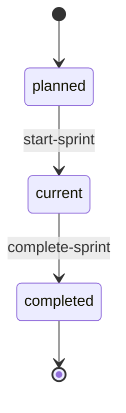

# Sprint Lifecycle 详细设计

> 上层架构：[项目与工作管理](./README.md)
>
> 相关架构：
> - [Scheduler](../scheduler/README.md)
> - [统一工具系统](../tool-system/README.md)
> - [Task Domain Model](./task-domain-model.md)
> - [Task Event Timeline](./task-event-timeline.md)

## 1. 设计范围

本文定义 Project 中 Sprint 的生命周期与 Current Sprint contract，包括：

- Sprint lifecycle state；
- Project Current Sprint；
- start-sprint；
- complete-sprint；
- unfinished Task rollover；
- Current Sprint scope change；
- completed Sprint immutability；
- Sprint 与 Scheduler 的并发边界；
- Sprint 创建、更新、删除约束。

本文不定义：

- Milestone lifecycle；
- Sprint 自动时间计划；
- velocity / burndown / capacity estimation；
- 自动选择下一个 Sprint；
- 自动创建 Sprint。

## 2. 核心原则

Sprint Lifecycle 遵循：

1. **单 Current Sprint**：一个 Project 同一时间最多只有一个 Current Sprint；
2. **显式 Start / Complete**：Sprint 不根据日期自动启动或完成；
3. **Current Sprint 是 Scheduler scope**：Scheduler 只调度 Current Sprint 中的 Task；
4. **Task 永远属于 Sprint**：未完成工作 rollover 到另一个 Sprint，不进入脱离 Sprint 的 backlog；
5. **完成历史不可变**：Completed Sprint 及其最终 Task membership 作为历史事实保留；
6. **不自动启动下一 Sprint**：Complete 与 Start 是两个独立领域操作；
7. **切换前清空运行态**：存在 active Task Execution 或 pending SchedulerDispatch 时禁止 Complete；
8. **Sprint 状态不冗余存储**：生命周期状态由 Project.current_sprint_id 与 Sprint timestamps 推导。

## 3. Sprint Domain Model

Sprint 至少包含：

```text
Sprint
├── id
├── project_id
├── milestone_id
├── title
├── description
├── manual_rank
├── started_at?
├── started_by?
├── completed_at?
├── completed_by?
├── version
├── created_at
└── updated_at
```

Project 保存：

```text
Project
└── current_sprint_id?
```

第一阶段不额外持久化：

```text
Sprint.status
```

状态由事实字段推导。

## 4. Lifecycle State

Sprint 对外可以投影三种 lifecycle state：

```text
planned
current
completed
```

推导规则：

### 4.1 planned

```text
started_at = null
completed_at = null
Project.current_sprint_id != Sprint.id
```

### 4.2 current

```text
Project.current_sprint_id = Sprint.id
started_at != null
completed_at = null
```

### 4.3 completed

```text
completed_at != null
Project.current_sprint_id != Sprint.id
```

Completed Sprint 必须已经存在 `started_at`。

不允许存在：

```text
started_at != null
completed_at = null
AND
Project.current_sprint_id != Sprint.id
```

也就是说：

> 已经启动但尚未完成的 Sprint 必须就是当前 Project 的 Current Sprint。

## 5. 状态机



第一阶段不增加：

- paused；
- cancelled；
- archived；
- reopened。

Completed Sprint 不允许回到 current。

如果历史 Sprint 需要重新继续工作，应创建新的 Sprint 并把需要继续的工作显式移动 / 创建到新 Sprint，而不是 reopen 历史 Sprint。

## 6. Project Current Sprint

Project 通过：

```text
current_sprint_id?
```

持有 Current Sprint identity。

约束：

- 可以为 null；
- 非 null 时必须引用同 Project Sprint；
- 引用的 Sprint 必须满足 current lifecycle invariant；
- 一个 Project 不允许同时存在两个 Current Sprint。

如果：

```text
current_sprint_id = null
```

Scheduler idle，不调度任何 Sprint。

完整 Scheduler 行为见 [Scheduler Loop](../scheduler/scheduler-loop.md)。

## 7. start-sprint

领域操作：

```text
start_sprint(sprint_id, actor)
```

Agent-facing Builtin Tool：

```text
start-sprint
```

### 7.1 前置条件

必须同时满足：

1. Sprint 存在；
2. Sprint 属于当前 Project；
3. Sprint lifecycle = planned；
4. Project.current_sprint_id = null；
5. Sprint.completed_at = null。

允许启动：

- 空 Sprint；
- 已经包含 Task 的 Sprint；
- 包含 rollover 进入的 `in_progress / in_review / blocked` Task 的 Sprint。

Start 不要求：

- Sprint 必须有 Task；
- 所有 Task 都是 todo；
- Scheduler 当前 enabled。

### 7.2 事务

```text
BEGIN

lock Project scheduling row

revalidate:
  Project.current_sprint_id = null
  Sprint = planned

Sprint.started_at = now
Sprint.started_by = actor

Project.current_sprint_id = Sprint.id

COMMIT
```

Start 与 Scheduler enabled 是两个独立概念。

如果 Project Scheduler 当前 paused：

```text
start-sprint
-> Sprint becomes current
-> Scheduler remains paused
```

恢复 Scheduler 后才开始 traversal。

## 8. Current Sprint Scope Change

Current Sprint 不是冻结 scope。

在 current 状态下仍允许：

- create-task 到 Current Sprint；
- move-task 把 Task 移入 Current Sprint；
- move-task 把 Task 移出 Current Sprint；
- update Sprint title / description；
- update / transfer Task。

Scheduler 不监听这些变化。

后续 traversal 读取最新 Current Sprint Task 集合自然发现 scope change。

### 8.1 移出 Current Sprint

如果要把一个 Task 从 Current Sprint 移到 planned Sprint：

- 目标 Sprint 必须属于同 Project；
- 目标 Sprint 不能 completed；
- Task 当前不能存在 active Task Execution；
- Task 当前不能存在 pending SchedulerDispatch。

否则拒绝 move。

这样避免 Task 离开 Scheduler scope 后旧 Execution 仍继续以旧 Sprint Context 工作。

### 8.2 移入 Current Sprint

从 planned Sprint 移入 Current Sprint 后：

- Task 保留业务 state；
- manual_rank 重新放入目标 `sprint + state + priority` 分组末尾；
- SchedulerTaskRuntime / relaunch cooldown 重置；
- Scheduler 后续 traversal 根据 Task 当前 state reconciliation。

## 9. complete-sprint

领域操作：

```text
complete_sprint(
  sprint_id,
  rollover_target_sprint_id?,
  actor
)
```

Agent-facing Builtin Tool：

```text
complete-sprint
```

### 9.1 前置条件

必须满足：

1. Sprint 存在且属于 Project；
2. Project.current_sprint_id = Sprint.id；
3. Sprint.started_at != null；
4. Sprint.completed_at = null；
5. Current Sprint 中不存在任何 active Task Execution；
6. Current Sprint 中不存在任何 pending SchedulerDispatch；
7. 如果存在未完成 Task，则必须提供合法 rollover target。

其中 active Task Execution 定义为：

```text
trigger_type = task
trigger_reference in current sprint task ids
status in:
  created
  preparing
  running
  waiting
```

这里检查的是 **所有 Task-triggered active Agent Execution**，不只 Scheduler 创建的 Execution。

pending Dispatch：

```text
SchedulerDispatch.status = pending
AND task belongs to current sprint
```

只要存在任意一条：

```text
complete-sprint
-> rejected
```

用户需要等待对应 Execution / Dispatch 结束，或先显式取消 / 处理，再重新 Complete。

## 10. Completed / Unfinished Task 分类

Sprint 完成时：

### Completed Work

```text
done
cancelled
```

保留在当前 Sprint。

### Unfinished Work

```text
backlog
todo
in_progress
in_review
blocked
```

必须 rollover 到目标 planned Sprint。

不把 unfinished Task 自动改为 todo。

其业务 state 继续保留。

## 11. Rollover Target

只有存在 unfinished Task 时才要求：

```text
rollover_target_sprint_id
```

目标必须：

- 属于同一个 Project；
- lifecycle = planned；
- 不是当前 Sprint；
- 不是 completed Sprint。

目标 Sprint：

- 可以已经包含其他 Task；
- 可以属于当前 Milestone；
- 也可以属于另一个 Milestone。

如果目标 Sprint 属于不同 Milestone，rollover Task 的：

```text
sprint_id
milestone_id
```

一起切换到目标 Sprint 对应层级。

如果当前 Sprint 没有 unfinished Task：

```text
rollover_target_sprint_id
```

可以省略。

## 12. Rollover Task 规则

对每个 unfinished Task：

保留：

- Task id；
- title / description；
- type；
- priority；
- state；
- assignee；
- plan；
- blockers；
- Task Event 历史；
- dependency / rely_on 引用。

更新：

```text
sprint_id = target sprint
milestone_id = target sprint.milestone_id
manual_rank = target group tail
```

不执行：

- state reset；
- assignee reset；
- blocker reset；
- plan reset。

### 12.1 Manual Rank

manual_rank 的正式排序 scope 是：

```text
sprint_id
+
state
+
priority
```

Rollover 时，Task 进入目标 Sprint 对应分组末尾。

如果一次 rollover 同时迁移多个相同 `state + priority` Task：

> 按源 Sprint 当前 manual_rank 顺序依次追加到目标分组末尾。

从而保持这些 rollover Task 的相对顺序。

### 12.2 Scheduler Runtime Reset

对 rollover Task 删除 / 重置：

```text
SchedulerTaskRuntime
relaunch_skip_remaining
cooldown_execution_id
cooldown_purpose
```

新的 Sprint 启动后，从当前 Task 业务状态重新 reconciliation。

历史 SchedulerDispatch 和 AgentExecution 不删除、不改写 sprint_id。

## 13. complete-sprint 事务

Sprint completion 是一个 Project 级领域事务。

概念：

```text
BEGIN

lock Project scheduling row
lock Current Sprint
lock rollover target (if any)

revalidate:
  Project.current_sprint_id = Sprint.id
  no active Task Execution
  no pending SchedulerDispatch
  rollover target valid

classify Tasks:
  done / cancelled -> stay
  all others -> rollover

move unfinished Tasks
reset moved Task scheduler runtime

Sprint.completed_at = now
Sprint.completed_by = actor

Project.current_sprint_id = null

COMMIT
```

事务完成后：

- 原 Sprint = completed；
- Project 没有 Current Sprint；
- rollover target 仍然 = planned；
- Scheduler 进入 idle；
- 已迁移 Task 不会被自动执行，直到显式 start-sprint。

## 14. 与 Scheduler 的并发控制

Sprint completion 与 Scheduler Dispatch creation 必须共享同一个 Project 级数据库互斥边界。

推荐：

```text
SELECT Project ... FOR UPDATE
```

或者等价 Project scheduling lock。

以下操作必须获取同一个 lock：

- start-sprint；
- complete-sprint；
- Scheduler 创建新的 SchedulerDispatch / claim todo；
- Scheduler relaunch in_progress / in_review。

目的：

避免竞态：

```text
complete-sprint:
  checked no active / pending

                 Scheduler concurrently:
                   creates pending Dispatch

complete-sprint:
  clears current_sprint
```

共享 Project lock 后：

- complete-sprint 持锁期间 Scheduler 不能创建新的 Dispatch；
- Scheduler 持锁 claim 时 complete-sprint 会等待；
- 后获得锁的一方重新校验 current_sprint_id / active / pending。

因此：

> Complete 成功提交时可以保证旧 Current Sprint 不存在新产生的 pending Dispatch。

## 15. Complete 不自动 Start 下一 Sprint

Complete 后：

```text
Project.current_sprint_id = null
```

即使提供了 rollover target，也不会自动：

```text
target planned -> current
```

启动下一 Sprint 必须显式：

```text
start-sprint(target_sprint_id)
```

这样：

- 完成旧 Sprint；
- 迁移 unfinished Tasks；
- 启动新 Scheduler scope；

是三个清晰可解释的领域阶段。

UI 如果希望提供：

> Complete & Start Next

可以顺序调用：

```text
complete-sprint
start-sprint
```

但 Domain 不提供一个隐式组合事务。

## 16. Update Sprint

`update-sprint` 第一阶段修改：

- title；
- description。

允许：

```text
planned
current
```

拒绝：

```text
completed
```

Completed Sprint 作为历史事实进入只读状态。

如果未来确实需要历史备注，应增加独立 annotation / comment 能力，而不是重新开放 completed Sprint mutation。

## 17. Delete Sprint

`delete-sprint` 不支持 force。

### planned

只有：

```text
Sprint = planned
AND no Task
```

才允许删除。

### current

禁止删除。

必须先：

```text
complete-sprint
```

不能通过 delete 绕过 lifecycle。

### completed

禁止删除。

Completed Sprint 作为项目历史保留。

因此原有：

> Sprint 无 Task即可删除

收紧为：

> 只有 planned 且无 Task 的 Sprint 才允许删除。

## 18. Create / Move Task 与 Completed Sprint

Completed Sprint membership 冻结。

禁止：

- create-task 到 completed Sprint；
- move-task 移入 completed Sprint；
- move-task 从 completed Sprint 移出；
- complete 后再次通过普通 Task 操作改变其最终 membership。

Current Sprint 与 planned Sprint 之间允许 scope change，但仍受 active Execution / pending Dispatch 约束。

## 19. Lifecycle 与 Task Context

Agent Execution Context 中的 Sprint 信息来自 Execution preparing 时的 Snapshot。

因此一旦 Task 已存在 active Execution：

- 不能完成其所在 Current Sprint；
- 不能把该 Task移出 Current Sprint。

这样避免：

```text
Execution snapshot says Sprint A
but Task already moved to Sprint B
```

造成运行中的上下文与业务 Source of Truth 发生结构性漂移。

## 20. Lifecycle 与 Task Event / Audit

Sprint Lifecycle 不复用 Task Event。

建议通过：

- Sprint 自身 lifecycle fields；
- Platform Audit；

记录：

- start-sprint；
- complete-sprint；
- rollover target；
- actor；
- timestamp；
- rollover Task count。

Task 因 rollover 发生 Sprint / Milestone 归属变化时，通过 Task Domain 写入 `task_moved` TaskEvent，并使用 `source = sprint_lifecycle` 区分其来源。

不为 Sprint Lifecycle 建立通用 Event Sourcing。

## 21. Builtin Tool Contract

第一阶段 Sprint Tools：

```text
list-sprints
create-sprint
update-sprint
delete-sprint
start-sprint
complete-sprint
```

### start-sprint

输入：

```text
sprint_id
```

### complete-sprint

输入：

```text
sprint_id
rollover_target_sprint_id?
```

其中：

- 存在 unfinished Task 时 target 必填；
- 无 unfinished Task 时 target 可省略。

Tool 只调用 Sprint Domain Service。

生命周期约束必须由服务端 Domain 强制校验，不能依赖 Agent / UI 自觉遵守。

## 22. Error Contract

建议至少提供稳定错误码：

```text
SPRINT_NOT_PLANNED
SPRINT_NOT_CURRENT
SPRINT_ALREADY_COMPLETED
PROJECT_ALREADY_HAS_CURRENT_SPRINT
SPRINT_HAS_ACTIVE_TASK_EXECUTIONS
SPRINT_HAS_PENDING_DISPATCHES
ROLLOVER_TARGET_REQUIRED
INVALID_ROLLOVER_TARGET
COMPLETED_SPRINT_IMMUTABLE
CURRENT_SPRINT_CANNOT_DELETE
COMPLETED_SPRINT_CANNOT_DELETE
SPRINT_NOT_EMPTY
TASK_EXECUTION_ACTIVE
TASK_PENDING_DISPATCH
```

错误需要携带足够的结构化 reference，使 Agent / UI 可以继续处理，例如：

- active execution ids；
- pending dispatch ids；
- unfinished task count；
- current_sprint_id。

不把内部 stack / implementation detail 作为业务错误返回。

## 23. 不在第一阶段设计的内容

以下内容后续按需要再设计：

- Sprint duration / start_date / end_date；
- 自动按日期 start / complete；
- velocity；
- capacity；
- burndown；
- sprint goal 独立字段；
- 自动 rollover target 选择；
- 自动 start next Sprint；
- completed Sprint archive / retention；
- Sprint reopen。

第一阶段 `title + description` 足够表达 Sprint 的工作目标与范围。
