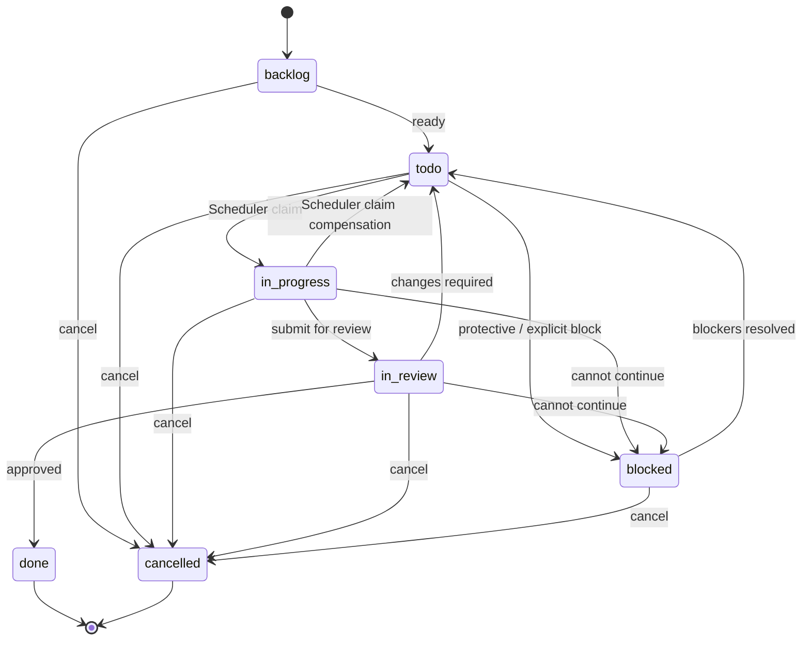

# Task State Machine 详细设计

> 状态：设计稿
>
> 上层架构：[项目与工作管理架构](./README.md)
>
> 相关设计：
> - [Task Domain Model](./task-domain-model.md)
> - [Task Blocker / Dependency](./task-blocker-dependency.md)
> - [Task Event Timeline](./task-event-timeline.md)
> - [Scheduler Task Reconciliation](../scheduler/task-reconciliation.md)

## 1. 设计范围

本文定义 Task workflow 的唯一状态机，包括 canonical state、合法 transition、assignee invariant、reviewer handoff、`transfer-task`、comment requirement、blocked recovery、Scheduler-owned transition、terminal state 与 transition transaction。

## 2. Canonical State

持久化枚举：

```text
backlog
todo
in_progress
in_review
blocked
done
cancelled
```

架构、DB、API、Tool 与事件 payload 统一使用 `in_progress / in_review` 作为 canonical machine value。前端可以渲染为 “in-progress / in-review” 等显示文案，但显示文案不进入协议或持久化枚举。

## 3. State Semantics

### 3.1 backlog

- 工作已经记录，但尚未进入自动执行队列；
- 不进入 Scheduler traversal；
- assignee 可空，也可以预先指定；
- create-task 默认 state。

### 3.2 todo

工作已经准备执行。必须：

```text
assignee_agent_id != null
AND no unresolved blocker
```

只有 Current Sprint 中的 todo 才可能被 Scheduler claim。

### 3.3 in_progress

普通执行阶段，必须有 assignee。

### 3.4 in_review

审核阶段，必须有 assignee。当前 assignee 就是 reviewer，Scheduler 不推断 reviewer。

### 3.5 blocked

Task 当前不能继续推进。事务提交后必须至少存在一个 unresolved blocker。

blocked 可以保留已有 assignee，也允许因 state inconsistency 等保护性路径暂时没有 assignee。

### 3.6 done

- 审核通过后的成功终态；
- 只能从 `in_review` 进入；
- 不进入 Scheduler；
- 不 reopen；
- 业务内容冻结。

### 3.7 cancelled

- 取消终态；
- 不进入 Scheduler；
- 不 reopen；
- 业务内容冻结。

## 4. State Machine



不存在 `in_progress -> done`。所有 Task 都必须经过 review 才能进入 done。

## 5. Transition Matrix

| Current | Target | Main actor | Required data / invariant |
| --- | --- | --- | --- |
| backlog | todo | Human / Agent | valid assignee；no unresolved blocker |
| backlog | cancelled | Human / Agent | optional comment |
| todo | in_progress | Scheduler | valid assignee；no unresolved blocker；claim contract |
| in_progress | todo | Scheduler compensation only | rare AgentBusy race after claim；restore pre-claim rank |
| todo | blocked | System / Human / Agent | at least one unresolved blocker after transaction |
| todo | cancelled | Human / Agent | optional comment |
| in_progress | in_review | Agent / Human | reviewer assignee；comment |
| in_progress | blocked | Agent / System / Human | unresolved blocker |
| in_progress | cancelled | Human / Agent | optional comment |
| in_review | done | Reviewer / Human | comment |
| in_review | todo | Reviewer / Human | next assignee；comment；no unresolved blocker |
| in_review | blocked | Reviewer / System / Human | unresolved blocker；comment |
| in_review | cancelled | Human / Agent | optional comment |
| blocked | todo | Human / Agent / Scheduler | all blockers resolved；valid assignee |
| blocked | cancelled | Human / Agent | optional comment |
| done | * | - | rejected |
| cancelled | * | - | rejected |

Main actor 只表达业务来源；最终 Authorization 仍由服务端权限系统判断。

## 6. Assignee Invariant

必须有合法 Project Agent：

```text
todo
in_progress
in_review
```

不强制非空：

```text
backlog
blocked
done
cancelled
```

Scheduler 永远不自行选择 work assignee、reviewer 或 blocked recovery assignee。

## 7. Reviewer Handoff

`in_progress -> in_review` 必须同时提供 reviewer `assignee_agent_id` 与 comment。

同一事务：

```text
Task.state = in_review
Task.assignee_agent_id = reviewer
Task.version += 1
TaskEvent(state_changed)
TaskEvent(assignee_changed)
TaskEvent(comment)
```

如果 reviewer 无效，整个 transition 拒绝。

## 8. Review Result

### 8.1 Approved

`in_review -> done` 必须提供 review comment。进入 done 后业务内容冻结。

### 8.2 Changes Required

`in_review -> todo` 必须提供 next assignee 与 review comment，目标必须满足 valid assignee + no unresolved blocker。

### 8.3 Review Blocked

`in_review -> blocked` 必须至少新增或已经存在一个 unresolved blocker，并提供 review comment。

## 9. transfer-task

Agent-facing Tool `transfer-task` 对应统一 Task Domain transition command。

概念输入：

```text
TransferTaskCommand
├── task_id
├── expected_version
├── target_state
├── assignee_agent_id?
├── comment?
├── add_blockers[]?
├── resolve_blocker_ids[]?
├── request_id
└── actor
```

`target_state` 表达调用方希望到达的状态；Domain 根据 current -> target 校验。Tool 不编码平行 workflow。

## 10. Target-state Design

第一阶段不为每个动作建立独立状态命令：

```text
submit_for_review
approve
request_changes
block_task
ready_task
```

统一由 `transfer_task(target_state = ...)` 进入 Task State Machine。

## 11. Comment Requirement

以下 transition 强制 comment：

```text
in_progress -> in_review
in_review -> done
in_review -> todo
in_review -> blocked
```

它分别承载工作结果、review 结论、修改要求或审核阻塞原因。

`backlog -> todo`、Scheduler claim 等机械 transition 不强制 comment。取消可以携带 comment / reason，但第一阶段不统一强制。

## 12. Entering blocked

任何提交为 `state = blocked` 的 transaction 结束时都必须满足：

```text
exists unresolved blocker
```

进入 blocked 可以同时创建新 blocker，也可以使用已经存在的 unresolved blocker。否则返回 `TASK_BLOCKED_WITHOUT_BLOCKER` 并回滚。

## 13. Resolving blocked

这里同时保持两个 contract：

1. committed `blocked` 永远至少有一个 unresolved blocker；
2. 自动 dependency recovery 由 Scheduler 处理，而不是 Blocker Domain 在任意 resolve 时偷偷改 state。

### 13.1 Human / Agent Explicit Recovery

Human / Agent 可以显式调用：

```text
transfer-task(
  target_state = todo,
  resolve_blocker_ids = [...],
  assignee_agent_id? = ...
)
```

同一事务内：

1. resolve 指定 blocker；
2. 如需要则更新 assignee；
3. 验证无 unresolved blocker；
4. 验证当前 assignee 合法；
5. `blocked -> todo`；
6. 写 TaskEvents；
7. commit。

因此解除 blocked 时可以顺便重新指派 assignee。

### 13.2 resolve-task-blocker Alone

独立 `resolve-task-blocker` 可以解除非最后一个 blocker。

如果 Task 当前 blocked 且目标 blocker 是最后一个 unresolved blocker，普通 resolve command 不能单独提交，因为会破坏 `blocked => unresolved blocker exists`。

返回：

```text
LAST_BLOCKER_REQUIRES_TASK_TRANSITION
```

调用方应使用 `transfer-task(target_state = todo, resolve_blocker_ids = ...)`。

### 13.3 Scheduler Automatic Recovery

Scheduler reconciliation 可以自动处理有明确解除规则的 blocker。第一阶段主要是：

```text
rely_on
AND related_task.state = done
```

Scheduler 在同一事务中：

```text
resolve auto-resolvable blocker(s)
re-check remaining blockers

if no unresolved blocker:
    if current assignee valid:
        blocked -> todo
    else:
        add technical blocker(metadata.code = state_inconsistency)
        keep blocked

write TaskEvents
increment Task.version
commit
```

Scheduler 不恢复“进入 blocked 前的 assignee”，也不选择新 assignee，只使用当前持久化值。

## 14. todo Claim

`todo -> in_progress` 是 Scheduler-owned transition。

正常流程必须先在 claim 前检查当前 assignee 的 Agent active slot。Agent 已 busy 时直接 skip：Task 保持 `todo`，不创建 SchedulerDispatch。

claim transaction 必须重新验证：

```text
state = todo
assignee exists
no unresolved blocker
task belongs to Current Sprint
no conflicting pending Dispatch
```

并原子更新 Task state / version、创建 SchedulerDispatch、写 `state_changed` TaskEvent。

### 14.1 Rare AgentBusy Compensation

claim 前的 idle check 不能替代 `AgentExecutor.launch()` 对 active slot 的原子裁决。检查后到 Launch 前，Meeting 或其他 Trigger 仍可能抢先占用同一 Agent slot。

因此保留一个仅供 Scheduler 使用的内部补偿路径：

```text
todo
-> in_progress + pending SchedulerDispatch
-> AgentExecutor.launch() returns AgentBusy
-> SchedulerDispatch = skipped(agent_busy)
-> in_progress -> todo
```

该补偿：

- 不是 Agent-facing `transfer-task` 合法流转；
- 不添加 technical blocker；
- 不要求 comment；
- 不消耗 relaunch cooldown；
- 必须恢复 claim 前保存的 `manual_rank`，避免一次纯技术竞态改变用户队列顺序；
- 必须推进 Task.version 并写一条 `state_changed` TaskEvent，`reason_code = scheduler_agent_busy_compensation`。

如果未来引入 Agent slot reservation，使“busy check + slot reservation”可以在 claim 前形成跨 Trigger 原子保证，才可以删除这条补偿路径。

## 15. Protective blocked

Scheduler 可以在明确 invariant violation 或 terminal launch failure 等场景保护性进入 blocked。

例如 assignee 缺失：

```text
add blocker(
  type = technical,
  metadata.code = state_inconsistency
)
Task -> blocked
```

或 Dispatch launch retry 最终耗尽：

```text
add blocker(
  type = technical,
  metadata.code = scheduler_launch_failed
)
Task -> blocked
```

保护性 blocked 不代表 Scheduler 负责修复业务数据。

## 16. Cancel

允许从 backlog / todo / in_progress / in_review / blocked 进入 cancelled。

cancelled 后不 reopen、不再 Scheduler dispatch、业务内容冻结。

如果 Task 当前有 active Agent Execution，业务 cancel 与 Agent Executor.cancel 的协作按 Scheduler / Agent Executor 设计处理。

## 17. Terminal Immutability

`done` 只有 `in_review -> done` 一条入口。`done / cancelled` 都不自动 reopen，不通过 update-task 修改业务内容，也不通过 move-task 改 Sprint，只允许继续追加 comment。

## 18. Atomic Transition Transaction

典型 transaction：

```text
BEGIN
lookup request_id / idempotency record
if completed same fingerprint -> replay original result
if reused different fingerprint -> IDEMPOTENCY_KEY_REUSED
load Task FOR UPDATE
verify expected_version
verify current state
verify target transition
apply blocker mutations
apply assignee mutation
apply Task state
assign new manual_rank if state group changes
Task.version += 1
insert TaskEvent(s)
persist idempotency result
insert outbox event(s) if needed
COMMIT
```

任何 invariant 失败整体回滚。

## 19. Rank on Transition

因为 manual rank scope 包含 state，普通 state change 后 Task 自动追加到目标 state group 尾部。

唯一例外是 `scheduler_agent_busy_compensation`：它必须恢复本次 claim 前的 todo `manual_rank`，不能追加到 todo 队尾。

## 20. Version 与 Idempotency

transition 必须先按 `request_id` 做 idempotency lookup：相同 request_id + 相同 request 直接返回第一次结果；相同 request_id + 不同 payload 返回 `IDEMPOTENCY_KEY_REUSED`。

只有尚未执行过的新 operation 才继续验证 `expected_version`；不匹配返回 `TASK_VERSION_CONFLICT`。

这样即使第一次 mutation 已提交但响应丢失，technical retry 也能 replay 原结果，而不会被已经递增的 Task.version 错误拒绝。不能因网络 / Tool retry 重复 state change、assignee change、blocker 或 comment。

## 21. TaskEvent

状态机产生的用户可见事实至少包括 state_changed、assignee_changed、blocker_added、blocker_resolved、comment。

同一次 transition 的多个 TaskEvent 各自独立，但共享 `operation_id / correlation_id`。

## 22. Error Contract

至少提供：

```text
TASK_STATE_TRANSITION_INVALID
TASK_VERSION_CONFLICT
TASK_ASSIGNEE_REQUIRED
TASK_ASSIGNEE_INVALID
TASK_UNRESOLVED_BLOCKER
TASK_BLOCKED_WITHOUT_BLOCKER
LAST_BLOCKER_REQUIRES_TASK_TRANSITION
TASK_TERMINAL_IMMUTABLE
COMMENT_REQUIRED
```

错误必须包含 current_state、requested_target_state、machine-readable code 与可显示 reason。

## 23. Source of Truth

Task State Machine 是 current -> target 合法性、target required data、assignee invariant、blocked invariant、comment requirement 与 terminal immutability 的唯一 Source of Truth。

Builtin Tool、Scheduler、UI API 都调用同一 Domain validation，不维护平行状态机。
