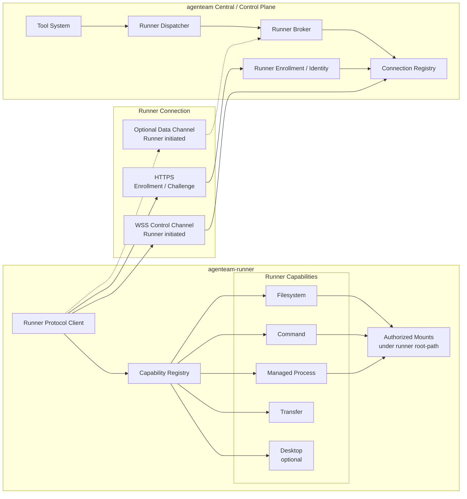
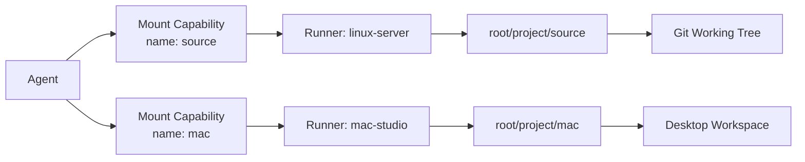
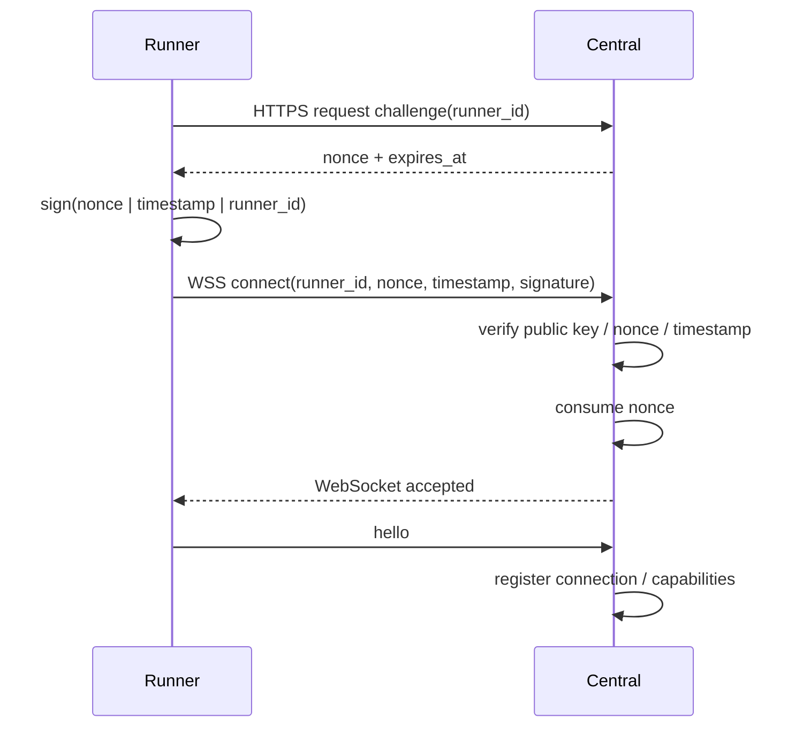
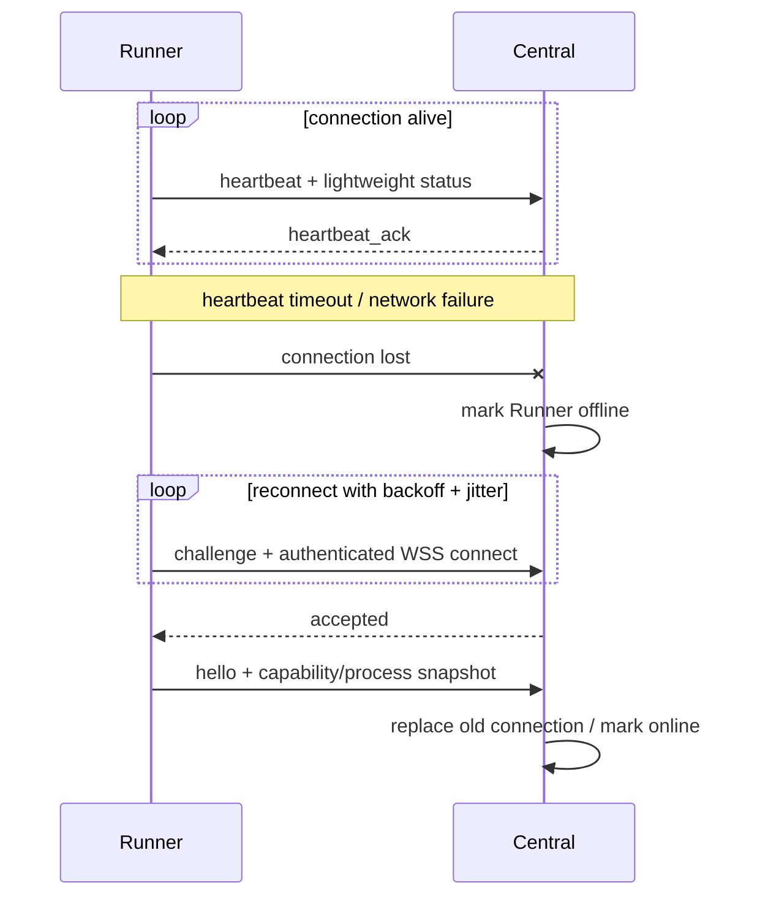
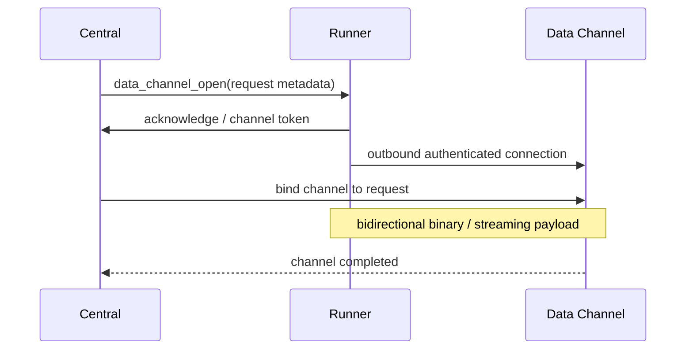

# Runner 架构

## 1. 定位

agenteam 是分布式系统。

Control Plane 负责：

- 项目管理；
- 调度；
- Agent Executor / Agent Execution；
- 模型调用；
- 权限与审计。

实际代码、命令、进程和桌面环境通过远程 Runner 提供。

Runner 是一个资源执行节点，不运行完整的 agenteam 项目协作逻辑。

## 2. Runner 架构

Runner 与 Central 之间采用 **Runner 主动出站连接** 的拓扑。

Central 不要求能够直接访问 Runner。Runner 只需要能够访问 Central 的 HTTPS / WSS，因此可以位于 NAT、家庭网络、企业内网或其他不能被公网直接访问的环境中。



Runner 与主系统之间使用 agenteam 自定义的 **Runner Protocol**，不要求使用 MCP。

Runner Protocol 负责 Central 与远程 Runner 之间的设备身份、连接维持、RPC、取消、状态同步和后续数据通道协商。

Runner 能力在 Control Plane 中被适配成统一 Runner Tools。模型和 Agent Loop 不需要感知 Runner Protocol。

## 3. Runner 配置

Runner 是系统级资源，项目不能创建任意自定义 Runner。

至少包含：

- id；
- name；
- description；
- tags；
- headless；
- root-path；
- connectivity/status；
- capabilities；
- device identity metadata；
- runner version / protocol version；
- last seen。

`headless` 表示设备是否缺少桌面环境。

Runner 的 description、headless、OS / arch、capabilities 等环境属性会进入 AgentExecutionContext 的 environment context，以便 Agent 判断可执行能力。

## 4. root-path

每个 Runner 配置一个根目录。

项目 mount point 必须位于该 root-path 下。

例如：

```text
runner root-path = /workspace

project = project-A
mount = src

actual path:
/workspace/project-A/src
```

必须防止：

- 路径穿透；
- symlink 越界；
- 系统敏感目录作为 root；
- Agent 越过 mount 操作其他项目；
- 通过 command 间接突破文件权限边界。

## 5. Agent Mount



Agent 的 mount 配置是 Agent Capability 的一部分。

每次 Agent Execution 应向 Agent Loop 暴露：

- mount name；
- Runner description；
- headless；
- logical path；
- mount description。

Agent 不应自动获得整个 Runner root。

## 6. Runner Tool 能力

Runner 的 Capability Registry 应至少能够声明以下能力组，并由 Control Plane 适配成统一 Runner Tools。

### Filesystem

- `read-file`；
- `write-file`；
- `edit-file`；
- `list-directory`；
- `grep-files`；
- `find-files`。

Filesystem Tool 必须始终在当前 Agent 被授权的 mount 范围内工作。即使 Runner 自身能够访问更大的 root-path，也不能因此扩大 Agent 的可见范围。

### Command

- `run-command`。

命令执行同样必须受到 mount / working directory / Runner policy 的限制，不能通过 shell 间接越过文件系统边界。

Central 会为当前 Agent Execution 计算可用的 Project Environment Variables：

- 所有普通 Project Variables；
- 当前 Agent 白名单允许的 Secret Variables。

`run-command` 通过独立 environment payload 接收这些变量，并注入目标 child process。

Agent 生成的 command 应尽量引用变量名，例如：

~~~text
$GITHUB_TOKEN
~~~

而不是把 Secret value 写入 command 参数或日志。

### Managed Process

- `start-process`；
- `get-process` / `read-process-output`；
- `stop-process`。

Managed Process 用于需要跨多次 Agent Tool Call 持续存在的 dev server、测试服务或调试进程。进程记录需要绑定 Runner、mount、Agent Execution 和 audit correlation 信息。

`start-process` 与 `run-command` 使用相同的 Project Environment Variables 注入规则。环境在进程创建时确定，不写入 Runner 持久化配置。

### Transfer

Runner backend 可以提供：

- `file-upload`；
- `file-download`；
- `file-transfer`。

Transfer 主要是 Runner Protocol 的数据搬运能力，不要求全部作为模型 Tool 暴露。Control Plane 可以直接使用这些能力完成 artifact、输入文件和执行结果传输。

### Desktop

仅非无头 Runner（`headless = false`）可以声明 Desktop Capability，例如：

- `screenshot`；
- `automation`；
- `browser-use`；
- `computer-use`。

Desktop Capability 不应在 headless Runner 上注册，也不应由 Tool System 假设所有 Runner 都具备。

## 7. Runner 不拥有的能力

Runner 不应实现：

- Task Scheduler；
- Project 状态机；
- Meeting；
- Agent Memory；
- Knowledge Base；
- Model Provider 管理；
- 完整 Agent Loop；
- 项目权限策略。

这些都属于 Control Plane。

## 8. Connection Topology 与传输协议

第一阶段统一采用：

```text
Enrollment / Challenge
= HTTPS

Control Channel
= WebSocket over TLS (WSS)
= JSON text frames

Optional Data Channel
= 独立的按需连接
= 用于 binary / large file / Desktop streaming 等大流量数据
```

连接始终由 Runner 主动发起：

```text
Runner
  -> HTTPS/WSS
      -> Central
```

Central 不主动向 Runner 建立 TCP / HTTP 连接。

因此部署时：

- Runner 只需要具备到 Central 的出站网络访问；
- Central 的反向代理必须支持 WebSocket Upgrade；
- Runner 不需要开放公网监听端口；
- Runner 可以处于 NAT 或私网中；
- TLS 负责 Runner 对 Central 服务端身份的验证。

第一阶段不要求 mTLS。Runner 自身身份通过后文的 Ed25519 device identity 完成。

## 9. 安装、Enrollment 与 Device Identity

Runner 采用一键安装与一次性 enrollment 流程。

### 初次安装

推荐过程：

1. 管理员在 Central 创建 Runner；
2. Central 生成短期、一次性的 enrollment token；
3. UI 生成单命令安装指令；
4. 目标设备下载安装 agenteam-runner；
5. Runner 本地生成 Ed25519 key pair；
6. Runner 通过 HTTPS 提交 enrollment token、public key、版本和平台信息；
7. Central 校验并消费 enrollment token；
8. Central 将 `runner_id` 与 public key 绑定；
9. private key 只保存在 Runner 本地；
10. Runner 开始建立长期 Control Channel。

Enrollment token 必须：

- 有较短有效期；
- 一次性使用；
- Central 只保存 hash 或等价不可逆验证数据；
- 使用后立即失效；
- 不作为长期连接凭据保存。

### 后续连接认证

Runner 每次建立 Control Channel 前先向 Central 请求 challenge。



认证要求：

- challenge nonce 必须高熵且单次使用；
- nonce 必须有较短有效期；
- timestamp 必须限制允许的时间偏差；
- signature 使用 Runner 本地 Ed25519 private key；
- Central 使用 enrollment 时绑定的 public key 验签；
- 已 revoke 的 Runner 不能获取 challenge，也不能建立新连接。

Central identity 由 TLS certificate 保证；Runner identity 由 Ed25519 challenge signature 保证。

### Credential Rotation / Re-enrollment

Runner credential rotation 应：

1. 使旧 public key 立即失效；
2. 关闭现有 Control Channel；
3. 生成新的短期 enrollment token；
4. Runner 使用新的 key pair 重新 enrollment；
5. 保留原 `runner_id` 和已有系统级配置。

## 10. Runner Protocol

协议定义为版本化的 **agenteam Runner Protocol**。

Control Channel 使用统一 Envelope：

```text
Envelope
├── version
├── type
├── request_id?
├── operation?
├── deadline?
└── payload?
```

第一阶段至少支持以下消息类型：

```text
hello
heartbeat
heartbeat_ack

request
response
cancel

runner_status
process_snapshot

data_channel_open
```

其中：

- `hello`：连接建立后的第一条协议消息；
- `heartbeat / heartbeat_ack`：连接活性确认；
- `request / response`：Central ↔ Runner RPC；
- `cancel`：取消仍在执行的 RPC；
- `runner_status`：Runner 状态或 capability 变化；
- `process_snapshot`：同步 Managed Process 状态；
- `data_channel_open`：后续需要独立 Data Channel 时进行协商。

未知的协议版本或不兼容的关键消息必须显式拒绝，不能静默按旧协议执行。

## 11. Hello 与 Capability Synchronization

WebSocket 认证成功后，Runner 必须首先发送 `hello`。

概念结构：

```text
RunnerHello
├── runner_id
├── name
├── runner_version
├── protocol_version
├── os
├── arch
├── headless
├── capabilities[]
└── active_processes[]
```

Capabilities 例如：

```text
filesystem
command
managed_process
transfer
desktop
browser_use
computer_use
```

Central 根据 Runner 实际上报的 capability 和系统配置共同决定：

- 当前 Runner 是否可以接收某类 RPC；
- 哪些 Runner Tools 可以注册到 Tool Registry；
- 哪些能力可以进入 AgentExecutionContext 的 environment metadata。

Central 不应仅根据历史数据库配置假定 Runner 当前一定具备某项能力。

## 12. Runner RPC

Tool System 不直接操作 WebSocket。

调用链：

```text
Agent Loop
  -> Tool System
      -> Runner Executor
          -> Runner Dispatcher
              -> Runner Protocol request
                  -> remote Runner operation
```

Runner 只理解 Runner Protocol operation，不需要知道 Agent Tool、Task、Meeting 等上层概念。

例如：

```text
read_file
write_file
edit_file
grep_files
find_files

run_command

start_process
read_process_output
stop_process
```

每个 RPC Request 至少携带：

```text
RunnerRequest
├── request_id
├── operation_id
├── project_id
├── mount_id
├── mount_path
├── execution_id
├── effective_permissions
├── environment (optional, sensitive)
│   ├── variables
│   └── secrets
├── idempotency_key (optional)
├── audit_correlation_id
└── operation_payload
```

其中 Central 负责计算 `effective_permissions`，Runner 再执行最后一道本机校验。

`environment` 只在 command / process 等需要进程环境的操作中携带。它由 Central 根据 Project Variables 和 Agent Secret Variable 白名单计算；Runner 不自行查询 Project Secret。

Runner 在 stdout / stderr / Tool Result 返回 Central 前，应对本次 request 已知的 Secret value 做 masking。Central 在持久化普通 Execution Log 前仍应执行自己的脱敏检查。

Project Variable / Secret 的 Source of Truth、Agent 白名单、WSS 下发、Runner 内存生命周期和 Managed Process 语义见 [项目变量与 Secret 详细设计](./project-work-management/project-environment-variables.md)。

Response 使用统一结构：

```text
RunnerResponse
├── ok
├── code
├── message
└── payload
```

错误必须尽量返回稳定的机器可读 code，例如：

```text
NOT_FOUND
PERMISSION_DENIED
PATH_OUTSIDE_MOUNT
CONFLICT
TIMEOUT
CANCELLED
UNSUPPORTED_OPERATION
```

## 13. RPC 生命周期、Deadline 与 Cancel

每个 request 必须具有唯一 `request_id`。

同一个逻辑 Tool Operation 因 technical retry 产生新的 Runner RPC 时：

- `operation_id` 保持不变；
- `request_id` 必须变化；
- 如果 operation 支持 backend idempotency，则多次 attempt 使用相同的稳定 `idempotency_key`。

Central 可以携带 `deadline`。Runner 收到 request 后：

1. 创建与 request_id 对应的执行上下文；
2. 根据 deadline 设置超时；
3. 执行 operation；
4. 返回与相同 request_id 关联的 response；
5. 清理 pending request。

当 Agent Execution 被取消或 Central 不再需要某个操作时，可以发送：

```text
cancel(request_id)
```

Runner 应尽可能取消：

- 尚未开始的 operation；
- 正在运行的 command；
- 长时间文件 / 网络操作；
- Desktop automation；
- 其他明确支持 cancellation 的操作。

Managed Process 本身是独立资源。取消 `start-process` 请求不等价于自动停止已经成功启动并持久化的 Managed Process。

## 14. Request Outcome 与重试语义

分布式 RPC 必须显式处理“请求已经发出，但最终结果无法确认”的情况。

例如：

```text
Central -> Runner: run_command("git push")
Runner executes command
connection drops before response reaches Central
```

此时 Central 不能判断该操作：

- 尚未执行；
- 执行失败；
- 已经成功，只是 response 丢失。

因此 Runner RPC 至少需要区分：

```text
success
failure
cancelled
timeout
unknown
```

其中 `unknown` 表示：

> 请求可能已经到达 Runner 或产生副作用，但 Central 无法确认最终结果。

规则：

- 每个 Runner RPC request 是当前 Tool Operation 的一个 Attempt；
- technical retry 必须保持相同 `operation_id`，并创建新的 `request_id`；
- 已经获得 One-time Approval 只表示该 operation 被授权，不代表 retry 一定安全；
- `unknown` 的写操作或有副作用操作不能自动重试；
- 只有 operation 明确声明幂等，或携带服务端可验证的 idempotency key 时，才允许安全重试；
- Tool System / Agent Loop 应把 unknown 作为独立结果类型处理，而不是伪装成普通 technical error；
- audit log 必须同时保留 operation_id、request_id 和 unknown outcome。

详细语义见 [One-time Approval、Tool Retry 与 Idempotency 详细设计](./security-governance/one-time-approval-retry-idempotency.md)。

## 15. Heartbeat、Offline 与 Reconnect

Control Channel 建立后 Runner 周期性发送 heartbeat，Central 返回 heartbeat_ack。



具体 heartbeat interval 和 timeout 由实现配置，不在架构阶段锁死固定秒数。

重连要求：

- Runner 自动重连；
- 使用 exponential backoff + jitter；
- 长时间稳定连接后可以重置 backoff；
- 同一个 `runner_id` 同一时刻只允许一个有效 Control Channel；
- 新连接认证成功后，可以关闭并替换旧连接；
- 重连后必须重新发送 hello、capability 和必要的 process snapshot；
- Central 不能假定断线期间的 pending RPC 一定没有执行。

## 16. Control Channel 与 Data Channel

Control Channel 只承载：

- authentication 后的 protocol messages；
- 小型结构化 RPC；
- heartbeat；
- status；
- cancellation；
- capability / process snapshot。

不应长期承载大量 binary 或高带宽实时数据。

后续以下场景应使用独立 Data Channel：

- 大文件 upload / download；
- artifact transfer；
- Desktop screenshot stream；
- browser-use / computer-use 的高频图像或交互流；
- 其他 binary / streaming 数据。

典型流程：



Data Channel 仍由 Runner 主动向 Central 建立，不改变“Central 不主动连接 Runner”的网络拓扑。

第一阶段可以只实现 Control Channel，并为 Data Channel 保留协议消息和扩展边界；不需要为了预留设计而提前实现完整流媒体协议。

## 17. Central 与 Runner 的安全边界

Central 是权限决策的主要来源，但 Runner 必须执行最后一道本机安全校验。

完整链路：

```text
Agent Capability
  ∩ Execution Policy
  ∩ Mount Capability
  ∩ Runner Capability
  ∩ Server-side Authorization
              ↓
       RunnerRequest
              ↓
Runner local validation
  - runner capability
  - mount identity
  - mount path
  - requested path
  - effective permission
  - operation safety rules
```

Runner 至少必须保证：

- `mount_path` 位于 `root-path` 内；
- 文件路径不能逃逸 mount；
- command working directory 不能逃逸 mount；
- request 的 mount_id 与实际 mount metadata 一致；
- operation 必须属于当前 Runner 声明的 capability；
- request 权限不能超过 Central 下发的 effective permissions；
- revoked device credential 不能继续执行新请求。

每次 Runner RPC 都应关联：

- request_id；
- agent execution id；
- project id；
- mount id；
- operation；
- audit correlation id。

## 18. Headless 与 Desktop Runner

对于不需要 GUI 的任务优先使用 headless Runner。

涉及：

- 浏览器人工界面；
- 桌面应用；
- UI 调试；
- GUI automation；

才选择具有桌面环境的 Runner。

是否需要 Desktop 应由 Agent 根据任务和 Runner metadata 判断，不应由 Tool System 隐式假设。

Desktop Tools 只在：

```text
runner.headless = false
AND runner.capabilities contains desktop-related capability
```

时注册到 Tool Registry。
