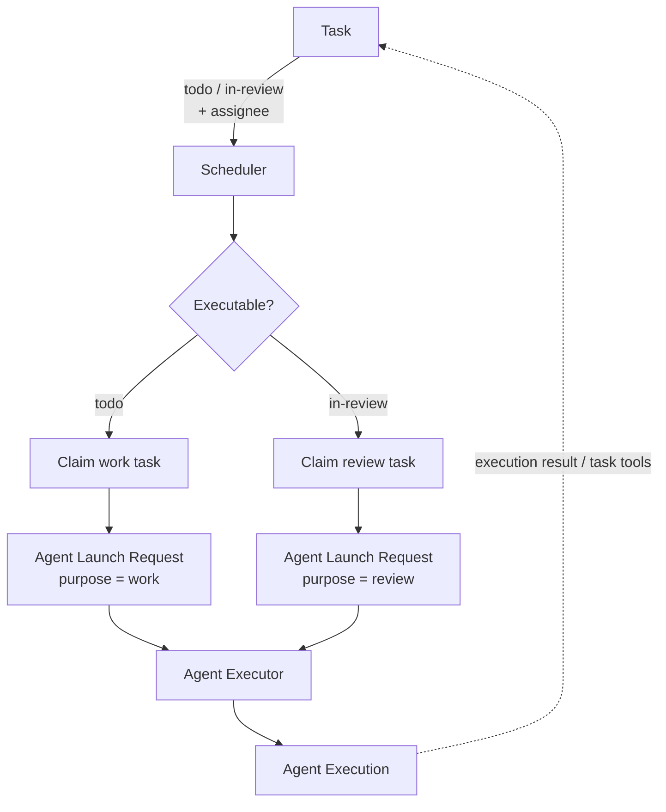
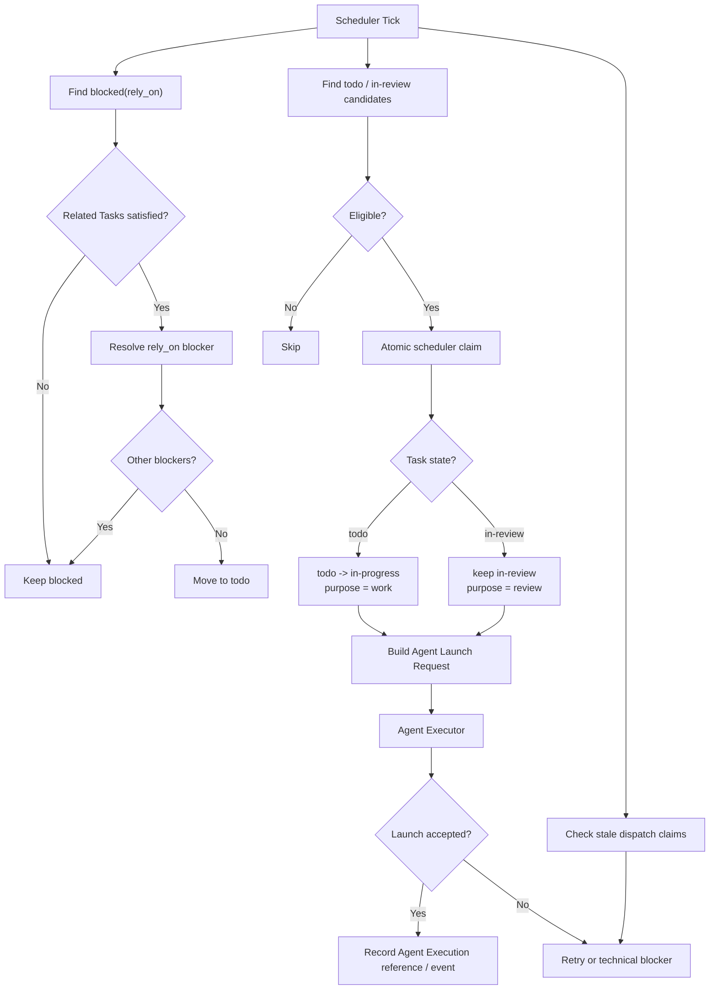

# Scheduler 架构

## 1. 定位

Scheduler 属于 Project Workspace 下的 Tasks / Work Management。

它负责理解 Task 的业务状态，并决定**何时需要启动哪个 Agent**。Scheduler 本身不负责准备 Agent Execution Context、不负责执行 Agent Loop，也不保存 Agent 运行过程。

Scheduler 与 Agent Executor 的边界：

```text
Task
  -> Scheduler
      -> Agent Launch Request
          -> Agent Executor
              -> Agent Execution
                  -> Agent Loop
```

Scheduler 的职责到 Agent Launch Request 为止。Agent Executor 收到请求后，会通过统一的 AgentExecutionContextBuilder 和 TaskContextProvider 准备 AgentExecutionContext；这部分属于 Agent Executor，不属于 Scheduler。

Scheduler 理解：

- Task state；
- assignee；
- blocker（包括 `rely_on`）；
- work / review 阶段；
- Task 与 Milestone / Sprint 的业务关系。

Agent Executor 不需要理解这些项目管理语义。Scheduler 只把已经确定好的 Agent 启动请求交给 Agent Executor。

## 2. 调度目标

同一个 Scheduler 同时负责普通工作阶段和审核阶段的 Task 调度。



普通工作阶段：

```text
todo
  -> Scheduler claim
  -> in-progress
  -> launch assignee
  -> Agent performs work
  -> Agent sets in-review + reviewer
```

审核阶段：

```text
in-review + reviewer
  -> Scheduler claim
  -> launch reviewer
  -> review
      -> done
      -> todo + next assignee
      -> blocked
```

审核仍然使用同一个 Scheduler，不引入独立 Review Scheduler。

## 3. Scheduler 职责

Scheduler 按可配置 tick 间隔周期运行，默认建议为 30 秒。

Scheduler 负责：

1. 检查并解除可以自动解除的 `rely_on` blocker；
2. 查找满足执行条件的 `todo` Task；
3. 查找满足执行条件的 `in-review` Task；
4. 对 Task 进行并发安全的调度 claim；
5. 根据 Task 当前阶段生成 Agent Launch Request；
6. 将启动请求交给 Agent Executor；
7. 记录 Task 与 Agent Execution 的关联事件；
8. 处理调度阶段的启动失败和恢复；
9. 保证同一个 Task 同一阶段不会被重复调度。

Scheduler **不负责**：

- 为 Task 选择执行 Agent；
- 为 `in-review` Task 选择 reviewer；
- 解析 Agent 配置；
- 组装 AgentExecutionContext；
- 解析模型或 Tool Capability；
- 执行 Agent Loop；
- 保存完整 execution log；
- 替代 Agent 或用户作业务决策；
- 自动解除需要人类介入的 blocker。

执行 Agent 在 `in-progress -> in-review` 时负责选择 reviewer。

审核 Agent 在 `in-review -> todo` 时负责指定下一轮执行 assignee。

Scheduler 只负责调度已经具有明确 assignee 的 Task。

## 4. 可调度条件

### Work Task

普通工作 Task 至少满足：

- state = `todo`；
- assignee 已存在；
- 没有未解除 blocker；
- 没有未解除的 `rely_on` blocker；
- 当前没有针对该 Task 工作阶段的有效 Agent Execution；
- Scheduler 当前处于运行状态。

### Review Task

审核 Task 至少满足：

- state = `in-review`；
- reviewer 已经作为当前 assignee；
- 没有未解除 blocker；
- 当前没有针对该 Task 审核阶段的有效 Agent Execution；
- Scheduler 当前处于运行状态。

Scheduler 不根据 Agent 名称、角色或能力自行推断 assignee。

## 5. Tick 流程



Scheduler tick 只负责发现和派发工作。Agent 启动之后的 Context 构造和执行生命周期由 Agent Executor 管理。

## 6. 调度 Claim

同一个 Task 同一阶段最多只能存在一次有效调度。

Scheduler claim 需要保证并发安全。

对于 `todo`：

- Task 当前仍为 `todo`；
- assignee 已存在；
- blocker 条件仍满足；
- 当前没有对应的有效 Agent Execution；
- 原子更新为 `in-progress`；
- 创建本次 dispatch 标识或幂等键。

对于 `in-review`：

- Task 当前仍为 `in-review`；
- reviewer assignee 已存在；
- blocker 条件仍满足；
- 当前没有对应的有效审核 Agent Execution；
- Task 状态保持 `in-review`；
- 创建本次 dispatch 标识或幂等键。

Scheduler 调用 Agent Executor 时应携带稳定的 idempotency key，避免因为重试、网络超时或进程恢复而重复创建 Agent Execution。

具体的幂等键和 dispatch claim 存储形式由实现阶段确定，但必须满足“同一 Task 同一调度阶段不能重复启动”的约束。

## 7. Agent Launch Request

Scheduler 不直接运行 Agent Loop，而是构造平台无关的 Agent Launch Request 交给 Agent Executor。

Task 调度场景至少需要表达：

```text
agent_id
trigger:
  type: task
  reference: task_id
purpose:
  work | review
idempotency_key
metadata:
  scheduler / project related metadata
```

其中：

- `agent_id` 来自 Task 当前 assignee；
- `trigger.reference` 只标识当前 Task；
- `purpose` 表示普通工作或审核；
- Scheduler 不把 Task、Milestone、Sprint 等完整业务上下文复制进 Launch Request；
- Agent Executor 根据 `trigger.type = task` 通过 TaskContextProvider 获取 Task / Sprint / Milestone 等 Trigger Context，并由统一 AgentExecutionContextBuilder 生成 AgentExecutionContext；
- Agent Executor 不需要理解 `todo`、`in-review` 等 Task 状态机语义。

## 8. Agent Execution 与 Task 的关系

Agent Execution 属于 Platform Services，不属于 Task 业务模型本身。

但 Task 需要能够追踪由自己触发的 Agent Execution，例如用于：

- 判断当前是否已经存在有效运行；
- 展示任务执行历史；
- 关联 execution log 和运行结果；
- 审计调度行为；
- 故障恢复。

关联关系通过 Agent Execution 的 trigger metadata 和 Task Event 建立，而不是把完整 Agent Execution 数据复制到 Task 中。

Task Event 可以记录：

- `agent_execution_started`；
- `agent_execution_finished`；
- `agent_execution_failed`。

完整 Agent Execution log 仍归 Agent Execution 自身。

## 9. 失败与恢复

需要区分两类失败。

### Scheduler / Dispatch Failure

例如：

- Agent Executor 暂时不可用；
- Launch Request 提交失败；
- dispatch claim 超时；
- 启动请求状态未知。

这类问题由 Scheduler 恢复，通常结合：

- idempotency key；
- dispatch claim timeout；
- retry；
- 必要时转为 `blocked(technical)`。

### Agent Execution Failure

Agent Execution 已经成功创建，但后续 Agent Loop 启动失败、超时、崩溃等。

这属于 Agent Executor / Agent Execution 生命周期，不由 Scheduler 直接管理 Agent Loop。

Agent Executor 将最终状态暴露给项目层；Scheduler 或 Task Domain 根据业务规则决定是否：

- 重试；
- 返回 `todo`；
- 保持 `in-review`；
- 转为 `blocked(technical)`；
- 等待用户处理。

## 10. 暂停 Scheduler

管理界面可以暂停和恢复 Scheduler。

暂停只停止新的 Task claim 和 Agent Launch Request，不应：

- 中断已经创建的 Agent Execution；
- 停止正在运行的 Agent Loop；
- 修改已经运行中的 Task 状态。

如果用户需要停止正在运行的 Agent，应对对应 Agent Execution 执行显式 cancel，由 Agent Executor 负责终止 Agent Loop 并记录最终状态。
