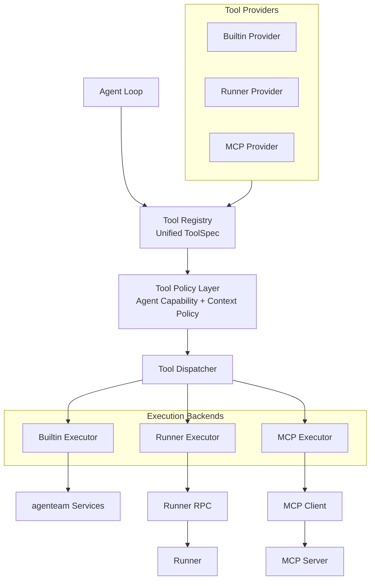

# 统一工具系统架构

## 1. 目标

Agent Loop 内部采用统一 Tool 抽象。

MCP 不是 agenteam 唯一的工具协议，而是工具来源之一。

工具初步来自：

- Builtin；
- Runner；
- MCP。

不同来源负责发现或定义工具，再转换为统一 ToolSpec 注册到 Tool Registry。

## 2. 架构



第一版实现无需过早在代码中拆分 Provider 和 Executor，可以先实现：

```text
ToolSource / ToolAdapter
  - Builtin
  - Runner
  - MCP
```

但逻辑边界仍应保持清楚。

## 3. Unified ToolSpec

ToolSpec 至少应包含：

- stable tool id；
- display name；
- description；
- input schema；
- output metadata；
- source；
- category；
- read/write 属性；
- risk metadata；
- execution adapter reference。

模型侧最终获得对应 Model Provider 原生的 tool/function schema。

模型不需要感知：

```text
Builtin
Runner
MCP
```

只需要看到具体能力，例如：

```text
update-task
query-doc
read-file
run-command
github-search
```

不使用单一的通用 `call_mcp` 工具间接承载所有 MCP tools。

## 4. Builtin Tools

Builtin Tools 暴露 agenteam 自身业务能力。

初步包括：

### Project

- read-project-info；
- update-project-info。

### Milestone

- list-milestones；
- create-milestone；
- update-milestone；
- delete-milestone。

### Sprint

- list-sprints；
- create-sprint；
- update-sprint；
- delete-sprint。

Milestone / Sprint 的删除不支持强制删除。服务端必须在存在下级对象时拒绝删除，并返回明确、可处理的结构化错误原因，例如：

```text
delete-milestone
-> rejected: milestone still contains Sprint(s)

delete-sprint
-> rejected: sprint still contains Task(s)
```

Agent 需要根据错误原因先迁移或处理下级对象，再重新发起删除。

### Agent

- list-agents；
- create-agent；
- update-agent；
- delete-agent。

### Task

- list-tasks；
- create-task；
- update-task；
- move-task；
- update-task-plan；
- comment-task；
- transfer-task。

Task Tool 按业务语义拆分，而不是为每个字段机械创建独立 Tool：

- `update-task`：修改 title、description、priority、type 等普通属性，不直接承担 Task 状态机流转；
- `move-task`：移动 Task 到目标 Sprint。调用方只需要指定 `target_sprint_id`，目标 Milestone 由 Sprint 归属自动确定；
- `update-task-plan`：单独更新 Task Plan；
- `transfer-task`：根据当前执行结果请求 Task 进入目标状态，并可以同时更新下一阶段 assignee、留下 comment，以及在进入 `blocked` 时增加 blocker。

`transfer-task` 不重复定义一套工作流规则。Agent 只表达希望发生的状态流转和必要附带信息，例如：

```text
in-progress -> in-review
  + reviewer assignee
  + comment

in-review -> done
  + review comment

in-review -> todo
  + next assignee
  + review comment

in-progress / in-review -> blocked
  + blocker
  + comment
```

真正允许哪些状态之间流转、哪些目标状态必须提供 assignee、何时必须提供 blocker，以及当前操作是否合规，都由 Task Domain 的状态机和领域约束统一校验。非法流转必须返回明确、可处理的错误原因。

因此 `transfer-task` 是状态机的调用入口，而不是状态机规则本身。后续即使 Task 状态机增加新的合法流转，也优先扩展领域规则，而不是为每种流转新增专用 Tool。

### Task Blocker

- list-task-blockers；
- add-task-blocker；
- resolve-task-blocker。

不再单独暴露 Task Dependency Tools。Task 依赖统一建模为：

```text
Blocker
  type = rely_on
  related_task_id = ...
```

`rely_on` 虽然通过统一 Blocker API 操作，但服务端仍必须执行依赖图专属规则，包括：

- related Task 必须存在；
- Task 不能依赖自身；
- 创建 / 修改时检查循环依赖；
- 可以按关联 Task 查询依赖关系；
- 前置 Task 满足条件后，可以由 Scheduler 自动解除对应 `rely_on` blocker。

### Knowledge Base

- list-docs；
- create-doc；
- update-doc；
- query-doc。

### Scheduler

- start-scheduler；
- pause-scheduler。

### Meeting

- list-meetings；
- request-meeting；
- add-agent-to-meeting；
- remove-agent-from-meeting；
- update-meeting；
- comment-meeting；
- request-decision；
- request-execution-approval。

其中：

- `request-decision` 创建 Meeting 中的 `DecisionRequest`，用于 Agent 请求用户回答业务问题；
- `request-execution-approval` 创建 `ExecutionApprovalRequest`，用于 Agent 请求用户授权明确的受限执行动作；
- 用户对 DecisionRequest 的 answer / skip，以及对 ExecutionApprovalRequest 的 approve / reject，属于 Meeting/UI 的用户操作，不通过 Agent Tool 完成。

`create-meeting` 属于用户/UI 能力。

Agent 使用 `request-meeting` 提交会议提案，不能直接绕过用户审批创建并启动正式会议。

### Memory

- retain；
- recall；
- reflect。

### Core Agent Tools

以下 Tool 是所有 Agent 都必须具备的基础能力，不进入普通 Agent Capability 的开关列表，用户不能关闭：

```text
Knowledge
- query-doc

Memory
- recall
- retain
- reflect
```

“不可关闭”不代表绕过权限：

- `query-doc` 仍只能查询当前 Project 的 Knowledge Base；
- Memory Tools 仍只能访问当前 Agent 自己的 memory namespace；
- 所有调用仍经过 System / Project / Server-side Authorization 和审计。

Knowledge Base 的 `list-docs / create-doc / update-doc` 仍属于普通可配置 Tool。

## 5. Runner Tools

Runner Tool 用于操作远程执行环境。第一阶段按以下能力组组织：

### Filesystem

- `read-file`；
- `write-file`；
- `edit-file`；
- `list-directory`；
- `grep-files`；
- `find-files`。

其中 `grep-files` 用于在 Agent 被授权的 mount 范围内进行内容搜索；`find-files` 用于按路径、文件名或模式发现文件。

### Command

- `run-command`。

### Managed Process

- `start-process`；
- `get-process` / `read-process-output`；
- `stop-process`。

Managed Process 用于 dev server、测试服务等需要跨多次 Tool Call 持续存在的进程，不把长时间后台任务强行塞进单次同步 `run-command`。

### Transfer

Runner backend 可以提供：

- `file-upload`；
- `file-download`；
- `file-transfer`。

这些能力主要用于 Control Plane 与 Runner 之间的数据搬运，不要求全部直接暴露为模型可见 Tool。是否注册到 Tool Registry 由具体使用场景决定。

### Desktop

仅 `headless = false` 的 Runner 才能提供 Desktop 能力，例如：

- `screenshot`；
- `automation`；
- `browser-use`；
- `computer-use`。

Runner Tool 的所有文件、命令、进程和桌面能力都必须受 Agent mount point、Runner capability 和服务端策略限制。

## 6. MCP Tools

MCP Adapter 负责：

1. 建立 MCP Client；
2. 发现 MCP Server tools；
3. 将 MCP schema 转为 Unified ToolSpec；
4. 注册到 Tool Registry；
5. 调用时把统一请求转换为 MCP 请求；
6. 将结果转换回统一 Tool Result。

MCP Server 的工具不能因为来自外部协议而跳过 agenteam 的权限和审计体系。

## 7. 权限模型

有效权限不是一个简单的 `allowed_tools[]`。

```mermaid
flowchart LR
    Tool["Tool Request"]

    SystemPolicy["System Policy"]
    ProjectPolicy["Project Policy"]
    AgentPolicy["Agent Capability"]
    ContextPolicy["Execution Policy"]
    Approval["Human Approval Scope"]
    ServerAuth["Server-side Authorization"]

    Execute["Execute"]

    Tool --> SystemPolicy
    SystemPolicy --> ProjectPolicy
    ProjectPolicy --> AgentPolicy
    AgentPolicy --> ContextPolicy
    ContextPolicy --> Approval
    Approval --> ServerAuth
    ServerAuth --> Execute
```



其中：

- Core Agent Tools 是平台保证的基础能力，不受普通 Agent Capability 开关移除，但仍受 scope 和服务端授权；
- Agent Capability 定义可配置 Tool 的长期最大能力；
- Agent Execution Policy 可以进一步收紧能力；
- Meeting 默认限制为读操作；
- 高风险写操作可以要求结构化 Human Approval；
- Approval 只授权明确动作或范围；
- 最终服务端仍必须执行对象级权限、mount/path、安全规则校验。

## 8. Tool Result 与审计

每次 Tool Call 至少需要记录：

- agent execution id；
- agent；
- tool id；
- tool source；
- request metadata；
- result status；
- duration；
- error；
- approval id（如有）。

敏感输入、secret 和大体积结果需要采用脱敏或外部 artifact 引用，避免直接写入普通日志。

无论 Agent 是由 Task Scheduler、Meeting 还是其他触发源启动，Tool Call 都统一归属于当前 Agent Execution，不再为 Meeting turn 单独建立另一套运行记录模型。
