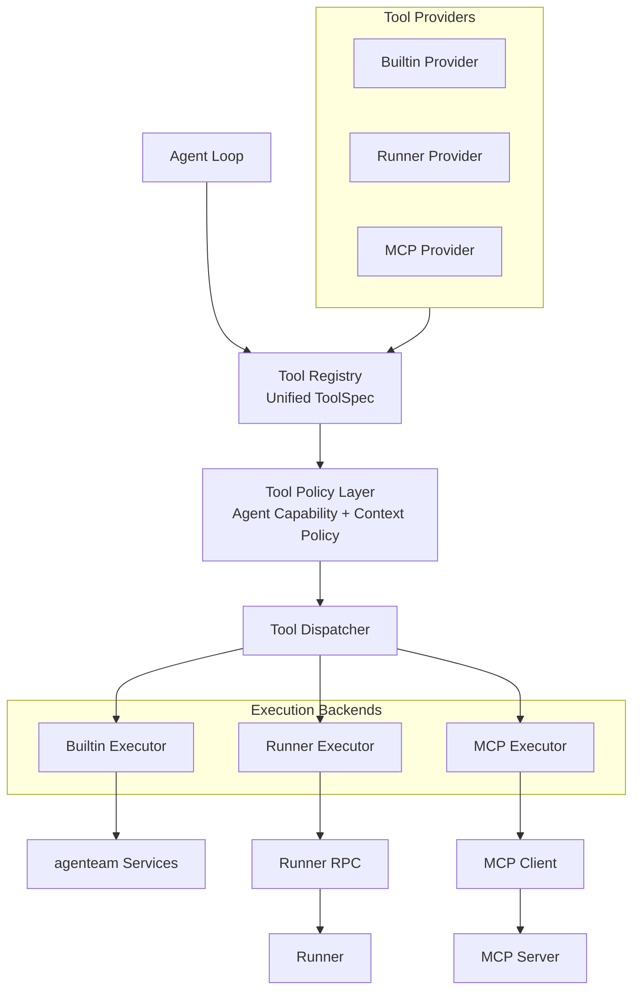
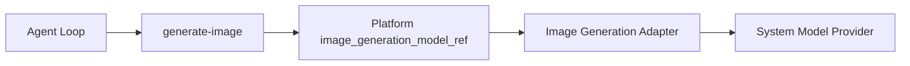
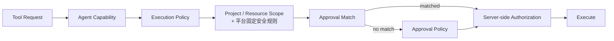

# 统一工具系统架构

## 1. 目标

Agent Loop 内部采用统一 Tool 抽象。

MCP 不是 agenteam 唯一的工具协议，而是工具来源之一。

工具初步来自：

- Builtin；
- Runner；
- MCP。

不同来源负责发现或定义工具，再转换为统一 ToolSpec 注册到 Tool Registry。

## 2. 架构



第一版实现无需过早在代码中拆分 Provider 和 Executor，可以先实现：

```text
ToolSource / ToolAdapter
  - Builtin
  - Runner
  - MCP
```

但逻辑边界仍应保持清楚。

## 3. Unified ToolSpec

ToolSpec 至少应包含：

- stable tool id；
- display name；
- description；
- input schema；
- output metadata；
- source；
- category；
- read/write 属性；
- risk metadata；
- default enabled；
- execution adapter reference。

模型侧最终获得对应 Model Provider 原生的 tool/function schema。

模型不需要感知：

```text
Builtin
Runner
MCP
```

只需要看到具体能力，例如：

```text
update-task
query-doc
read-file
run-command
github-search
```

不使用单一的通用 `call_mcp` 工具间接承载所有 MCP tools。

## 4. Builtin Tools

Builtin Tools 暴露 agenteam 自身业务能力。

初步包括：

### Project

- read-project-info；
- update-project-info。

### Milestone

- list-milestones；
- create-milestone；
- update-milestone；
- delete-milestone。

### Sprint

- list-sprints；
- create-sprint；
- update-sprint；
- delete-sprint。

Milestone / Sprint 的删除不支持强制删除。服务端必须在存在下级对象时拒绝删除，并返回明确、可处理的结构化错误原因，例如：

```text
delete-milestone
-> rejected: milestone still contains Sprint(s)

delete-sprint
-> rejected: sprint still contains Task(s)
```

Agent 需要根据错误原因先迁移或处理下级对象，再重新发起删除。

### Agent

- list-agents；
- create-agent；
- update-agent；
- delete-agent。

### Task

- list-tasks；
- create-task；
- update-task；
- move-task；
- update-task-plan；
- comment-task；
- transfer-task。

Task Tool 按业务语义拆分，而不是为每个字段机械创建独立 Tool：

- `update-task`：修改 title、description、priority、type 等普通属性，不直接承担 Task 状态机流转；
- `move-task`：移动 Task 到目标 Sprint。调用方只需要指定 `target_sprint_id`，目标 Milestone 由 Sprint 归属自动确定；
- `update-task-plan`：单独更新 Task Plan；
- `transfer-task`：根据当前执行结果请求 Task 进入目标状态，并可以同时更新下一阶段 assignee、留下 comment，以及在进入 `blocked` 时增加 blocker。

`transfer-task` 不重复定义一套工作流规则。Agent 只表达希望发生的状态流转和必要附带信息，例如：

```text
in-progress -> in-review
  + reviewer assignee
  + comment

in-review -> done
  + review comment

in-review -> todo
  + next assignee
  + review comment

in-progress / in-review -> blocked
  + blocker
  + comment
```

真正允许哪些状态之间流转、哪些目标状态必须提供 assignee、何时必须提供 blocker，以及当前操作是否合规，都由 Task Domain 的状态机和领域约束统一校验。非法流转必须返回明确、可处理的错误原因。

因此 `transfer-task` 是状态机的调用入口，而不是状态机规则本身。后续即使 Task 状态机增加新的合法流转，也优先扩展领域规则，而不是为每种流转新增专用 Tool。

### Task Blocker

- list-task-blockers；
- add-task-blocker；
- resolve-task-blocker。

不再单独暴露 Task Dependency Tools。Task 依赖统一建模为：

```text
Blocker
  type = rely_on
  related_task_id = ...
```

`rely_on` 虽然通过统一 Blocker API 操作，但服务端仍必须执行依赖图专属规则，包括：

- related Task 必须存在；
- Task 不能依赖自身；
- 创建 / 修改时检查循环依赖；
- 可以按关联 Task 查询依赖关系；
- 前置 Task 满足条件后，可以由 Scheduler 自动解除对应 `rely_on` blocker。

### Knowledge Base

- list-docs；
- create-doc；
- update-doc；
- query-doc。

### Media

- generate-image。

`generate-image` 是普通可配置 Builtin Tool，不属于 Core Agent Tools。

它不要求 Agent 直接选择 image_generation Model。Tool backend 使用平台级 Model Management 中的 `image_generation_model_ref`：



约束：

- `image_generation_model_ref` 只能引用系统级 `type = image_generation` 的 ModelConfig；
- Project Provider 不允许配置 image_generation Model；
- selector 未配置或引用的 Model 当前不可用时，`generate-image` 不应作为可执行 Tool 暴露；
- Agent 只看到统一 ToolSpec 和 Tool Result，不感知具体 image_generation Provider / Model；
- `generate-image` 与其他普通 Builtin Tool 一样受 Agent Capability、Execution Policy、Approval 与服务端授权约束。

Model 选择和 Adapter 边界见 [Model System 详细设计](../platform-infrastructure/model-system.md)。

### Scheduler

- start-scheduler；
- pause-scheduler。

### Meeting

- list-meetings；
- request-meeting；
- add-agent-to-meeting；
- remove-agent-from-meeting；
- update-meeting；
- comment-meeting；
- request-decision；
- request-execution-approval。

其中：

- `request-decision` 创建 Meeting 自己的 `DecisionRequest`，用于 Agent 请求用户回答业务问题；当前 Agent Execution 进入 waiting，用户 answer / skip 后继续同一个 Agent Execution；
- `request-execution-approval` 用于 Meeting 场景显式发起受限动作审批，但实际 Approval Request 由 Security / Governance 统一创建和持久化，Meeting 只保存引用并在 Timeline 中展示；
- Approval Request 会进入 Human Inbox，用户可以从 Human Inbox 或对应业务页面处理同一个审批对象；
- 用户对 DecisionRequest 的 answer / skip，以及对 Approval Request 的 approve / reject，都属于用户操作，不通过 Agent Tool 完成。

Approval 不是 Meeting 专属能力。Task Execution、Runner / MCP Tool 等其他场景产生的审批需求也统一进入 Security / Governance 的 Approval 机制，并由 Human Inbox 聚合。

`create-meeting` 属于用户/UI 能力。

Agent 使用 `request-meeting` 直接创建 `status = proposed` 的 Meeting Session。该 Meeting 同时进入 Human Inbox 的待处理聚合视图；用户需要进入 Meeting 页面批准后，Meeting 才从 `proposed` 进入 `active` 并允许正常 Turn 执行。

### Memory

- retain；
- recall；
- reflect。

### Artifact

- list-artifacts；
- create-artifact；
- read-artifact。

Artifact Tool 是 Agent 对平台文件 / 持久化结果的业务访问层。

Agent 不直接操作 ObjectStorageService、StoredObject、MinIO 或 Signed URL：

~~~text
Agent
-> Artifact Builtin Tool
-> ToolArtifact
-> StoredObject
-> ObjectStorageService
~~~

create-artifact 可以：

- 直接保存 Agent 生成的文本 / 文件内容；
- 从当前 Agent 已有权限的 file_ref / image_ref / MCP Resource 等 source_ref 创建命名 Artifact。

用户预览 / 下载时，由 UI / API 在权限校验后生成短期 Signed URL；Agent 自身不创建或持有下载 URL。

完整 contract 见 [Artifact Builtin Tools 详细设计](./artifact-tools.md)。

### Core Agent Tools

以下 Tool 是所有 Agent 都必须具备的基础能力，不进入普通 Agent Capability 的开关列表，用户不能关闭：

```text
Knowledge
- query-doc

Memory
- recall
- retain
- reflect

MCP Resources
- list-mcp-resources
- read-mcp-resource

Artifacts
- list-artifacts
- create-artifact
- read-artifact
```

“不可关闭”不代表绕过权限：

- `query-doc` 仍只能查询当前 Project 的 Knowledge Base；
- Memory Tools 仍只能访问当前 Agent 自己的 memory namespace；
- MCP Resource Tools 仍只能访问当前 Project 中 enabled MCP Connection 的 Resource Catalog / Resource；
- Artifact Tools 仍只能列举、创建和读取当前 Project 中当前调用方有权访问的 Artifact；
- 所有调用仍经过 Project / Resource Scope、平台固定安全规则、服务端 Authorization 和审计。

Knowledge Base 的 `list-docs / create-doc / update-doc` 仍属于普通可配置 Tool。

## 5. Runner Tools

Runner Tool 用于操作远程执行环境。第一阶段按以下能力组组织：

### Filesystem

- `read-file`；
- `write-file`；
- `edit-file`；
- `list-directory`；
- `grep-files`；
- `find-files`。

其中 `grep-files` 用于在 Agent 被授权的 mount 范围内进行内容搜索；`find-files` 用于按路径、文件名或模式发现文件。

### Command

- `run-command`。

### Managed Process

- `start-process`；
- `get-process` / `read-process-output`；
- `stop-process`。

Managed Process 用于 dev server、测试服务等需要跨多次 Tool Call 持续存在的进程，不把长时间后台任务强行塞进单次同步 `run-command`。

### Transfer

Runner backend 可以提供：

- `file-upload`；
- `file-download`；
- `file-transfer`。

这些能力主要用于 Control Plane 与 Runner 之间的数据搬运，不要求全部直接暴露为模型可见 Tool。是否注册到 Tool Registry 由具体使用场景决定。

### Desktop

仅 `headless = false` 的 Runner 才能提供 Desktop 能力，例如：

- `screenshot`；
- `automation`；
- `browser-use`；
- `computer-use`。

Runner Tool 的所有文件、命令、进程和桌面能力都必须受 Agent mount point、Runner capability 和服务端策略限制。

## 6. MCP Tools

MCP Server 通过 MCP Bridge 接入统一 Tool System。

MCP Bridge 负责：

1. 根据 MCP Server Config 建立 MCP Client；
2. 发现 MCP Server tools；
3. 为每个远端 Tool 生成稳定 Tool identity；
4. 将 MCP schema 转为 Unified ToolSpec；
5. 注册到 Tool Registry；
6. 调用时把统一请求转换为 MCP 请求；
7. 将结果转换回统一 Tool Result；
8. 维护 Tool availability / discovery 状态。

MCP Bridge discovery 出来的每个 Tool 都是独立的 Unified Tool，不通过单一 `call_mcp` 间接承载。

这些 Tool 与 Builtin / Runner Tool 一样进入 Agent Capability：

```text
MCP Server
  -> MCP Bridge discovery
      -> Unified ToolSpec
          -> Tool Registry
              -> Agent Capability
```

Agent Capability 默认按具体 MCP Tool 授权。新 discovery 出来的 Tool 不自动加入已有 Agent Capability，避免 MCP Server 升级后隐式扩大 Agent 权限。

MCP Server 的工具不能因为来自外部协议而跳过 agenteam 的权限和审计体系。

MCP Server Config、System / Project scope、Credential、Tool stable identity、discovery / refresh、transport 与执行链路的完整设计见 [MCP 集成架构](../mcp-integration/index.md)。

## 7. 权限模型

有效权限不是一个简单的 `allowed_tools[]`。



其中：

- Core Agent Tools 是平台保证的基础能力，不受普通 Agent Capability 开关移除，但仍受 scope 和服务端授权；
- Agent Capability 定义可配置 Tool 的长期最大能力；
- Agent Execution Policy 可以进一步收紧能力；
- Project / Resource Scope 和平台固定安全规则在具体 Tool Call 时强制校验；
- 基础权限通过后，先匹配当前 active Approval；
- 没有匹配 Approval 时，才由 Approval Policy 决定直接执行还是进入 Human Inbox；
- 最终服务端仍必须执行对象级权限、mount/path、安全规则和业务规则校验。

Approval 不决定 Tool 是否出现在模型可见 Tool Set 中。Tool Set 由当前可用 Tool、Agent Capability 和 Execution Policy 共同决定；Approval 发生在具体调用阶段。

### 7.1 ApprovalScopeResolver

需要支持 Reusable Approval 的 Tool 可以提供 `ApprovalScopeResolver`。

它负责：

- 从当前真实 Tool Call 生成 current scope；
- 决定该 Tool 是否支持 Reusable Approval；
- 如果支持，生成“以后都允许此类调用”对应的 Reusable Approval Scope；
- 判断保存的 Reusable Approval Scope 是否覆盖后续 Tool Call；
- 提供用于 UI 展示的 human-readable Scope。

Security / Governance 只负责 Project、Agent、stable Tool ID、Approval state 等通用匹配，不实现一套理解所有 Tool 参数的通用 constraints DSL。

Tool 不提供 Reusable Approval Scope 时，审批界面只允许“批准本次”或“拒绝”。

详细规则见 [Approval Scope 详细设计](../security-governance/approval-scope.md)。

### 7.2 Tool Operation 与 Attempt

Tool System 区分：

~~~text
tool_call_id
= Model 产生的一次 Tool Call

operation_id
= 该 Tool Call 对应的逻辑 Tool Operation

attempt_id / backend request_id
= 某一次实际执行尝试
~~~

新的 Agent Tool Call 总是创建新的 operation_id，即使 Tool 和 arguments 完全相同。

如果 Tool System 对同一个逻辑操作执行 technical retry：

- operation_id 保持不变；
- operation fingerprint 保持不变；
- attempt_id / backend request_id 变化；
- 已绑定该 operation_id 的 One-time Approval 不需要重新审批。

One-time Approval 只确认当前 Tool Operation 是否被用户授权，不决定 retry 是否安全。

是否允许 retry 由 Tool / Backend 的 idempotency、attempt outcome 和可验证 idempotency key 决定。

其中：

~~~text
unknown + non-idempotent
-> 不允许自动 retry
~~~

完整设计见 [One-time Approval、Tool Retry 与 Idempotency 详细设计](../security-governance/one-time-approval-retry-idempotency.md)。

## 8. Tool Result 与审计

每次 Tool Call / Tool Operation 至少需要记录：

- agent execution id；
- tool_call_id；
- operation_id；
- attempt_id / backend request_id；
- agent；
- tool id；
- tool source；
- request metadata；
- result status；
- duration；
- error；
- approval id（如有）。

敏感输入、Secret 和大体积结果需要采用脱敏或外部 artifact 引用，避免直接写入普通日志。

Project Secret Variable 的 value 不应展开到普通 Tool arguments。Runner command 等场景优先保留 `$VARIABLE_NAME` 引用，并通过独立 execution environment 注入 Secret。对于已经解析到执行后端的 Secret，Tool Result / stdout / stderr 在进入普通日志或回填 Agent Model 前需要对已知 Secret value 做 masking。

无论 Agent 是由 Task Scheduler、Meeting 还是其他触发源启动，Tool Call 都统一归属于当前 Agent Execution，不再为 Meeting turn 单独建立另一套运行记录模型。

## 9. 详细设计

统一工具系统的详细设计按职责拆分为以下文档：

- [Unified Tool Runtime 详细设计](./tool-runtime.md)：总体职责、完整调用时序、Runtime 与 Agent Loop / Model Adapter / Security & Governance 的边界，以及第一阶段总体实现范围；
- [Tool Definition & Registry 详细设计](./tool-definition-registry.md)：Stable Tool Identity、ToolSpec、ToolBinding、ToolRuntimeState、Registry、Tool availability、spec_revision、Execution Tool Set 与 model-visible Tool Projection；
- [Tool Execution 详细设计](./tool-execution.md)：ToolCall、Arguments Validation、ToolOperation / ToolAttempt、Authorization、Dispatcher、timeout / cancellation、retry / idempotency、并发与持久化；
- [Tool Result & Backend 详细设计](./tool-result-backend.md)：Unified Tool Result、Tool Error / Runtime Failure、Artifact / StoredObject、Result Size、Backend Contract，以及 Builtin / Runner / MCP Backend；
- [Artifact Builtin Tools 详细设计](./artifact-tools.md)：Agent-facing Artifact list / create / read、source_ref、Object Storage 边界以及用户预览 / 下载。
